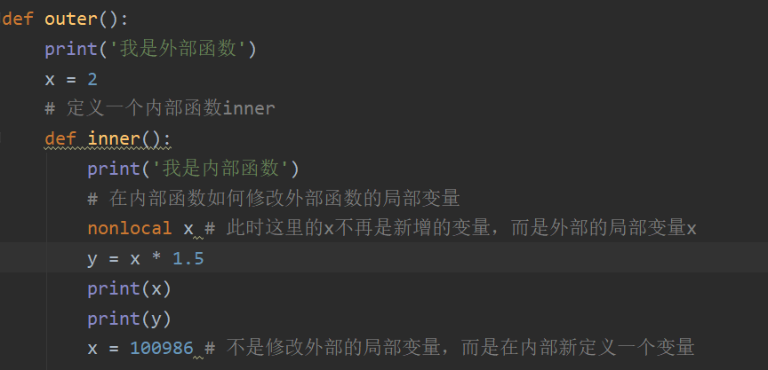

# 如何插入图片


# asd

#qwwe

YouDaoNotes0224\InternetNote\0面试资料\assets\捕获.PNG
D:\0-Notebook\YouDaoNotes0224\InternetNote\0面试资料\assets\捕获.PNG
# 2235


# ---------------------------
## 一、浅拷贝+深拷贝
    0. 赋值引用
    1. 浅拷贝
    2. 深拷贝
    3.赋值操作
    4. 测试代码如下：
    5. 总结
## 二、python中常用的几个容器
## 三、高级特性
    1. 生成器
    2. 迭代器
## 四、函数式编程
    1. 装饰器
    2. 代码
## 五、进程和线程

## 一、浅拷贝+深拷贝
浅拷贝就是对引用的拷贝，所谓深拷贝就是对对象的资源的拷贝。
0. 赋值引用
1. 浅拷贝
    仅仅复制了源容器中初始元素的地址浅拷贝是在另一块地址中创建一个新的变量或容器，但是容器内的元素的地址均是源对象的元素的地址的拷贝。也就是说新的容器中指向了旧的元素（ 新瓶装旧酒 ）。
2. 深拷贝完全拷贝了一个副本，容器内部元素地址都不一样深拷贝是在另一块地址中创建一个新的变量或容器，同时容器内的元素的地址也是新开辟的，仅仅是值相同而已，是完全的副本。也就是说（ 新瓶装新酒）

3.赋值操作
    我们要有以下认识：
    1. 赋值是将一个对象的地址赋值给一个变量，让变量指向该地址（ 旧瓶装旧酒 ）。
    2. 修改不可变对象（str、tuple）需要开辟新的空间
    3. 修改可变对象（list等）不需要开辟新的空间
    4. 测试代码如下：
   
    ```
    q
    ds
    ff
    gg
    ```

5. 总结所谓浅拷贝就是对引用的拷贝，所谓深拷贝就是对对象的资源的拷贝。

### To-do List

## 二、python中常用的几个容器
    容器，是Python 中的一个抽象概念，是对专门用来装其他对象的数据类型的统称。
    在Python 中，有四类最常见的内建容器类型： 列表（list） 、 元组（tuple） 、字典（dict） 、 集合（set） 。 通过单独或是组合使用它们，可以高效的完成很多事情。
## 三、高级特性
    1. 生成器
    01.生成器是一个返回迭代器的函数。
        不需要像迭代器的类一样写__iter__()和__next__()方法，只需要一个yiled关键字，每次遇到yield时函数会暂停并保存当前所有的运行信息，返回yield的值,并在下一次执行next()方法时从当前位置继续运行。
    02.创建generator方法：
    （1）把一个列表生成式的[]改成()
    ```
    >>> g = (x * x for x in range(10))

    >>> for n in g:
    ...     print(n)
    ...     yield n
    ```
    （2）range(数组)、斐波拉且数列>>> g = (x * x for x in range(10))>>> for n in g:...     print(n)...     yield ndef fib(max):    n, a, b = 0, 0, 1    while n < max:        yield b        a, b = b, a + b        n = n + 1    return 'done'>>> f = fib(6)>>> f<generator object fib at 0x104feaaa0>（3）难点：generator和函数的执行流程不一样函数是顺序执行，遇到return语句或者最后一行函数语句就返回。而变成generator的函数，在每次调用next()的时候执行，遇到yield语句返回，再次执行时从上次返回的yield语句处继续执行。def odd():    print('step 1')    yield 1    print('step 2')    yield(3)
    print('step 3')    yield(5)>>> o = odd()>>> next(o)step 11>>> next(o)step 23>>> next(o)step 35>>> next(o)Traceback (most recent call last):  File "<stdin>", line 1, in <module>StopIteration
    
    2. 迭代器
        迭代器是一个可以记住遍历的位置的对象。迭代器对象从集合的第一个元素开始访问，直到所有的元素被访问完结束。迭代器只能往前不会后退。
        迭代器有两个基本的方法：iter() 和 next()凡是可作用于for循环的对象都是Iterable类型；凡是可作用于next()函数的对象都是Iterator类型，它们表示一个惰性计算的序列；集合数据类型如list、dict、str，set等是Iterable但不是Iterator，不过可以通过iter()函数获得一个Iterator对象。Python的for循环本质上就是通过不断调用next()函数实现的，例如：for x in [1, 2, 3, 4, 5]:    pass
        # 等价于：# 首先获得Iterator对象:it = iter([1, 2, 3, 4, 5])# 循环:while True:    try:        # 获得下一个值:        x = next(it)    except StopIteration:

### To-do List