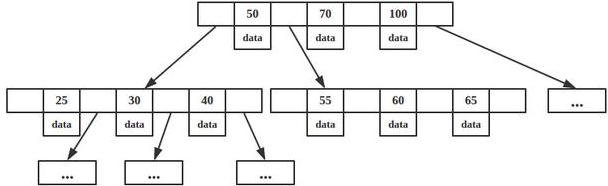
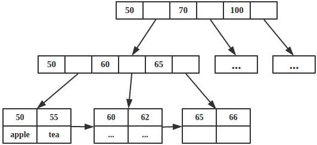

# 几个树结构

AVL与红黑树都假设所有数据放在主存中.当数据量太大,只能以块的形式从磁盘读取数据,磁盘的I/O操作相当耗时.为了实现动态多层索引,通常采用B树和B+树.B,B+树的提出目的就是减少磁盘的I/O操作.对于AVL与红黑树,查找,插入,删除O(logn),而对于B树,多叉树,树的高度被控制,一般远小于logn,因此对磁盘的访问时间极大降低.

## B-树

B-树是一种自平衡的搜索树,如下图所示

特点
- 多分支，非二叉树
- 每个节点既保存索引，又有data域
- 搜索时相当于二分查找 O(h)

rebalance: 上溢时节点分裂，以中值为分界分裂，中值关键码插入父节点；下溢时先尝试从兄弟节点借一个关键码，没有可借的就和兄弟合并。

## B+ 树

- 多分支，非二叉树
- 只有叶子节点有data域
- 所有叶子节点通过指针连接在一起
- 搜索时相当于二分查找

俩核心区别，一个是数据的保存位置，一个是相邻节点的指向。
- B+树查询时间复杂度固定是logn，B-树查询复杂度最好是 O(1)。
- B+树相邻接点的指针可以大大增加区间访问性，可使用在范围查询等，而B-树每个节点 key 和 data域 在一起，则无法区间查找。
- B+树更适合外部存储，也就是磁盘存储。由于内节点无 data域，每个节点能索引的范围更大更精确.
- B-树每个节点即保存数据指针又保存索引，所以磁盘IO的次数很少，B+树只有叶子节点保存，磁盘IO多，但是区间访问比较好。

B*树又是B+树的变种，其与B+树的区别有：
1. B*树在B+树的非根和非叶子节点再增加指向兄弟节点的指针
2. B*树规定非叶子节点的键值个数至少为(2/3)M，这样每个节点的使用率就从B+树的1/2上升到2/3，所以空间使用率更高。

## AVL树
平衡二叉树高度平衡的二叉搜索树(左子树和右子树的高度差不超过1)。

## 红黑树
红黑是用非严格的平衡来换取增删节点时候旋转次数的降低，任何不平衡都会在三次旋转之内解决，而AVL是严格平衡树，因此在增加或者删除节点的时候，根据不同情况，旋转的次数比红黑树要多.红黑树在需要大量插入和删除的场景下，效率更高。由于AVL高度平衡，因此AVL的search效率更高。

在二叉搜索树要求外，红黑树额外要求：
- 节点是红色或黑色。
- 根是黑色。
- 所有None节点都是黑色。
- 每个红色节点必须有两个黑色的子节点。
- 从任一节点到其每个叶子的所有简单路径都包含相同数目的黑色节点。

## 应用场景
- AVL树: 最早的平衡二叉树之一。windows对进程地址空间的管理用到了AVL树。
- 红黑树: 平衡二叉树，广泛用在C++的STL中。如map和set都是用红黑树实现的。
- B/B+树: 用在磁盘文件组织 数据索引和数据库索引。
- Trie树(字典树): 用在统计和排序大量字符串，如自动机。
