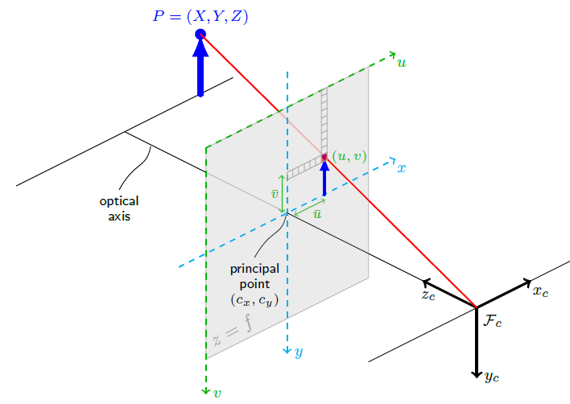
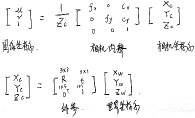
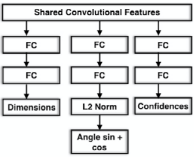
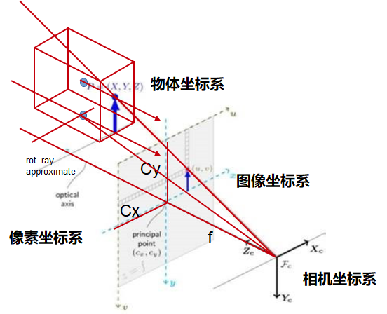
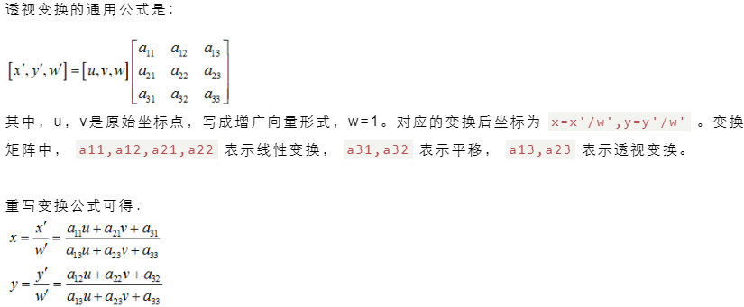

# 3D Detection

## 坐标系变换

齐次形式
$$ \begin{bmatrix} u\\v\\1 \end{bmatrix} = \frac{1}{Z_c} * K *
\begin{bmatrix} R^{3*3}&T^{3*1} \end{bmatrix} *
\begin{bmatrix} X_o\\Y_o\\Z_o\\1 \end{bmatrix} $$

进一步描述外参 R, T
$$ \begin{bmatrix} u\\v\\1 \end{bmatrix} = \frac{1}{Z_c} * K *
\begin{bmatrix} cos\theta&0&sin\theta \\ 0&1&0 \\ -sin\theta&0&cos\theta \end{bmatrix} *
\begin{bmatrix} X_o\\Y_o\\Z_o \end{bmatrix} +
\begin{bmatrix} X_c\\Y_c\\Z_c \end{bmatrix} $$

像素坐标系: $u, v$
物体坐标系: $X_o, Y_o, Z_o (l, w, h)$
相机坐标系: $X_c, Y_c, Z_c$

`核心，如何求解3D相关的7个未知数:` $\theta, X_o, Y_o, Z_o, X_c, Y_c, Z_c$
其中 $\theta(r_y), X_c, Y_c, Z_c$最重要

Deep3Dbox

1. 每个region proposal 回归 $\theta, X_o, Y_o, Z_o$
2. 分bin回归$sin\theta, cos\theta$ 与落在该bin的conf
3. 找 [u,v] 和 3D点的对应,最小二乘法求解超静定方程$X_c, Y_c, Z_c$

问题:
1. [u,v]与3D点的对应关系找不准
2. 最小二乘法求解误差大,$Z_c$带来的误差很大,不如梯度下降回归,再后矫正.

M3D-RPN:
神经网络直接预测 $ \theta, t_w, t_h, t_l, [t_x, t_y, t_z] $

- post reficty $\theta$

Stereo RCNN:
神经网络预测: $[u_l, v_t, u_r, v_b, u^r_l, u^r_r, u_p], [X_o, Y_o, Z_o, \theta]$

- 通过约束方程求解 $\theta, X_c, Y_c, Z_c$
- post dense alignment $Z_c$
- post reficty 基于dense alignment更新的$Z_c$, 通过约束方程再求解 $\theta, X_c, Y_c$

ROI-10D:
神经网络预测: $q(\theta), u_c, v_c, Z_c, X_o, Y_o, Z_o$ ($X_c, Y_c 通过\theta, Z_c计算得到?$)

### 2D 中心与 3D 中心投影的错位

## 透视变换

因此4个点可以标定两个平面的透视矩阵
