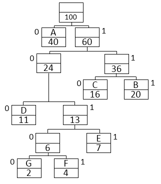

# Huffman 编码

- 是一种文件，图像无损压缩的方法。
- 核心思想：出现频次较多的符号使用较短的编码，出现频次较少的符号使用较长的编码

算法流程
1. 统计符号出现频率
2. 根据频率建立小顶堆(基于频率)，存储HeapNode
3. 依次heappop()出当前堆中最小的两个Node合并，建立二叉树
4. 为二叉树每个节点01编码，左边为0，右边为1

以如下字符串为例，从下往上基于频率合并节点，建立得到二叉树如图，父节点的值为左右子节点的和。左节点编码为0，右节点为1，右节点大于左节点。
```
sample = "A"*40+"B"*20+"C"*16+"D"*11+"E"*7+"F"*4+"G"*2
```



```python
import heapq
from typing import Dict

class HuffmanCoding():
    def __init__(self):
        self.heap = []
        self.char2coding = {}
        self.coding2char = {}

    def freqence_calculate(self, compressed_str: str):
        """O(n)"""
        freq = {}
        for char in compressed_str:
            freq[char] = 1 if char not in freq else freq[char]+1
        return freq

    def build_heap(self, freq: Dict[str,int]):
        """O(n)"""
        for key in freq:
            node = HeapNode(key, freq[key])
            heapq.heappush(self.heap, node)

    def merge_nodes(self):
        """O(nlogn)"""
        while len(self.heap) > 1:
            node1 = heapq.heappop(self.heap)
            node2 = heapq.heappop(self.heap)
            merge_node = HeapNode(None, node1.freq+node2.freq)
            merge_node.left = node1
            merge_node.right = node2
            heapq.heappush(self.heap, merge_node)

    def encoding(self):
        def helper(node, coding):
            if node == None:
                return
            if node.char != None:
                self.char2coding[node.char] = coding
                self.coding2char[coding] = node.char
            helper(node.left, coding+"0")
            helper(node.right, coding+"1")

        root = heapq.heappop(self.heap)
        helper(root, "")


class HeapNode():
    def __init__(self, char, freq):
        self.char = char
        self.freq = freq
        self.left = None
        self.right = None

    def __lt__(self, other):
        """for comparison in heaq push and pop"""
        return self.freq < other.freq


if __name__ == "__main__":
    sample = "A"*40+"B"*20+"C"*16+"D"*11+"E"*7+"F"*4+"G"*2
    huffman_coding = HuffmanCoding()
    freq = huffman_coding.freqence_calculate(sample)
    huffman_coding.build_heap(freq)
    huffman_coding.merge_nodes()
    huffman_coding.encoding()

    size_cnt = 0
    for key in sorted(huffman_coding.char2coding.keys()):
        code = huffman_coding.char2coding[key]
        print("{}: {}".format(key, code))
        size_cnt += freq[key] * len(code)

    print("before compress: {}".format(len(sample)*(len(bin(len(freq)))-2)))
    print("after compress: {}".format(size_cnt))
```
