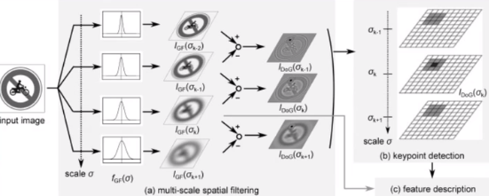

# SIFT
做了那么久图像,怎么能不整理下SIFT
论文: https://www.cs.ubc.ca/~lowe/papers/ijcv04.pdf
## SIFT 算法流程
1. 尺度空间极值检测
不同高斯核sigma滤波，构建不同模糊程度的图像金字塔.对相邻层求差分.如果该点灰度值大于或小于周围全部26个点,则定义该点为关键点.

2. 关键点精确定位
将找到的极值点进行曲面拟合,重新确定更精确的极值点. 剔除低对比度的特征点 与 不稳定的边缘响应点

3. 方向赋值
为了实现关键点的旋转不变性,计算关键点附近各个像素的梯度方向与梯度幅值.统计窗口内,8个(原文36)方向幅值的直方图,累计幅值最高的方向作为该特征点的主方向.有时候还会有辅方向.同样通过曲线拟合,确定精确方向.

4. 关键点描述
将16x16分为4x4个区域,每个区域8个方向,总共128个特征来描述这个特征点.
参考: https://www.bilibili.com/video/av42629边缘检测算子边缘检测算子442?from=search&seid=7778066026571529065

## SIFT 图像拼接
1. 加载两个图片，提取SIFT特征点
2. 两张图片的SIFT特征点匹配(例如knn)
3. 基于匹配的特征点估计图片的透射变换
4. 图片融合(alpha blending, 梯度遮罩, 最大密度投影)

## 特征点匹配
比较最近邻距离与次近邻距离的SIFT匹配方式：取一幅图像中的一个SIFT关键点，并找出其与另一幅图像中欧式距离最近的前两个关键点，在这两个关键点中，如果最近的距离除以次近的距离得到的比率ratio少于某个阈值T，则接受这一对匹配点。

## LSB 最低有效位
8位灰度图像数值范围0-255
对于十进制255 -> 二进制 11111111
对于后几个bit的修改对原图不会怎么改变,可以把水印信息放在这.
