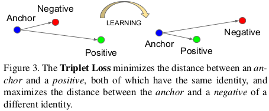
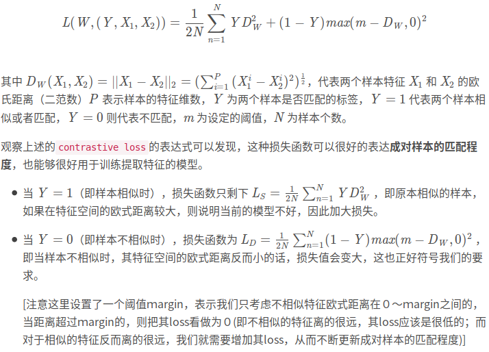
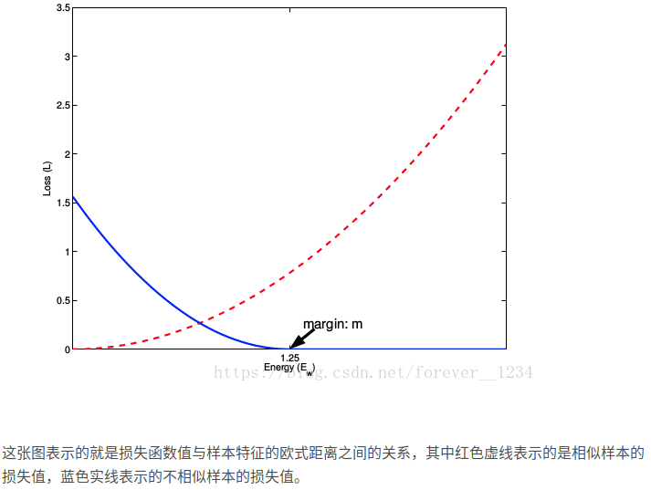

# Fine-grained Learning

## loss function

### triplet loss
#### loss definition
image $x_i^a$ (anchor) of the specific person is closer to
all other images $x_i^p$ (positive) of the same person than it is to
any image $x_i^n$ (negative) of any other person.

$$
\begin{aligned}
\left\|f\left(x_{i}^{a}\right)-f\left(x_{i}^{p}\right)\right\|_{2}^{2}+\alpha &<\left\|f\left(x_{i}^{a}\right)-f\left(x_{i}^{n}\right)\right\|_{2}^{2}
\end{aligned}
$$

$$
\begin{aligned}
\forall\left(f\left(x_{i}^{a}\right), f\left(x_{i}^{p}\right), f\left(x_{i}^{n}\right)\right) \in \mathcal{T}
\end{aligned}
$$

$$
\mathcal{L} = \sum_{i}^{N}\left[\left\|f\left(x_{i}^{a}\right)-f\left(x_{i}^{p}\right)\right\|_{2}^{2}-\left\|f\left(x_{i}^{a}\right)-f\left(x_{i}^{n}\right)\right\|_{2}^{2}+\alpha\right]_{+}
$$

#### triplet selection (hard samples minning)
Generate triplets online. This can be done by selecting the hard positive/negative exemplars from within a mini-batch.
https://omoindrot.github.io/triplet-loss

### Contrastive loss
Contrastive loss from Yann LeCun “Dimensionality Reduction by Learning an Invariant Mapping” CVPR 2006
#### loss definition

https://blog.csdn.net/forever__1234/article/details/81222092

### center loss
https://ydwen.github.io/papers/WenECCV16.pdf
center loss 与 softmax loss 配合一起使用的

### n pair loss

### magnet loss
