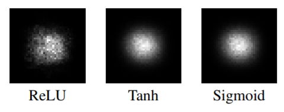

# 理论感受野计算

在设计网络层次时，有效感受野是一个重要参考依据，但是很多资料并没有把感受野的计算讲清楚，所以正好自己总结一下，并给出分类网络与目标检测网络的理论感受野计算的代码。
有效感受野比理论感受野小。



特征的有效感受野（实际起作用的感受野）实际上是小于理论感受野的.虽然x11和x33都位于第二层特征感受野内，但是二者对最后的特征o11(2)的影响却不同，输入中越靠感受野中间的元素对特征的贡献越大。


具体可参见论文[Understanding the Effective Receptive Field](https://arxiv.org/abs/1701.04128)


计算理论感受野，分为2步

1. 依次列出每个卷积层的[filter_size 卷积核大小, stride 步长], 如果同时想计算每层的大小需要补充 [padding 填充]，如class networkReceptiveField 中我分别列出了Alexnet， vgg16， 基于darknet53的yolo v3，基于mobilenet v2的yolo v3的卷积层结构[filter_size, stride, padding]在self.networks

2. 倒推计算卷积层感受野，从网络的最后一层逐层递推到该层。如下图，计算第三层实心点的理论感受野，先计算该点对应第二层的感受野，再计算对应第一层的感受野。（1，2，3层特征图大小6*6，padding为1，stride为1）


```python
receptive_field = 1
for layer in reversed(range(layernum)):
    filter_size, stride, _ = net[layer]
    receptive_field = ((receptive_field - 1) * stride) + filter_size
```

补充：卷积层padding的计算
- 卷积中padding的计算公式

$$ padding = \frac{(shape_{out} - 1) * stride + filter_{size} - shape_{in}}{2} $$
  
- 如果特征图大小不变

$$ padding = \frac{filter_{size} - 1}{2} $$


完整的代码如下

```python
import numpy as np


class networkReceptiveField(object):
    def __init__(self, img_input_size):
        # by default, provide 4 networks structures
        self.networks = {
        # parameters: [filter_size, stride, padding]
    'alexnet': {'parameters': [[11, 4, 0], [3, 2, 0], [5, 1, 2], [3, 2, 0], [3, 1, 1], [3, 1, 1], [3, 1, 1], [3, 2, 0]],
                'name': ['conv1', 'pool1', 'conv2', 'pool2', 'conv3', 'conv4', 'conv5', 'pool5']},

    'vgg16':   {'parameters': [[3, 1, 1], [3, 1, 1], [2, 2, 0], [3, 1, 1], [3, 1, 1], [2, 2, 0], [3, 1, 1], [3, 1, 1], [3, 1, 1],
                      [2, 2, 0], [3, 1, 1], [3, 1, 1], [3, 1, 1], [2, 2, 0], [3, 1, 1], [3, 1, 1], [3, 1, 1],
                      [2, 2, 0]],
                'name': ['conv1_1', 'conv1_2', 'pool1', 'conv2_1', 'conv2_2', 'pool2', 'conv3_1', 'conv3_2',
                         'conv3_3', 'pool3', 'conv4_1', 'conv4_2', 'conv4_3', 'pool4', 'conv5_1', 'conv5_2', 'conv5_3',
                         'pool5']},

    'darknet53': {'parameters': [
                           # stage 0
                          [3, 1, 1], [3, 2, 0.5],
                           # stage 1
                          [1, 1, 0], [3, 1, 1], [3, 2, 0.5],
                           # stage 2
                          [1, 1, 0], [3, 1, 1], [1, 1, 0], [3, 1, 1], [3, 2, 0.5],
                           # stage 3
                          [1, 1, 0], [3, 1, 1], [1, 1, 0], [3, 1, 1], [1, 1, 0], [3, 1, 1], [1, 1, 0], [3, 1, 1],
                          [1, 1, 0], [3, 1, 1], [1, 1, 0], [3, 1, 1], [1, 1, 0], [3, 1, 1], [1, 1, 0], [3, 1, 1],
                          # [1, 1, 0], [3, 1, 1], [1, 1, 0], [3, 1, 1], [1, 1, 0], [3, 1, 1], [1, 1, 0], # yolo layers S
                           # stage 4
                          [3, 2, 0.5], [1, 1, 0], [3, 1, 1], [1, 1, 0], [3, 1, 1], [1, 1, 0], [3, 1, 1], [1, 1, 0],
                          [3, 1, 1], [1, 1, 0], [3, 1, 1], [1, 1, 0], [3, 1, 1], [1, 1, 0], [3, 1, 1], [1, 1, 0], [3, 1, 1],
                          # [1, 1, 0], [3, 1, 1], [1, 1, 0], [3, 1, 1], [1, 1, 0], [3, 1, 1], [1, 1, 0], # yolo layers M
                           # stage 5
                          [3, 2, 0.5], [1, 1, 0], [3, 1, 1], [1, 1, 0], [3, 1, 1], [1, 1, 0], [3, 1, 1], [1, 1, 0], [3, 1, 1],
                          [1, 1, 0], [3, 1, 1], [1, 1, 0], [3, 1, 1], [1, 1, 0], [3, 1, 1], [1, 1, 0] # yolo layers L
                          ],
                  'name': ['conv00', 'conv00d',
                           'conv10', 'conv11', 'conv11d',
                           'conv20', 'conv21', 'conv22', 'conv23', 'conv23d',
                           'conv30', 'conv31', 'conv32', 'conv33', 'conv34', 'conv35', 'conv36', 'conv37',
                           'conv38', 'conv39', 'conv310', 'conv311', 'conv312', 'conv313', 'conv314', 'conv315',
                           # 'yoloS0', 'yoloS1', 'yoloS2', 'yoloS3', 'yoloS4', 'yoloS5', 'yoloS6',
                           'conv40d', 'conv40', 'conv41', 'conv42', 'conv43', 'conv44', 'conv45', 'conv46',
                           'conv47', 'conv48', 'conv49', 'conv410', 'conv411', 'conv412', 'conv413', 'conv414', 'conv415',
                           # 'yoloM0', 'yoloM1', 'yoloM2', 'yoloM3', 'yoloM4', 'yoloM5', 'yoloM6',
                           'conv50d', 'conv50', 'conv51', 'conv52', 'conv53', 'conv50', 'conv51', 'conv52', 'conv53',
                           # 'yoloL0', 'yoloL1', 'yoloL2', 'yoloL3', 'yoloL4', 'yoloL5', 'yoloL6']},
    'mobilenetv2': {'parameters': [
                        # stage 0
                        [3, 2, 0.5],
                        # stage 1
                        [1, 1, 0], [3, 1, 1], [1, 1, 0], [1, 1, 0], [3, 2, 0.5], [1, 1, 0],
                        # stage 2
                        [1, 1, 0], [3, 1, 1], [1, 1, 0], [1, 1, 0], [3, 2, 0.5], [1, 1, 0],
                        # stage 3
                        [1, 1, 0], [3, 1, 1], [1, 1, 0], [1, 1, 0], [3, 1, 1], [1, 1, 0],
                        # [1, 1, 0], [3, 1, 1], [1, 1, 0], [3, 1, 1], [1, 1, 0], [3, 1, 1], [1, 1, 0], # yolo layers S
                        [1, 1, 0], [3, 2, 0.5], [1, 1, 0],
                        # stage 4
                        [1, 1, 0], [3, 1, 1], [1, 1, 0], [1, 1, 0], [3, 1, 1], [1, 1, 0], [1, 1, 0], [3, 1, 1], [1, 1, 0],
                        [1, 1, 0], [3, 1, 1], [1, 1, 0], [1, 1, 0], [3, 1, 1], [1, 1, 0], [1, 1, 0], [3, 1, 1], [1, 1, 0],
                        # [1, 1, 0], [3, 1, 1], [1, 1, 0], [3, 1, 1], [1, 1, 0], [3, 1, 1], [1, 1, 0],  # yolo layers M
                        [1, 1, 0], [3, 2, 0.5], [1, 1, 0],
                        # stage 5
                        [1, 1, 0], [3, 1, 1], [1, 1, 0], [1, 1, 0], [3, 1, 1], [1, 1, 0], [1, 1, 0], [3, 1, 1], [1, 1, 0], [1, 1, 0],
                        [1, 1, 0], [3, 1, 1], [1, 1, 0], [3, 1, 1], [1, 1, 0], [3, 1, 1], [1, 1, 0]  # yolo layers L
    ],
        'name': ['conv00d',
                 'conv10', 'conv11', 'conv12', 'conv13', 'conv14', 'conv15d',
                 'conv20', 'conv21', 'conv22', 'conv23', 'conv24', 'conv25d',
                 'conv30', 'conv31', 'conv32', 'conv33', 'conv34', 'conv35',
                 # 'yoloS0', 'yoloS1', 'yoloS2', 'yoloS3', 'yoloS4', 'yoloS5', 'yoloS6',
                 'conv36', 'conv37', 'conv38d',
                 'conv40', 'conv41', 'conv42', 'conv43', 'conv44', 'conv45', 'conv46', 'conv47', 'conv48',
                 'conv49', 'conv410', 'conv411', 'conv412', 'conv413', 'conv414', 'conv415', 'conv416', 'conv417',
                 # 'yoloM0', 'yoloM1', 'yoloM2', 'yoloM3', 'yoloM4', 'yoloM5', 'yoloM6',
                 'conv418', 'conv419', 'conv420d',
                 'conv50', 'conv51', 'conv52', 'conv53', 'conv54', 'conv55', 'conv56', 'conv57', 'conv58', 'conv59',
                 # 'yoloL0', 'yoloL1', 'yoloL2', 'yoloL3', 'yoloL4', 'yoloL5', 'yoloL6'
                 ]}}

        self.imsize = img_input_size
```
```python
    def compute_outsize(self, net, layernum):
        insize = np.array(self.imsize, dtype=int)
        outsize = []
        stride_total = 1
        for layer in range(layernum):
            filter_size, stride, padding = net[layer]
            outsize = (insize - filter_size + 2 * padding) / stride + 1
            insize = outsize
            stride_total = stride_total * stride
        return outsize, stride_total

    def inFromOut(self, net, layernum):
        receptive_field = 1
        for layer in reversed(range(layernum)):
            filter_size, stride, padding = net[layer]
            receptive_field = ((receptive_field - 1) * stride) + filter_size
        return receptive_field

    def get_receptive_field(self, net):
        print("neutral network feeded with image size: {} * {}".format(self.imsize[0], self.imsize[1]))
        # choose one network to analyse it's respective field
        network = self.networks[net]['parameters']
        print(net)
        for i in range(len(network)):
            outsize, stride_total = self.compute_outsize(network, i + 1)
            receptive_field = self.inFromOut(network, i + 1)
            print("Layer Name = %8s, Output size = %4.1d * %3.1d, Stride = %2.1d, RF size = %2.1d" % (
                self.networks[net]['name'][i], outsize[0], outsize[1], stride_total, receptive_field))
```

```python
if __name__ == '__main__':
    imsize = [832, 1024]
    networks = networkReceptiveField(imsize)
    # alexnet, vgg16, darknet53(with yolov3 layers), mobilenetv2(with yolov3 layers)
    # in order to analyse the full receptive field with yolo layer,
    # you need uncomment the corresponding layers in self.networks 'parameters'
    networks.get_receptive_field('vgg16')
```

```python
layer output sizes given image = 1024 x 1024
****************** YOLO V3 with Backbone Darknet53*******************
stage 0 ============================================================
Layer Name =   conv00, Output size = 1024, Stride =  1, RF size =  3
Layer Name =  conv00d, Output size =  512, Stride =  2, RF size =  5
stage 1 ============================================================
Layer Name =   conv10, Output size =  512, Stride =  2, RF size =  5
Layer Name =   conv11, Output size =  512, Stride =  2, RF size =  9
Layer Name =  conv11d, Output size =  256, Stride =  4, RF size = 13
stage 2 ============================================================
Layer Name =   conv20, Output size =  256, Stride =  4, RF size = 13
Layer Name =   conv21, Output size =  256, Stride =  4, RF size = 21
Layer Name =   conv22, Output size =  256, Stride =  4, RF size = 21
Layer Name =   conv23, Output size =  256, Stride =  4, RF size = 29
Layer Name =  conv23d, Output size =  128, Stride =  8, RF size = 37
stage 3 ============================================================
Layer Name =   conv30, Output size =  128, Stride =  8, RF size = 37
Layer Name =   conv31, Output size =  128, Stride =  8, RF size = 53
Layer Name =   conv32, Output size =  128, Stride =  8, RF size = 53
Layer Name =   conv33, Output size =  128, Stride =  8, RF size = 69
Layer Name =   conv34, Output size =  128, Stride =  8, RF size = 69
Layer Name =   conv35, Output size =  128, Stride =  8, RF size = 85
Layer Name =   conv36, Output size =  128, Stride =  8, RF size = 85
Layer Name =   conv37, Output size =  128, Stride =  8, RF size = 101
Layer Name =   conv38, Output size =  128, Stride =  8, RF size = 101
Layer Name =   conv39, Output size =  128, Stride =  8, RF size = 117
Layer Name =  conv310, Output size =  128, Stride =  8, RF size = 117
Layer Name =  conv311, Output size =  128, Stride =  8, RF size = 133
Layer Name =  conv312, Output size =  128, Stride =  8, RF size = 133
Layer Name =  conv313, Output size =  128, Stride =  8, RF size = 149
Layer Name =  conv314, Output size =  128, Stride =  8, RF size = 149
Layer Name =  conv315, Output size =  128, Stride =  8, RF size = 165
*****************************branch 1********************************
Layer Name =   yoloS0, Output size =  128, Stride =  8, RF size = 165
Layer Name =   yoloS1, Output size =  128, Stride =  8, RF size = 181
Layer Name =   yoloS2, Output size =  128, Stride =  8, RF size = 181
Layer Name =   yoloS3, Output size =  128, Stride =  8, RF size = 197
Layer Name =   yoloS4, Output size =  128, Stride =  8, RF size = 197
Layer Name =   yoloS5, Output size =  128, Stride =  8, RF size = 213
Layer Name =   yoloS6, Output size =  128, Stride =  8, RF size = 213
stage 4 ============================================================
Layer Name =  conv40d, Output size =   64, Stride = 16, RF size = 181
Layer Name =   conv40, Output size =   64, Stride = 16, RF size = 181
Layer Name =   conv41, Output size =   64, Stride = 16, RF size = 213
Layer Name =   conv42, Output size =   64, Stride = 16, RF size = 213
Layer Name =   conv43, Output size =   64, Stride = 16, RF size = 245
Layer Name =   conv44, Output size =   64, Stride = 16, RF size = 245
Layer Name =   conv45, Output size =   64, Stride = 16, RF size = 277
Layer Name =   conv46, Output size =   64, Stride = 16, RF size = 277
Layer Name =   conv47, Output size =   64, Stride = 16, RF size = 309
Layer Name =   conv48, Output size =   64, Stride = 16, RF size = 309
Layer Name =   conv49, Output size =   64, Stride = 16, RF size = 341
Layer Name =  conv410, Output size =   64, Stride = 16, RF size = 341
Layer Name =  conv411, Output size =   64, Stride = 16, RF size = 373
Layer Name =  conv412, Output size =   64, Stride = 16, RF size = 373
Layer Name =  conv413, Output size =   64, Stride = 16, RF size = 405
Layer Name =  conv414, Output size =   64, Stride = 16, RF size = 405
Layer Name =  conv415, Output size =   64, Stride = 16, RF size = 437
*****************************branch 2********************************
Layer Name =   yoloM0, Output size =   64, Stride = 16, RF size = 437
Layer Name =   yoloM1, Output size =   64, Stride = 16, RF size = 469
Layer Name =   yoloM2, Output size =   64, Stride = 16, RF size = 469
Layer Name =   yoloM3, Output size =   64, Stride = 16, RF size = 501
Layer Name =   yoloM4, Output size =   64, Stride = 16, RF size = 501
Layer Name =   yoloM5, Output size =   64, Stride = 16, RF size = 533
Layer Name =   yoloM6, Output size =   64, Stride = 16, RF size = 533
stage 5 ============================================================
Layer Name =  conv50d, Output size =   32, Stride = 32, RF size = 469
Layer Name =   conv50, Output size =   32, Stride = 32, RF size = 469
Layer Name =   conv51, Output size =   32, Stride = 32, RF size = 533
Layer Name =   conv52, Output size =   32, Stride = 32, RF size = 533
Layer Name =   conv53, Output size =   32, Stride = 32, RF size = 597
Layer Name =   conv50, Output size =   32, Stride = 32, RF size = 597
Layer Name =   conv51, Output size =   32, Stride = 32, RF size = 661
Layer Name =   conv52, Output size =   32, Stride = 32, RF size = 661
Layer Name =   conv53, Output size =   32, Stride = 32, RF size = 725
*****************************branch 3********************************
Layer Name =   yoloL0, Output size =   32, Stride = 32, RF size = 725
Layer Name =   yoloL1, Output size =   32, Stride = 32, RF size = 789
Layer Name =   yoloL2, Output size =   32, Stride = 32, RF size = 789
Layer Name =   yoloL3, Output size =   32, Stride = 32, RF size = 853
Layer Name =   yoloL4, Output size =   32, Stride = 32, RF size = 853
Layer Name =   yoloL5, Output size =   32, Stride = 32, RF size = 917
Layer Name =   yoloL6, Output size =   32, Stride = 32, RF size = 917
```


```python
layer output sizes given image = 1024 x 1024
************ YOLO V3 with backbone mobilenetv2 **************
stage 0 ============================================================
Layer Name =  conv00d, Output size =  512, Stride =  2, RF size =  3
stage 1 ============================================================
Layer Name =   conv10, Output size =  512, Stride =  2, RF size =  3
Layer Name =   conv11, Output size =  512, Stride =  2, RF size =  7
Layer Name =   conv12, Output size =  512, Stride =  2, RF size =  7
Layer Name =   conv13, Output size =  512, Stride =  2, RF size =  7
Layer Name =   conv14, Output size =  256, Stride =  4, RF size = 11
Layer Name =  conv15d, Output size =  256, Stride =  4, RF size = 11
stage 2 ============================================================
Layer Name =   conv20, Output size =  256, Stride =  4, RF size = 11
Layer Name =   conv21, Output size =  256, Stride =  4, RF size = 19
Layer Name =   conv22, Output size =  256, Stride =  4, RF size = 19
Layer Name =   conv23, Output size =  256, Stride =  4, RF size = 19
Layer Name =   conv24, Output size =  128, Stride =  8, RF size = 27
Layer Name =  conv25d, Output size =  128, Stride =  8, RF size = 27
stage 3 ============================================================
Layer Name =   conv30, Output size =  128, Stride =  8, RF size = 27
Layer Name =   conv31, Output size =  128, Stride =  8, RF size = 43
Layer Name =   conv32, Output size =  128, Stride =  8, RF size = 43
Layer Name =   conv33, Output size =  128, Stride =  8, RF size = 43
Layer Name =   conv34, Output size =  128, Stride =  8, RF size = 59
Layer Name =   conv35, Output size =  128, Stride =  8, RF size = 59
*****************************branch 1********************************
Layer Name =   yoloS0, Output size =  128, Stride =  8, RF size = 59
Layer Name =   yoloS1, Output size =  128, Stride =  8, RF size = 75
Layer Name =   yoloS2, Output size =  128, Stride =  8, RF size = 75
Layer Name =   yoloS3, Output size =  128, Stride =  8, RF size = 91
Layer Name =   yoloS4, Output size =  128, Stride =  8, RF size = 91
Layer Name =   yoloS5, Output size =  128, Stride =  8, RF size = 107
Layer Name =   yoloS6, Output size =  128, Stride =  8, RF size = 107

Layer Name =   conv36, Output size =  128, Stride =  8, RF size = 59
Layer Name =   conv37, Output size =   64, Stride = 16, RF size = 75
Layer Name =  conv38d, Output size =   64, Stride = 16, RF size = 75
stage 4 ============================================================
Layer Name =   conv40, Output size =   64, Stride = 16, RF size = 75
Layer Name =   conv41, Output size =   64, Stride = 16, RF size = 107
Layer Name =   conv42, Output size =   64, Stride = 16, RF size = 107
Layer Name =   conv43, Output size =   64, Stride = 16, RF size = 107
Layer Name =   conv44, Output size =   64, Stride = 16, RF size = 139
Layer Name =   conv45, Output size =   64, Stride = 16, RF size = 139
Layer Name =   conv46, Output size =   64, Stride = 16, RF size = 139
Layer Name =   conv47, Output size =   64, Stride = 16, RF size = 171
Layer Name =   conv48, Output size =   64, Stride = 16, RF size = 171
Layer Name =   conv49, Output size =   64, Stride = 16, RF size = 171
Layer Name =  conv410, Output size =   64, Stride = 16, RF size = 203
Layer Name =  conv411, Output size =   64, Stride = 16, RF size = 203
Layer Name =  conv412, Output size =   64, Stride = 16, RF size = 203
Layer Name =  conv413, Output size =   64, Stride = 16, RF size = 235
Layer Name =  conv414, Output size =   64, Stride = 16, RF size = 235
Layer Name =  conv415, Output size =   64, Stride = 16, RF size = 235
Layer Name =  conv416, Output size =   64, Stride = 16, RF size = 267
Layer Name =  conv417, Output size =   64, Stride = 16, RF size = 267
*****************************branch 2********************************
Layer Name =   yoloM0, Output size =   64, Stride = 16, RF size = 267
Layer Name =   yoloM1, Output size =   64, Stride = 16, RF size = 299
Layer Name =   yoloM2, Output size =   64, Stride = 16, RF size = 299
Layer Name =   yoloM3, Output size =   64, Stride = 16, RF size = 331
Layer Name =   yoloM4, Output size =   64, Stride = 16, RF size = 331
Layer Name =   yoloM5, Output size =   64, Stride = 16, RF size = 363
Layer Name =   yoloM6, Output size =   64, Stride = 16, RF size = 363

Layer Name =  conv418, Output size =   64, Stride = 16, RF size = 267
Layer Name =  conv419, Output size =   32, Stride = 32, RF size = 299
Layer Name = conv420d, Output size =   32, Stride = 32, RF size = 299
stage 5 ============================================================
Layer Name =   conv50, Output size =   32, Stride = 32, RF size = 299
Layer Name =   conv51, Output size =   32, Stride = 32, RF size = 363
Layer Name =   conv52, Output size =   32, Stride = 32, RF size = 363
Layer Name =   conv53, Output size =   32, Stride = 32, RF size = 363
Layer Name =   conv54, Output size =   32, Stride = 32, RF size = 427
Layer Name =   conv55, Output size =   32, Stride = 32, RF size = 427
Layer Name =   conv56, Output size =   32, Stride = 32, RF size = 427
Layer Name =   conv57, Output size =   32, Stride = 32, RF size = 491
Layer Name =   conv58, Output size =   32, Stride = 32, RF size = 491
Layer Name =   conv59, Output size =   32, Stride = 32, RF size = 491
*****************************branch 3********************************
Layer Name =   yoloL0, Output size =   32, Stride = 32, RF size = 491
Layer Name =   yoloL1, Output size =   32, Stride = 32, RF size = 555
Layer Name =   yoloL2, Output size =   32, Stride = 32, RF size = 555
Layer Name =   yoloL3, Output size =   32, Stride = 32, RF size = 619
Layer Name =   yoloL4, Output size =   32, Stride = 32, RF size = 619
Layer Name =   yoloL5, Output size =   32, Stride = 32, RF size = 683
Layer Name =   yoloL6, Output size =   32, Stride = 32, RF size = 683
```
