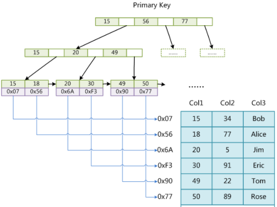

# 数据库

### MySQL 执行一条查询语句的内部执行过程
1. 客户端先通过连接器连接到MySQL服务器
2. 连接器权限验证，如果有缓存则直接返回缓存数据，没有则进入分析器
3. 分析器堆查询语句进行语法分析和词法分析，判断SQL语法，语法错误返回客户端错误信息，语法正确进入下一步优化器。
4. 优化器堆查询语句优化处理，比如表里有多个索引，优化器会判别哪个索引性能更好。
5. 优化器执行完就进入执行器，执行器执行语句进行查询比对，查询到满足条件的所有数据，然后返回。

### 索引类型
- 主键索引：一张表只能有一个主键索引，主键索引列值唯一，不能有空值。
- 唯一索引：一张表可以多个唯一索引，唯一索引列值唯一，可以有空值。
- 普通索引：一张表可以有多个普通索引，可以重复，可以为空值。
- 复合索引（多列索引）：在多个字段上创建的索引。遵循最左前缀原则，只有在查询条件中使用了复合索引的第一个字段，索引才会被使用。
- 全文索引：可以加快模糊查询，不常用。

- 聚集索引（聚簇索引）：数据在物理存储中的顺序和索引中数据的逻辑顺序相同。一张表只能有一个聚集索引，一般是表中的主键索引，如果没有主键索引就会以第一个非空的唯一索引作为聚集索引。
- 非聚集索引：数据在物理储存中的顺序跟索引中的数据的逻辑顺序不同。非聚集索引无法定位数据所在行，需要两遍扫描索引树。第一遍扫描非聚集索引的索引树，确定数据的主键ID后再去聚集索引中寻找相应的数据。

### 什么时候使用索引，什么时候不
需要建立索引的情况
- 经常搜索的列
- 作为主键的列
- 经常需要连接（where子句）的列
- 经常需要排序的列
- 经常需要范围查找的列

不需要建立索引的情况
- 很少查询的列
- 更新很频繁的列
- 表得整体行数较少
参考：https://www.cnblogs.com/wezheng/p/8399305.html

### MySQL B+树
这篇blog讲的很好[MySQL索引数据结构](http://blog.codinglabs.org/articles/theory-of-mysql-index.html)。

#### 为什么使用B/B+树
索引本身也很大，不可能全部存储在内存中，因此索引往往以索引文件的形式存储的磁盘上。这样的话，索引查找过程中就要产生磁盘I/O消耗，相对于内存存取，I/O存取的消耗要高几个数量级。索引的结构组织要尽量减少查找过程中磁盘I/O的存取次数。

#### 主存存取原理
主存是一系列的存储单元组成的矩阵，每个存储单元存储固定大小的数据。每个存储单元有唯一的地址，现代主存的编址规则比较复杂，这里将其简化成一个二维地址：通过一个行地址和一个列地址可以唯一定位到一个存储单元。

主存的存取过程如下：
- 当系统需要读取主存时，则将地址信号放到地址总线上传给主存，主存读到地址信号后，解析信号并定位到指定存储单元，然后将此存储单元数据放到数据总线上，供其它部件读取。
- 写主存的过程类似，系统将要写入单元地址和数据分别放在地址总线和数据总线上，主存读取两个总线的内容，做相应的写操作。
- 主存存取的时间仅与存取次数呈线性关系

#### 磁盘存取原理
盘片被划分成一系列同心环，圆心是盘片中心，每个同心环叫做一个磁道，所有半径相同的磁道组成一个柱面。磁道被沿半径线划分成一个个小的段，每个段叫做一个扇区，每个扇区是磁盘的最小读写单元。

当需要从磁盘读取数据时，系统会将数据逻辑地址传给磁盘，磁盘的控制电路按照寻址逻辑将逻辑地址翻译成物理地址，即确定要读的数据在哪个磁道，哪个扇区。为了读取这个扇区的数据，需要将磁头放到这个扇区上方，为了实现这一点，磁头需要移动对准相应磁道，这个过程叫做寻道，所耗费时间叫做寻道时间，然后磁盘旋转将目标扇区旋转到磁头下，这个过程耗费的时间叫做旋转时间。
磁盘预读：预读的长度一般为页（page）的整倍数。页是计算机管理存储器的逻辑块，硬件及操作系统往往将主存和磁盘存储区分割为连续的大小相等的块，每个存储块称为一页（页大小通常为4k），主存和磁盘以页为单位交换数据。当程序要读取的数据不在主存中时，会触发一个缺页异常，此时系统会向磁盘发出读盘信号，磁盘会找到数据的起始位置并向后连续读取一页或几页载入内存中，然后异常返回，程序继续运行。

#### MyISAM索引实现
MyISAM引擎使用B+Tree作为索引结构，叶节点的data域存放的是数据记录的地址。MyISAM中首先按照B+Tree搜索索引，如果指定的Key存在，则取出其data域的值，然后以data域的值为地址，读取相应数据记录。在MyISAM中主键索引和辅助索引结构上是一样的。

#### InnoDB索引实现

- MyISAM索引文件和数据文件是分离的，索引文件叶节点data域仅保存`数据地址`。而在InnoDB中，表数据文件本身就是按B+Tree组织的一个索引结构，主键索引树的的叶节点data域保存了`完整的数据记录`。
- 与MyISAM索引的不同是InnoDB的辅助索引data域存储相应记录`主键的值`而不是地址。

- 不建议使用过长的字段作为主键，因为所有辅助索引都引用主索引，过长的主索引会令辅助索引变得过大。
- 非单调的主键会造成在插入新记录时数据文件为了维持B+Tree的特性而频繁的分裂调整，十分低效，而使用自增字段作为主键则是一个很好的选择。

### 事务的实现
事务是一组原子性操作的集合。实现事务要保证可靠性和并发隔离，满足ACID特性。主要是靠日志恢复和并发控制实现的：
- 日志恢复：数据库有两个日志，一个是redo log, 一个是undo log。redo log记录的是已经成功提交的事务操作信息，用来恢复数据，保证事务的`持久性`。undo log记录的是事务修改之前的数据信息，用来回滚数据，保证事务的`原子性`。
- 并发控制：并发控制主要靠读写锁和MVCC（多版本并发控制）来实现。读写锁包括共享锁和排它锁，保证事务的`隔离性`。MVCC通过为数据添加时间戳来实现。

### ACID (atomicity, consistency, isolation, durability)
- A: atom 原子性: 事务是一个不可分割的工作单位，这组操作`要么全部发生，要么全部不发生`。
- C: consistency 一致性: `数据库总是从一个一致性状态转移到另一个一致性状态`。比如在银行转账操作后两个账户的总额应当不变。
- I: isolation 隔离性: `一个事务所作的修改在最终提交以前，对其他事务是不可见的`。
- D：durability 持久性: `一旦事务提交，其所作的修改会永久的保存到数据库中`，即使系统崩溃，修改的数据也不会丢失。如果事务没有完成，数据库因故断电了，那么重启后也应该是没有执行事务的状态，如果事务已经完成后数据库断电了，那么重启后就应该是事务执行完成后的状态。

### 数据库的隔离级别
- 未提交读 (Read Uncommitted): 事务中的修改，即使没有提交，对其他事务也是可见的。会出现脏读的问题。
- 已提交读/不可重复读 (Read Committed): 一个事务从开始到结束前，只能看见已经提交的事务所做的修改。两次同样的查询，可能得到不一样的结果，但这并不是什么异常。解决了脏读。
- 可重复读 (Repeatable Read): 同一个事务，多次读取同记录的结果是一致的，在该事务执行期间，禁止其他事务对此字段更新。解决了脏读，不可重复读（可通过锁行实现），但是有幻读的问题。
- 可串行化 (Serializable): 最高的隔离级别，强制事务串行执行，会有大量超时和锁争用的问题，实际中很少使用。

SQL Server 默认隔离级别是 已提交读
MySQL 默认隔离级别是 可重复读

### 脏读，不可重复读和幻读
- `脏读`：事务读取其他事务未提交的数据。
> 比如A向B转账100，A的账户减少了100，而B的账户还没来得及修改，此时一个并发的事务访问到了B的账户，就是脏读
- `不可重复读`：不可重复读是对于数据库中的某一个字段，一个事务多次查询却返回了不同的值，这是由于在查询的间隔中，该字段被另一个事务修改并提交了。
> 比如A第一次查询自己的账户有1000元，此时另一个事务给A的账户增加了1000元，所以A再次读取他的账户得到了2000的结果，跟第一次读取的不一样。
不可重复读与脏读的不同之处在于，脏读是读取了另一个事务没有提交的脏数据，不可重复读是读取了已经提交的数据，实际上并不是一个异常现象。
- `幻读`：当某个事务在读取某个范围内的记录时，另外一个事务又在该范围内插入了新的记录，当之前的事务再次读取该范围的记录时，会产生换行。
> 比如A公司一共有100个人，第一次查询总人数得到100条记录，此时另一个事务新增了一个人，所以下一次查询得到101条记录。
不可重复读和幻读的不同之处在于，`幻读是多次读取的结果行数不同，不可重复读是读取结果的值不同`。

避免不可重复读需要锁行，避免幻读则需要锁表。

脏读，不可重复读和幻读都是数据库的读一致性问题，是在并行的过程中出现的问题，必须采用一定的隔离级别解决。

补充：https://blog.csdn.net/fuzhongmin05/article/details/91126936

### 数据库的范式
- 第一范式，`确保每列保持原子性`。第一范式是最基本的范式。如果数据库表中的所有字段值都是不可分解的原子值，就说明该数据库表满足了第一范式。
- 第二范式，`确保表中的每列都和主键相关`。在一个数据库表中，一个表中只能保存一种数据，不可以把多种数据保存在同一张数据库表中。
- 第三范式，`确保非主键的列没有传递依赖`。数据表中的每一列数据都和主键直接相关，而不能间接相关。非主键的列不能确定其他列，列与列之间不能出现传递依赖。
> 比如一张学生信息表，主键是（学号）列包括 姓名，班级，班主任 就不符合第三范式，因为非主键的列中 班主任 依赖于 班级。

### MySQL 的优化
高频访问：
- 分表分库：将数据库表进行水平拆分，减少表的长度
- 增加缓存： 在web和DB之间加上一层缓存层
- 增加数据库的索引：在合适的字段加上索引，解决高频访问的问题
并发优化：
- 主从读写分离：只在主服务器上写，从服务器上读
- 负载均衡集群：通过集群或者分布式的方式解决并发压力

### innodb和myisam的特点与区别

### 锁
参考 [小林-互斥锁、自旋锁、读写锁、悲观锁、乐观锁](https://mp.weixin.qq.com/s?__biz=MzUxODAzNDg4NQ==&mid=2247485583&idx=1&sn=412546e55f9f5cf394bdda633fcc2b1c&chksm=f98e4c25cef9c53350fcfcae69d771298e535c3c15e77af2a0c241a4738766ff616354c3e3f3&scene=126&sessionid=1600524740&key=0ac52f944ed0d7b1051d00555aa7b46b5d2242eaf68f9f2728123e4ffe1e47d490527eecc95a812718b4b8c816236e82adf382734a1486ce2533069a3e4bbc39e3c20ce29ea2659ca86934a0f29d0976e9691bdda8c2cd2601207df30455e11479c7df2479aa7d933ac686942f8ed9506403390309ca001d72502361074eec92&ascene=1&uin=Njk1MDM4NjA3&devicetype=Windows+10+x64&version=6209007b&lang=zh_CN&exportkey=AbsY2lIxq8XUWu4mXW9g3zQ%3D&pass_ticket=zBNH23z8Ll4V7eYW3tTgDPSVPgUG9bJD0qUMZJl1obSfyw%2BYFpkgcb282inC%2FEbo&wx_header=0)
互斥锁、自旋锁、共享锁（读锁）、排它锁（写锁）、悲观锁、乐观锁

加锁的目的是保证共享资源在任意时间里，只有一个线程访问，避免多线程导致共享数据错乱的问题。

其中 互斥锁 与 自旋锁 是很多高级锁的基础，先介绍一下。

#### 互斥锁 与 自旋锁
当已经有一个线程加锁后，其他线程加锁就会失败，互斥锁和自旋锁对于加锁失败的后处理不一样
- 互斥锁加锁失败后，线程会释放CPU给其他线程
- 自旋锁加锁失败后，线程会忙等待，直到它拿到锁

举一个互斥锁的例子，当线程A加互斥锁成功后，互斥锁被线程A独占，只要A没有释放锁，线程B加锁就失败，线程B会释放CPU时间给其他线程，自己进入阻塞态。因此加互斥锁的开销是 `两次线程上下文切换的成本`，
- 当线程B加锁失败，内核把线程从运行态切换到阻塞态，CPU时间调度给其他线程。
- 当A加的互斥锁释放了，线程B从阻塞态变为就绪态，等待CPU时间，进入运行态。
同一进程内线程间的切换的开销，涉及线程的私有数据，寄存器等不共享的数据；还需要切换到内核态进行切换。

如果被锁住的代码执行时间很短，就不应该使用互斥锁，而应该用自旋锁。

自旋锁通过CPU提供的 CAS函数，在用户态完成加锁和解锁的操作，不会主动产生线程上下文切换。 CAS 函数是一个原子指令，包含两个步骤，1.查看锁的状态 2.如果空闲则加锁占用。自旋锁切换开销小，但如果被锁的代码执行时间长，线程自旋忙等待的时间也长。

#### 共享锁（读锁）与 排它锁（写锁）
排它锁 可根据需要 选择 互斥锁 或者 自旋锁 来实现。
读锁是共享锁，可以被多个线程同时持有，而不造成阻塞。
写锁是排它锁，任何时刻只能有一个线程持有写锁。

根据读写的优先级，可分为 读优先锁，写优先锁，公平读写锁 等
举一个写优先锁的例子，工作如下：
- 当写锁没有被线程持有时，多个线程能并发的持有读锁，其都能共享访问资源。
- 当写锁被一个线程持有后，读进程获取读锁的操作会被阻塞，其他写进程获取写锁的操作也会被阻塞，直到写锁被释放。
公平读写锁实现的一个简单方式是：用队列把获取读与写锁的线程排队，按照FIFO的顺序加锁即可，避免饥饿。

#### 乐观锁 与 悲观锁
互斥锁，自旋锁，共享锁，排它锁都是悲观锁
悲观锁认为：多线程同时修改共享资源的概率高，容易出现冲突，因此访问共享资源前，先加锁。

乐观锁认为：多线程同时修改共享资源的概率低，先让多线程去修改共享资源，再验证这段时间有没有发生冲突，没有则操作完成，有冲突则放弃本次操作。乐观锁也叫无锁编程。 在线文档编辑，git 都是乐观锁，缺点是解决冲突的重试成本高，要回滚或者手动修改等。（如何验证冲突呢？比如可以记录并比较 版本号，时间等信息）
