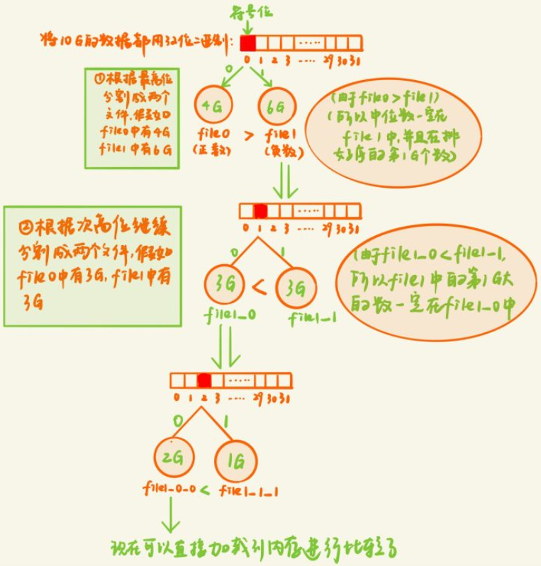
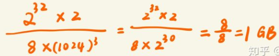

# 海量数据找中位数

### 题目： 只有2G内存的pc机，在一个存有10G个整数的文件，从中找到中位数。

#### 思路一：外排序（排序-归并）
什么是外排序
外排序就是由于数据量太大不能一次性加载到内存，所以需要先暂时用外存储器（硬盘）将数据存起来，然后依次读入一部分数据到内存，排序之后，生成临时文件存储到硬盘，最后再对这些临时文件进行一个归并，得到最后的排序结果（在合并的过程中虽然不需要多大内存，但是会产生频繁的IO操作，频繁的读磁盘和写磁盘）
《编程之法》中的例子：

假定现在有20个数据的文件A：{5 11 0 18 4 14 9 7 6 8 12 17 16 13 19 10 2 1 3 15}，但一次只能使用仅装4个数据的内容，所以，我们可以每趟对4个数据进行排序，即5路归并，具体方法如下述步骤：

我们先把“大”文件A，分割为a1，a2，a3，a4，a5等5个小文件，每个小文件4个数据
a1文件为：5 11 0 18
a2文件为：4 14 9 7
a3文件为：6 8 12 17
a4文件为：16 13 19 10
a5文件为：2 1 3 15
然后依次对5个小文件分别进行排序
a1文件完成排序后：0 5 11 18
a2文件完成排序后：4 7 9 14
a3文件完成排序后：6 8 12 17
a4文件完成排序后：10 13 16 19
a5文件完成排序后：1 2 3 15
最终多路归并，完成整个排序
整个大文件A文件完成排序后：0 1 2 3 4 5 6 7 8 9 10 11 12 13 14 15 16 17 18 19
本题思路：先通过外排序进行排序再寻找中位数
先将这10G的数据等分成5份存储到硬盘中，然后依次读入一份到内存里面，进行排序，然后将这5份数据进行归并得到最后的排序结果，然后找出中位数第5G大

#### 思路二：堆排序（转换为求前5G大的元素）
我们知道利用堆排序处理海量数据的topK是非常合适不过了，因为它不用将所有的元素都进行排序，只需要比较和根节点的大小关系就可以了，同时也不需要一次性将所有的数据都加载到内存；对于海量数据而言，要求前k小/大的数，我们只需要构建一个k个大小的堆，然后将读入的数依次和根节点比较就行了（当然这里的前提是内存需要存的下k个数）

最大堆求前n小，最小堆求前n大。

1、前k小：构建一个k个数的最大堆，当读取的数大于根节点时，舍弃；当读取的数小于根节点时，替换根节点，重新塑造最大堆，然后继续读取，最后读取完所有的数据之后，最大堆中的数就是最小k个数

2、前k大：构建一个k个数的最小堆，当读取的数小于根节点时舍弃；当读取的数大于根节点时，替换根节点，重新塑造最小堆，然后继续读取，读取完所有的数据之后，最小堆中的数就是最大k个数

所以我们本题采用堆排序来求中位数

对于10G的数据，它的中位数就是第5G个元素，按常理来说我们需要构建一个5G大小的堆，但是允许的内存只有两个G，所以我们先构建一个1G大小的大顶堆，然后求出第1G个元素（根节点），然后利用该元素构建一个新的1G大小的堆，求出第2G大的元素，依次类推，求出第5G大的元素

每次构建一个堆求第几G大的元素，都需要重新遍历完所有10G的数据，相当于要遍历5 * 10G次，这需要频繁的IO操作，需要不断的从硬盘中读取数据

#### 思路三: 基于二进制位快速选择
基于二进制位将10G数据映射到不同的文件中，利用快速选择的思想寻找中位数。

依次读入一部分数据到内存，根据数据的最高位将数据映射到不同的文件中，然后判断中位数可能存在于于哪个文件然后再继续对哪个文件进行分割，直到能够将数据读入内存直接排序.

该方法相对于外排序和堆排序可以减少磁盘IO的次数，每次可以丢弃一部分数据不再进行读取和写入操作

#### 思路四：bitmap
位图 存储空间受最大值影响,多个重复数字效果不好

bitmap的应用

1）查找：先将所有数据映射到bitmap里面，然后判断目标数是否在bitmap里面

2）判断重复：依次将数据放入bitmap里面，若已经放入（该bit位为1），那么就重复

3）找出不重复的数：使用2-bitmap，00表示为出现，01表示出现1次，10表示出现多次，当遍历完所有数据之后，筛选出bit位为00的下标；或者使用两个1-bitmap，如果重复就放入另外一个bitmap，那么另外一个bitmap为1的位都是重复的数

本题思路：使用位图法
假设10G数据都为无符号整数（范围为0-2^32），考虑到可能原数据中可能有重复，所以我们采用两个bit位来表示一个整数，00表示为出现，01表示出现1次，10表示出现多次

所需要的内存为

对于10G的数据我们只需要1G的内存就能够表示出来所有的数据，可见bitmap的压缩性之强

我们依次读取10G数据，然后转换为位图表示，去掉所有bit位为00的位置，找到中间下标就是中位数
