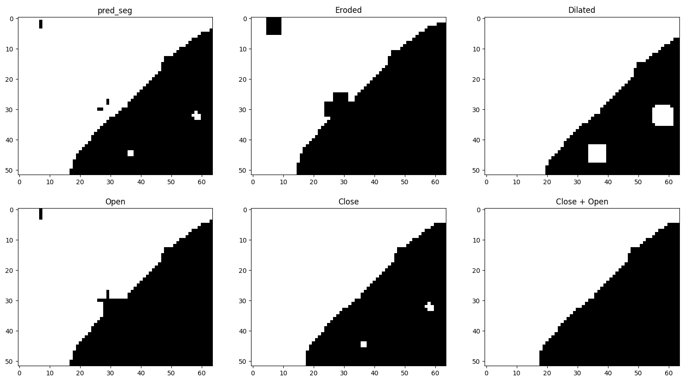
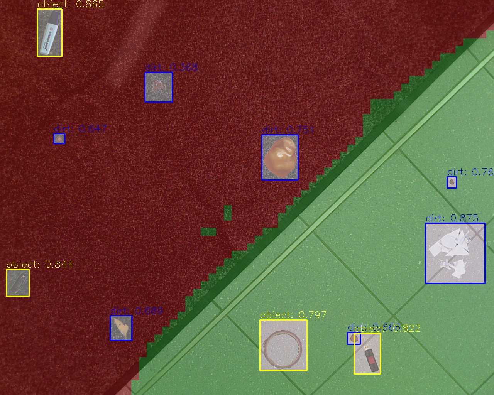
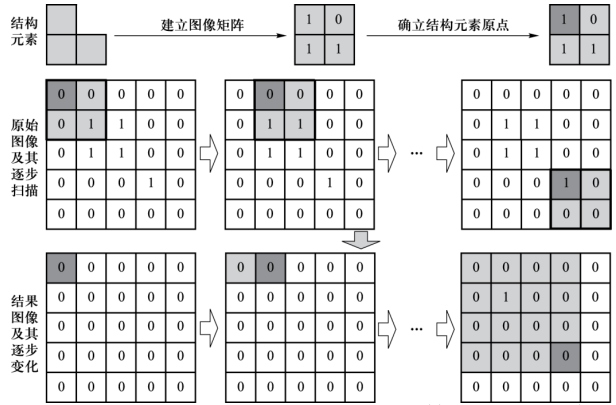
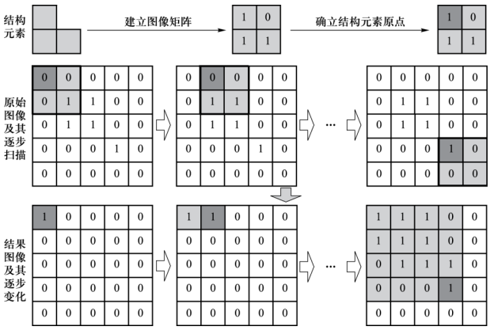

# 通过形态学过滤图片中的噪声点
以及少的代价,在目标检测的基础上引入了语义分割的分支,让机器人在检测脏东西的同时,区别出可行驶区域,因此有必要对粗的语义分割结果进行处理,这里使用了图形形态学中的腐蚀,膨胀,开运算,闭运算.

下图左上角是语义分割的结果(这里是二分类,多分类类似), 分别使用腐蚀,膨胀,开运算,闭运算,开运算+闭运算对原始结果进行了处理



处理前



处理后


### Eroded 腐蚀: 用来消除小且无意义的目标物,同时会造成目标区域范围变小，图像的边界收缩



 1.定义核结构元素
 ```python
 # example
 kernel = cv2.getStructuringElement(cv2.MORPH_RECT, (3, 3))
 kernel = np.ones((5, 5), np.uint8)
 ```
 2.卷积待处理图片,对当前卷积位置,完全重合(即核中为1对应的图片区域值也都为1),则对输出图像对应的像元赋值为1,否则为0
 ```python
 eroded = cv2.erode(src, kernel)
 ```
 注意要保证待处理图片为np.array, dtype='uint8'

### Dilated 膨胀: 用来填补空洞,消除小颗粒噪声,同时会造成目标区域范围变大，图像的边界拓张



 1.定义核结构元素

 2.卷积待处理图片,对当前卷积位置,非空(即核中为1对应的图片区域值至少一个为1),则对输出图像对应的像元赋值为1,否则为0
 ```python
 dilated = cv2.dilate(src, kernel)
 ```
### 开运算: 先腐蚀再膨胀,分离物体,消除物体外小区域
```python
opened = cv2.morphologyEx(src, cv2.MORPH_OPEN, kernel)
```
### 闭运算: 先膨胀再腐蚀,优化物体内部空洞
```python
closed = cv2.morphologyEx(src, cv2.MORPH_CLOSE, kernel)
```

### skimage 提供的移除小物体API
**实测: 对于独立小物体,remove_small_objects效果较好;对于小物体相互又交错的,使用闭运算 + 开运算效果较好**

skimage.morphology.remove_small_objects 仅对目标区域(既值大与0的区域)进行处理,若同时想对背景区域处理需要反值
```python
################# skimage remove small object #################
pred_seg_rev = 1 - pred_seg
pred_seg_rev_rmv = skimage.morphology.remove_small_objects(pred_seg_rev, min_size=300, connectivity=1)
pred_seg_rmv = 1 - pred_seg_rev_rmv
pred_seg_rmv = skimage.morphology.remove_small_objects(pred_seg_rmv, min_size=300, connectivity=1)
```

注意: 对语义mask与原图像融合时可使用cv2.add,避免溢出255
```python
vis_image = cv2.add(0.6 * original_image, 0.4 * seg_map).astype('uint8')
```
