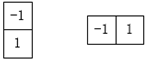
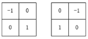
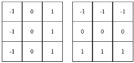
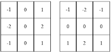
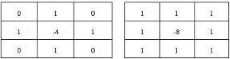

# 各种边缘检测算子
图像梯度
图像离散分布，求导其实就是做差分，在点(x,y)处梯度$g_x$ 和 $g_y$ 定义如下:
$$ g_x = \frac{\partial f(x,y)}{\partial x} = f(x+1,y) - f(x,y) $$

$$ g_y = \frac{\partial f(x,y)}{\partial y} = f(x,y+1) - f(x,y) $$

可以通过如下卷积获取每个点的一阶梯度

二阶梯度 (g梯度大小，theta梯度方向)
$$ g_x = \frac{\partial^2 f(x,y)}{\partial x^2} =
f(x+1,y)+f(x-1,y)-2f(x,y) $$

$$ g_y = \frac{\partial^2 f(x,y)}{\partial y^2} =
f(x,y+1)+f(x,y-1)-2f(x,y) $$

$$ g = \sqrt{g_x^2 + g_y^2}$$

$$ \theta = arctan(g_y/g_x)$$

### Roberts算子
能较好的增强正负45度的图像边缘

### Prewitt 算子

### Sobel算子

Sobel算子对于像素位置的影响做了加权

### Laplacian 算子
Laplace算子是一种各向同性算子，不能检测出边的方向。Laplace算子对孤立象素的响应要比对边缘或线的响应要更强烈，因此只适用于无噪声图象。存在噪声情况下，使用Laplacian算子检测边缘之前需要先进行低通滤波。所以，拉普拉斯算子一般不会用于边的检测，而是常用来判断边缘像素位于图像的明区或暗区。

### Canny
算法步骤：
- 用高斯滤波器平滑图像.因为噪声就是灰度变化大的地方，容易被识别为伪边缘。
- 用一阶偏导有限差分计算梯度幅值和方向，例如 Sobel
- 对梯度幅值进行非极大值抑制.在得到每个像素的梯度大小和方向后，遍历每个像素，判断该像素的梯度大小在该像素梯度方向上是否是其邻域中的局部最大值,不是的话抑制为0.
- 用双阈值算法检测和连接边缘：通过非极大值抑制后，仍然有很多的可能边缘点，进一步的设置一个双阈值，低阈值low，高阈值high。灰度变化大于high的，设置为强边缘像素，低于low的，剔除。在low和high之间的设置为弱边缘。对每一个弱边缘进一步判断，如果其领域内有强边缘像素，保留，如果没有，剔除.

参考: https://zhuanlan.zhihu.com/p/106832002
https://github.com/GYee/CV_interviews_Q-A/blob/master/%E5%9B%BE%E5%83%8F%E5%A4%84%E7%90%86/08_%E8%BE%B9%E7%BC%98%E6%A3%80%E6%B5%8B%E7%AE%97%E5%AD%90%E6%9C%89%E5%93%AA%E4%BA%9B%E4%BB%A5%E5%8F%8A%E5%AE%83%E4%BB%AC%E4%B9%8B%E9%97%B4%E7%9A%84%E5%AF%B9%E6%AF%94.md
