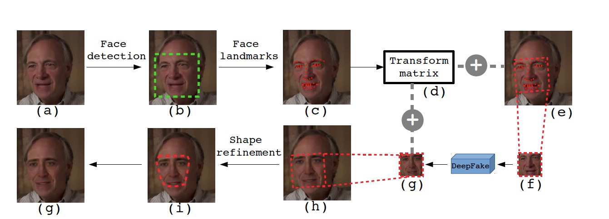
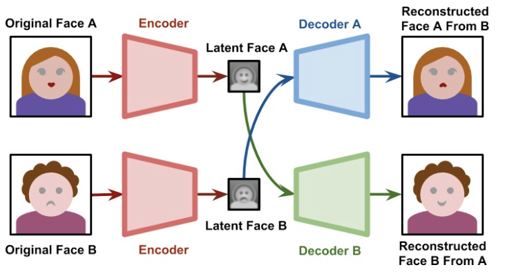

# 乐鑫0609
10个英文单选, 2个编程, 3个简答

## 同时完成项目的最短时间
参考: https://www.youtube.com/watch?v=x3mm5a_CwRM
```python
times = [2,2,4,2,3,6,1]
depends = [[0,1],[0,2],[1,3],[2,3],[3,4],[5,6],[6,4]]

from collections import defaultdict, deque
if __name__ == "__main__":
    n = len(times)
    indegrees = [0] * n
    adjacency = defaultdict(list)
    for depend in depends:
        prev, curr = depend
        adjacency[prev].append(curr)
        indegrees[curr] += 1

    queue = deque()
    earliest = [0] * n
    latest = [float("inf")] * n
    for i in range(n):
        if indegrees[i] == 0:
            queue.append(i)
            earliest[i] = times[i]
    queue0 = queue.copy()

    """ O(V+E) """
    while queue:
        prev = queue.pop()
        if prev not in adjacency:
            continue
        for curr in adjacency[prev]:
            indegrees[curr] -= 1
            earliest[curr] = max(earliest[curr], earliest[prev]+times[curr])
            if indegrees[curr] == 0:
                queue.appendleft(curr)
    print(earliest)

    """假如还要反向推回去求机动时间"""
    rev_adjacency = [[] for i in range(n)]
    for depend in depends:
        prev, curr = depend
        rev_adjacency[curr].append(prev)

    queue = deque()
    max_val = max(earliest)
    latest = [max_val] * n
    for i in range(n):
        if earliest[i] == max_val:
            queue.append(i)

    while queue:
        curr = queue.pop()
        for prev in rev_adjacency[curr]:
            queue.appendleft(prev)
            latest[prev] = min(latest[prev], latest[curr]-times[curr])
    print(latest)

    """机动时间定义为 earliest[i]-latest[j]-V[i][j], 机动时间为0的活动组成的路径称为关键路径"""
    queue = queue0
    flexible = [[0] * n for i in range(n)]
    while queue:
        prev = queue.pop()
        if prev not in adjacency:
            continue
        for curr in adjacency[prev]:
            flexible[prev][curr] = latest[curr] - earliest[prev] - times[curr]
            queue.appendleft(curr)
    print(flexible)
```

## 分类器评价指标主要有
1，Accuracy
2，Precision
3，Recall
4，F1 score
5，ROC 曲线
6，AUC
7，PR 曲线

## 神经网络模型压缩方法
参考: https://github.com/glqglq/glqblog/blob/master/_posts/2019-04-30-%E7%A5%9E%E7%BB%8F%E7%BD%91%E7%BB%9C%E5%8E%8B%E7%BC%A9%E7%BB%BC%E8%BF%B0.md
1. 更精细模型的设计 (深度可分离卷积, SSH)
2. 模型裁剪/剪枝（Pruning）
权重(Weight)剪枝——非结构化, 核内权重(Intra Kernel Weight)剪枝/核的稀疏化——结构化, 卷积核(Kernel/ Filter)/特征图(Feature Map)/通道(Channel)剪枝——结构化, 中间隐层(Layer)剪枝
3. 张量分解. 三维张量铺展成二维张量，使用标准SVD方法
4. 权值共享
5. 权重量化(Quantization). 通过减少表示每个权重所需的比特数来压缩原始网络
6. 知识蒸馏. 在同一个域上迁移学习


## 人脸识别流程
- 人脸检测。人脸检测器用于寻找图像中人脸的位置，如果有人脸，就返回包含每张人脸的边界框的坐标。
- 人脸对齐。人脸对齐的目标是使用一组位于图像中固定位置的参考点来缩放和裁剪人脸图像。这个过程通常需要使用一个特征点检测器来寻找一组人脸特征点，在简单的 2D 对齐情况中，即为寻找最适合参考点的最佳仿射变换。
- 人脸表征。在人脸表征阶段，人脸图像的像素值会被转换成紧凑且可判别的特征向量，这也被称为模板（template）。理想情况下，同一个主体的所有人脸都应该映射到相似的特征向量。
- 人脸匹配。在人脸匹配构建模块中，两个模板会进行比较，从而得到一个相似度分数，该分数给出了两者属于同一个主体的可能性。

## ZAO 换脸原理
参考: https://developer.aliyun.com/article/717367




