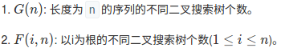

# Leetcode 汇总
### 位操作/位运算
#### [136. 只出现一次的数字](https://leetcode-cn.com/problems/single-number/)
```
给定一个非空整数数组，除了某个元素只出现一次以外，其余每个元素均出现两次。找出那个只出现了一次的元素。
```
```python
class Solution:
    def singleNumber(self, nums: List[int]) -> int:
        val = 0
        for num in nums:
            val ^= num
        return val
```

#### [137. 只出现一次的数字 II](https://leetcode-cn.com/problems/single-number-ii/)
```
给定一个非空整数数组，除了某个元素只出现一次以外，其余每个元素均出现了m=3次。找出那个只出现了一次的元素。
```
统计nums数组中二进制1的出现次数,%m,剩下的就是只出现了一次的数字
```python
class Solution:
    def singleNumber(self, nums: List[int]) -> int:
        count = [0 for i in range(32)]
        for num in nums:
            for i in range(32):
                count[i] += num & 1
                num >>= 1
        res = 0
        m = 3
        for i in range(31,-1,-1):
            res <<= 1 # 放在前面避免多左移一次
            res |= count[i] % m
        # 将数字32位以上取反，32位以下不变。
        if count[-1] % m != 0:
            res = ~(res ^ 0xffffffff)
        return res
```

#### [剑指 Offer 56 - I. 数组中数字出现的次数](https://leetcode-cn.com/problems/shu-zu-zhong-shu-zi-chu-xian-de-ci-shu-lcof/)
```
一个整型数组 nums 里除两个数字之外，其他数字都出现了两次。
```
```python
class Solution:
    def singleNumbers(self, nums: List[int]) -> List[int]:
        val = 0
        for num in nums:
            val ^= num
        pivot = 1
        while val & pivot == 0:
            pivot <<= 1
        a, b = 0, 0
        for num in nums:
            if num & pivot == 0:
                a ^= num
            else:
                b ^= num
        return [a, b]
```

#### [287. 寻找重复数](https://leetcode-cn.com/problems/find-the-duplicate-number/)
```python
class Solution:
    def findDuplicate(self, nums: List[int]) -> int:
        """二分尝试法. 在区间[0,n]搜索, 每次统计数组小于mid的元素个数
        如果 cnt<=mid 说明重复元素在mid之后, 反之在mid之前
        时间 O(nlogn) 空间 O(1)
        """
        n = len(nums)
        l, r = 0, n
        while l < r:
            mid = l + (r-l) // 2
            cnt = 0
            for num in nums:
                if num <= mid:
                    cnt += 1
            if cnt <= mid:
                l = mid + 1
            else:
                r = mid
        return l
```
#### [169. 多数元素](https://leetcode-cn.com/problems/majority-element/)
```python
class Solution:
    def majorityElement(self, nums: List[int]) -> int:
        n = len(nums)
        count = [0 for i in range(32)]
        for num in nums:
            for i in range(32):
                count[i] += num & 1
                num >>= 1
        res = 0
        for i in range(32):
            if count[i] > n/2:
                res |= (1<<i)
        # 将数字32位以上取反，32位以下不变。
        if res >= 1<<31:
            res = ~(res ^ 0xffffffff)
        return res
```
```cpp
class Solution {
public:
    int majorityElement(vector<int>& nums) {
        int n = nums.size();
        vector<int> stat(32, 0);
        for (int num : nums){
            for (int i = 0; i < 32; i++){
                stat[i] += num & 1;
                num >>= 1;
            }
        }
        int res = 0;
        for (int i = 0; i < 32; i++){
            if (stat[i] > n / 2){
                res |= (1 << i);
            }
        }
        return res;
    }
};
```

哈希表：O(n), O(n)
```python
class Solution:
    def majorityElement(self, nums: List[int]) -> int:
        dict_ = {}
        half = len(nums) // 2
        for item in nums:
            if item not in dict_:
                dict_[item] = 1
            else:
                dict_[item] += 1
            if dict_[item] > half: return item
        return False
```
Boyer-Moore 投票：O(n), O(1). 数数相抵消，剩下的是众数
```python
class Solution:
    def majorityElement(self, nums: List[int]) -> int:
        count = 0
        candidate = None
        for num in nums:
            if count == 0:
                candidate = num
            count += (1 if num == candidate else -1)
        return candidate
```

#### [229. 求众数 II](https://leetcode-cn.com/problems/majority-element-ii/)
```python
class Solution:
    def majorityElement(self, nums: List[int]) -> List[int]:
        if not nums: return []
        count1, count2, candidate1, candidate2 = 0, 0, 0, 1
        for n in nums:
            if n == candidate1:
                count1 += 1
            elif n == candidate2:
                count2 += 1
            elif count1 == 0:
                candidate1, count1 = n, 1
            elif count2 == 0:
                candidate2, count2 = n, 1
            else:
                count1, count2 = count1 - 1, count2 - 1
        return [n for n in (candidate1, candidate2) if nums.count(n) > len(nums) // 3] # 注意最后有一个对c1,c2的筛选
```
#### [1018. 可被 5 整除的二进制前缀](https://leetcode-cn.com/problems/binary-prefix-divisible-by-5/)
#### [201. 数字范围按位与](https://leetcode-cn.com/problems/bitwise-and-of-numbers-range/)
```python
class Solution:
    def rangeBitwiseAnd(self, m: int, n: int) -> int:
        """寻找相同前缀1，后面补0"""
        cnt = 0
        while (m != n):
            m >>= 1
            n >>= 1
            cnt += 1
        return m << cnt
```
```cpp
class Solution {
public:
    int rangeBitwiseAnd(int m, int n) {
        int cnt = 0;
        while (m != n){
            m >>= 1;
            n >>= 1;
            cnt += 1;
        }
        return m << cnt;
    }
};
```
#### [190. 颠倒二进制位](https://leetcode-cn.com/problems/reverse-bits/)
颠倒给定的 32 位无符号整数的二进制位
一共32位，先16，16交换，再8，8交换，再4，4交换，再2，2交换，再1，1交换。
```python
class Solution:
    def reverseBits(self, n: int) -> int:
        n = (n >> 16) | (n << 16)
        n = ((n & 0xff00ff00) >> 8) | ((n & 0x00ff00ff) << 8)
        n = ((n & 0xf0f0f0f0) >> 4) | ((n & 0x0f0f0f0f) << 4)
        n = ((n & 0xcccccccc) >> 2) | ((n & 0x33333333) << 2)
        n = ((n & 0xaaaaaaaa) >> 1) | ((n & 0x55555555) << 1)
        return n
```

## 动态规划
### 背包问题
0-1背包: 416, 474, 494. 背包: 322, 518, 1449.
- 整体框架就是for i 遍历物体, for j 遍历重量维度
- 注意初始化需不需要修改dp
- 01背包在 物体i-1重量j维度 逆序遍历,保证每个物体只使用一次
- 多重背包在 物体i重量j维度 正向遍历,保证物体可以重复使用
**dp二维改一维,还是双重循环,框架不变,只是dp只使用重量j的维度**

#### [简化01背包](https://www.lintcode.com/problem/backpack/description)
```
在n个物品中挑选若干物品装入背包，最多能装多满？假设背包的大小为m，每个物品的大小为A[i]
```
```python
class Solution:
    def backPack(self, m, A):
        # --- 递归
        n = len(A)
        dp = [[0 for i in range(m+1)] for j in range(n+1)]
        def helper(index, curr):
            if index == n:
                dp[index][curr] = curr
                return dp[index][curr]
            if dp[index][curr] > 0:
                return dp[index][curr]
            res = 0
            if curr+A[index] <= m:
                pick = helper(index+1, curr+A[index])
                not_pick = helper(index+1, curr)
                res = max(pick, not_pick)
            else:
                not_pick = helper(index+1, curr)
                res = not_pick
            dp[index][curr] = res
            return res
        return helper(0,0)

        #--- 二维数组
        n, m = len(A)+1, m+1
        dp = [[0 for j in range(m)] for i in range(n)]
        for i in range(1, n):
            for j in range(m-1, 0, -1):
                if j < A[i-1]:
                    dp[i][j] = dp[i-1][j]
                else:
                    dp[i][j] = max(dp[i-1][j], dp[i-1][j-A[i-1]]+A[i-1])
        # print(dp)
        return dp[-1][-1]

        #--- 一维数组
        n, m = len(A)+1, m+1
        dp = [0] * m
        for i in range(1, n):
            # 01背包逆序,完全背包正序
            for j in range(m, 0, -1):
                if j < A[i-1]:
                    continue
                dp[j] = max(dp[j], dp[j-A[i-1]]+A[i-1])
            # print(dp)
        return dp[-1]
```
#### [经典01背包](https://www.lintcode.com/problem/backpack-ii/description)
```
有 n 个物品和一个大小为 m 的背包. 给定数组 A 表示每个物品的大小和数组 V 表示每个物品的价值. 问最多能装入背包的总价值是多大?
```
为什么不能 return value
```python
class Solution:
    def backPackII(self, m, A, V):
        #-- 搜索
        n = len(A)
        dp = [[0 for i in range(m+1)] for j in range(n+1)]
        def helper(index, value, weight):
            if index == n:
                return 0
            if dp[index][weight]:
                return dp[index][weight]
            res = 0
            if weight + A[index] <= m:
                pick = helper(index+1, value, weight+A[index])+V[index]
                not_pick = helper(index+1, value, weight)
                res = max(pick, not_pick)
            else:
                not_pick = helper(index+1, value, weight)
                res = not_pick
            dp[index][weight] = res
            return res

        return helper(0, 0, 0)

        #--- 二维dp
        n, m = len(A)+1, m+1
        dp = [[0 for j in range(m)] for i in range(n)]
        for i in range(1, n):
            for j in range(m-1, 0, -1):
                if j < A[i-1]:
                    dp[i][j] = dp[i-1][j]
                else:
                    dp[i][j] = max(dp[i-1][j], dp[i-1][j-A[i-1]]+V[i-1])
        return dp[-1][-1]

        #--- 一维dp
        n, m = len(A)+1, m+1
        dp = [0 for i in range(m)]
        for i in range(1, n):
            for j in range(m-1, -1, -1):
                if j < A[i-1]:
                    continue
                else:
                    dp[j] = max(dp[j], dp[j-A[i-1]] + V[i-1])
        return dp[-1]
```

#### [三维01背包](https://ac.nowcoder.com/acm/contest/6218/C)
```python
class Solution:
    def minCost(self , breadNum , beverageNum , packageSum ):
        n = len(packageSum)
        dp = [[[float("inf")] * (beverageNum+1) for j in range(breadNum+1)] for i in range(n+1)]
        dp[0][0][0] = 0
        for i in range(1, n+1):
            for j in range(breadNum, -1, -1):
                for k in range(beverageNum, -1, -1):
                    x = max(0, j-packageSum[i-1][0])
                    y = max(0, k-packageSum[i-1][1])
                    dp[i][j][k] = min(dp[i-1][j][k], dp[i-1][x][y]+packageSum[i-1][2])
        return dp[-1][-1][-1]
```

#### [563. 背包问题 V](https://www.lintcode.com/problem/backpack-v/my-submissions)
```
给出 n 个物品, 以及一个数组, nums[i] 代表第i个物品的大小, 保证大小均为正数,
正整数 target 表示背包的大小, 找到能填满背包的方案数。每一个物品只能使用一次
```
```python
class Solution:
    """01背包问题,爬楼梯升级版,求排列数
    如果装的下, dp[i][j] = 上一个物品j重量的排列数+上一个物品j-w的排列数
    else      dp[i][j] = 上一个物品j重量的排列数
    """
    def backPackV(self, nums, target):
        # --- 二维dp
        # 1. 初始化dp数组
        n, m = len(nums)+1, target+1
        dp = [[0 for j in range(m)] for i in range(n)]
        for i in range(n):
            dp[i][0] = 1
        # 2. 按顺序遍历dp填表
        for i in range(1, n):
            for j in range(1, m):
                # 3. 状态转移方程
                if j - nums[i-1] < 0:
                    dp[i][j] = dp[i-1][j]
                else:
                    dp[i][j] = dp[i-1][j] + dp[i-1][j-nums[i-1]]
        # print(dp)
        # 4. 最终返回状态
        return dp[-1][-1]

        # --- 一维dp
        dp = [0] * (target+1)
        dp[0] = 1
        n = len(nums)
        for i in range(n):
            for j in range(target, nums[i]-1, -1):
                dp[j] = dp[j-nums[i]] + dp[j]
            print(dp)
        return dp[-1]

        # --- 搜索
        n = len(nums)
        memo = [[0 for i in range(target)] for j in range(n)]
        def helper(index, curr):
            if curr == target:
                return 1
            if curr > target or index == n:
                return 0
            if memo[index][curr]:
                return memo[index][curr]
            pick = helper(index+1, curr+nums[index])
            not_pick = helper(index+1, curr)
            res = pick + not_pick
            memo[index][curr] = res
            return res
        return helper(0, 0)
```
#### [562. 背包问题 IV](https://www.lintcode.com/problem/backpack-iv/description)
```
给出 n 个物品, 以及一个数组, nums[i]代表第i个物品的大小, 保证大小均为正数并且没有重复,正整数 target 表示背包的大小, 找到能填满背包的方案数。每一个物品可以使用无数次
```
#### [518. 零钱兑换 II](https://leetcode-cn.com/problems/coin-change-2/)
```python
class Solution:
    def backPackIV(self, nums, target):
        """状态转移: 到i,j为止的组合数 = 不使用该硬币组合数 + 使用该硬币组合数"""
        # 1. 初始化dp
        n = len(nums)+1
        m = target+1
        dp = [[0 for j in range(m)] for i in range(n)]
        for i in range(n):
            dp[i][0] = 1
        # 2. 按规则遍历dp填表
        for i in range(1, n):
            for j in range(1, m):
                # 3. 状态转移
                if j - nums[i-1] < 0:
                    dp[i][j] = dp[i-1][j]
                else:
                    dp[i][j] = dp[i-1][j] + dp[i][j-nums[i-1]]
        # 4. 输出最终状态
        return dp[-1][-1]
```

```python
import functools
class Solution:
    def change(self, amount: int, coins: List[int]) -> int:
        n = len(coins)
        coins.sort() # 要break剪枝,不然超时
        @functools.lru_cache(None)
        def helper(amount, index):
            if amount == 0:
                return 1
            if amount < 0:
                return 0
            res = 0
            for i in range(index, n):
                val = amount-coins[i]
                if val < 0:
                    break
                res += helper(val, i)
            return res
        return helper(amount, 0)
```

#### [322. 零钱兑换](https://leetcode-cn.com/problems/coin-change/)
```
给定不同面额的硬币 coins 和一个总金额 amount。编写一个函数来计算可以凑成总金额所需的最少的硬币个数。如果没有任何一种硬币组合能组成总金额，返回 -1。
```
```python
from collections import deque
import functools
class Solution:
    def coinChange(self, coins: List[int], amount: int) -> int:
        """bfs"""
        coins = sorted(coins, reverse=True)
        queue = deque([(amount,0)])
        visited = set([amount])
        while queue:
            top, step = queue.pop()
            if top == 0:
                return step
            for coin in coins:
                res = top - coin
                if res >= 0 and res not in visited:
                    visited.add(res)
                    queue.appendleft((res,step+1))
        return -1

        """dp搜索,记忆化枚举所有状态,对于符合条件返回的状态取最小值"""
        @functools.lru_cache(None)
        def helper(amount):
            if amount == 0:
                return 0
            if amount < 0:
                return None
            res = 0xffffffff
            for coin in coins:
                ans = helper(amount-coin)
                if ans != None:
                    res = min(ans+1, res)
            return res

        ans = helper(amount)
        if ans == 0xffffffff: ans = -1
        return ans

        """dp数组, dp[i]定义为组成金额i所需最少的硬币数"""
        dp = [0xffffffff for i in range(amount+1)]
        dp[0] = 0
        for coin in coins:
            for i in range(coin, amount+1):
                dp[i] = min(dp[i], dp[i-coin]+1)
        # print(dp)
        return dp[-1] if dp[-1] != 0xffffffff else -1
```

#### [70. 爬楼梯](https://leetcode-cn.com/problems/climbing-stairs/)
```python
class Solution:
    def climbStairs(self, n: int) -> int:
        ## dp 1维数组
        if n == 1: return 1
        dp = [0] * n
        dp[0] = 1
        dp[1] = 2
        for i in range(2, n):
            dp[i] = dp[i-1] + dp[i-2]
        return dp[-1]

        ## dp 常数
        if n == 1: return 1
        if n == 2: return 2
        prev = 1
        curr = 2
        nxt = 0
        for i in range(2, n):
            nxt = prev + curr
            prev = curr
            curr = nxt
        return nxt

        ## 枚举+记忆
        import functools
        @functools.lru_cache(None)
        def helper(step):
            if step == 0:
                return 1
            if step < 0:
                return 0
            res = 0
            res += helper(step-1)
            res += helper(step-2)
            return res
        return helper(n)
```
```cpp
class Solution {
public:
    int numWays(int n) {
        if (n <= 1) return 1;
        if (n == 2) return 2;
        int prev = 1;
        int curr = 2;
        int nxt = 3;
        while (n > 2){
            nxt = (prev + curr) % 1000000007;
            prev = curr;
            curr = nxt;
            n--;
        }
        return nxt;
    }
};
```

#### [486. 预测赢家](https://leetcode-cn.com/problems/predict-the-winner/)
```python
class Solution:
    def PredictTheWinner(self, nums: List[int]) -> bool:
        def helper(index, l, r):
            if l > r:
                return 0
            sign = -1 if (index & 1) else 1
            l_score = helper(index+1, l+1, r) + sign * nums[l]
            r_score = helper(index+1, l, r-1) + sign * nums[r]
            # sign妙了，s2也想让自己利益最大化
            return max(l_score*sign, r_score*sign) * sign

        """动态规划"""
        n = len(nums)
        dp = [[0] * n for i in range(n)]
        def dp_helper(sign, l, r):
            if l > r:
                return 0
            if dp[l][r] != 0:
                return dp[l][r]
            l_score = dp_helper(-sign, l+1, r) + sign * nums[l]
            r_score = dp_helper(-sign, l, r-1) + sign * nums[r]
            dp[l][r] = max(l_score*sign, r_score*sign) * sign
            return dp[l][r]

        return dp_helper(1, 0, len(nums)-1) >= 0
```
```cpp
class Solution {
public:
    bool PredictTheWinner(vector<int>& nums) {
        int n = nums.size();
        vector<vector<int>> dp(n, vector<int> (n, 0));
        int result = helper(1, 0, n-1, dp, nums);
        return result >= 0;
    }

    int helper(int sign, int l, int r, vector<vector<int>> &dp, vector<int> &nums){
        if (l > r) return 0;
        if (dp[l][r] != 0) return dp[l][r];
        int l_score = helper(-sign, l+1, r, dp, nums) + sign * nums[l];
        int r_score = helper(-sign, l, r-1, dp, nums) + sign * nums[r];
        dp[l][r] = max(sign*l_score, sign*r_score) * sign;
        return dp[l][r];
    }
};
```

#### [77. 组合](https://leetcode-cn.com/problems/combinations/)
```
给定两个整数 n 和 k，返回 1 ... n 中所有可能的 k 个数的组合。
输入: 3, 2  输出: [[1,2],[1,3],[2,3]]
```
1. 每次从上一index+1开始遍历
2. 如果 已选+剩余可选 < k: break
3. results.append()后要return
时间复杂度 k*C_n^k
```python
class Solution:
    def combine(self, n: int, k: int) -> List[List[int]]:
        results = []
        def helper(index, res):
            if len(res) == k:
                results.append(res)
                return # 重要,避免之后无效的递归
            for i in range(index, n+1):
                # 重要,if 已选+剩余可选 < k: break
                if len(res)+n-i+1 < k:
                    break
                helper(i+1, res+[i])
        helper(1, [])
        return results
```
写函数的时候，输入参数在前，输出参数在后，输入参数写引用，输出参数写指针的形式
调用函数时，输出参数正常申明，传地址进去。
```cpp
class Solution {
public:
    vector<vector<int>> combine(int n, int k) {
        vector<int> res;
        vector<vector<int>> result;
        helper(1, n+1, k, res, &result);
        return result;
    }

    void helper(int index, const int &n, const int &k, vector<int> &res, vector<vector<int>> *result) {
        if (res.size() == k) {
            result->push_back(res);
            return;
        }
        for (int i = index; i < n; i++) {
            if (n - i + 1 < k - res.size()) break;
            res.push_back(i);
            helper(i+1, n, k, res, result);
            res.pop_back();
        }
    }
};
```

#### [78. 子集](https://leetcode-cn.com/problems/subsets/)
```
给定一组不含重复元素的整数数组 nums，返回该数组所有可能的子集（幂集）。
输入: nums = [1,2,3]
输出:[[3],[1],[2],[1,2,3],[1,3],[2,3],[1,2],[]]
```
1. 注意是i+1 不是 index+1
时间, 空间复杂度 O(N 2^N)
```python
class Solution:
    def subsets(self, nums: List[int]) -> List[List[int]]:
        n = len(nums)
        results = []
        def helper(index, res):
            if index > n:
                return
            results.append(res)
            for i in range(index, n):
                helper(i+1, res+[nums[i]])
        helper(0, [])
        return results
```

#### [46. 全排列](https://leetcode-cn.com/problems/permutations/)
```
给定一个 没有重复 数字的序列，返回其所有可能的全排列。
输入: [1,2,3]
输出: [[1,2,3],[1,3,2],[2,1,3],[2,3,1],[3,1,2],[3,2,1]]
```
1. 每次都从index为0开始遍历
2. 当前数字不能在已添加数字里
3. 用vis实现O(1)的查询
```python
class Solution:
    def permute(self, nums: List[int]) -> List[List[int]]:
        result = []
        vis = {num:0 for num in nums}
        n = len(nums)
        def helper(res):
            if len(res) == n:
                result.append(res)
                return
            for num in nums:
                if vis[num]:
                    continue
                vis[num] = 1
                helper(res + [num])
                vis[num] = 0
        helper([])
        return result
```

#### [47. 全排列 II](https://leetcode-cn.com/problems/permutations-ii/)
```
给定一个可包含重复数字的序列，返回所有不重复的全排列。
输入: [1,1,2]   输出: [[1,1,2],[1,2,1],[2,1,1]]
```
```python
from collections import Counter
class Solution:
    def permuteUnique(self, nums: List[int]) -> List[List[int]]:
        nums.sort()
        n = len(nums)
        count = Counter(nums)
        results = []
        def helper(res, count):
            if len(res) == n:
                results.append(res)
                return
            for i in range(n):
                # 跳过重复数字
                if i != 0 and nums[i] == nums[i-1]:
                    continue
                # 跳过用尽数字
                if count[nums[i]] == 0:
                    continue
                count[nums[i]] -= 1
                helper(res+[nums[i]], count)
                count[nums[i]] += 1
        helper([], count)
        return results
```
```cpp
class Solution {
public:
    unordered_map<int, int> stat;
    vector<vector<int>> result;
    vector<int> res;
    vector<vector<int>> permuteUnique(vector<int>& nums) {
        for (auto &item : nums) stat[item] += 1;
        sort(nums.begin(), nums.end());
        helper(nums);
        return result;
    }
    void helper(vector<int> &nums) {
        if (res.size() == nums.size()) {
            result.emplace_back(res);
            return;
        }
        for (int i = 0; i < nums.size(); ++i) {
            if (stat[nums[i]] == 0) continue;
            if (i > 0 && nums[i] == nums[i-1]) continue;
            --stat[nums[i]];
            res.emplace_back(nums[i]);
            helper(nums);
            res.pop_back();
            ++stat[nums[i]];
        }
        return;
    }
};
```

#### [60. 第k个排列](https://leetcode-cn.com/problems/permutation-sequence/)
直接去找第k个排列，剪枝。提前计算好剩余数字对应排列数，然后有剩余就都跳过。
```python
class Solution:
    def getPermutation(self, n: int, k: int) -> str:
        self.k = k
        vis = [0] * n
        stat = [1] * (n+1)
        for i in range(1, n+1):
            stat[i] = i * stat[i-1]

        def helper(s):
            if len(s) == n:
                return s
            for i in range(1, n+1):
                if vis[i-1]:
                    continue
                val = self.k - stat[n-len(s)-1]
                if val > 0:
                    self.k = val
                    continue
                vis[i-1] = 1
                ans = helper(s + str(i))
                vis[i-1] = 0
                return ans

        return helper("")
```
```cpp
class Solution {
public:
    string getPermutation(int n, int k) {
        vector<int> stat(n+1, 1);
        vector<int> vis(n+1, 0);
        for (int i = 1; i < n+1; i++){
            stat[i] = stat[i-1] * i;
        }
        return helper("", stat, vis, k, n);

    }

    string helper(string s, vector<int> &stat, vector<int> vis, int &k, int n){
        if (s.size() == n) return s;
        for (int i = 1; i < n+1; i++){
            if (vis[i]) continue;
            int val = k - stat[n-s.size()-1];
            if (val > 0){
                k = val;
                continue;
            }
            vis[i] = 1;
            return helper(s + to_string(i), stat, vis, k, n);
            vis[i] = 0;
        }
        return s;
    }
};
```

#### [17. 电话号码的字母组合](https://leetcode-cn.com/problems/letter-combinations-of-a-phone-number/)
注意,与全排列II的不同是不能跳过重复数字
```python
from collections import Counter
class Solution:
    def letterCombinations(self, digits: str) -> List[str]:
        if len(digits) == 0: return []
        mapping = {"2":["a","b","c"], "3":["d","e","f"], "4":["g","h","i"], "5":["j","k","l"], "6":["m","n","o"], "7":["p","q","r","s"], "8":["t","u","v"], "9":["w","x","y","z"]}
        stat = []
        for num in digits:
            stat.extend(mapping[num])
        count = Counter(stat)
        results = []
        n = len(digits)
        def helper(index, curr):
            if index == n:
                results.append(curr)
                return
            for char in mapping[digits[index]]:
                if count[char] == 0:
                    continue
                count[char] -= 1
                helper(index+1, curr+char)
                count[char] += 1
        helper(0, "")
        return results
```
```cpp
class Solution {
private:
    vector<string> result;
    unordered_map<char, string> lookup{{'2', "abc"}, {'3', "def"}, {'4', "ghi"},
    {'5', "jkl"}, {'6', "mno"}, {'7', "pqrs"}, {'8', "tuv"}, {'9', "wxyz"}};

public:
    vector<string> letterCombinations(string digits) {
        int n = digits.size();
        if (n == 0) return result;
        helper(0, digits, "", n);
        return result;
    }
    void helper(int index, const string &input, string res, const int &n){
        if (index == n){
            result.push_back(res);
            return;
        }
        char c = input[index];
        for (char item : lookup[c]){
            helper(index+1, input, res+item, n);
        }
    }
};
```

### 二维dp(字符串)
#### [5. 最长回文子串](https://leetcode-cn.com/problems/longest-palindromic-substring/)
```
给定一个字符串 s，找到 s 中最长的回文子串。
输入: "babad" 输出: "bab" 注意: "aba" 也是一个有效答案。
```
从上到下,从左到右
```python
class Solution:
    def longestPalindrome(self, s: str) -> str:
        """dp[i][j]: 子串s[i,j]是否回文. 2个for循环顺序遍历
        if s[i]==s[j], dp[i][j]=dp[i+1][j-1] or 1(if j-i<3)"""
        n = len(s)
        if n == 0: return ""
        dp = [[0]*n for i in range(n)]
        res = (0, 0)
        for i in range(n):
            dp[i][i] = 1
        for j in range(n):
            for i in range(j):
                if s[i] == s[j]:
                    if j - i < 3:
                        dp[i][j] = 1
                    else:
                        dp[i][j] = dp[i+1][j-1]
                    if dp[i][j] == 1:
                        if j - i > res[1] - res[0]:
                            res = (i, j)
        return s[res[0]: res[1]+1]
```

#### [516. 最长回文子序列](https://leetcode-cn.com/problems/longest-palindromic-subsequence/)
```
给定一个字符串s，找到其中最长的回文子序列，并返回该序列的长度。 输入: "bbbab"  输出: 4
```
```python
class Solution:
    def longestPalindromeSubseq(self, s: str) -> int:
        """ dp[i][j]: s[i:j]最长的回文子序列长度
        注意i反向遍历(n-1,-1,-1), j正向遍历(i+1, n) """
        n = len(s)
        if n == 0: return 0
        dp = [[0]*n for i in range(n)]
        for i in range(n):
            dp[i][i] = 1
        for i in range(n-1, -1, -1):
            for j in range(i+1, n):
                if s[i] == s[j]:
                    dp[i][j] = dp[i+1][j-1] + 2
                else:
                    dp[i][j] = max(dp[i+1][j], dp[i][j-1])
        return dp[0][-1]
```

#### [1143. 最长公共子序列](https://leetcode-cn.com/problems/longest-common-subsequence/)
```
给定两个字符串 text1 和 text2，返回这两个字符串的最长公共子序列的长度。
例如，"ace" 是 "abcde" 的子序列，但 "aec" 不是 "abcde" 的子序列.
```
```python
class Solution:
    def longestCommonSubsequence(self, text1: str, text2: str) -> int:
        """ dp[i][j] s1[:i],s2[:j]最长公共子序列
        dp长度为(n1+1,n2+1) 因为要向i-1,j-1查询
        不需要初始化因为初始最长公共子序列为0 """
        n1, n2 = len(text1)+1, len(text2)+1
        dp = [[0]*n2 for i in range(n1)]
        for i in range(1, n1):
            for j in range(1, n2):
                if text1[i-1] == text2[j-1]:
                    dp[i][j] = max(dp[i-1][j-1]+1, dp[i][j-1], dp[i-1][j])
                else:
                    dp[i][j] = max(dp[i][j-1], dp[i-1][j])
        return dp[-1][-1]

        """ 求公共子序列元素,倒序遍历,通过dp控制双指针移动 """
        p1, p2 = n1-2, n2-2
        s = ""
        while p1 >= 0 and p2 >= 0:
            if text1[p1] == text2[p2]:
                s = text1[p1] + s
                p1 -= 1
                p2 -= 1
            else:
                if dp[p1+1][p2] < dp[p1][p2+1]:
                    p1 -= 1
                else:
                    p2 -= 1
        print(s)
```

#### [求最长公共子串的长度和该子串](https://www.nowcoder.com/questionTerminal/02e7cc263f8a49e8b1e1dc9c116f7602)
```python
class LongestSubstring:
    def findLongest(self, A, n, B, m):
        dp = [[0]*(m+1) for i in range(n+1)]
        ans = 0
        for i in range(1, n+1):
            for j in range(1, m+1):
                if A[i-1] == B[j-1]:
                    dp[i][j] = dp[i-1][j-1] + 1
                    ans = max(ans, dp[i][j])
                else:
                    dp[i][j] = 0
        return ans
```

#### [72. 编辑距离](https://leetcode-cn.com/problems/edit-distance/)
```
给你两个单词 word1 和 word2，请你计算出将 word1 转换成 word2 所使用的最少操作数
你可以对一个单词： 插入一个字符 删除一个字符 替换一个字符
输入：word1 = "horse", word2 = "ros"  输出：3
horse -> rorse (将 'h' 替换为 'r')
rorse -> rose (删除 'r')
rose -> ros (删除 'e')
```
```python
class Solution:
    def minDistance(self, word1: str, word2: str) -> int:
        n, m = len(word1)+1, len(word2)+1
        dp = [[0] * m for i in range(n)]
        # 注意初始化空串到另一字符串的距离
        for i in range(n):
            dp[i][0] = i
        for j in range(m):
            dp[0][j] = j
        for i in range(1, n):
            for j in range(1, m):
                if word1[i-1] == word2[j-1]:
                    dp[i][j] = dp[i-1][j-1]
                else:
                    dp[i][j] = min(dp[i-1][j-1], dp[i-1][j], dp[i][j-1]) + 1
        return dp[-1][-1]
```

#### [97. 交错字符串](https://leetcode-cn.com/problems/interleaving-string/)
```
给定三个字符串 s1, s2, s3, 验证 s3 是否是由 s1 和 s2 交错组成的。
```
二维dp
```python
class Solution:
    def isInterleave(self, s1: str, s2: str, s3: str) -> bool:
        n1, n2, n3 = len(s1), len(s2), len(s3)
        if n1 + n2 != n3:
            return False
        dp = [[False] * (n2+1) for i in range(n1+1)]
        dp[0][0] = True
        for i in range(1, n1+1):
            if s1[i-1] == s3[i-1]:
                dp[i][0] = True
            else:
                break
        for j in range(1, n2+1):
            if s2[j-1] == s3[j-1]:
                dp[0][j] = True
            else:
                break
        for i in range(1, n1+1):
            for j in range(1, n2+1):
                flag1 = dp[i-1][j] and s3[i+j-1] == s1[i-1]
                flag2 = dp[i][j-1] and s3[i+j-1] == s2[j-1]
                dp[i][j] = flag1 or flag2
        return dp[-1][-1]
```

#### [正则表达式匹配](https://leetcode-cn.com/problems/regular-expression-matching/)
递归中枚举所有情况,加上记忆化
```python
import functools
class Solution:
    def isMatch(self, s: str, p: str) -> bool:
        @functools.lru_cache(None)
        def helper(text, pattern):
            if len(pattern) == 0: return text == ""
            match =  len(text) != 0 and (pattern[0] == text[0] or pattern[0] == ".")
            if len(pattern) > 1 and pattern[1] == "*":
                return helper(text, pattern[2:]) or (match and helper(text[1:], pattern))
            return match and helper(text[1:], pattern[1:])
        return helper(s, p)
```

### 最大子序问题
1. 定义状态
2. 推导状态转移方程
3. 初始化
4. 输出

#### [152. 乘积最大子数组](https://leetcode-cn.com/problems/maximum-product-subarray/)
```
给你一个整数数组 nums ，请你找出数组中乘积最大的连续子数组（该子数组中至少包含一个数字），并返回该子数组所对应的乘积。
输入: [2,3,-2,4]  输出: 6
```
```python
class Solution:
    def maxProduct(self, nums: List[int]) -> int:
        """
        dp[i][0]: 到数组index为i的元素,最近一段连续的最小乘积
        dp[i][1]: 到数组index为i的元素,最近一段连续的最大乘积
        """
        n = len(nums)
        # 注意２在里面，ｎ在外面
        dp = [[0 for i in range(2)] for j in range(n)]
        # 初始化
        if n == 0: return None
        dp[0][0], dp[0][1] = nums[0], nums[0]
        res = nums[0]
        for i in range(1, n):
            # nums[i] 为正负 两种情况下状态的改变
            if nums[i] > 0:
                # min 的意思为可以在这里截断，dp[i-1]维护的是上一段连续乘积
                dp[i][0] = min(dp[i-1][0]*nums[i], nums[i])
                dp[i][1] = max(dp[i-1][1]*nums[i], nums[i])
            else:
                # 最大值变为最小值，最小值变为最大值
                dp[i][0] = min(dp[i-1][1]*nums[i], nums[i])
                dp[i][1] = max(dp[i-1][0]*nums[i], nums[i])
            res = max(res, dp[i][1])
        return res
```

滚动变量,空间优化
```python
class Solution:
    def maxProduct(self, nums: List[int]) -> int:
        """ 滚动变量,不能只使用curr,要引入prev
        curr_min: 到数组当前index,最近一段连续的最小乘积
        curr_max: 到数组当前index,最近一段连续的最大乘积
        注意 prev <-> curr 之间的转化
        """
        n = len(nums)
        prev_max, prev_min, res = nums[0], nums[0], nums[0]
        for i in range(1, n):
            if nums[i] > 0:
                curr_min = min(nums[i], prev_min*nums[i])
                curr_max = max(nums[i], prev_max*nums[i])
            else:
                curr_min = min(nums[i], prev_max*nums[i])
                curr_max = max(nums[i], prev_min*nums[i])
            prev_min, prev_max = curr_min, curr_max
            res = max(res, curr_max)
        return res
```

#### [53. 最大子序和](https://leetcode-cn.com/problems/maximum-subarray/)
```
给定一个整数数组 nums ，找到一个具有最大和的连续子数组（子数组最少包含一个元素），返回其最大和。
输入: [-2,1,-3,4,-1,2,1,-5,4], 输出: 6
解释: 连续子数组 [4,-1,2,1] 的和最大，为 6。
```
```python
class Solution:
    def maxSubArray(self, nums: List[int]) -> int:
        """
        dp[i]: 到数组i的最近一段最大和
        注意return res 而不是dp[-1]
        """
        n = len(nums)
        dp = [0 for i in range(n)]
        dp[0], res = nums[0], nums[0]
        for i in range(1, n):
            dp[i] = max(dp[i-1]+nums[i], nums[i])
            res = max(dp[i], res)
        return res
```
```python
class Solution:
    def maxSubArray(self, nums: List[int]) -> int:
        comsum, res = nums[0], nums[0]
        n = len(nums)
        for i in range(1, n):
            comsum = max(nums[i], comsum+nums[i])
            res = max(res, comsum)
        return res
```

#### [300. 最长上升子序列](https://leetcode-cn.com/problems/longest-increasing-subsequence/)
```
给定一个无序的整数数组，找到其中最长上升子序列的长度。 LIS
输入: [10,9,2,5,3,7,101,18]  输出: 4
解释: 最长的上升子序列是 [2,3,7,101]，它的长度是 4。
```
O(n^2)动态规划.
- dp[j]定义为到j为止的最长上升子序列长度
- dp初始化为1, 因为非空数组至少1个上升子序列
- val = dp[i]+1 if nums[j]>nums[i]
- val = 1 截断
- dp[j] 取最大的val,在 for i in range(j)的循环中
```python
class Solution:
    def lengthOfLIS(self, nums: List[int]) -> int:
        n = len(nums)
        if n == 0: return 0
        dp = [1] * n
        max_len = 0
        for j in range(n):
            for i in range(j):
                val = dp[i]+1 if nums[i] < nums[j] else 1
                dp[j] = max(dp[j], val)
            max_len = max(max_len, dp[j])
        return max_len
```
```python
class Solution:
    def lengthOfLIS(self, nums: List[int]) -> int:
        def low_bound(nums, l, r, target):
            while l < r:
                m = l + (r-l) // 2
                if nums[m] < target:
                    l = m + 1
                else:
                    r = m
            return l

        dp = []
        for num in nums:
            if len(dp) == 0:
                dp.append(num)
                continue
            index = low_bound(dp, 0, len(dp), num)
            if index == len(dp):
                dp.append(num)
            else:
                dp[index] = num
        return len(dp)
```

#### [674. 最长连续递增序列](https://leetcode-cn.com/problems/longest-continuous-increasing-subsequence/)
```
给定一个未经排序的整数数组，找到最长且连续的的递增序列，并返回该序列的长度。
```
```python
class Solution:
    def findLengthOfLCIS(self, nums: List[int]) -> int:
        n = len(nums)
        if n == 0: return 0
        dp = [1] * n
        max_len = 1
        for i in range(1, n):
            if nums[i] > nums[i-1]:
                dp[i] = dp[i-1] + 1
            max_len = max(max_len, dp[i])
        return max_len
```

#### [435. 无重叠区间](https://leetcode-cn.com/problems/non-overlapping-intervals/)
将问题转化为寻找最大(非严格)递增区间. O(n^2)
dp[i]的状态可由 1. 保留当前i区间, dp[j]+1 2.删除当前i区间 两种状态转移而来,在两种状态中取max
```python
class Solution:
    def eraseOverlapIntervals(self, intervals: List[List[int]]) -> int:
        n = len(intervals)
        if n == 0: return 0
        intervals = sorted(intervals, key=lambda ele:ele[1])
        dp = [1] * n
        res = 1
        for i in range(n):
            for j in range(i-1, -1, -1):
                if intervals[i][0] >= intervals[j][1]:
                    dp[i] = dp[j] + 1
                    break
            dp[i] = max(dp[i], dp[i-1])
            res = max(dp[i], res)
        return n - res
```
贪心, O(nlogn)
```python
class Solution:
    def eraseOverlapIntervals(self, intervals: List[List[int]]) -> int:
        intervals = sorted(intervals, key=lambda ele:ele[1])
        n = len(intervals)
        p, cnt = 0, 0
        while p < n:
            last = intervals[p][1]
            j = p+1
            while j < n and intervals[j][0] < last:
                j += 1
                cnt += 1
            p = j
        return cnt
```

#### [376. 摆动序列](https://leetcode-cn.com/problems/wiggle-subsequence/)
```
如果连续数字之间的差严格地在正数和负数之间交替，则数字序列称为摆动序列。
第一个差（如果存在的话）可能是正数或负数。少于两个元素的序列也是摆动序列。
输入: [1,7,4,9,2,5]   输出: 6
解释: 整个序列均为摆动序列。
```
```python
class Solution:
    def wiggleMaxLength(self, nums: List[int]) -> int:
        """
        up[i]  : 到nums[i]为止最长的上升摆动序列
        down[i]: 到nums[i]为止最长的下降摆动序列
        """
        n = len(nums)
        if n == 0: return 0
        up = [0 for i in range(n)]
        down = [0 for i in range(n)]
        up[0], down[0] = 1, 1
        for i in range(1, n):
            if nums[i] > nums[i-1]:
                up[i] = down[i-1] + 1
                down[i] = down[i-1]
            elif nums[i] < nums[i-1]:
                up[i] = up[i-1]
                down[i] = up[i-1] + 1
            else:
                up[i] = up[i-1]
                down[i] = down[i-1]
        return max(up[-1], down[-1])
```

#### [121. 买卖股票的最佳时机](https://leetcode-cn.com/problems/best-time-to-buy-and-sell-stock/)
```
最多只允许完成一笔交易（即买入和卖出一支股票一次）
```
```python
class Solution:
    def maxProfit(self, prices: List[int]) -> int:
        """
        profit0: 状态为手中无股票的最大收益
        profit1: 状态为手中有股票的最大收益
        """
        n = len(prices)
        if n == 0: return 0
        profit0 = 0
        profit1 = - prices[0]
        for i in range(n):
            profit0 = max(profit0, profit1+prices[i])
            profit1 = max(profit1, -prices[i])
        return profit0
```

#### [122. 买卖股票的最佳时机 II](https://leetcode-cn.com/problems/best-time-to-buy-and-sell-stock-ii/)
```
可以尽可能地完成更多的交易（多次买卖一支股票）。
```
```python
class Solution:
    def maxProfit(self, prices: List[int]) -> int:
        n = len(prices)
        if n == 0: return 0
        profit0 = 0
        profit1 = -prices[0]
        for i in range(1, n):
            profit0 = max(profit0, profit1+prices[i])
            profit1 = max(profit1, profit0-prices[i])
        return profit0
```

#### [123. 买卖股票的最佳时机 III](https://leetcode-cn.com/problems/best-time-to-buy-and-sell-stock-iii/)
```python
class Solution:
    def maxProfit(self, prices: List[int]) -> int:
        n = len(prices)
        if n == 0: return 0
        profit00 = 0
        profit01 = -prices[0]
        profit10 = 0
        profit11 = -prices[0]
        for i in range(n):
            profit00 = max(profit00, profit01+prices[i])
            profit01 = max(profit01, -prices[i])
            profit10 = max(profit10, profit11+prices[i])
            profit11 = max(profit11, profit00-prices[i])
        return profit10
```

#### [188. 买卖股票的最佳时机 IV](https://leetcode-cn.com/problems/best-time-to-buy-and-sell-stock-iv/)
```python
class Solution:
    def maxProfit(self, k: int, prices: List[int]) -> int:
        n = len(prices)
        if n == 0 or k == 0: return 0
        # 如果交易次数>天数,当作无限次交易O(n)处理
        if k >= n:
            profit0 = 0
            profit1 = -prices[0]
            for i in range(n):
                profit0 = max(profit0, profit1+prices[i])
                profit1 = max(profit1, profit0-prices[i])
            return profit0
        profit0 = [0 for i in range(k)]
        profit1 = [-prices[0] for i in range(k)]
        for i in range(1, n):
            profit0[0] = max(profit0[0], profit1[0]+prices[i])
            profit1[0] = max(profit1[0], -prices[i])
            for j in range(1, k):
                profit0[j] = max(profit0[j], profit1[j]+prices[i])
                profit1[j] = max(profit1[j], profit0[j-1]-prices[i])
        return profit0[-1]
```

#### [714. 买卖股票的最佳时机含手续费](https://leetcode-cn.com/problems/best-time-to-buy-and-sell-stock-with-transaction-fee/)
```python
class Solution:
    def maxProfit(self, prices: List[int], fee: int) -> int:
        n = len(prices)
        if n == 0: return 0
        profit0 = 0
        # 注意统一状态,fee在profit0_1处减均可,注意前后统一
        profit1 = -prices[0]-fee
        for i in range(1,n):
            profit0 = max(profit0, profit1+prices[i])
            profit1 = max(profit1, profit0-prices[i]-fee)
        return profit0
```

#### [309. 最佳买卖股票时机含冷冻期](https://leetcode-cn.com/problems/best-time-to-buy-and-sell-stock-with-cooldown/)
```python
class Solution:
    def maxProfit(self, prices: List[int]) -> int:
        n = len(prices)
        if n == 0: return 0
        profit0 = [0 for i in range(n)]
        profit1 = [-prices[0] for i in range(n)]
        for i in range(1, n):
            profit0[i] = max(profit0[i-1], profit1[i-1]+prices[i])
            profit1[i] = max(profit1[i-1], profit0[i-2]-prices[i])
        return profit0[-1]
```
```python
class Solution:
    def maxProfit(self, prices: List[int]) -> int:
        n = len(prices)
        if n == 0: return 0
        profit0 = 0
        profit1 = -prices[0]
        freeze = 0
        for i in range(n):
            # 注意储存的是前一天的状态
            prev = profit0
            profit0 = max(profit0, profit1+prices[i])
            profit1 = max(profit1, freeze-prices[i])
            freeze = prev
        return profit0
```

### 单调栈
Leetcode: 402, 316, 42, 84, 739, 496, 503, 901
#### [402. 移掉K位数字](https://leetcode-cn.com/problems/remove-k-digits/)
```
给定一个以字符串表示的非负整数 num，移除这个数中的 k 位数字，使得剩下的数字最小。输入: num = "1432219", k = 3  输出: "1219"
解释: 移除掉三个数字 4, 3, 和 2 形成一个新的最小的数字 1219。
```
维护一个删除k次的单调递增栈
```python
class Solution:
    def removeKdigits(self, num: str, k: int) -> str:
        n = len(num)
        if k == n: return "0"
        maintain = n - k
        stack = []
        cnt = 0
        for i in range(n):
            val = int(num[i])
            # 把val<stack[-1]判断放在while,避免写break
            while stack and val < stack[-1] and cnt<k:
                stack.pop()
                cnt += 1
            if val == 0 and not stack: continue
            stack.append(val)
        ans = "0" if not stack else "".join(map(str, stack[:maintain]))
        return ans
```
#### [456. 132模式](https://leetcode-cn.com/problems/132-pattern/)
```python
class Solution:
    def find132pattern(self, nums: List[int]) -> bool:
        ak = -float("inf")
        stack = []
        nums = nums[::-1]
        for num in nums:
            if ak > num:
                return True
            # stack 维护单调递减栈
            while stack and num > stack[-1]:
                ak = stack.pop()
            stack.append(num)
        return False
```

#### [321. 拼接最大数](https://leetcode-cn.com/problems/create-maximum-number/)
```
给定长度分别为 m 和 n 的两个数组，其元素由 0-9 构成，表示两个自然数各位上的数字
。现在从这两个数组中选出 k (k <= m + n) 个数字拼接成一个新的数，要求从同一个数组
中取出的数字保持其在原数组中的相对顺序。求满足该条件的最大数。结果返回一个表示该最大数的长度为 k 的数组。
输入: nums1 = [3, 4, 6, 5] nums2 = [9, 1, 2, 5, 8, 3] k = 5
输出: [9, 8, 6, 5, 3]
```
```python
class Solution:
    def maxNumber(self, nums1: List[int], nums2: List[int], k: int) -> List[int]:
        """
        从nums1选取m,nums2选取k-m. 遍历i [0,k], 取最大值
        """
        def pick(m, nums):
            stack = []
            n = len(nums)
            t = n-m
            for i in range(n):
                while stack and nums[i]>stack[-1] and t>0:
                    stack.pop()
                    t -= 1
                stack.append(nums[i])
            return stack[:m]

        def merge(nums1, nums2):
            res = []
            p1, p2 = 0, 0
            while p1 < len(nums1) and p2 < len(nums2):
                # 注意,这里一定要用list比较
                if nums1[p1:] < nums2[p2:]:
                    res.append(nums2[p2])
                    p2 += 1
                else:
                    res.append(nums1[p1])
                    p1 += 1
            if p1 == len(nums1):
                res.extend(nums2[p2:])
            elif p2 == len(nums2):
                res.extend(nums1[p1:])
            return res

        max_select = [0 for i in range(k)]
        for i in range(k+1):
            if i > len(nums1) or k-i > len(nums2):
                continue
            select1 = pick(i, nums1)
            select2 = pick(k-i, nums2)
            select = merge(select1, select2)
            max_select = max(max_select, select)
        return max_select
```

#### [42. 接雨水](https://leetcode-cn.com/problems/trapping-rain-water/)
基本思路,对每个i,其能装载的水量为, min(left_max, right_max)-curr_h
```python
class Solution:
    def trap(self, height: List[int]) -> int:
        """单调栈"""
        stack = []
        waters = 0
        for i in range(len(height)):
            while stack and height[stack[-1]] < height[i]:
                curr_i = stack.pop()
                curr_h = height[curr_i]
                if len(stack) == 0: break
                boundary = min(height[stack[-1]], height[i])
                water = (boundary - curr_h) * (i - stack[-1] - 1)
                waters += water
            stack.append(i)
        return waters
```

```python
class Solution:
    def trap(self, height: List[int]) -> int:
        """动态规划"""
        n = len(height)
        if n==0: return 0
        max_left_height = [0 for i in range(n)]
        max_right_height = [0 for i in range(n)]
        max_left_height[0] = height[0]
        max_right_height[-1] = height[-1]
        for i in range(1,n):
            max_left_height[i] = max(max_left_height[i-1], height[i])
        for i in range(n-2,-1,-1):
            max_right_height[i] = max(max_right_height[i+1], height[i])
        waters = 0
        for i in range(n):
            left_height = max_left_height[i]
            right_height = max_right_height[i]
            curr_height = height[i]
            boundary = min(left_height, right_height)
            water = boundary-curr_height
            waters += water
        return waters
```

#### [84. 柱状图中最大的矩形](https://leetcode-cn.com/problems/largest-rectangle-in-histogram/)
```
给定 n 个非负整数，用来表示柱状图中各个柱子的高度。每个柱子彼此相邻，且宽度为 1
求在该柱状图中，能够勾勒出来的矩形的最大面积。
```
维护单调递增栈
```python
class Solution:
    def largestRectangleArea(self, heights: List[int]) -> int:
        heights = [0] + heights + [0]
        stack = []
        max_area = 0
        for i in range(len(heights)):
            while stack and heights[i] < heights[stack[-1]]:
                index = stack.pop()
                curr_h = heights[index]
                area = curr_h * (i - stack[-1] - 1)
                max_area = max(max_area, area)
            stack.append(i)
        return max_area
```

#### [85. 最大矩形](https://leetcode-cn.com/problems/maximal-rectangle/)
1. 维护单调递增的栈
2. 每层统计高度,同时入栈操作
3. 注意height两头有哨兵节点0
4. 注意 area 的宽为 j-stack[-1]-1
```
输入:
 [["1","0","1","0","0"],
  ["1","0","1","1","1"],
  ["1","1","1","1","1"],
  ["1","0","0","1","0"]]
输出: 6
```
```python
class Solution:
    def maximalRectangle(self, matrix: List[List[str]]) -> int:
        n = len(matrix)
        if n == 0: return 0
        m = len(matrix[0])
        height = [0] * (m+2)
        max_area = 0
        for i in range(n):
            stack = []
            for j in range(m+2):
                if j < m:
                    if matrix[i][j] == "1":
                        height[j+1] += 1
                    else:
                        height[j+1] = 0
                while stack and height[j] < height[stack[-1]]:
                    index = stack.pop()
                    curr_h = height[index]
                    area = curr_h * (j - stack[-1] - 1)
                    max_area = max(area, max_area)
                stack.append(j)
        return max_area
```

#### [739. 每日温度](https://leetcode-cn.com/problems/daily-temperatures/)
```
根据每日 气温 列表，请重新生成一个列表，对应位置的输出是需要再等待多久温度才会升高超过该日的天数。如果之后都不会升高，请在该位置用 0 来代替。
例如，给定一个列表 temperatures = [73, 74, 75, 71, 69, 72, 76, 73]，你的输出应该是 [1, 1, 4, 2, 1, 1, 0, 0]。
```
```python
class Solution:
    def dailyTemperatures(self, T: List[int]) -> List[int]:
        stack = []
        n = len(T)
        results = [0 for i in range(n)]
        for i in range(n):
            while stack and T[i] > T[stack[-1]]:
                index = stack.pop()
                results[index] = i - index
            stack.append(i)
        return results
```

#### [496. 下一个更大元素 I](https://leetcode-cn.com/problems/next-greater-element-i/)
```
给定两个 没有重复元素 的数组 nums1 和 nums2 ，其中nums1 是 nums2 的子集。找到 nums1 中每个元素在 nums2 中的下一个比其大的值。
nums1 中数字 x 的下一个更大元素是指 x 在 nums2 中对应位置的右边的第一个比 x 大的元素。如果不存在，对应位置输出 -1 。
输入: nums1 = [4,1,2], nums2 = [1,3,4,2].
输出: [-1,3,-1]
```
```python
class Solution:
    def nextGreaterElement(self, nums1: List[int], nums2: List[int]) -> List[int]:
        """基于nums2构造单调递减栈,构造hashmap"""
        stack = []
        mapping = {}
        for i in range(len(nums2)):
            while stack and nums2[i] > stack[-1]:
                val = stack.pop()
                mapping[val] = nums2[i]
            stack.append(nums2[i])

        result = [-1 for i in range(len(nums1))]
        for i, num in enumerate(nums1):
            if num in mapping:
                result[i] = mapping[num]
        return result
```
#### [503. 下一个更大元素 II](https://leetcode-cn.com/problems/next-greater-element-ii/)
```python
class Solution:
    def nextGreaterElements(self, nums: List[int]) -> List[int]:
        stack = []
        n0 = len(nums)
        result = [-1 for i in range(n0)]
        nums = nums * 2
        for i, num in enumerate(nums):
            while stack and num > nums[stack[-1]]:
                index = stack.pop()
                if index < n0:
                    result[index] = num
            stack.append(i)
        return result
```

#### [556. 下一个更大元素 III](https://leetcode-cn.com/problems/next-greater-element-iii/)
求下一个全排列，一个全部倒序的数没有下一个全排列。
- 从后往前遍历找到第一个非逆序的数,inv_index。stack 逆序存储一个递增的单调栈
- 从第一个非逆序的数往后找到第一个大于它的数(可以用二分查找优化)
- 交换位置，第一个数往后逆序排序，因为已经使用栈，因此不用再逆序了
见官方题解动画 https://leetcode-cn.com/problems/next-greater-element-iii/solution/xia-yi-ge-geng-da-yuan-su-iii-by-leetcode/

```python
class Solution:
    def nextGreaterElement(self, n: int) -> int:
        str_n = str(n)
        len_n = len(str_n)
        stack = []
        inv_index = None
        for i in range(len_n-1, -1, -1):
            val = int(str_n[i])
            if stack and val < stack[-1]:
                inv_index = i
                stack.insert(0, val)
                break
            stack.append(val)

        if inv_index != None:
            ex_index = 0
            for i in range(1, len(stack)):
                if stack[i] > stack[0]:
                    ex_index = i
                    break
            stack[ex_index], stack[0] = stack[0], stack[ex_index]
            str_n_new = str_n[:inv_index] + "".join(map(str, stack))
            n_new = int(str_n_new)
            return n_new if n_new < 1<<31 else -1
        else:
            return -1
```

#### [31. 下一个排列](https://leetcode-cn.com/problems/next-permutation/)
与上一题唯一不同就是原地修改
```python
class Solution:
    def upper_bound(self, arr, left, right, target):
        while left < right:
            mid = left + (right-left) // 2
            if arr[mid] <= target:
                left = mid + 1
            else:
                right = mid
        return left

    def nextPermutation(self, nums: List[int]) -> None:
        inv_index = None
        for i in range(len(nums)-1,0,-1):
            if nums[i] > nums[i-1]:
                inv_index = i
                break
        if inv_index != None:
            nums[inv_index:] = sorted(nums[inv_index:])
            swap_index = self.upper_bound(nums, inv_index, len(nums), nums[inv_index-1])
            nums[inv_index-1], nums[swap_index] = nums[swap_index], nums[inv_index-1]
        else:
            nums.sort()
```

#### [901. 股票价格跨度](https://leetcode-cn.com/problems/online-stock-span/)
```python
class StockSpanner:
    def __init__(self):
        self.stack = []
        self.result = []
        self.cnt = 0
    def next(self, price: int) -> int:
        res = 1
        while self.stack and self.stack[-1][-1] <= price:
            index, pric = self.stack.pop()
            res += self.result[index]
        self.result.append(res)
        self.stack.append((self.cnt, price))
        self.cnt += 1
        return res
```

### 前缀和
#### [560. 和为K的子数组](https://leetcode-cn.com/problems/subarray-sum-equals-k/)
```
给定一个整数数组和一个整数 k，你需要找到该数组中和为 k 的连续的子数组的个数。
输入:nums = [1,1,1], k = 2  输出: 2 , [1,1] 与 [1,1] 为两种不同的情况。
```
```python
class Solution:
    def subarraySum(self, nums: List[int], k: int) -> int:
        """O(n^2)"""
        # i, j = 0, 1
        # n = len(nums)
        # prefixsum = [0] * (n+1)
        # for i in range(n):
        #     prefixsum[i+1] = prefixsum[i] + nums[i]
        # cnt = 0
        # for i in range(n+1):
        #     for j in range(i+1, n+1):
        #         if prefixsum[j] - prefixsum[i] == k:
        #             cnt += 1
        # return cnt

        """O(n)前缀和 + memo, memo存储"""
        prefix = {0: 1}
        comsum = 0
        cnt = 0
        for num in nums:
            comsum += num
            if comsum - k in prefix:
                cnt += prefix[comsum-k]
            prefix[comsum] = prefix[comsum] + 1 if comsum in prefix else 1
        return cnt
```

#### [523. 连续的子数组和](https://leetcode-cn.com/problems/continuous-subarray-sum/)
```python
class Solution:
    def checkSubarraySum(self, nums: List[int], k: int) -> bool:
        """ 前缀和存储 {前缀和%k:index}
        如果当前前缀和%k出现过prefix中,说明区间和%k为0,再判断长度>=2
        注意如果该前缀和%k已经出现过,则不更新prefix"""
        comsum = 0
        prefix = {0: -1}
        for i, num in enumerate(nums):
            comsum += num
            if k != 0:
                comsum %= k
            if comsum in prefix:
                if i - prefix[comsum] >= 2:
                    return True
            else:
                prefix[comsum] = i
        return False
```

#### [1477. 找两个和为目标值且不重叠的子数组](https://leetcode-cn.com/problems/find-two-non-overlapping-sub-arrays-each-with-target-sum/)
```
给你一个整数数组 arr 和一个整数值 target 。
请你在 arr 中找 两个互不重叠的子数组 且它们的和都等于 target 。可能会有多种方案，请你返回满足要求的两个子数组长度和的 最小值 。
请返回满足要求的最小长度和，如果无法找到这样的两个子数组，请返回 -1 。
输入：arr = [3,1,1,1,5,1,2,1], target = 3  输出：3
解释：注意子数组 [1,2] 和 [2,1] 不能成为一个方案因为它们重叠了。
```
```python
class Solution:
    def minSumOfLengths(self, arr: List[int], target: int) -> int:
        """前缀和,动态规划. dp[i]:到i处满足条件的最短的长度.
        思路: 构建dict{前缀和:index},如果存在,查询满足条件的当前长度,
        更新dp[i] = min(dp[i-1], curr), 如果dp[prev_index]存在, res=min(res, curr+dp[prev_index])
        """
        prefix = {0: -1} # becareful
        n = len(arr)
        dp = [float("inf")] * n
        comsum = 0
        res = float("inf")
        for i in range(n):
            comsum += arr[i]
            prefix[comsum] = i
            if comsum-target in prefix:
                prev_index = prefix[comsum-target]
                curr = i - prev_index
                dp[i] = min(dp[i-1], curr)
                if dp[prev_index] != float("inf") and prev_index > -1:
                    res = min(res, curr+dp[prev_index])
            else:
                dp[i] = dp[i-1]
        return res if res != float("inf") else -1
```

#### [1300. 转变数组后最接近目标值的数组和](https://leetcode-cn.com/problems/sum-of-mutated-array-closest-to-target/)
```
给你一个整数数组 arr 和一个目标值 target ，请你返回一个整数 value ，使得将数组中所有大于 value 的值变成 value 后，数组的和最接近  target （最接近表示两者之差的绝对值最小）。
如果有多种使得和最接近 target 的方案，请你返回这些整数中的最小值。
输入：arr = [4,9,3], target = 10   输出：3
解释：当选择 value 为 3 时，数组会变成 [3, 3, 3]，和为 9 ，这是最接近 target 的方案。
```
思路: 先排序,再遍历arr. 每次计算 当前到尾部元素的平均值,如果这个平均值<=当前元素,说明可以把之后的元素都变成当前元素,否则跳过
具体return的时候注意5舍6入.
```python
class Solution:
    def findBestValue(self, arr: List[int], target: int) -> int:
        arr.sort()
        presum = 0
        n = len(arr)
        for i in range(n):
            x = (target - presum) // (n - i)
            if x <= arr[i]:
                t = (target - presum) / (n - i)
                if t - x <= 0.5:
                    return x
                else:
                    return x+1
            presum += arr[i]
        return arr[-1]
```

#### [974. 和可被 K 整除的子数组](https://leetcode-cn.com/problems/subarray-sums-divisible-by-k/)
```
给定一个整数数组 A，返回其中元素之和可被 K 整除的（连续、非空）子数组的数目。
输入：A = [4,5,0,-2,-3,1], K = 5  输出：7
有 7 个子数组满足其元素之和可被 K = 5 整除：
[4, 5, 0, -2, -3, 1], [5], [5, 0], [5, 0, -2, -3], [0], [0, -2, -3], [-2, -3]
```
```python
class Solution:
    def subarraysDivByK(self, A: List[int], K: int) -> int:
        n = len(A)
        total, ans = 0, 0
        memo = {0:1}
        for num in A:
            total += num
            res = total % K
            temp = memo.get(res, 0)
            ans += temp
            memo[res] = temp + 1
        return ans
```

#### [1248. 统计优美子数组](https://leetcode-cn.com/problems/count-number-of-nice-subarrays/)
```
给你一个整数数组 nums 和一个整数 k。如果某个 连续 子数组中恰好有 k 个奇数数字，我们就认为这个子数组是「优美子数组」。请返回这个数组中「优美子数组」的数目。
输入：nums = [1,1,2,1,1], k = 3  输出：2
解释：包含 3 个奇数的子数组是 [1,1,2,1] 和 [1,2,1,1] 。
```
```python
class Solution:
    def numberOfSubarrays(self, nums: List[int], k: int) -> int:
        # odd_positions = [0]  # 设定一个数组记录奇数的位置，0代表当前位置之前的一个奇数的位置(fake point)
        # for i in range(len(nums)):
        #     if nums[i] % 2 == 1:
        #         odd_positions.append(i + 1)  # 将位置压入
        # odd_positions.append(len(nums) + 1)  # len(nums)+1代表最后一个奇数位之后的奇数位置(fake point)
        # count = 0
        # for i in range(1, len(odd_positions) - k):
        #     # 当前奇数位置 i 到前一个奇数位置之间选一个位置 * i 后的第 k-1 个奇数的位置到 i 后的第 k 个奇数节点范围内选一个
        #     count += ((odd_positions[i] - odd_positions[i - 1]) *
        #               (odd_positions[i + k] - odd_positions[i + k - 1]))  # 组合数
        # return count

        """
        pre_fix: 到当前index累计奇数的个数
        pre_fix_count: 记录每个奇数个数下的不同的连续数组个数
        """
        pre_fix_count = [1] + [0] * len(nums)
        pre_fix = 0
        result = 0
        for i in range(len(nums)):
            odd = 1 if nums[i] % 2 == 1 else 0
            pre_fix += odd
            pre_fix_count[pre_fix] += 1
            if pre_fix >= k:
                result += pre_fix_count[pre_fix - k]
        return result
```


#### [1371. 每个元音包含偶数次的最长子字符串](https://leetcode-cn.com/problems/find-the-longest-substring-containing-vowels-in-even-counts/)
TODO: 再理解一下
```python
class Solution:
    def findTheLongestSubstring(self, s: str) -> int:
        res = 0
        state = [-1] * (1 << 5)
        cur, state[0] = 0, 0
        d = dict(zip('aeiou', range(5)))
        for idx, val in enumerate(s):
            tmp = -1
            if val in d:
                tmp = d[val]
            if tmp != -1:
                cur ^= 1 << tmp
            if state[cur] == -1:
                state[cur] = idx + 1
            else:
                res = max(res, idx + 1 - state[cur])
        return res
```
#### [724. 寻找数组的中心索引](https://leetcode-cn.com/problems/find-pivot-index/)
巧用前缀和求中心索引
```cpp
class Solution {
public:
    int pivotIndex(vector<int>& nums) {
        int n = nums.size();
        int prefix[n+1];
        memset(prefix, 0, sizeof(prefix));
        for (int i = 0; i < n; ++i) {
            prefix[i+1] = prefix[i] + nums[i];
        }
        int sum = prefix[n];
        for (int i = 0; i < n; ++i) {
            int right_sum = sum - prefix[i+1];
            int left_sum = prefix[i];
            if (right_sum == left_sum) return i;
        }
        return -1;
    }
};
```
#### [554. 砖墙](https://leetcode-cn.com/problems/brick-wall/)
转化为前缀和后去统计
```cpp
class Solution {
public:
    int leastBricks(vector<vector<int>>& wall) {
        unordered_map<int, int> stat;
        for (int i = 0; i < wall.size(); ++i) {
            for (int j = 0; j < wall[i].size()-1; ++j) {
                if (j > 0) wall[i][j] += wall[i][j-1];
                stat[wall[i][j]] += 1;
            }
        }
        int cnt = 0;
        for (auto iter = stat.begin(); iter != stat.end(); ++iter) {
            if (iter->second > cnt) {
                cnt = iter->second;
            }
        }
        return wall.size() - cnt;
    }
};
```

### 树
#### 建树
##### [108. 将有序数组转换为二叉搜索树](https://leetcode-cn.com/problems/convert-sorted-array-to-binary-search-tree/)
```python
# Definition for a binary tree node.
# class TreeNode:
#     def __init__(self, x):
#         self.val = x
#         self.left = None
#         self.right = None

class Solution:
    def sortedArrayToBST(self, nums: List[int]) -> TreeNode:
        def helper(left, right):
            if left >= right: return None
            mid = left + (right-left)//2
            root = TreeNode(nums[mid])
            root.left = helper(left, mid)
            root.right = helper(mid+1, right)
            return root
        return helper(0, len(nums))
```


### 滑动窗口
#### [3.无重复字符的最长子串](https://leetcode-cn.com/problems/longest-substring-without-repeating-characters/)
```python
class Solution:
    def lengthOfLongestSubstring(self, s: str) -> int:
        l = 0
        n = len(s)
        window = set()
        max_len = 0
        for r in range(n):
            if s[r] not in window:
                window.add(s[r])
                max_len = max(max_len, r-l+1)
            else:
                while s[r] in window:
                    window.remove(s[l])
                    l += 1
                window.add(s[r])
        return max_len
```
#### [30.串联所有单词的子串](https://leetcode-cn.com/problems/substring-with-concatenation-of-all-words/)
TODO
```python
from collections import Counter
class Solution:
    def isvalid(self, window):
        for val in window.values():
            if val > 0: return False
        return True

    def findSubstring(self, s: str, words: List[str]) -> List[int]:
        if not s or not words: return []
        n = len(words)
        m = len(words[0])
        window0 = Counter(words)
        p = 0
        results = []
        for i in range(len(s)-n*m+1):
            p = i
            window = window0.copy()
            while p+m <= len(s) and s[p:p+m] in window and window[s[p:p+m]]>0:
                window[s[p:p+m]] -= 1
                p += m
                if self.isvalid(window):
                    results.append(i)
        return results
```
#### [76.最小覆盖子串](https://leetcode-cn.com/problems/longest-common-prefix/)
```python
from collections import Counter
class Solution:
    def minWindow(self, s: str, t: str) -> str:
        """
        1. 右指针逐步向前移动,满足条件后停下
        2. 左指针逐步向前收缩,不满足条件后停下,先记录最后满足条件的答案,再向前一步进入不满足状态
        3. 循环1,2, 过程中记录所有满足条件的最小值, return时如果没有被更新过, return ""
        """
		count = collections.defaultdict(int)
		for c in t:
			count[c] += 1
        n = len(s)
        l = 0
        res = (0, n+1)
        for r in range(n):
            if s[r] in count:
                count[s[r]] -= 1
                if count[s[r]] == 0:
                    cnt -= 1
                while cnt == 0:
                    if s[l] in count:
                        count[s[l]] += 1
                        if count[s[l]] == 1:
                            cnt += 1
                            if r - l < res[1] - res[0]:
                                res = (l, r)
                    l += 1
        return s[res[0]:res[1]+1] if res != (0, n+1) else ""
```

#### [567.字符串的排列](https://leetcode-cn.com/problems/permutation-in-string/)
这一题如果前向遍历就超时. 双指针的核心就是O(2n)遍历所有可能性,在最后一个满足的情况判断
```python
from collections import Counter
class Solution:
    def checkInclusion(self, s1: str, s2: str) -> bool:
        m, n = len(s1), len(s2)
        l = 0
        window = Counter(s1)
        cnt = len(window)
        for r in range(n):
            if s2[r] in window:
                window[s2[r]] -= 1
                if window[s2[r]] == 0:
                    cnt -= 1
            while cnt == 0:
                if s2[l] in window:
                    window[s2[l]] += 1
                    if window[s2[l]] == 1:
                        cnt += 1
                        # 最后一个满足的情况是不是==len(s1)
                        if r-l+1 == m:
                            return True
                l += 1
        return False

        """超时"""
        # window = Counter(s1)
        # cnt = len(window)
        # if cnt == 0: return True
        # n, m = len(s2), len(s1)
        # for l in range(n):
        #     if s2[l] in window:
        #         if l + m > n:
        #             return False
        #         _window = window.copy()
        #         for r in range(l, l+m):
        #             if s2[r] in _window:
        #                 _window[s2[r]] -= 1
        #                 if _window[s2[r]] == 0:
        #                     cnt -= 1
        #                     if cnt == 0:
        #                         return True
        #             else:
        #                 break
        #         cnt = len(window)
        # return False
```

#### [209.长度最小的子数组](https://leetcode-cn.com/problems/minimum-size-subarray-sum/)
```python
class Solution:
    def minSubArrayLen(self, s: int, nums: List[int]) -> int:
        i = 0
        comsum = 0
        res = (0, float("inf"))
        for j in range(len(nums)):
            comsum += nums[j]
            while comsum >= s:
                if j-i < res[1]-res[0]:
                    res = (i, j)
                comsum -= nums[i]
                i += 1
        minlen = res[1] - res[0] + 1
        return minlen if minlen < float("inf") else 0
```
#### [239.滑动窗口最大值](https://leetcode-cn.com/problems/sliding-window-maximum/)
```python
from collections import deque
class Solution:
    def maxSlidingWindow(self, nums: List[int], k: int) -> List[int]:
        """维护单调递减的双端队列, 存储的是index"""
        queue = deque([])
        result = []
        n = len(nums)
        for i in range(n):
            while queue and nums[i] > nums[queue[-1]]:
                queue.pop()
            if queue and queue[0] <= i - k:
                queue.popleft()
            queue.append(i)
            if i >= k-1:
                result.append(nums[queue[0]])
        return result
```

#### [415. 字符串相加](https://leetcode-cn.com/problems/add-strings/)
```python
class Solution:
    def addStrings(self, num1: str, num2: str) -> str:
        n1, n2 = len(num1), len(num2)
        n = max(n1, n2)
        carry = 0
        p = 0
        res = ""
        while carry or p < n:
            val1 = int(num1[-(p+1)]) if p < n1 else 0
            val2 = int(num2[-(p+1)]) if p < n2 else 0
            carry, val = divmod(val1+val2+carry, 10)
            res = str(val) + res
            p += 1
        return res
```

#### [43. 字符串相乘](https://leetcode-cn.com/problems/multiply-strings/)
```python
class Solution:
    def multiply(self, num1: str, num2: str) -> str:
        n1, n2 = len(num1), len(num2)
        res = [0] * (n1+n2)
        for i in range(n1-1, -1, -1):
            for j in range(n2-1, -1, -1):
                val = res[i+j+1] + int(num1[i]) * int(num2[j])
                res[i+j] += val // 10 # 十数位加进位
                res[i+j+1] = val % 10 # 个数位取mod
        # 去除前置0
        for i in range(len(res)):
            if res[i] != 0:
                return "".join(map(str, res[i:]))
        return "0"
```
```cpp
class Solution {
public:
    string multiply(string num1, string num2) {
        int n1 = num1.size();
        int n2 = num2.size();
        vector<int> res(n1+n2, 0);
        for (int i = n1-1; i >= 0; --i) {
            for (int j = n2-1; j >= 0; --j) {
                int val = res[i+j+1] + (num1[i]-'0') * (num2[j]-'0');
                res[i+j] += val / 10;
                res[i+j+1] = val % 10;
            }
        }
        stringstream ss;
        int p = 0;
        while (p < n1+n2 && res[p] == 0) ++p;
        while (p < n1+n2) {
            ss << res[p];
            ++p;
        }
        string ans = ss.str();
        return ans.size() == 0 ? "0" : ans;
    }
};
```

### 线段树
#### [307. 区域和检索 - 数组可修改](https://leetcode-cn.com/problems/range-sum-query-mutable/)
```python
class NumArray(object):
    """
    1. 线段树总长度2n, index 0 处留空(前n-1个是汇总节点，后n个叶子节点)
    2. 父节点i, 左节点2*i(偶数), 右节点2*i+1(奇数)
    """
    def __init__(self, nums):
        """建树O(n), 空间O(2n)"""
        self.lenth = len(nums)
        self.tree = [0] * self.lenth + nums
        for i in range(self.lenth-1, 0, -1):
            # 父节点 = 左子节点 + 右子节点 (奇偶均适用)
            self.tree[i] = self.tree[i<<1] + self.tree[i<<1|1]

    def update(self, i, val):
        """更新O(logn)"""
        n = self.lenth + i
        self.tree[n] = val
        while n > 1:
            # 父节点 = 更新节点 + 更新节点的相邻节点
            self.tree[n>>1] = self.tree[n] + self.tree[n^1]
            n >>= 1

    def sumRange(self, i, j):
        """查询O(logn)"""
        i, j = self.lenth+i, self.lenth+j
        res = 0
        while i <= j:
            # 如果查询左边界是右子节点跳过其父节点直接加上
            if i & 1 == 1:
                res += self.tree[i]
                i += 1
            i >>= 1
            # 如果查询右边界是左子节点跳过其父节点直接加上
            if j & 1 == 0:
                res += self.tree[j]
                j -= 1
            j >>= 1
        return res
```


### 并查集
#### [990. 等式方程的可满足性](https://leetcode-cn.com/problems/satisfiability-of-equality-equations/)
典型并查集
```python
class UnionFindSet:
    def __init__(self, n):
        self.parent = [i for i in range(n)]
        self.rank = [0] * n

    def find(self, x):
        """返回根节点的同时完全压缩"""
        if x != self.parent[x]:
            self.parent[x] = self.find(self.parent[x])
        return self.parent[x]

    def union(self, x, y):
        """合并两个节点到同一根节点,并维护rank"""
        px, py = self.find(x), self.find(y)
        if self.rank[px] < self.rank[py]:
            self.parent[px] = py
        elif self.rank[px] > self.rank[py]:
            self.parent[py] = px
        else:
            self.parent[px] = py
            self.rank[py] += 1

    def is_connect(self, x, y):
        """查询两个节点是否联通"""
        return self.find(x) == self.find(y)

class Solution:
    def equationsPossible(self, equations: List[str]) -> bool:
        unionfind = UnionFindSet(26)
        for item in equations:
            if item[1] == "=":
                index1 = ord(item[0]) - ord("a")
                index2 = ord(item[3]) - ord("a")
                unionfind.union(index1, index2)
        for item in equations:
            if item[1] == "!":
                index1 = ord(item[0]) - ord("a")
                index2 = ord(item[3]) - ord("a")
                if unionfind.is_connect(index1, index2):
                    return False
        return True
```

#### [547. 朋友圈](https://leetcode-cn.com/problems/friend-circles/)
最终 return self.parent 不同的节点数是错误的解法
因此维护self.cnt变量,union操作时,如果父节点相同,不操作,父节点不相同,合并子树,cnt-1
```python
class UnionFindSet():
    def __init__(self, size):
        self.parent = [i for i in range(size)]
        self.rank = [0] * size
        self.cnt = size

    def find(self, x):
        if x != self.parent[x]:
            self.parent[x] = self.find(self.parent[x])
        return self.parent[x]

    def union(self, x, y):
        px, py = self.find(x), self.find(y)
        if px == py:
            return
        self.cnt -= 1
        if self.rank[px] < self.rank[py]:
            self.parent[px] = py
        elif self.rank[px] > self.rank[py]:
            self.parent[py] = px
        else:
            self.parent[px] = py
            self.rank[py] += 1

class Solution:
    def findCircleNum(self, M: List[List[int]]) -> int:
        n = len(M)
        unionfind = UnionFindSet(n)
        for i in range(n):
            for j in range(i):
                if M[i][j] == 1:
                    unionfind.union(i, j)
        return unionfind.cnt
```
#### [785. 判断二分图](https://leetcode-cn.com/problems/is-graph-bipartite/)
查并集,用于无向图
```python
class UnionSet(object):
    def __init__(self, n):
        self.parent = [i for i in range(n)]
        self.rank = [0] * n

    def find(self, x):
        if x != self.parent[x]:
            self.parent[x] = self.find(self.parent[x])
        return self.parent[x]

    def union(self, x, y):
        px, py = self.find(x), self.find(y)
        if self.rank[px] < self.rank[py]:
            self.parent[px] = py
        elif self.rank[px] > self.rank[py]:
            self.parent[py] = px
        else:
            self.parent[px] = py
            self.rank[py] += 1

    def is_connect(self, x, y):
        return self.find(x) == self.find(y)

class Solution:
    def isBipartite(self, graph: List[List[int]]) -> bool:
        n = len(graph)
        unionfind = UnionSet(n)
        for i in range(n):
            for item in graph[i]:
                if unionfind.is_connect(i, item):
                    return False
                unionfind.union(item, graph[i][0])
        return True
```
dfs,bfs染色法
```python
from collections import deque
class Solution:
    def isBipartite(self, graph: List[List[int]]) -> bool:
        n = len(graph)
        visited = [0] * n
        for i in range(n):
            if visited[i] != 0:
                continue
            queue = deque([i])
            visited[i] = 1
            while queue:
                top = queue.pop()
                for node in graph[top]:
                    if visited[node] == visited[top]:
                        return False
                    if visited[node] != 0:
                        continue
                    queue.appendleft(node)
                    visited[node] = -visited[top]
        return True
```

### 拓扑排序
#### 同时完成项目的最短时间
参考: https://www.youtube.com/watch?v=x3mm5a_CwRM
```python
times = [2,2,4,2,3,6,1]
depends = [[0,1],[0,2],[1,3],[2,3],[3,4],[5,6],[6,4]]

from collections import defaultdict, deque
if __name__ == "__main__":
    n = len(times)
    indegrees = [0] * n
    adjacency = defaultdict(list)
    for depend in depends:
        prev, curr = depend
        adjacency[prev].append(curr)
        indegrees[curr] += 1

    queue = deque()
    earliest = [0] * n
    latest = [float("inf")] * n
    for i in range(n):
        if indegrees[i] == 0:
            queue.append(i)
            earliest[i] = times[i]
    queue0 = queue.copy()

    """ O(V+E) """
    while queue:
        prev = queue.pop()
        if prev not in adjacency:
            continue
        for curr in adjacency[prev]:
            indegrees[curr] -= 1
            earliest[curr] = max(earliest[curr], earliest[prev]+times[curr])
            if indegrees[curr] == 0:
                queue.appendleft(curr)
    print(earliest)

    """假如还要反向推回去求机动时间"""
    rev_adjacency = [[] for i in range(n)]
    for depend in depends:
        prev, curr = depend
        rev_adjacency[curr].append(prev)

    queue = deque()
    max_val = max(earliest)
    latest = [max_val] * n
    for i in range(n):
        if earliest[i] == max_val:
            queue.append(i)

    while queue:
        curr = queue.pop()
        for prev in rev_adjacency[curr]:
            queue.appendleft(prev)
            latest[prev] = min(latest[prev], latest[curr]-times[curr])
    print(latest)

    """机动时间定义为 earliest[i]-latest[j]-V[i][j], 机动时间为0的活动组成的路径称为关键路径"""
    queue = queue0
    flexible = [[0] * n for i in range(n)]
    while queue:
        prev = queue.pop()
        if prev not in adjacency:
            continue
        for curr in adjacency[prev]:
            flexible[prev][curr] = latest[curr] - earliest[prev] - times[curr]
            queue.appendleft(curr)
    print(flexible)
```

## 链表
### 反转链表
#### [206. 反转链表](https://leetcode-cn.com/problems/reverse-linked-list/)
```python
class ListNode:
    def __init__(self, x):
        self.val = x
        self.next = None

class Solution:
    def reverseList(self, head: ListNode) -> ListNode:
        prev = None
        curr = head
        while curr:
            nxt = curr.next
            curr.next = prev
            prev = curr
            curr = nxt
        return prev

    # 递归
    def reverseList(self, head: ListNode) -> ListNode:
        if(head==None or head.next==None):
            return head
		    cur = self.reverseList(head.next)
		    head.next.next = head
		    head.next = None
		    return cur
```

```cpp
#include <iostream>
#include <vector>
using namespace std;

struct ListNode {
    int val;
    ListNode *next;
    ListNode(int x): val(x), next(nullptr) {}
};

class Solution {
public:
    ListNode* reverseList(ListNode *head) {
        ListNode *prev = nullptr;
        ListNode *curr = head;
        while (curr) {
            ListNode *nxt = curr->next;
            curr->next = prev;
            prev = curr;
            curr = nxt;
        }
        return prev;
    }
};

int main() {
    vector<int> nums{1,2,3,4,5};
    auto *dummy = new ListNode(-1);
    ListNode *d_head = dummy;
    for (auto num : nums) {
        dummy->next = new ListNode(num);
        dummy = dummy->next;
    }
    dummy->next = nullptr;

    auto solver = Solution();
    ListNode *rev_head = solver.reverseList(d_head->next);
    while (rev_head) {
        printf("\033[0:1:31m%d ", rev_head->val);
        rev_head = rev_head->next;
    }
    return 0;
}
```

#### [92. 反转链表 II](https://leetcode-cn.com/problems/reverse-linked-list-ii/)
```
反转从位置 m 到 n 的链表。请使用一趟扫描完成反转。
输入: 1->2->3->4->5->NULL, m = 2, n = 4
输出: 1->4->3->2->5->NULL
```
```python
class Solution:
    def reverseBetween(self, head: ListNode, m: int, n: int) -> ListNode:
        dummy = ListNode(-1)
        dummy.next = head
        pre = dummy
        for i in range(1, m):
            pre = pre.next
        curr = pre.next
        for i in range(m, n):
            nxt = curr.next
            curr.next = nxt.next
            nxt.next = pre.next
            pre.next = nxt
        return dummy.next
```
#### [25. K 个一组翻转链表](https://leetcode-cn.com/problems/reverse-nodes-in-k-group/)
```python
class Solution:
    def reverseKGroup(self, head: ListNode, k: int) -> ListNode:
        """利用 stack LIFO 的性质反转链表"""
        dummy = dummyhead = ListNode(-1)
        node = head
        while True:
            cnt = k
            stack = []
            temp = node
            # 把k个节点加入stack
            while cnt > 0 and node:
                cnt -= 1
                stack.append(node)
                node = node.next
            # 如果不满k个, 不反转
            if cnt != 0:
                dummy.next = temp
                break
            while stack:
                dummy.next = stack.pop()
                dummy = dummy.next
            # 避免死循环
            dummy.next = None
        return dummyhead.next
```

# 400 leetcode
### Array
#### 基础题
##### [27. 移除元素](https://leetcode-cn.com/problems/remove-element/)
python pop() - O(1), pop(i) - O(n), remove(val) - O(n)
对数组进行删除增加操作用while+指针！
动态维护指针start与end，遇到=val的元素交换到尾部(题目说不用管顺序)
```python
class Solution:
    def removeElement(self, nums: List[int], val: int) -> int:
        start, end = 0, len(nums) - 1
        while start <= end:
            if nums[start] == val:
                nums[start], nums[end], end = nums[end], nums[start], end - 1
            else:
                start +=1
        return start
```
##### [26. 删除排序数组中的重复项](https://leetcode-cn.com/problems/remove-duplicates-from-sorted-array/)
双指针，快指针往前走，当遇到快慢指针值不一样，慢指针走一步，修改当前元素为快指针指向的元素。(注意题目限制条件，数组有序！)
```python
class Solution:
    def removeDuplicates(self, nums: List[int]) -> int:
        l = 0
        for r in range(len(nums)):
            if nums[r] != nums[l]:
                l += 1
                nums[l] = nums[r]
        return l+1
```
##### [80. 删除排序数组中的重复项 II](https://leetcode-cn.com/problems/remove-duplicates-from-sorted-array-ii/)
该解法可拓展为删除有序数组的k重复项，同样可解决 leetcode 26。

如果当前元素比其第前k个元素大（如果当前元素与其第前k个元素不同），将当前元素赋值给指针停留位置，指针停留位置+1。保证nums[:i]重复不超过k个元素.
```python
class Solution:
    def removeDuplicates(self, nums: List[int]) -> int:
        i = 0
        k = 2
        for num in nums:
            if i < k or num > nums[i-k]:
                nums[i] = num
                i += 1
        return i
```
##### [189. 旋转数组](https://leetcode-cn.com/problems/rotate-array/)
```python
class Solution:
    def rotate(self, nums, k):
        n = len(nums)
        k = k % n
        nums[:] = nums[n-k:] + nums[:n-k]
```

##### [41. 缺失的第一个正数](https://leetcode-cn.com/problems/first-missing-positive/)
```python
class Solution:
    def firstMissingPositive(self, nums: List[int]) -> int:
        i = 1
        nums = set(nums)
        while i in nums:
            i += 1
        return i
```
##### [面试题 01.07. 旋转矩阵](https://leetcode-cn.com/problems/rotate-matrix-lcci/)
```python
class Solution:
    def rotate(self, matrix: List[List[int]]) -> None:
        """
        Do not return anything, modify matrix in-place instead.
        """
        # 先转置（以对称轴旋转）再以中轴旋转
        rows = len(matrix)
        if rows == 0: return matrix
        cols = len(matrix[0])
        for row in range(rows):
            for col in range(row+1,cols):
                matrix[row][col], matrix[col][row] = matrix[col][row], matrix[row][col]
        for row in range(rows):
            for col in range(cols//2):
                matrix[row][col], matrix[row][cols-1-col] = matrix[row][cols-1-col], matrix[row][col]
```

##### [299. 猜数字游戏](https://leetcode-cn.com/problems/bulls-and-cows/)
数据结构 Counter &, |, (a&b).values()
```python
class Solution:
    def getHint(self, secret: str, guess: str) -> str:
        """ Counter &, |, (a&b).values() """
        from collections import Counter
        s, g = Counter(secret), Counter(guess)
        a = sum(i == j for i, j in zip(secret, guess))
        return '%sA%sB' % (a, sum((s & g).values()) - a)
```
```python
class Solution:
    def getHint(self, secret: str, guess: str) -> str:
        from collections import defaultdict
        secret_dict = defaultdict(list)
        guess_dict = defaultdict(list)
        for i in range(len(secret)):
            secret_dict[secret[i]].append(i)
            guess_dict[guess[i]].append(i)
        A, B = 0, 0
        for key in guess_dict:
            if key in secret_dict:
                secret_indexs = secret_dict[key]
                guess_indexs = guess_dict[key]
                if len(secret_indexs) < len(guess_indexs):
                    short, long = secret_indexs, guess_indexs
                else: short, long = guess_indexs, secret_indexs
                for i in short:
                    if i in long: A += 1
                    else: B += 1

        result = str(A)+'A'+str(B)+'B'
        return result
```

##### [134. 加油站](https://leetcode-cn.com/problems/gas-station/)
1. if sum of gas is more than sum of cost, then there must be a solution.
2. The tank should never be negative, so restart whenever there is a negative number.
```python
class Solution:
    def canCompleteCircuit(self, gas: List[int], cost: List[int]) -> int:
        n = len(gas)

        total_tank, curr_tank = 0, 0
        starting_station = 0
        for i in range(n):
            total_tank += gas[i] - cost[i]
            curr_tank += gas[i] - cost[i]
            # If one couldn't get here,
            if curr_tank < 0:
                # Pick up the next station as the starting one.
                starting_station = i + 1
                # Start with an empty tank.
                curr_tank = 0

        return starting_station if total_tank >= 0 else -1
```

##### [118. 杨辉三角](https://leetcode-cn.com/problems/pascals-triangle/)
```python
class Solution:
    def generate(self, numRows: int) -> List[List[int]]:
        triangle = []

        for row_num in range(num_rows):
            # The first and last row elements are always 1.
            row = [None for _ in range(row_num+1)]
            row[0], row[-1] = 1, 1

            # Each triangle element is equal to the sum of the elements
            # above-and-to-the-left and above-and-to-the-right.
            for j in range(1, len(row)-1):
                row[j] = triangle[row_num-1][j-1] + triangle[row_num-1][j]

            triangle.append(row)

        return triangle
```

##### [119. 杨辉三角 II](https://leetcode-cn.com/problems/pascals-triangle-ii/)
```python
class Solution:
    def getRow(self, rowIndex: int) -> List[int]:
        """
        假设j - 1行为[1,3,3,1], 那么我们前面插入一个0(j行的数据会比j-1行多一个),
        然后执行相加[0+1,1+3,3+3,3+1,1] = [1,4,6,4,1], 最后一个1保留即可.
        """
        r = [1]
        for i in range(1, rowIndex + 1):
            r.insert(0, 0)
            for j in range(i):
                r[j] = r[j] + r[j + 1]
        return r
```
##### [274. H指数](https://leetcode-cn.com/problems/h-index)

两种方法：1. sort，取直方图下最大正方形 2. cut为正方形，计数排序
https://leetcode-cn.com/problems/h-index/solution/hzhi-shu-by-leetcode/

##### [275. H指数 II](https://leetcode-cn.com/problems/h-index-ii)
线性
```python
class Solution:
    def hIndex(self, citations):
        n = len(citations)
        for idx, c in enumerate(citations):
            if c >= n - idx:
                return n - idx
        return 0

```
数组有序，用二分查找 时间复杂度 O(logn)
```python
class Solution:
    def hIndex(self, citations):
        n = len(citations)
        left, right = 0, n - 1
        while left <= right:
            pivot = left + (right - left) // 2
            if citations[pivot] == n - pivot:
                return n - pivot
            elif citations[pivot] < n - pivot:
                left = pivot + 1
            else:
                right = pivot - 1
        return n - left
```
https://leetcode-cn.com/problems/h-index-ii/solution/hzhi-shu-ii-by-leetcode/

##### [11. 盛最多水的容器](https://leetcode-cn.com/problems/container-with-most-water)
首尾双指针，哪边低，哪边指针向内移动
```python
class Solution:
    def maxArea(self, height: List[int]) -> int:
        p0 = 0
        p1 = len(height) - 1
        if p0 == p1: return 0
        max_area = 0

        while (p0 != p1):
            area = (p1 - p0) * min(height[p0], height[p1])
            print(area)
            max_area = max(area, max_area)
            if height[p0] < height[p1]:
                p0 += 1
            else: p1 -= 1

        return max_area
```


##### [334. 递增的三元子序列](https://leetcode-cn.com/problems/increasing-triplet-subsequence/)
```python
class Solution:
    def increasingTriplet(self, nums: List[int]) -> bool:
        first = second = float('inf')
        for n in nums:
            # 记录最小的数
            if n <= first:
                first = n
            # 记录第二小的数
            elif n <= second:
                second = n
            else:
                return True
        return False
```

#### [128. 最长连续序列](https://leetcode-cn.com/problems/longest-consecutive-sequence/)
```
给定一个未排序的整数数组，找出最长连续序列的长度。要求算法的时间复杂度为 O(n)。
输入: [100, 4, 200, 1, 3, 2]   输出: 4
解释: 最长连续序列是 [1, 2, 3, 4]。它的长度为 4。
```
哈希map倒序查询,巧妙O(n)
```python
class Solution:
    def longestConsecutive(self, nums: List[int]) -> int:
        lookup = set(nums)
        ans = 0
        for num in lookup:
            if num-1 in lookup:
                continue
            cnt = 0
            while num in lookup:
                cnt += 1
                num += 1
            ans = max(ans, cnt)
        return ans
```
```python
class Solution:
    def longestConsecutive(self, nums: List[int]) -> int:
        nums.sort()
        n = len(nums)
        if n == 0: return 0
        cnt, ans = 1, 1
        for i in range(1, n):
            if nums[i] != nums[i-1]:
                if nums[i] == nums[i-1] + 1:
                    cnt += 1
                    ans = max(ans, cnt)
                else:
                    cnt = 1
        return ans
```

#### [330. 按要求补齐数组](https://leetcode-cn.com/problems/patching-array/)
贪心，题解很巧妙
https://leetcode-cn.com/problems/patching-array/solution/an-yao-qiu-bu-qi-shu-zu-by-leetcode/

#### [4. 寻找两个有序数组的中位数](https://leetcode-cn.com/problems/median-of-two-sorted-arrays/)
```python
class Solution:
    def findMedianSortedArrays(self, nums1: List[int], nums2: List[int]) -> float:
        def helper(nums1, nums2, k):
            if len(nums1) < len(nums2):
                return helper(nums2, nums1, k)
            if len(nums2) == 0:
                return nums1[k-1]
            if k == 1:
                return min(nums1[0], nums2[0])

            t = min(k//2, len(nums2))
            if nums1[t-1] < nums2[t-1]:
                return helper(nums1[t:], nums2, k-t)
            else:
                return helper(nums1, nums2[t:], k-t)

        k1 = (len(nums1) + len(nums2) + 1) // 2
        k2 = (len(nums1) + len(nums2) + 2) // 2
        if k1 == k2:
            return helper(nums1, nums2, k1)
        else:
            return (helper(nums1, nums2, k1) + helper(nums1, nums2, k2)) / 2
```

#### [1013. 将数组分成和相等的三个部分](https://leetcode-cn.com/problems/partition-array-into-three-parts-with-equal-sum/)
```python
class Solution:
    def canThreePartsEqualSum(self, A: List[int]) -> bool:
        """数组等分3分，要巧利用/3，这里还用了贪心，把复杂度降到O(n)"""
        lookfor, rest = divmod(sum(A), 3)
        if rest != 0: return False
        sum_i = 0
        recode_i = 0
        for i in range(len(A)):
            sum_i += A[i]
            if sum_i == lookfor:
                recode_i = i
                break # 贪心
        sum_j = 0
        recode_j = 0
        for j in range(len(A)-1,-1,-1):
            sum_j += A[j]
            if sum_j == lookfor:
                recode_j = j
                break
        return True if recode_i+1 < recode_j else False

    def canThreePartsEqualSum(self, A: List[int]) -> bool:
        """暴力  O(n^2)"""
        comsum = [0]+[sum(A[:i+1]) for i in range(len(A))]
        for i in range((len(comsum))):
            if comsum[i] == sum_A
        for i in range(len(A)):
            for j in range(i,len(A)):
                if A[:i] and A[i:j] and A[j:] and comsum[i] == comsum[j]-comsum[i] == comsum[-1]-comsum[j]:
                    return True
        return False
```

#### [327. 区间和的个数](https://leetcode-cn.com/problems/count-of-range-sum)
不会啊, TODO:线段树

#### [289. 生命游戏](https://leetcode-cn.com/problems/game-of-life/)
遍历标记，再遍历修改

#### [57. 插入区间](https://leetcode-cn.com/problems/insert-interval/)
```python
class Solution:
    def insert(self, intervals: List[List[int]], newInterval: List[int]) -> List[List[int]]:
        # init data
        new_start, new_end = newInterval
        idx, n = 0, len(intervals)
        output = []

        # add all intervals starting before newInterval
        while idx < n and new_start > intervals[idx][0]:
            output.append(intervals[idx])
            idx += 1

        # add newInterval
        # if there is no overlap, just add the interval
        if not output or output[-1][1] < new_start:
            output.append(newInterval)
        # if there is an overlap, merge with the last interval
        else:
            output[-1][1] = max(output[-1][1], new_end)

        # add next intervals, merge with newInterval if needed
        while idx < n:
            interval = intervals[idx]
            start, end = interval
            idx += 1
            # if there is no overlap, just add an interval
            if output[-1][1] < start:
                output.append(interval)
            # if there is an overlap, merge with the last interval
            else:
                output[-1][1] = max(output[-1][1], end)
        return output
```

#### [238. 除自身以外数组的乘积](https://leetcode-cn.com/problems/product-of-array-except-self/)
构造L, R, 数组,存储的是该元素左边/右边的累计乘积.为了节省空间,重复利用L,并且R在正向遍历时构建更新
```python
class Solution:
    def productExceptSelf(self, nums: List[int]) -> List[int]:
        n = len(nums)
        ans = [0] * n
        ans[-1] = nums[-1]
        for i in range(n-2,-1,-1):
            ans[i] = ans[i+1] * nums[i]
        R = 1
        for i in range(n):
            if i < n-1:
                ans[i] = R * ans[i+1]
            else:
                ans[i] = R
            R *= nums[i]
        return ans
```
#### [228. 汇总区间](https://leetcode-cn.com/problems/summary-ranges/)
1. 一次遍历就可以了. O(n)

#### [88. 合并两个有序数组](https://leetcode-cn.com/problems/merge-sorted-array/)
#### [面试题 10.01. 合并排序的数组](https://leetcode-cn.com/problems/sorted-merge-lcci/)
从后往前遍历，更利于数组的修改 O(n+m)
这道题坑了我半小时！！ 注意：
1. 循环的结束条件，B走完了即可，可以保证A中剩下的有序
2. 循环中要保证p1大于0，才能正常比较赋值。如果A p1指针已经走完了，将B走完，填满p3即可
```python
class Solution:
    def merge(self, A: List[int], m: int, B: List[int], n: int) -> None:
        """
        Do not return anything, modify A in-place instead.
        """
        p1, p2, p3 = m-1, n-1, len(A)-1
        while (p2 >= 0):
            if p1 >= 0 and A[p1] > B[p2]:
                A[p3] = A[p1]
                p1 -= 1
            else:
                A[p3] = B[p2]
                p2 -= 1
            p3 -= 1
```
```cpp
class Solution {
public:
    void merge(vector<int>& nums1, int m, vector<int>& nums2, int n) {
        int p1 = m - 1, p2 = n - 1, p3 = n + m - 1;
        while (p2 >= 0){
            if (p1 >=0 && nums1[p1] > nums2[p2]){
                nums1[p3--] = nums1[p1];
                p1--;
            }
            else{
                nums1[p3--] = nums2[p2];
                p2--;
            }
        }
    }
};
```

#### [75. 颜色分类](https://leetcode-cn.com/problems/sort-colors/)
1. 基数排序 时间复杂度为O(n+k)，空间复杂度为O(n+k)。n 是待排序数组长度, k=2-0+1=3
```python
class Solution:
    def sortColors(self, nums: List[int]) -> None:
        def countingSort(array):
            min_value = min(array)
            max_value = max(array)
            bucket_len = max_value -  min_value + 1
            buckets = [0] * bucket_len
            for num in array:
                buckets[num - min_value] += 1
            array.clear() # 注意不要用 array = []
            for i in range(len(buckets)):
                while buckets[i] != 0:
                    buckets[i] -= 1
                    array.append(i + min_value)

        return countingSort(nums)
```
2. 三路快排，空间复杂度O(logn)
```python
class Solution:
    def sortColors(self, nums: List[int]) -> None:
        """三路快排的partition的稍微改动"""
        pivot = 1
        p_l = 0
        p_r = len(nums)
        p = 0
        while (p < p_r):
            if nums[p] < pivot:
                nums[p], nums[p_l] = nums[p_l], nums[p]
                p += 1
                p_l += 1
            elif nums[p] > pivot:
                p_r -= 1
                nums[p], nums[p_r] = nums[p_r], nums[p]
            else:
                p += 1
```

#### [283. 移动零](https://leetcode-cn.com/problems/move-zeroes/)
双指针，快指针向前遍历，遇到非0将慢指针赋值，慢指针+1
```python
class Solution:
    def moveZeroes(self, nums: List[int]) -> None:
        end = len(nums)
        i = 0
        while (i<end): # 注意inplace操作不要用for
            if nums[i] == 0:
                nums.pop(i)
                nums.append(0)
                end -= 1
            else:
                i += 1
```

#### [324. 摆动排序 II](https://leetcode-cn.com/problems/wiggle-sort-ii/)
快速选择中位数 + 三路快排 + 插入

#### [278. 第一个错误的版本](https://leetcode-cn.com/problems/first-bad-version/)
二分查找

#### [153. 寻找旋转排序数组中的最小值](https://leetcode-cn.com/problems/find-minimum-in-rotated-sorted-array/)
> 假设按照升序排序的数组在预先未知的某个点上进行了旋转。
( 例如，数组 [0,1,2,4,5,6,7] 可能变为 [4,5,6,7,0,1,2] )。
请找出其中最小的元素。
假设数组中不存在重复元素。

154题 while l<=r 也可，有r--去避免死循环，这题只能用 while l < r
```python
class Solution:
    def findMin(self, nums: List[int]) -> int:
        def search(nums, l, r):
            while l < r:
                m = l + (r - l) // 2
                if nums[m] > nums[r]:
                    l = m + 1
                else:
                    r = m
            return l

        index = search(nums, 0, len(nums)-1)
        return nums[index]
```

#### [154. 寻找旋转排序数组中的最小值 II](https://leetcode-cn.com/problems/find-minimum-in-rotated-sorted-array-ii/)
> 假设按照升序排序的数组在预先未知的某个点上进行了旋转。
( 例如，数组 [0,1,2,4,5,6,7] 可能变为 [4,5,6,7,0,1,2] )。
请找出其中最小的元素。注意数组中可能存在重复的元素。

1. 中点与右边界比较，确定在前还是后段区间
2. 如果nums[m]==nums[right]，则无法确定中点所处区间，则收缩右边界 r--
3. len(nums)-1, l < r. len(nums)-1为了偶数时取靠前的一个，l < r 没有=，用于没有target，而是寻找峰值，能正确退出。

```python
class Solution:
    def findMin(self, nums: List[int]) -> int:
        def search(nums, l, r):
            while l < r:
                m = l + (r - l) // 2
                if nums[m] > nums[r]:
                    l = m + 1
                elif nums[m] < nums[r]:
                    r = m
                else:
                    r -= 1
            return l

        index = search(nums, 0, len(nums)-1)
        return nums[index]
```
```cpp
class Solution {
public:
    int findMin(vector<int>& nums) {
        int idx = low_bound(nums, 0, nums.size()-1);
        return nums[idx];
    }

    int low_bound(vector<int> &nums, int left, int right) {
        while (left <= right) {
            int m = left + (right - left) / 2;
            if (nums[m] < nums[right]) right = m;
            else if (nums[m] > nums[right]) left = m + 1;
            else --right;
        }
        return left;
    }
};
```

#### [33. 搜索旋转排序数组](https://leetcode-cn.com/problems/search-in-rotated-sorted-array/)
> 假设按照升序排序的数组在预先未知的某个点上进行了旋转。
( 例如，数组 [0,1,2,4,5,6,7] 可能变为 [4,5,6,7,0,1,2] )。
搜索一个给定的目标值，如果数组中存在这个目标值，则返回它的索引，否则返回 -1 。
假设数组中不存在重复的元素。

与81不同的是，去掉重复元素时的--r, 但是 nums[m] >= nums[right] 必须是大于等于，不然死循环
```python
class Solution:
    def search(self, nums: List[int], target: int) -> int:
        def low_bound(nums, left, right, target):
            while (left <= right):
                m = left + (right - left) // 2
                if (nums[m] == target):
                    return m
                if (nums[m] >= nums[right]):
                    if (nums[m] > target and target >= nums[left]):
                        right = m
                    else:
                        left = m + 1
                else:
                    if (nums[m] < target and target <= nums[right]):
                        left = m + 1
                    else:
                        right = m
            return -1

        return low_bound(nums, 0, len(nums)-1, target)
```

#### [81. 搜索旋转排序数组 II](https://leetcode-cn.com/problems/search-in-rotated-sorted-array-ii)
有重复元素，寻找target，是[154. 寻找旋转排序数组中的最小值 II](https://leetcode-cn.com/problems/find-minimum-in-rotated-sorted-array-ii/)的拓展。
1. 用len(nums)-1, left <= right 的写法
2. 与当前中点nums[m]与右边界比较，确定中点处于前还是后一段上升数组
3. 如果nums[m]==nums[right]，则无法确定中点在哪一段，则收缩右边界
4. 中点与target确定如何收缩左右边界，注意target用大于（小于）等于

```python
class Solution:
    def search(self, nums: List[int], target: int) -> bool:
        def low_bound(nums, left, right, target):
            while (left <= right):
                m = left + (right - left) // 2
                if (nums[m] == target):
                    return True
                if (nums[m] > nums[right]):
                    if (nums[m] > target and target >= nums[left]):
                        right = m
                    else:
                        left = m + 1
                elif (nums[m] < nums[right]):
                    if (nums[m] < target and target <= nums[right]):
                        left = m + 1
                    else:
                        right = m
                else:
                    right -= 1
            return False

        return low_bound(nums, 0, len(nums)-1, target)
```
```cpp
class Solution {
public:
    bool search(vector<int>& nums, int target) {
        return low_bound(nums, 0, nums.size()-1, target);
    }
    bool low_bound(vector<int>& nums, int left, int right, int target) {
        while (left <= right) {
            int m = left + (right - left) / 2;
            if (nums[m] == target) return true;
            if (nums[m] < nums[right]) {
                if (nums[m] < target && target <= nums[right]) left = m + 1;
                else right = m;
            }
            else if (nums[m] > nums[right]) {
                if (nums[m] > target && target >= nums[left]) right = m;
                else left = m + 1;
            }
            else --right;
        }
        return false;
    }
};
```

#### [162. 寻找峰值](https://leetcode-cn.com/problems/find-peak-element/)
> 峰值元素是指其值大于左右相邻值的元素。
给定一个输入数组 nums，其中 nums[i] ≠ nums[i+1]，找到峰值元素并返回其索引。
数组可能包含多个峰值，在这种情况下，返回任何一个峰值所在位置即可。
你可以假设 nums[-1] = nums[n] = -∞。

注意：
1. len(nums)-1取中点靠前，所以 nums[m] 与 nums[m+1] 比较
2. 因为前后元素比较，所以要 left < right
```python
class Solution:
    def findPeakElement(self, nums: List[int]) -> int:
        def get_peak(nums, l, r):
            while l < r:
                m = l + (r-l) // 2
                if nums[m] < nums[m+1]:
                    l = m + 1
                else:
                    r = m
            return l
        return get_peak(nums, 0, len(nums)-1)
```
```cpp
class Solution {
public:
    int findPeakElement(vector<int>& nums) {
        return helper(nums, 0, nums.size()-1);
    }
    int helper(vector<int>& nums, int left, int right) {
        while (left < right) {
            int m = left + (right - left) / 2;
            if (nums[m] < nums[m+1]) left = m + 1;
            else right = m;
        }
        return left;
    }
};
```

#### [1095. 山脉数组中查找目标值](https://leetcode-cn.com/problems/find-in-mountain-array/)
> 给你一个 山脉数组 mountainArr，请你返回能够使得 mountainArr.get(index) 等于 target 最小 的下标 index 值。
如果不存在这样的下标 index，就请返回 -1。
输入：array = [1,2,3,4,5,3,1], target = 3
输出：2

山脉数组先增后减，前后段分别是有序的：
1. 二分找极点（最大值）
2. 在前半段有序数组二分搜索
3. 在后半段逆序的有序数组二分搜索 （可以用-转为正序，复用代码）

```python
#class MountainArray:
#    def get(self, index: int) -> int:
#    def length(self) -> int:

class Solution:
    def findInMountainArray(self, target: int, mountain_arr: 'MountainArray') -> int:
        def get_peak(nums, left, right, target):
            while left < right:
                m = left + (right - left) // 2
                if nums.get(m) < nums.get(m+1):
                    left = m + 1
                else:
                    right = m
            return left

        def low_bound(nums, left, right, target, key=lambda x:x):
            target = key(target)
            while left < right:
                m = left + (right - left) // 2
                if key(nums.get(m)) < target:
                    left = m + 1
                else:
                    right = m
            return left

        peak_idx = get_peak(mountain_arr, 0, mountain_arr.length()-1, target)
        index = low_bound(mountain_arr, 0, peak_idx+1, target)
        if index < mountain_arr.length() and mountain_arr.get(index) == target:
            return index
        index = low_bound(mountain_arr, peak_idx, mountain_arr.length(), target, key=lambda x:-x)
        if index < mountain_arr.length() and mountain_arr.get(index) == target:
            return index
        return -1
```

#### [374. 猜数字大小](https://leetcode-cn.com/problems/guess-number-higher-or-lower/)
```python
# The guess API is already defined for you.
# @return -1 if my number is lower, 1 if my number is higher, otherwise return 0
# def guess(num: int) -> int:

class Solution:
    def guessNumber(self, n: int) -> int:
        l, r = 0, n # 注意mapping
        while (l < r):
            m = l + (r-l)//2 + 1
            if guess(m) == 0:
                return m
            elif guess(m) == 1:
                l = m
            elif guess(m) == -1:
                r = m - 1
        return None
```

#### [34. 在排序数组中查找元素的第一个和最后一个位置](https://leetcode-cn.com/problems/find-first-and-last-position-of-element-in-sorted-array/)
low_bound, up_bound, 注意边界，注意up_bound为>target的index
```python
class Solution:
    def searchRange(self, nums: List[int], target: int) -> List[int]:
        def low_bound(arr, l, r, target):
            while (l < r):
                m = l + (r-l)//2
                if arr[m] < target:
                    l = m + 1
                else:
                    r = m
            return l

        def up_bound(arr, l, r, target):
            while (l < r):
                m = l + (r-l)//2
                if arr[m] <= target:
                    l = m + 1
                else:
                    r = m
            return l

        index0 = low_bound(nums, 0, len(nums), target)
        index1 = up_bound(nums, 0, len(nums), target)

        if index0 < len(nums) and nums[index0] == target:
            return [index0, index1-1]
        else:
            return [-1, -1]
```

#### [349. 两个数组的交集](https://leetcode-cn.com/problems/intersection-of-two-arrays/)
复习一下Counter用法
```python
class Solution:
    def intersection(self, nums1: List[int], nums2: List[int]) -> List[int]:
        from collections import Counter
        a = Counter(nums1)
        b = Counter(nums2)
        return a & b
```

#### [354. 俄罗斯套娃信封问题](https://leetcode-cn.com/problems/russian-doll-envelopes/)
```python
class Solution:
    def maxEnvelopes(self, envelopes: List[List[int]]) -> int:
        """体会动态规划从下往上记录历史答案的思想，但该方法超时 O(n^2)"""
        if len(envelopes) < 2: return len(envelopes)
        envelopes = sorted(envelopes, key=lambda ele: (ele[0],ele[1]), reverse=True)
        # print(envelopes)
        dp = [1] * len(envelopes)
        for i in range(len(envelopes)):
            for j in range(i):
                if envelopes[i][0] < envelopes[j][0] and envelopes[i][1] < envelopes[j][1]:
                    dp[i] = max(dp[i],dp[j]+1)
        return max(dp)
```

```python
class Solution:
    def maxEnvelopes(self, envelopes: List[List[int]]) -> int:
        """巧用排序,保证w升序，相同w的h降序，使得问题可以转换成h维度的最大上升子序列"""
        def low_bound(nums, l, r, target):
            while l < r:
                m = l + (r-l) // 2
                if nums[m] < target:
                    l = m + 1
                else:
                    r = m
            return l

        envelopes = sorted(envelopes, key=lambda x:(x[0],-x[1]))
        n = len(envelopes)
        dp = []
        for i in range(n):
            h = envelopes[i][1]
            if len(dp) == 0:
                dp.append(h)
                continue
            index = low_bound(dp, 0, len(dp), h)
            if index >= len(dp):
                dp.append(h)
            else:
                dp[index] = h
        # print(dp)
        return len(dp)
```

#### [315. 计算右侧小于当前元素的个数](https://leetcode-cn.com/problems/count-of-smaller-numbers-after-self/)
归并（求每个元素的逆序对个数）
```python
class Solution:
    def countSmaller(self, nums: List[int]) -> List[int]:
        """merge时,对每个左数组中的元素,+=右数组当前index,即为右侧小于当前元素的个数"""
        def mergeSort(arr, l, r):
            def merge(l, r):
                n1, n2 = len(l), len(r)
                p1, p2 = 0, 0
                arr = []
                while p1 < n1 or p2 < n2:
                    # 注意是 <=
                    if p2 == n2 or (p1 < n1 and l[p1][1] <= r[p2][1]):
                        arr.append(l[p1])
                        res[l[p1][0]] += p2
                        p1 += 1
                    else:
                        arr.append(r[p2])
                        p2 += 1
                return arr

            if r == 0:
                return []
            if l == r-1:
                return [arr[l]]
            m = l + (r-l) // 2
            left = mergeSort(arr, l, m)
            right = mergeSort(arr, m, r)
            return merge(left, right)

        n = len(nums)
        arr = []
        for i in range(n):
            arr.append((i, nums[i]))
        res = [0] * n
        mergeSort(arr, 0, n)
        return res
```
线段树
```python
class SegmentTree:
    def __init__(self, nums):
        self.lenth = len(nums)
        self.tree = [0] * self.lenth + nums

    def update(self, i):
        n = self.lenth + i
        self.tree[n] += 1
        while n > 1:
            self.tree[n>>1] = self.tree[n] + self.tree[n^1]
            n >>= 1

    def query(self, i, j):
        i, j = self.lenth+i, self.lenth+j
        res = 0
        while i <= j:
            if i & 1 == 1:
                res += self.tree[i]
                i += 1
            i >>= 1
            if j & 1 == 0:
                res += self.tree[j]
                j -= 1
            j >>= 1
        return res

class Solution:
    def countSmaller(self, nums: List[int]) -> List[int]:
        """建立一个哈希表，查询排名，
        维护一个长度为n'的线段树,从后往前遍历,每次排名的索引处值+1，
        查询[0,排名-1]区间的值就是右侧小于当前元素的个数"""
        if len(nums) == 0: return []
        uni_nums = list(set(nums))
        uni_nums.sort()
        tree = SegmentTree([0]*len(uni_nums))
        lookup = {}
        for i in range(len(uni_nums)):
            lookup[uni_nums[i]] = i
        results = [0] * len(nums)
        for i in range(len(nums)-1, -1, -1):
            rank = lookup[nums[i]]
            ans = tree.query(0, rank-1)
            tree.update(rank)
            results[i] = ans
        return results
```
### Array
#### 基础题
#### [28. 实现 strStr()](https://leetcode-cn.com/problems/implement-strstr/)
题解一：暴力遍历 + 避免不必要的遍历
```python
class Solution:
    def strStr(self, haystack: str, needle: str) -> int:
      """ 双指针O(m+n)超时，优化如下 """
        # 避免不必要的遍历
        if len(needle) == 0: return 0
        if len(needle) > len(haystack): return -1
        from collections import Counter
        haystack_dict = Counter(haystack)
        needle_dict = Counter(needle)
        for key in needle_dict:
            if key in haystack_dict and needle_dict[key] <= haystack_dict[key]:
                pass
            else: return -1
        # 避免 needle 太长
        for i in range(len(haystack)-len(needle)+1):
            if haystack[i:i+len(needle)] == needle:
                return i
        return -1
```
题解二： KMP
其实KMP并不难，解释起来也不需要一大段的，核心就是
1. 根据子串构造一个next部分匹配表
2. 遍历数组，当匹配失效时，查询next部分匹配表定位子串接着与主串比较的位置

next部分匹配表为对应元素前后缀共同元素的个数，以"ABCDABD"为例。
- "A"的前缀和后缀都为空集，共有元素的长度为0；
- "AB"的前缀为[A]，后缀为[B]，共有元素的长度为0；
- "ABC"的前缀为[A, AB]，后缀为[BC, C]，共有元素的长度0；
- "ABCD"的前缀为[A, AB, ABC]，后缀为[BCD, CD, D]，共有元素的长度为0；
- "ABCDA"的前缀为[A, AB, ABC, ABCD]，后缀为[BCDA, CDA, DA, A]，共有元素为"A"，长度为1；
- "ABCDAB"的前缀为[A, AB, ABC, ABCD, ABCDA]，后缀为[BCDAB, CDAB, DAB, AB, B]，共有元素为"AB"，长度为2；
- "ABCDABD"的前缀为[A, AB, ABC, ABCD, ABCDA, ABCDAB]，后缀为[BCDABD, CDABD, DABD, ABD, BD, D]，共有元素的长度为0。

具体如何实现子串公共前后缀数目的计算呢，这里使用到双指针i, j，以"ABCDABD"为例。
i指针遍历子串，如果没有相等元素，j指针保留在头部，如果遇到相同元素，j指针后移，当元素再次不相同时，j指针回到头部。
可以看到，其实**i指针后缀，j指针前缀，实现前后缀相同元素的计数**。
```sh
i         i          i           i            i             i             i
ABCDABD  ABCDABD   ABCDABD    ABCDABD     ABCDABD      ABCDABD      ABCDABD
ABCDABD   ABCDABD    ABCDABD     ABCDABD      ABCDABD      ABCDABD        ABCDABD
j         j          j           j            j             j             j
```

构造好子串的next表后，i指针遍历主串，当遇到子串首元素时，i，j同时前进，当匹配失效时，查找next表中当前元素的值，将j指针移动到该处。（这样可以避免将j指针又放到起始位置，重新逐一比较。）

## 题解二：KMP
```python
class Solution:
    def strStr(self, haystack: str, needle: str) -> int:
        def get_next(p):
            """ 构造子串needle的匹配表, 以 "ABCDABD" 为例
            i         i          i           i            i             i             i
            ABCDABD  ABCDABD   ABCDABD    ABCDABD     ABCDABD      ABCDABD      ABCDABD
            ABCDABD   ABCDABD    ABCDABD     ABCDABD      ABCDABD      ABCDABD        ABCDABD
            j         j          j           j            j             j             j
            """
            _nxt = [0] * (len(p)+1) #      A  B  C  D  A  B  D
            _nxt[0] = -1            # [-1, 0, 0, 0, 0, 1, 2, 0]
            i, j = 0, -1
            while (i < len(p)):
                if (j == -1 or p[i] == p[j]):
                    i += 1
                    j += 1
                    _nxt[i] = j
                else:
                    j = _nxt[j]
            return _nxt

        def kmp(s, p, _nxt):
            """kmp O(m+n). s以 "BBC ABCDAB ABCDABCDABDE" 为例"""
            # 注意在构造_nxt表时，p[i] p[j]相比较，所以j必须从-1开始，这里s与p比较，j从0开始可以避免空串时的特殊情况
            i, j = 0, 0
            while (i < len(s) and j < len(p)):
                if (j == -1 or s[i] == p[j]):
                    i += 1
                    j += 1
                else:
                    j = _nxt[j]
            return i - j if j == len(p) else -1
        return kmp(haystack, needle, get_next(needle))
```
参考理解KMP比较好的两个链接
http://www.ruanyifeng.com/blog/2013/05/Knuth%E2%80%93Morris%E2%80%93Pratt_algorithm.html
https://www.zhihu.com/question/21923021/answer/281346746

#### [459. 重复的子字符串](https://leetcode-cn.com/problems/repeated-substring-pattern/)
给定一个非空的字符串，判断它是否可以由它的一个子串重复多次构成。
```python
class Solution:
    def repeatedSubstringPattern(self, s: str) -> bool:
        ss = s + s
        n = len(ss)
        return self.kmp_find(ss[1:n-1], s) != -1
        # return ss[1:n-1].find(s) != -1

    def kmp_find(self, string, sub_string):
        def get_next(sub_string):
            n = len(sub_string)
            _nxt = [0] * (len(sub_string)+1)
            _nxt[0] = -1
            i, j = 0, -1
            while (i < n):
                if (j == -1 or sub_string[i] == sub_string[j]):
                    i += 1
                    j += 1
                    _nxt[i] = j
                else:
                    j = _nxt[j]
            return _nxt

        def kmp(string, sub_string, _nxt):
            i, j = 0, 0
            while (i < len(string) and j < len(sub_string)):
                if (j == -1 or string[i] == sub_string[j]):
                    i += 1
                    j += 1
                else:
                    j = _nxt[j]
            return i-j if j == len(sub_string) else -1

        return kmp(string, sub_string, get_next(sub_string))
```

#### [214. 最短回文串](https://leetcode-cn.com/problems/shortest-palindrome/)
给定一个字符串 s，你可以通过在字符串前面添加字符将其转换为回文串。找到并返回可以用这种方式转换的最短回文串。
```python
class Solution:
    def shortestPalindrome(self, s: str) -> str:
        """求merge_s的最长公共前后缀 即为 s最长回文前缀"""
        rev_s = s[::-1]
        merge_s = s + '#' + rev_s
        n = len(merge_s)
        nxt = [0] * (n+1)
        nxt[0] = -1
        i, j = 0, -1
        while (i < n):
            if (j == -1 or merge_s[i] == merge_s[j]):
                i += 1
                j += 1
                nxt[i] = j
            else:
                j = nxt[j]
        prefix = nxt[-1]
        return s[prefix:][::-1] + s
```

#### [14. 最长公共前缀](https://leetcode-cn.com/problems/longest-common-prefix/)
```python
class Solution:
    def longestCommonPrefix(self, strs: List[str]) -> str:
        """水平遍历"""
        if len(strs) == 0: return ""
        p = strs[0]
        for i in range(1, len(strs)):
            while (strs[i].find(p) != 0): # 最长公共前缀
                p = p[:-1]
        return p
```
二分归并
```python
class Solution:
    def longestCommonPrefix(self, strs: List[str]) -> str:
        if len(strs) == 0: return ""
        if len(strs) == 1: return strs[0]

        def merge(l_arr, r_arr):
            while (l_arr.find(r_arr) != 0):
                r_arr = r_arr[:-1]
            return r_arr

        def merge_split(arr):
            if len(arr) == 1:
                return arr
            m = len(arr) // 2
            l_arr = merge_split(arr[:m])
            r_arr = merge_split(arr[m:])
            common_str = merge(l_arr[0], r_arr[0])
            return [common_str]

        return merge_split(strs)[0]
```

#### [205. 同构字符串](https://leetcode-cn.com/problems/isomorphic-strings/)
注意理解下题意
```python
class Solution:
    def isIsomorphic(self, s: str, t: str) -> bool:
        from collections import Counter
        a = Counter(s)
        b = Counter(t)
        for item_a, item_b in zip(a.items(), b.items()):
            if item_a[1] != item_b[1]:
                return False

        p = 0
        while (p < len(s)-1):
            if s[p] == s[p+1]:
                status_s = True
            else:
                status_s = False
            if t[p] == t[p+1]:
                status_t = True
            else:
                status_t = False
            if status_s != status_t:
                return False
            p += 1
        return True
```

#### [49. 字母异位词分组](https://leetcode-cn.com/problems/group-anagrams/)
熟悉一下defaultdict用法，tuple可以作为key，list不行
```python
class Solution:
    def groupAnagrams(self, strs: List[str]) -> List[List[str]]:
        """原Counter方法一个个比较加入result超时"""
        from collections import defaultdict
        result = defaultdict(list)
        for i in range(len(strs)):
            result[tuple(sorted(strs[i]))].append(strs[i]) # tuple 可以作为key, list 不行
        return list(result.values())
```

#### [87. 扰乱字符串](https://leetcode-cn.com/problems/scramble-string/)
```python
# TODO: 动态规划 or 递归
```

#### [168. Excel表列名称](https://leetcode-cn.com/problems/excel-sheet-column-title)
>>> ord("A") ... 65
>>> ord("a") ... 97
>>> ord("b") ... 98
>>> ord("B") ... 66
>>> chr(65) ... 'A'
>>> divmod(5,2)  ... (2, 1)

```python
class Solution:
    def convertToTitle(self, n: int) -> str:
        res = ""
        while n:
            n -= 1
            n, y = divmod(n, 26)
            res = chr(y + 65) + res
        return res
```
#### [171. Excel表列序号](https://leetcode-cn.com/problems/excel-sheet-column-number/)
```python
class Solution:
    def titleToNumber(self, s: str) -> int:
        result = 0
        mul = 1
        for str_ in s[::-1]:
            ASCII = ord(str_) - 64
            result += mul * ASCII
            mul *= 26
        return result
```

#### [13. 罗马数字转整数](https://leetcode-cn.com/problems/roman-to-integer)
1. 把一个小值放在大值的左边，就是做减法，否则为加法
2. jave, c++  用 switch case 会比哈希快很多

#### [65. 有效数字](https://leetcode-cn.com/problems/valid-number/)
automat 跳转，检测状态是否有效
```python
class Solution:
    def isNumber(self, s: str) -> bool:
        """automat"""
        states = [
            { 'b': 0, 's': 1, 'd': 2, '.': 4 }, # 0. start
            { 'd': 2, '.': 4 } ,                # 1. 'sign' before 'e'
            { 'd': 2, '.': 3, 'e': 5, 'b': 8 }, # 2. 'digit' before 'dot'
            { 'd': 3, 'e': 5, 'b': 8 },         # 3. 'dot' with 'digit'
            { 'd': 3 },                         # 4. no 'digit' before 'dot'
            { 's': 6, 'd': 7 },                 # 5. 'e'
            { 'd': 7 },                         # 6. 'sign' after 'e'
            { 'd': 7, 'b': 8 },                 # 7. 'digit' after 'e'
            { 'b': 8 }                          # 8. end with
        ]
        p = 0
        for c in s:
            if '0' <= c <= '9': typ = 'd'
            elif c == ' ': typ = 'b'
            elif c == '.': typ = '.'
            elif c == 'e': typ = 'e'
            elif c in "+-": typ = 's'
            else: typ = '?'
            if typ not in states[p]: return False
            p = states[p][typ]
        return p in [2, 3, 7, 8]
```

#### [面试题57 - II. 和为s的连续正数序列](https://leetcode-cn.com/problems/he-wei-sde-lian-xu-zheng-shu-xu-lie-lcof/)
这题也能滑动窗口，构造1-target的list，sum[l:r]<target, r向前走，sum[l:r]>target, l向前走， sum[l:r]>target，记录，l向前走
```python
class Solution:
    def findContinuousSequence(self, target: int) -> List[List[int]]:
        target_list = [i+1 for i in range(target)]
        l, r = 0, 1
        result = []
        while (r < len(target_list)):
            if sum(target_list[l:r]) < target:
                r += 1
            elif sum(target_list[l:r]) > target:
                l += 1
            else:
                result.append([i for i in target_list[l:r]])
                l += 1 # important
        return result
```

#### [125. 验证回文串](https://leetcode-cn.com/problems/valid-palindrome/)
.isdigit()判断是否是数字 .isalpha()判断是否是字母 .lower()转化为小写 .upper()转化为大写
中心展开分奇数偶数讨论
```python
class Solution:
    def isPalindrome(self, s: str) -> bool:
        # filter and lower
        s_new = ""
        for str_ in s:
            if str_.isdigit() or str_.isalpha():
                s_new += str_.lower()
        # 中心展开
        center = len(s_new) // 2
        i = 0
        while (center+i) < len(s_new):
            if len(s_new)%2 == 0:
                if s_new[center-1-i] == s_new[center+i]:
                    i += 1
                else:
                    return False
            else:
                if s_new[center-i] == s_new[center+i]:
                    i += 1
                else:
                    return False
        return True
```

#### [214. 最短回文串](https://leetcode-cn.com/problems/shortest-palindrome/)
暴力法。 TODO： KMP
```python
class Solution:
    def shortestPalindrome(self, s: str) -> str:
        max_index = 0
        for i in range(len(s)):
            sub_s = s[:i+1]
            if sub_s == sub_s[::-1]:
                max_index = i+1
        return s[max_index:][::-1] + s
```

#### [131. 分割回文串](https://leetcode-cn.com/problems/palindrome-partitioning/)
TODO: dfs 回溯还不太明白
```python
class Solution:
    def partition(self, s: str) -> List[List[str]]:
        dp = [[0] * len(s) for _ in range(len(s))]
        for r in range(len(s)):
            for l in range(r+1):
                if s[r] == s[l] and (r-l < 2 or dp[r-1][l+1] == 1):
                    dp[r][l] = 1

        res = []
        def helper(i, tmp):
            if i == len(s):
                res.append(tmp)
            for j in range(i, len(s)):
                if dp[j][i]:
                    helper(j+1, tmp + [s[i:j+1]])
        helper(0, [])
        return res
```

#### [132. 分割回文串 II](https://leetcode-cn.com/problems/palindrome-partitioning-ii/)
TODO: 再重新好好思考下
```python
class Solution:
    def minCut(self, s: str) -> int:
        min_s = list(range(len(s)))
        n = len(s)
        dp = [[False] * n for _ in range(n)]
        for i in range(n):
            for j in range(i+1):
                if s[i] == s[j] and (i - j < 2 or dp[j + 1][i - 1]):
                    dp[j][i] = True
                    # 说明不用分割
                    if j == 0:
                        min_s[i] = 0
                    else:
                        min_s[i] = min(min_s[i], min_s[j - 1] + 1)
        return min_s[-1]
```
#### [22. 括号生成](https://leetcode-cn.com/problems/generate-parentheses/)
二叉树dfs用的妙
```python
class Solution:
    def generateParenthesis(self, n: int) -> List[str]:
        """用dfs逆向枚举， r<l剪枝"""
        ans = []
        def dfs(l, r, s):
            # 到底了向结果添加
            if l == r == 0:
                ans.append(s)
            # 保证括号有效，相当于剪枝操作
            if r < l:
                return
            if l > 0:
                dfs(l-1, r, s+"(")
            if r > 0:
                dfs(l, r-1, s+")")
        dfs(n, n, "")
        return ans
```

#### [32. 最长有效括号](https://leetcode-cn.com/problems/longest-valid-parentheses/)
还需要再好好理解一下
```python
class Solution:
    def longestValidParentheses(self, s: str) -> int:
        """用stack记录index"""
        stack = [-1]
        max_len = 0
        for i, item in enumerate(s):
            if item == "(":
                stack.append(i)
            else:
                stack.pop()
                if len(stack) == 0:
                    stack.append(i)
                else:
                    len_ = i - stack[-1]
                    max_len = max(len_, max_len)
        return max_len
```

#### [241. 为运算表达式设计优先级](https://leetcode-cn.com/problems/different-ways-to-add-parentheses/)
好好体会下枚举，晚上自己重写一遍
```python
class Solution:
    def diffWaysToCompute(self, input: str) -> List[int]:
        # 递归 + 备忘录
        self.formula = input
        self.memo = {}
        return self._diffWaysToCompute(0, len(input))

    def _diffWaysToCompute(self, lo, hi):
        if self.formula[lo:hi].isdigit():
            return [int(self.formula[lo:hi])]
        if((lo, hi) in self.memo):
            return self.memo.get((lo, hi))
        ret = []
        for i, char in enumerate(self.formula[lo:hi]):
            if char in ['+', '-', '*']:
                leftResult = self._diffWaysToCompute(lo, i + lo)
                rightResult = self._diffWaysToCompute(lo + i + 1, hi)
                ret.extend([eval(str(i) + char + str(j)) for i in leftResult for j in rightResult])
                self.memo[(lo, hi)] = ret
        return ret
```
#### [818. 赛车](https://leetcode-cn.com/problems/race-car/)
```python
from collections import deque
class Solution:
    def racecar(self, target: int) -> int:
        queue = deque([(0, 1, 0)])
        visited = set((0, 1))
        while queue:
            p, v, cnt = queue.pop()
            A = (p+v, v*2)
            R = (p, -1) if v > 0 else (p, 1)
            for status in [A, R]:
                if status not in visited:
                    # 假设一定能搜索到target
                    if status[0] == target:
                        return cnt+1
                    visited.add(status)
                    queue.appendleft(status+(cnt+1,))
        return -1
```

#### [301. 删除无效的括号](https://leetcode-cn.com/problems/remove-invalid-parentheses/)
枚举+bfs搜索
```python
class Solution:
    def removeInvalidParentheses(self, s: str) -> List[str]:
        def is_valid(str_):
            stack = []
            flag = 0
            for item in str_:
                if stack and stack[-1] == "(" and item ==")":
                    stack.pop()
                elif item in ["(", ")"]:
                    stack.append(item)
                    flag = 1
            return True if len(stack)==0 and flag else False

        result = set()
        from collections import deque
        queue = deque([s])
        seen = set()

        while(queue):
            for _ in range(len(queue)):
                str_ = queue.pop()
                if is_valid(str_):
                    result.add(str_)
                    return list(result)
                for i in range(len(str_)):
                    left = str_[:i] + str_[i+1:]
                    if is_valid(left):
                        result.add(left)
                    else:
                        if left not in seen:
                            queue.appendleft(left)
                            seen.add(left) # must prune
            if len(result)>0:
                return list(result)

        return ["".join([item for item in s if item not in ["(",")"]])]
```
TODO: 好好练练递归，再把种树作一遍

#### [392. 判断子序列](https://leetcode-cn.com/problems/is-subsequence/)
```python
class Solution:
    def isSubsequence(self, s: str, t: str) -> bool:
        # i, j = 0, 0
        # while i < len(s) and j < len(t):
        #     if s[i] == t[j]:
        #         i += 1
        #     j += 1
        # return True if i == len(s) else False
        """find比双指针快，巧用find  arg2  起始索引"""
        if s == '':
            return True
        loc = -1
        for i in s:
            loc = t.find(i,loc+1)
            if loc == -1:
                return False
        return True
```

#### [115. 不同的子序列](https://leetcode-cn.com/problems/distinct-subsequences/)
TODO: 需要重做，重新理解
```python
class Solution:
    def numDistinct(self, s: str, t: str) -> int:
        n1 = len(s)
        n2 = len(t)
        dp = [[0] * (n1 + 1) for _ in range(n2 + 1)]
        for j in range(n1 + 1):
            dp[0][j] = 1
        for i in range(1, n2 + 1):
            for j in range(1, n1 + 1):
                if t[i - 1] == s[j - 1]:
                    dp[i][j] = dp[i - 1][j - 1]  + dp[i][j - 1]
                else:
                    dp[i][j] = dp[i][j - 1]
        print(dp)
        return dp[-1][-1]
```


#### [39. 组合总和](https://leetcode-cn.com/problems/combination-sum/)
巧用index避免重复项，注意边界条件子递归从index开始不用+1
```python
class Solution:
    def combinationSum(self, candidates: List[int], target: int) -> List[List[int]]:
        n = len(candidates)
        candidates.sort()
        result = []
        def helper(index, res, target):
            if target == 0:
                result.append(res)
                return
            for i in range(index, n):
                if target - candidates[i] < 0:
                    break
                helper(i, res+[candidates[i]], target-candidates[i])

        helper(0, [], target)
        return result
```
```cpp
class Solution {
public:
    vector<vector<int>> result;
    vector<int> res;
    vector<vector<int>> combinationSum(vector<int>& candidates, int target) {
        sort(candidates.begin(), candidates.end());
        helper(candidates, 0, target);
        return result;
    }

    void helper(vector<int> &nums, int index, int target) {
        if (target == 0) {
            result.push_back(res);
            return;
        }
        for (int i = index; i < nums.size(); i++) {
            if (target - nums[i] < 0) break;
            res.push_back(nums[i]);
            helper(nums, i, target-nums[i]);
            res.pop_back();
        }
        return;
    }
};
```

#### [40. 组合总和 II](https://leetcode-cn.com/problems/combination-sum-ii/)
关键点：
- 先sort然后通过candidates[i] != candidates[i-1]去重
- i == index or candidates[i] != candidates[i-1] 该层递归首个元素可以和前一个元素一样，其他不可以
```python
class Solution:
    def combinationSum2(self, candidates: List[int], target: int) -> List[List[int]]:
        candidates.sort()
        n = len(candidates)
        result = []
        def helper(index, res, target):
            if target == 0:
                result.append(res)
                return
            for i in range(index, n):
                if (i == index or candidates[i] != candidates[i-1]):
                    temp = target - candidates[i]
                    if temp < 0:
                        break
                    helper(i+1, res+[candidates[i]], temp)
        helper(0, [], target)
        return result
```
```cpp
class Solution {
public:
    vector<int> res = {};
    vector<vector<int>> combinationSum2(vector<int>& candidates, int target) {
        sort(candidates.begin(), candidates.end());
        vector<vector<int>> result;
        helper(candidates, 0, target, &result);
        return result;
    }

    void helper(vector<int> &nums, int index, int target, vector<vector<int>> *result) {
        if (target == 0) {
            result->push_back(res);
            return;
        }
        for (int i = index; i < nums.size(); i++) {
            if (i == index || nums[i] != nums[i-1]){
                if (target-nums[i] < 0) break;
                res.push_back(nums[i]);
                helper(nums, i+1, target-nums[i], result);
                res.pop_back();
            }
        }
        return;
    }
};
```

#### [216. 组合总和 III](https://leetcode-cn.com/problems/combination-sum-iii/)
```python
class Solution:
    def combinationSum3(self, k: int, n: int) -> List[List[int]]:
        def helper(res, index, target):
            if target == 0 and len(res) == k:
                result.append(res)
                return
            if len(res) == k:
                return
            for i in range(index, 10):
                if target-i < 0:
                    break
                helper(res+[i], i+1, target-i)

        result = []
        helper([], 1, n)
        return result
```
```cpp
class Solution {
public:
    vector<vector<int>> result;
    vector<int> res;
    int len;
    vector<vector<int>> combinationSum3(int k, int n) {
        len = k;
        helper(1, n);
        return result;
    }
    void helper(int index, int target) {
        if (res.size() == len and target == 0) {
            result.push_back(res);
            return;
        }
        if (res.size() == len) return;
        for (int i = index; i < 10; i++) {
            if (target - i < 0) break;
            res.push_back(i);
            helper(i+1, target-i);
            res.pop_back();
        }
        return;
    }
};
```

#### [377. 组合总和 Ⅳ](https://leetcode-cn.com/problems/combination-sum-iv/)
```python
import functools
class Solution:
    def combinationSum4(self, nums: List[int], target: int) -> int:
        n = len(nums)
        nums.sort()
        @functools.lru_cache(None)
        def helper(res):
            if res == target:
                return 1
            ans = 0
            for i in range(n):
                val = res + nums[i]
                if val > target:
                    break
                ans += helper(val)
            return ans
        return helper(0)
```
```cpp
class Solution {
public:
    vector<int> res;
    unordered_map<int, int> dp;
    int cnt = 0;
    int combinationSum4(vector<int>& nums, int target) {
        return helper(nums, target);
    }
    int helper(vector<int> &nums, int target) {
        if (target == 0) {
            return 1;
        }
        if (dp.count(target) != 0) return dp[target];
        int res = 0;
        for (int i = 0; i < nums.size(); i++) {
            if (target - nums[i] >= 0) {
                res += helper(nums, target-nums[i]);
            }
        }
        dp[target] = res;
        return dp[target];
    }
};
```

#### [139. 单词拆分](https://leetcode-cn.com/problems/word-break/)
```python
class Solution:
    def wordBreak(self, s: str, wordDict: List[str]) -> bool:
        """ 1. 先把总体思路写出来，有时候多余的剪枝，反而导致程序更慢
        2. set, dict 的查询比 list 快
        3. 从上到下的回溯，把尝试的结果记录下来，便于后面提前退出递归 """
        # max_len = 0
        # for item in wordDict:
        #     max_len = max(max_len, len(item))
        memo = {}
        wordDict = set(wordDict)
        def helper(start_idx,s):
            if start_idx == len(s): return True
            if start_idx in memo: return memo[start_idx]
            for i in range(start_idx+1, len(s)+1):
                # if i-start_idx > max_len: return False
                if s[start_idx:i] in wordDict and helper(i,s):
                    memo[start_idx] = True
                    return True
            memo[start_idx] = False
            return False

        return helper(0, s)
```
```python
class Solution:
    def wordBreak(self, s: str, wordDict: List[str]) -> bool:
        n = len(s)
        wordDict = set(wordDict)
        import functools
        @functools.lru_cache(None)
        def helper(start):
            if start == n:
                return True
            for i in range(start+1,n+1):
                if s[start:i] in wordDict and helper(i):
                    return True
            return False

        return helper(0)
```

#### [140. 单词拆分 II](https://leetcode-cn.com/problems/word-break-ii/)
https://leetcode-cn.com/problems/word-break-ii/solution/pythonji-yi-hua-dfsjian-zhi-90-by-mai-mai-mai-mai-/ TODO: 再做

#### [473. 火柴拼正方形]()
```python
class Solution:
    def makesquare(self, nums: List[int]) -> bool:
        total = sum(nums)
        if total % 4 != 0: return False
        target = total//4
        nums.sort(reverse=True)
        memo = {}
        def dfs(nums, consum, cnt):
            if not nums:
                if cnt == 4: return True
                return False
            if (nums, consum, cnt) in memo:
                return memo[(nums, consum, cnt)]
            for i in range(len(nums)):
                if consum + nums[i] == target:
                    if dfs(nums[:i] + nums[i+1:], 0, cnt + 1):
                        memo[(nums, consum, cnt)] = True
                        return True
                elif consum + nums[i] < target:
                    if dfs(nums[:i]+nums[i+1:], consum + nums[i], cnt):
                        memo[(nums, consum, cnt)] = True
                        return True
                else: break
            memo[(nums, consum, cnt)] = False
            return False
        nums = tuple(nums)
        return dfs(nums, 0, 0)
```
#### [365. 水壶问题](https://leetcode-cn.com/problems/water-and-jug-problem/)
```python
class Solution:
    def canMeasureWater(self, x: int, y: int, z: int) -> bool:
        """搜索问题用bfs, dfs.
        枚举当前状态下的所有可能.
        1. 装满任意一个水壶
        2. 清空任意一个水壶
        3. 从一个水壶向另外一个水壶倒水，直到装满或者倒空"""

        stack = []
        stack.append([0, 0])
        seen = set()
        while stack:
            x_remain, y_remain = stack.pop()
            if (x_remain, y_remain) in seen:
                continue
            if x_remain == z or y_remain == z or x_remain+y_remain == z:
                return True
            seen.add((x_remain, y_remain))
            stack.append([x, y_remain])
            stack.append([x_remain, y])
            stack.append([0, y_remain])
            stack.append([x_remain, 0])
            water_transfer = min(x_remain, y-y_remain) # x -> y
            stack.append([x_remain-water_transfer, y_remain+water_transfer])
            water_transfer = min(y_remain, x-x_remain) # y -> x
            stack.append([x_remain+water_transfer, y_remain-water_transfer])

        return False
```
```python
class Solution:
    def canMeasureWater(self, x: int, y: int, z: int) -> bool:
        """搜索问题用bfs, dfs. 最短路经，bfs更快.
        枚举当前状态下的所有可能.
        1. 装满任意一个水壶
        2. 清空任意一个水壶
        3. 从一个水壶向另外一个水壶倒水，直到装满或者倒空"""

        from collections import deque
        queue = deque()
        queue.appendleft([0, 0])
        seen = set()
        while queue:
            for _ in range(len(queue)):
                x_remain, y_remain = queue.pop()
                if (x_remain, y_remain) in seen:
                    continue
                if x_remain == z or y_remain == z or x_remain+y_remain == z:
                    return True
                seen.add((x_remain, y_remain))
                # 装满任意一个水壶
                queue.appendleft([x, y_remain])
                queue.appendleft([x_remain, y])
                # 清空任意一个水壶
                queue.appendleft([0, y_remain])
                queue.appendleft([x_remain, 0])
                # 向另外一个水壶倒水
                water_transfer = min(x_remain, y-y_remain) # x -> y
                queue.appendleft([x_remain-water_transfer, y_remain+water_transfer])
                water_transfer = min(y_remain, x-x_remain) # y -> x
                queue.appendleft([x_remain+water_transfer, y_remain-water_transfer])

        return False
```

#### [二维矩阵的最短路径]()
```
题目：给出n*n矩阵，第二行指定起始,终止坐标，求最短路径，只用 # @ 是障碍物
7
0 0 0 3
*5#++B+
55.++++
###$+++
++$@$++
+++$$++
A++++##
+++++#+
```
```python
n = int(input())
si, sj, ei, ej = list(map(int, input().split()))
grid = []
for i in range(n):
    grid.append(input())

oriens = [(1,0),(-1,0),(0,1),(0,-1)]
vis = [[0] * n for i in range(n)]
def dfs(i, j):
    if i == ei and j == ej:
        return 0
    res = float("inf")
    for orien in oriens:
        nxt_i, nxt_j = i+orien[0], j+orien[1]
        if nxt_i < 0 or nxt_i >= n or nxt_j < 0 or nxt_j >= n:
            continue
        if grid[nxt_i][nxt_j] == '#' or grid[nxt_i][nxt_j] == '@':
            continue
        if vis[nxt_i][nxt_j]:
            continue
        vis[nxt_i][nxt_j] = 1
        ans = dfs(nxt_i, nxt_j) + 1
        # 记得要用vis，退出时设为0
        vis[nxt_i][nxt_j] = 0
        res = min(res, ans)
    return res

from collections import deque
vis = [[0] * n for i in range(n)]
def bfs():
    queue = deque([[si,sj,0]])
    while queue:
        i, j, step = queue.pop()
        for orien in oriens:
            nxt_i, nxt_j = i + orien[0], j + orien[1]
            if nxt_i < 0 or nxt_i >= n or nxt_j < 0 or nxt_j >= n:
                continue
            if grid[nxt_i][nxt_j] == '#' or grid[nxt_i][nxt_j] == '@':
                continue
            if vis[nxt_i][nxt_j]:
                continue
            if nxt_i == ei and nxt_j == ej:
                return step+1
            vis[nxt_i][nxt_j] = 1
            queue.appendleft((nxt_i, nxt_j, step+1))

vis[si][sj] = 1
ans = dfs(si, sj)
print(ans)

ans = bfs()
print(ans)
```

#### [200. 岛屿数量](https://leetcode-cn.com/problems/number-of-islands/)
```python
from collections import deque
class Solution:
    def numIslands(self, grid: List[List[str]]) -> int:
        def bfs(i, j):
            queue = deque([(i,j)])
            grid[i][j] = "0"
            oriens = [(1,0),(-1,0),(0,1),(0,-1)]
            while queue:
                for _ in range(len(queue)):
                    row, col = queue.pop()
                    for orien in oriens:
                        nxt_row, nxt_col = row+orien[0], col+orien[1]
                        if nxt_row < 0 or nxt_row >= n or nxt_col < 0 or nxt_col >= m:
                            continue
                        if grid[nxt_row][nxt_col] == "0":
                            continue
                        queue.appendleft((nxt_row, nxt_col))
                        grid[nxt_row][nxt_col] = "0"

        n = len(grid)
        if n == 0: return 0
        m = len(grid[0])
        if m == 0: return 0
        cnt = 0
        for i in range(n):
            for j in range(m):
                if grid[i][j] == "1":
                    bfs(i, j)
                    cnt += 1
        return cnt
```
```cpp
class Solution {
public:
    int cnt = 0;
    vector<vector<int>> oriens {{1,0},{-1,0},{0,1},{0,-1}};
    int numIslands(vector<vector<char>>& grid) {
        int n = grid.size();
        if (n == 0) return cnt;
        int m = grid[0].size();
        if (m == 0) return cnt;
        for (int i = 0; i < n; ++i) {
            for (int j = 0; j < m; ++j) {
                if (grid[i][j] == '1') {
                    grid[i][j] = '0';
                    dfs(grid, i, j);
                    ++cnt;
                }
            }
        }
        return cnt;
    }
    void dfs(vector<vector<char>> &grid, int i, int j) {
        for (auto &orien : oriens) {
            int nxt_i = i + orien[0];
            int nxt_j = j + orien[1];
            if (nxt_i < 0 || nxt_i >= grid.size() || nxt_j < 0 || nxt_j >= grid[0].size()) continue;
            if (grid[nxt_i][nxt_j] == '0') continue;
            grid[nxt_i][nxt_j] = '0';
            dfs(grid, nxt_i, nxt_j);
        }
    }
};
```

#### [1254. 统计封闭岛屿的数目](https://leetcode-cn.com/problems/number-of-closed-islands/)
```python
class Solution:
    def closedIsland(self, grid: List[List[int]]) -> int:
        n = len(grid)
        if n == 0: return 0
        m = len(grid[0])
        if m == 0: return 0
        oriens = [(-1,0),(1,0),(0,-1),(0,1)]

        def dfs(i, j):
            for orien in oriens:
                nxt_i, nxt_j = i+orien[0], j+orien[1]
                if nxt_i < 0 or nxt_i >= n or nxt_j < 0 or nxt_j >= m:
                    continue
                if nxt_i == 0 or nxt_i == n-1 or nxt_j == 0 or nxt_j == m-1:
                    if grid[nxt_i][nxt_j] == 0:
                        self.flag = False
                if grid[nxt_i][nxt_j] == 1:
                    continue
                grid[nxt_i][nxt_j] = 1
                dfs(nxt_i, nxt_j)

        cnt = 0
        for i in range(n):
            for j in range(m):
                if grid[i][j] == 0:
                    if i == 0 or i == n-1 or j == 0 or j == m-1:
                        continue
                    self.flag = True
                    grid[i][j] = 1
                    dfs(i, j)
                    if self.flag:
                        cnt += 1
        return cnt
```
```cpp
class Solution {
public:
    int cnt = 0;
    vector<pair<int, int>> oriens {{1,0},{-1,0},{0,1},{0,-1}};
    int closedIsland(vector<vector<int>>& grid) {
        if (grid.empty()) return cnt;
        int n = grid.size();
        int m = grid[0].size();
        // 把边缘的陆地变为水域
        for (int i = 0; i < n; ++i) {
            for (int j = 0; j < m; ++j) {
                if ((i == 0 || i == n-1 || j == 0 || j == m-1) && grid[i][j] == 0) {
                    grid[i][j] = 1;
                    dfs(grid, i, j);
                }
            }
        }
        for (int i = 0; i < n; ++i) {
            for (int j = 0; j < m; ++j) {
                if (grid[i][j] == 0) {
                    grid[i][0] = 1;
                    dfs(grid, i, j);
                    ++cnt;
                }
            }
        }
        return cnt;
    }
    void dfs(vector<vector<int>> &grid, int i, int j) {
        for (auto &orien : oriens) {
            int nxt_i = i + orien.first;
            int nxt_j = j + orien.second;
            if (nxt_i < 0 || nxt_i >= grid.size() || nxt_j < 0 || nxt_j >= grid[0].size()) continue;
            if (grid[nxt_i][nxt_j] == 1) continue;
            grid[nxt_i][nxt_j] = 1;
            dfs(grid, nxt_i, nxt_j);
        }
    }
};
```

#### [130. 被围绕的区域](https://leetcode-cn.com/problems/surrounded-regions/)
TODO: 并查集
```python
class Solution:
    def solve(self, board: List[List[str]]) -> None:
        """
        Do not return anything, modify board in-place instead.
        """
        height = len(board)
        if height==0: return board
        width = len(board[0])
        directions = [(1,0),(-1,0),(0,1),(0,-1)]
        visited = set()
        def dfs(i,j):
            if i == 0 or i == height-1 or j == 0 or j == width-1:
                return False, None
            if (i,j) in visited:
                return False, None
            queue = [(i,j)]
            visited.add((i,j))
            result = [(i,j)]
            flag = True
            while queue:
                top = queue.pop()
                for direction in directions:
                    row = top[0] + direction[0]
                    col = top[1] + direction[1]
                    if row<0 or row>=height or col<0 or col>=width:
                        continue
                    if (row,col) not in visited and board[row][col] == "O":
                        if row == 0 or row == height-1 or col == 0 or col == width-1:
                            flag = False
                        queue.append((row,col))
                        visited.add((row,col))
                        result.append((row,col))
            return flag, result

        for i in range(height):
            for j in range(width):
                if board[i][j] == "O":
                    flag, result = dfs(i,j)
                    if flag:
                        for item in result:
                            row, col = item
                            board[row][col] = "X"
```

#### [37. 解数独](https://leetcode-cn.com/problems/sudoku-solver/)
```python
class Solution:
    def solveSudoku(self, board: List[List[str]]) -> None:
        solver = {}
        n = len(board)
        m = len(board[0])
        rowUsed = [[0] * m for i in range(n)]
        colUsed = [[0] * m for i in range(n)]
        boxUsed = [[0] * m for i in range(n)]
        for i in range(n):
            for j in range(m):
                if board[i][j] != '.':
                    num = int(board[i][j])
                    rowUsed[i][num-1] = 1
                    colUsed[j][num-1] = 1
                    k = i // 3 * 3 + j // 3
                    boxUsed[k][num-1] = 1

        def helper(i, j):
            if j == m:
                return True
            if i == n:
                return helper(0, j+1)
            if board[i][j] != '.':
                return helper(i+1, j)
            k = i // 3 * 3 + j // 3
            for num in range(1, 10):
                if rowUsed[i][num-1] == 1 or colUsed[j][num-1] == 1 or boxUsed[k][num-1] == 1:
                    continue
                rowUsed[i][num-1] = 1
                colUsed[j][num-1] = 1
                boxUsed[k][num-1] = 1
                board[i][j] = str(num)
                if helper(i+1, j):
                    return True
                rowUsed[i][num-1] = 0
                colUsed[j][num-1] = 0
                boxUsed[k][num-1] = 0
                board[i][j] = '.'
            return False

        helper(0, 0)
```

#### [127. 单词接龙](https://leetcode-cn.com/problems/word-ladder/)
超时
```python
class Solution:
    def ladderLength(self, beginWord: str, endWord: str, wordList: List[str]) -> int:
        def check(s1,s2):
            count = 0
            n = len(s1)
            for i in range(n):
                if s1[i] == s2[i]:
                    count += 1
            return True if count == n-1 else False

        if endWord not in wordList: return 0
        from collections import deque
        queue = deque([beginWord])
        visited = set([beginWord])
        level = 0
        while queue:
            level += 1
            for _ in range(len(queue)):
                top = queue.pop()
                if top == endWord: return level
                for item in wordList:
                    if item not in visited and check(item, top):
                        queue.appendleft(item)
                        visited.add(item)
        return 0
```
双向BFS，可运行时间还是太慢，勉强通过
```python
class Solution:
    def ladderLength(self, beginWord: str, endWord: str, wordList: List[str]) -> int:
        def check(s1,s2):
            count = 0
            n = len(s1)
            for i in range(n):
                if s1[i] == s2[i]:
                    count += 1
            return True if count == n-1 else False

        def bfs(queue, visited, visited_other):
            for _ in range(len(queue)):
                top = queue.pop()
                if top in visited_other: return True
                for item in wordList:
                    if item not in visited and check(item, top):
                        queue.appendleft(item)
                        visited.add(item)

        if endWord not in wordList: return 0
        from collections import deque
        queue_begin = deque([beginWord])
        visited_begin = set([beginWord])
        queue_end = deque([endWord])
        visited_end = set([endWord])

        level = 0
        while queue_begin and queue_end:
            if bfs(queue_begin, visited_begin, visited_end):
                return level*2+1
            if bfs(queue_end, visited_end, visited_begin):
                return level*2+2
            level += 1

        return 0
```
```python
from collections import defaultdict
class Solution(object):
    def ladderLength(self, beginWord, endWord, wordList):
        if endWord not in wordList or not endWord or not beginWord or not wordList:
            return 0

        L = len(beginWord)

        # 通过defaultdict(list)构造邻接矩阵，缩小遍历范围，好方法
        all_combo_dict = defaultdict(list)
        for word in wordList:
            for i in range(L):
                all_combo_dict[word[:i] + "*" + word[i+1:]].append(word)

        queue = [(beginWord, 1)]
        visited = {beginWord: True}
        while queue:
            current_word, level = queue.pop(0)
            for i in range(L):
                intermediate_word = current_word[:i] + "*" + current_word[i+1:]

                for word in all_combo_dict[intermediate_word]:
                    if word == endWord:
                        return level + 1
                    if word not in visited:
                        visited[word] = True
                        queue.append((word, level + 1))
                all_combo_dict[intermediate_word] = []

        return 0
```
#### [51. N皇后](https://leetcode-cn.com/problems/n-queens/)
```python
class Solution:
    def solveNQueens(self, n: int) -> List[List[str]]:
        results = []
        def result_to_board(result):
            board = [["."]*n for _ in range(n)]
            board_ = [""] * n
            for row, col in result:
                board[row-1][col-1] = "Q"
            for i in range(n):
                board_[i] = "".join(board[i])
            return board_

        def check(row, col, result):
            for exit_row, exit_col in result:
                if row == exit_row or col == exit_col:
                    return False
                if abs(row-exit_row) == abs(col-exit_col):
                    return False
            return True

        def helper(row, result):
            if row == n+1:
                results.append(result_to_board(result))
                return
            for col in range(1, n+1):
                if check(row, col, result):
                    result.append((row, col))
                    helper(row+1, result)
                    result.pop()

        helper(1, [])
        return results
```
```cpp
class Solution {
public:
    vector<int> vis_col, vis_diag, vis_udiag;
    vector<vector<string>> solveNQueens(int n) {
        vis_col = vector<int> (n, 0);
        vis_diag = vector<int> (2*n, 0);
        vis_udiag = vector<int> (2*n, 0);
        vector<string> matrix(n, string(n, '.'));
        vector<vector<string>> result;
        helper(0, matrix, result);
        return result;
    }

    void helper(int row, vector<string> &matrix, vector<vector<string>> &result){
        if (row == matrix.size()){
            result.push_back(matrix);
            return;
        }
        for (int col = 0; col < matrix.size(); col++){
            if (vis_col[col] || vis_diag[row+col] || vis_udiag[matrix.size()+row-col]) continue;
            matrix[row][col] = 'Q';
            vis_col[col] = vis_diag[row+col] = vis_udiag[matrix.size()+row-col] = 1;
            helper(row+1, matrix, result);
            matrix[row][col] = '.';
            vis_col[col] = vis_diag[row+col] = vis_udiag[matrix.size()+row-col] = 0;
        }
    }
};
```

#### [52. N皇后 II](https://leetcode-cn.com/problems/n-queens-ii/)
TODO: 理解位运算
```python
class Solution:
    def totalNQueens(self, n):
        def backtrack(row = 0, hills = 0, next_row = 0, dales = 0, count = 0):
            """
            :type row: 当前放置皇后的行号
            :type hills: 主对角线占据情况 [1 = 被占据，0 = 未被占据]
            :type next_row: 下一行被占据的情况 [1 = 被占据，0 = 未被占据]
            :type dales: 次对角线占据情况 [1 = 被占据，0 = 未被占据]
            :rtype: 所有可行解的个数
            """
            if row == n:  # 如果已经放置了 n 个皇后
                count += 1  # 累加可行解
            else:
                # 当前行可用的列
                # ! 表示 0 和 1 的含义对于变量 hills, next_row and dales的含义是相反的
                # [1 = 未被占据，0 = 被占据]
                free_columns = columns & ~(hills | next_row | dales)

                # 找到可以放置下一个皇后的列
                while free_columns:
                    # free_columns 的第一个为 '1' 的位
                    # 在该列我们放置当前皇后
                    curr_column = - free_columns & free_columns

                    # 放置皇后
                    # 并且排除对应的列
                    free_columns ^= curr_column

                    count = backtrack(row + 1,
                                      (hills | curr_column) << 1,
                                      next_row | curr_column,
                                      (dales | curr_column) >> 1,
                                      count)
            return count

        # 棋盘所有的列都可放置，
        # 即，按位表示为 n 个 '1'
        # bin(cols) = 0b1111 (n = 4), bin(cols) = 0b111 (n = 3)
        # [1 = 可放置]
        columns = (1 << n) - 1
        return backtrack()
```
#### [127. 单词接龙](https://leetcode-cn.com/problems/word-ladder/)
```python
class Solution(object):
    def ladderLength(self, beginWord, endWord, wordList):
        from collections import defaultdict, deque
        word_adjacency = defaultdict(list)
        word_len = len(beginWord)
        for word in wordList:
            for i in range(word_len):
                mask = word[:i] + "*" + word[i+1:]
                word_adjacency[mask].append(word)

        queue = deque([(beginWord, 1)])
        visited = set([beginWord])

        while queue:
            # print(queue)
            top, level = queue.pop()
            for i in range(word_len):
                mask = top[:i] + "*" + top[i+1:]
                for word in word_adjacency[mask]:
                    if word == endWord: return level+1
                    if word not in visited:
                        queue.appendleft((word, level+1))
                        visited.add(word)

        return 0
```
#### [126. 单词接龙 II](https://leetcode-cn.com/problems/word-ladder-ii/)
```python
class Solution:
    def findLadders(self, beginWord: str, endWord: str, wordList: List[str]) -> List[List[str]]:
        if endWord not in wordList: return []
        from collections import deque, defaultdict
        n = len(beginWord)
        # construct adjacency matrix
        adjacency = defaultdict(list)
        for word in wordList:
            for i in range(n):
                mask = word[:i] + "*" + word[i+1:]
                adjacency[mask].append(word)

        level = 1
        queue = deque([(beginWord, level)])
        visited = {beginWord:level}
        level_words = defaultdict(list)
        endlevel = None

        # bfs
        while queue:
            for _ in range(len(queue)):
                top, level = queue.pop()
                if endlevel and level >= endlevel: continue
                for i in range(n):
                    mask = top[:i] + "*" + top[i+1:]
                    words = adjacency[mask]
                    for word in words:
                        if word == endWord:
                            endlevel = level+1
                        if word not in visited:
                            queue.appendleft((word, level+1))
                            visited[word] = level+1
                            # level_words[level].append(word)
                        if visited[word] == level+1:
                            level_words[top].append(word) # TODO: check

        # 用dfs输出全部的组合
        print(level_words)
        results = []
        def dfs(top, result):
            if result and result[-1] == endWord:
                results.append(result)
                return
            for word in level_words[top]:
                dfs(word, result+[word])
        dfs(beginWord, [beginWord])
        return results
```
### 背包
#### [416. 分割等和子集](https://leetcode-cn.com/problems/partition-equal-subset-sum/)
```python
class Solution:
    def canPartition(self, nums: List[int]) -> bool:
        sum_val = sum(nums)
        if sum_val & 1:
            return False
        target = sum_val // 2
        n = len(nums)
        dp = [-1] * (target+1)
        def helper(index, res):
            if res == target:
                return True
            if index == n:
                return False
            if dp[res] != -1:
                return dp[res]
            if res + nums[index] <= target:
                if helper(index+1, res+nums[index]):
                    return True
            if res <= target:
                if helper(index+1, res):
                    return True
            dp[res] = 0
            return False
        return helper(0, 0)
```
```python
二维dp
class Solution:
    def canPartition(self, nums: List[int]) -> bool:
        nums_sum = sum(nums)
        if nums_sum % 2 != 0: return False
        target = nums_sum // 2

        dp = [[False] * (target+1) for _ in range(len(nums)+1)]
        dp[0][0] = True

        for i in range(1, len(dp)):
            for j in range(1, len(dp[0])):
                if j < nums[i-1]:
                    dp[i][j] = dp[i-1][j]
                else:
                    dp[i][j] = dp[i-1][j] or dp[i-1][j-nums[i-1]]

        return dp[-1][-1]
空间优化，不断覆盖之前的记录
class Solution:
    def canPartition(self, nums: List[int]) -> bool:
        if sum(nums) % 2 != 0: return False
        target = sum(nums) // 2
        dp = [False] * (target+1)
        dp[0] = True

        for num in nums:
            for i in range(target, num-1, -1):
                dp[i] = dp[i] or dp[i-num]

        return dp[-1]
```
#### [474. 一和零](https://leetcode-cn.com/problems/ones-and-zeroes/)
```python
import functools
class Solution:
    def findMaxForm(self, strs: List[str], m: int, n: int) -> int:
        @functools.lru_cache(None)
        def helper(i, m, n):
            if i == len(strs): return 0
            if m == 0 and n == 0: return 0
            zero = strs[i].count("0")
            one = strs[i].count("1")
            pick = 0
            if m >= zero and n >= one:
                pick = helper(i+1, m-zero, n-one) + 1
            not_pick = helper(i+1, m, n)
            return max(pick, not_pick)
        return helper(0, m, n)
```

#### [1049. 最后一块石头的重量 II](https://leetcode-cn.com/problems/last-stone-weight-ii/)
```python
import functools
class Solution:
    def lastStoneWeightII(self, stones: List[int]) -> int:
        sums = sum(stones)
        target = sums//2 # 背包重量上限
        # 该背包问题,重量与价值都是target
        @functools.lru_cache(None)
        def helper(index, curr):
            if curr == target:
                return curr
            if curr > target:
                return curr - stones[index-1]
            if index == len(stones):
                return curr
            pick = helper(index+1, curr+stones[index])
            not_pick = helper(index+1, curr)
            return max(pick, not_pick)
        res = helper(0,0)
        return sums - 2 * res
```

#### [494. 目标和](https://leetcode-cn.com/problems/target-sum/)
```python
import functools
class Solution:
    def findTargetSumWays(self, nums: List[int], S: int) -> int:
        n = len(nums)
        @functools.lru_cache(None)
        def helper(index, curr):
            if index == n:
                return 1 if curr == S else 0
            res = 0
            res += helper(index+1, curr+nums[index])
            res += helper(index+1, curr-nums[index])
            return res

        return helper(0, 0)
```
```python
class Solution:
    def findTargetSumWays(self, nums: List[int], S: int) -> int:
        if (S + sum(nums)) % 2 != 0 or sum(nums) < S: return 0
        T = (S + sum(nums)) // 2
        dp = [0] * (T+1)
        dp[0] = 1
        for num in nums:
            for j in range(T, num-1, -1): # 注意到 num-1，否则索引<0反向更新
                dp[j] = dp[j] + dp[j-num] # 不放num的方法数 + 放num之前容量的方法数
        return dp[-1]
```
#### [312. 戳气球](https://leetcode-cn.com/problems/burst-balloons/)
```python
import functools
class Solution:
    def maxCoins(self, nums: List[int]) -> int:
        nums = [1] + nums + [1]
        @functools.lru_cache(None)
        def helper(left, right):
            if left + 1 == right:
                return 0

            max_val = 0
            for i in range(left+1, right):
                val = nums[left] * nums[i] * nums[right] + helper(left, i) + helper(i, right)
                max_val = max(max_val, val)
            return max_val

        return helper(0, len(nums)-1)
```

### Dynamic Programming
#### [62. 不同路径](https://leetcode-cn.com/problems/unique-paths/)
```python
import functools
class Solution:
    def uniquePaths(self, m: int, n: int) -> int:
        ## 从上到下,记忆化搜索,搜到就+1
        directions = [(1,0), (0,1)]
        @functools.lru_cache(None)
        def helper(row, col):
            if row == n-1 and col == m-1:
                return 1
            if row > n or col > m:
                return 0
            res = 0
            for direction in directions:
                next_row = direction[0]+row
                next_col = direction[1]+col
                if next_row < 0 or next_row >= n:
                    continue
                if next_col < 0 or next_col >= m:
                    continue
                res += helper(next_row, next_col)
            return res
        return helper(0, 0)
```
```python
        ## dp: dp[i][j] = dp[i-1][j] + dp[i][j-1]
        if n == 0 or m == 0: return 0
        dp = [[0 for i in range(m)] for j in range(n)]
        for i in range(n):
            dp[i][0] = 1
        for j in range(m):
            dp[0][j] = 1
        for i in range(1, n):
            for j in range(1, m):
                dp[i][j] = dp[i-1][j] + dp[i][j-1]
        return dp[n-1][m-1]
```

#### [63. 不同路径 II](https://leetcode-cn.com/problems/unique-paths-ii/)
```python
import functools
class Solution:
    def uniquePathsWithObstacles(self, obstacleGrid: List[List[int]]) -> int:
        ## 记忆化搜索
        n = len(obstacleGrid)
        if n == 0: return 0
        m = len(obstacleGrid[0])
        directions = [(1,0),(0,1)]
        @functools.lru_cache(None)
        def helper(row, col):
            # important!
            if obstacleGrid[row][col] == 1:
                return 0
            if row == n-1 and col == m-1:
                return 1
            res = 0
            for direction in directions:
                next_row = row + direction[0]
                next_col = col + direction[1]
                if next_row < 0 or next_row >= n:
                    continue
                if next_col < 0 or next_col >= m:
                    continue
                if obstacleGrid[next_row][next_col] == 1:
                    continue
                res += helper(next_row, next_col)
            return res
        return helper(0,0)
```
```python
        ## dp
        n = len(obstacleGrid)
        if n == 0: return 0
        m = len(obstacleGrid[0])
        dp = [[0 for i in range(m)] for j in range(n)]
        # 重要! 如果遇到障碍,则之后的dp均为0
        flag = False
        for i in range(n):
            if obstacleGrid[i][0] == 1:
                flag = True
            dp[i][0] = 0 if flag else 1
        flag = False
        for j in range(m):
            if obstacleGrid[0][j] == 1:
                flag = True
            dp[0][j] = 0 if flag else 1
        for i in range(1,n):
            for j in range(1,m):
                if obstacleGrid[i][j] == 1:
                    dp[i][j] = 0
                else:
                    dp[i][j] = dp[i-1][j] + dp[i][j-1]
        return dp[n-1][m-1]
```

#### [120. 三角形最小路径和](https://leetcode-cn.com/problems/triangle/)
遍历所有节点，更新全局变量self.min_path
```python
class Solution:
    def minimumTotal(self, triangle: List[List[int]]) -> int:
        results = []
        total_level = len(triangle)
        self.min_path = float("inf")

        # import functools
        # @functools.lru_cache(None)
        def helper(level, index, count):
            if level == total_level:
                self.min_path = min(count, self.min_path)
                return
            # print(triangle[level][index])
            helper(level+1, index+1, count+triangle[level][index])
            helper(level+1, index, count+triangle[level][index])

        helper(0,0,0)
        return self.min_path
```
从上至下的动态规划，利用functools.lru_cache避免重复遍历
```python
class Solution:
    def minimumTotal(self, triangle: List[List[int]]) -> int:
        results = []
        total_level = len(triangle)
        import functools
        @functools.lru_cache(None)
        def helper(level, index):
            if level == total_level:
                return 0
            print(triangle[level][index])
            left  = helper(level+1, index) + triangle[level][index]
            right = helper(level+1, index+1) + triangle[level][index]
            return min(left, right)

        return helper(0,0)
```
利用memo记录可重复利用的结果，不再对已有结果的重复遍历
相比与递归与剪枝，
动态规划是一个从下到上，记录下节点的结果，避免从上节点向下重复遍历，实现剪枝
```python
class Solution:
    def minimumTotal(self, triangle: List[List[int]]) -> int:
        results = []
        total_level = len(triangle)
        """lru_cache 节省的遍历在于共享节点"""
        memo = {}
        def helper(level, index):
            if level == total_level:
                return 0
            # print(triangle[level][index])
            if (level+1,index) in memo:
                left = memo[(level+1,index)]
            else:
                left  = helper(level+1, index) + triangle[level][index]
                memo[(level+1,index)] = left
            if (level+1,index+1) in memo:
                right = memo[(level+1,index+1)]
            else:
                right = helper(level+1, index+1) + triangle[level][index]
                memo[(level+1,index+1)] = right
            return min(left, right)

        return helper(0,0)
```

#### [279. 完全平方数](https://leetcode-cn.com/problems/perfect-squares/)
```python
class Solution:
    def numSquares(self, n: int) -> int:
        from collections import deque
        queue = deque([n])
        visited = set([n])
        level = 0
        while queue:
            level += 1
            for _ in range(len(queue)):
                top = queue.pop()
                number = int(top ** 0.5)
                for item in range(number, 0, -1):
                    res = top - item**2
                    # 马上检查return，会比在top处快很多！
                    if res == 0: return level
                    if res not in visited:
                        queue.appendleft(res)
                        visited.add(res)

        return False
```

#### [64. 最小路径和](https://leetcode-cn.com/problems/minimum-path-sum/)
```python
class Solution:
    def minPathSum(self, grid: List[List[int]]) -> int:
        ds = [(1,0), (0,1)]
        n = len(grid)
        if n == 0: return 0
        m = len(grid[0])
        dp = [[0 for j in range(m)] for i in range(n)]
        for i in range(n):
            for j in range(m):
                if i == 0 and j == 0:
                    dp[i][j] = grid[i][j]
                elif i == 0:
                    dp[i][j] = dp[i][j-1] + grid[i][j]
                elif j == 0:
                    dp[i][j] = dp[i-1][j] + grid[i][j]
                else:
                    dp[i][j] = min(dp[i-1][j], dp[i][j-1]) + grid[i][j]
        return dp[-1][-1]
```
```python
class Solution:
    def minPathSum(self, grid: List[List[int]]) -> int:
        rows = len(grid)
        if rows == 0: return 0
        cols = len(grid[0])
        directions = [(1,0), (0,1)]

        memo = {}
        def helper(row, col):
            if row == rows-1 and col == cols-1:
                value = grid[row][col]
                memo[(row, col)] = value
                return value
            path = float("inf")
            for direction in directions:
                next_row = row + direction[0]
                next_col = col + direction[1]
                if next_row < 0 or next_row >= rows or next_col < 0 or next_col >= cols:
                    continue
                if (next_row, next_col) in memo:
                    value = memo[(next_row, next_col)]
                    path_ = value + grid[row][col]
                else:
                    value = helper(next_row, next_col)
                    memo[(next_row, next_col)] = value
                    path_ = value + grid[row][col]
                path = min(path, path_)
            return path

        return helper(0,0)
```
```python
class Solution:
    def minPathSum(self, grid: List[List[int]]) -> int:
        rows = len(grid)
        if rows == 0: return 0
        cols = len(grid[0])
        directions = [(1,0), (0,1)]

        import functools
        @functools.lru_cache(None)
        def helper(row, col):
            if row == rows-1 and col == cols-1:
                value = grid[row][col]
                return value
            path = float("inf")
            for direction in directions:
                next_row = row + direction[0]
                next_col = col + direction[1]
                if next_row < 0 or next_row >= rows or next_col < 0 or next_col >= cols:
                    continue
                value = helper(next_row, next_col)
                path_ = value + grid[row][col]
                path = min(path, path_)
            return path

        return helper(0,0)
```

#### [174. 地下城游戏](https://leetcode-cn.com/problems/dungeon-game/)
```python
class Solution:
    def calculateMinimumHP(self, dungeon: List[List[int]]) -> int:
        """回溯return时加逻辑，保证正向走的时候血量的局部值
        """
        rows = len(dungeon)
        if rows == 0: return 1
        cols = len(dungeon[0])
        directions = [(1,0),(0,1)]
        import functools
        @functools.lru_cache(None)
        def helper(row, col):
            if row == rows-1 and col == cols-1:
                return -dungeon[row][col]
            needs = float("inf")
            for direction in directions:
                next_row = row + direction[0]
                next_col = col + direction[1]
                if next_row<0 or next_row>=rows or next_col<0 or next_col>=cols:
                    continue
                res = helper(next_row, next_col)
                next_value = -dungeon[next_row][next_col]
                res = max(res, next_value)
                needs = min(needs, res)
            return max(needs - dungeon[row][col], -dungeon[row][col])
        return max(1, helper(0,0) + 1)
```

#### [221. 最大正方形](https://leetcode-cn.com/problems/maximal-square/)
`if matrix[row][col] == "1":
    dp[row][col] = min(left_top, top, left) + 1`
```python
class Solution:
    def maximalSquare(self, matrix: List[List[str]]) -> int:
        rows = len(matrix)
        if rows == 0: return 0
        cols = len(matrix[0])
        dp = [[0] * cols for _ in range(rows)]
        max_area = 0
        for row in range(rows):
            for col in range(cols):
                if matrix[row][col] == "1":
                    left_top = dp[row-1][col-1] if (row-1)>=0 and (col-1)>=0 else 0
                    top = dp[row-1][col] if (row-1)>=0 else 0
                    left = dp[row][col-1] if (col-1)>=0 else 0
                    dp[row][col] = min(left_top, top, left) + 1
                    max_area = max(max_area, dp[row][col]**2)
        return max_area
```

#### [355. 设计推特](https://leetcode-cn.com/problems/design-twitter/)
```python
from collections import defaultdict
class Twitter:
    def __init__(self):
        """
        Initialize your data structure here.
        """
        self.users = defaultdict(set)
        self.news  = defaultdict(list)
        self.new_id = 0
        self.top_new = 10

    def postTweet(self, userId: int, tweetId: int) -> None:
        """
        Compose a new tweet.
        """
        self.news[userId].append((tweetId, self.new_id))
        self.new_id += 1

    def getNewsFeed(self, userId: int) -> List[int]:
        """
        Retrieve the 10 most recent tweet ids in the user's news feed. Each item in the news feed must be posted by users who the user followed or by the user herself. Tweets must be ordered from most recent to least recent.
        """
        follows = self.users[userId]
        follows.add(userId)
        news = []
        for user in follows:
            news.extend(self.news[user])
        news = sorted(news, key = lambda ele: (ele[1]), reverse=True)
        top_new = min(self.top_new, len(news))
        return [news[i][0] for i in range(top_new)]

    def follow(self, followerId: int, followeeId: int) -> None:
        """
        Follower follows a followee. If the operation is invalid, it should be a no-op.
        """
        self.users[followerId].add(followeeId)

    def unfollow(self, followerId: int, followeeId: int) -> None:
        """
        Follower unfollows a followee. If the operation is invalid, it should be a no-op.
        """
        if followeeId in self.users[followerId]:
            self.users[followerId].remove(followeeId)


# Your Twitter object will be instantiated and called as such:
# obj = Twitter()
# obj.postTweet(userId,tweetId)
# param_2 = obj.getNewsFeed(userId)
# obj.follow(followerId,followeeId)
# obj.unfollow(followerId,followeeId)
```

#### [91. 解码方法](https://leetcode-cn.com/problems/decode-ways/)
```python
class Solution:
    def numDecodings(self, s: str) -> int:
        ac_list = range(1,27)
        n = len(s)
        import functools
        @functools.lru_cache(None)
        def helper(index):
            if index == n:
                return 1
            ans = 0
            if int(s[index]) in ac_list:
                ans += helper(index+1)
            else: return 0 # becareful
            if index+2 <= n and int(s[index:index+2]) in ac_list:
                ans += helper(index+2)
            return ans
        return helper(0)
```

#### [44. 通配符匹配](https://leetcode-cn.com/problems/wildcard-matching/)
TODO: do once more
```python
import functools
class Solution:
    def isMatch(self, s: str, p: str) -> bool:
        n1, n2 = len(s), len(p)
        @functools.lru_cache(None)
        def helper(p1, p2):
            if p1 == n1:
                if p2 == n2 or set(p[p2:]) == {"*"}:
                    return True
                else:
                    return False
            elif p2 == n2:
                return p1 == n1
            elif p[p2] == "*":
                return helper(p1+1, p2) or helper(p1, p2+1)
            elif p[p2] == "?" or s[p1] == p[p2]:
                return helper(p1+1, p2+1)
            else:
                return False

        return helper(0, 0)


        i, j = 0, 0
        start = -1
        match = 0
        while i < len(s):
            # 一对一匹配,匹配成功一起移
            if j < len(p) and (s[i] == p[j] or p[j] == "?"):
                i += 1
                j += 1
            # 记录p的"*"的位置,还有s的位置
            elif j < len(p) and p[j] == "*":
                start = j
                match = i
                j += 1
            # j 回到 记录的下一个位置
            # match 更新下一个位置
            # 这不代表用*匹配一个字符
            elif start != -1:
                j = start + 1
                match += 1
                i = match
            else:
                return False
        # 将多余的 * 直接匹配空串
        return all(x == "*" for x in p[j:])
```

## LinkedList
#### [141. 环形链表](https://leetcode-cn.com/problems/linked-list-cycle/)
```python
# Definition for singly-linked list.
# class ListNode:
#     def __init__(self, x):
#         self.val = x
#         self.next = None

class Solution:
    def hasCycle(self, head: ListNode) -> bool:
        """双指针 or hashmap"""
        fast, slow = head, head
        while fast and fast.next:
            fast = fast.next.next
            slow = slow.next
            if fast == slow:
                return True
        return False

        lookup = set()
        node = head
        while node:
            node_id = id(node)
            node = node.next
            if node_id not in lookup:
                lookup.add(node_id)
            else:
                return True
        return False
```

#### [142. 环形链表 II](https://leetcode-cn.com/problems/linked-list-cycle-ii/)
```python
class Solution:
    def detectCycle(self, head: ListNode) -> ListNode:
        fast, slow = head, head
        flag = True
        while fast and fast.next:
            fast = fast.next.next
            slow = slow.next
            if slow == fast:
                flag = False
                break
        if flag: return None
        fast = head
        while fast != slow:
            fast = fast.next
            slow = slow.next
        return fast
```

#### [24. 两两交换链表中的节点](https://leetcode-cn.com/problems/swap-nodes-in-pairs/)
```python
class Solution:
    def swapPairs(self, head: ListNode) -> ListNode:
        """ d -> 1 -> 2 -> 3 -> 4 -> None
            d   prev curr nxt
        """
        dummy = d_head = ListNode(-1)
        dummy.next = head
        while dummy.next and dummy.next.next:
            prev = dummy.next
            curr = prev.next
            nxt = curr.next
            dummy.next = curr
            curr.next = prev
            prev.next = nxt
            dummy = prev # 注意反转后是到prev
        return d_head.next
```

#### [328. 奇偶链表](https://leetcode-cn.com/problems/odd-even-linked-list/)
```python
class Solution:
  def oddEvenList(self, head: ListNode) -> ListNode:
      if head==None or head.next==None:
          return head
      odd = head
      even = head.next
      odd_head = odd
      even_head = even
      while even and even.next:
          # becareful, odd first, even second
          odd.next = odd.next.next
          odd = odd.next
          even.next = even.next.next
          even = even.next

      odd.next = even_head
      return odd_head
```

#### [奇偶链表]
题目描述：一个链表，奇数位升序偶数位降序，让链表变成升序的。
比如：1 8 3 6 5 4 7 2 9，最后输出1 2 3 4 5 6 7 8 9。
```python
def sort_linkedlist(head):
	if head == None: return None
	dummy1 = node1 = head
	dummy2 = node2 = head.next
	while node2.next:
		node1.next = node2.next
		node2.next = node2.next.next
		node1 = node1.next
		node2 = node2.next

	prev = None
	curr = dummy2
	while curr:
		nxt = curr.next
		curr.next = prev
		prev = curr
		curr = nxt

	dummy = d_head = Linkedlist(-1)
	while prev and dummy1:
		if prev.val > dummy1.val:
			dummy.next = dummy1
			dummy1 = dummy1.next
		else:
			dummy.next = prev
			prev = prev.next
		dummy = dummy.next
	dummy.next = prev if prev else dummy1
	return d_head
```

#### [19. 删除链表的倒数第N个节点](https://leetcode-cn.com/problems/remove-nth-node-from-end-of-list/)
```python
class Solution:
    def removeNthFromEnd(self, head: ListNode, n: int) -> ListNode:
        """用dummy节点避免要删除头结点的情况"""
        dummy = d_head = ListNode(-1)
        dummy.next = head
        while n:
            dummy = dummy.next
            n -= 1
        slow = d_head
        while dummy.next:
            slow = slow.next
            dummy = dummy.next
        slow.next = slow.next.next
        return d_head.next
```
```cpp
class Solution {
public:
    ListNode* removeNthFromEnd(ListNode* head, int n) {
        ListNode *curr = head;
        while (n--) {
            curr = curr->next;
        }
        ListNode *prev = new ListNode(-1);
        ListNode *d_head = prev;
        prev->next = head;
        while (curr) {
            curr = curr->next;
            prev = prev->next;
        }
        prev->next = prev->next->next;
        return d_head->next;
    }
};
```

#### [83. 删除排序链表中的重复元素](https://leetcode-cn.com/problems/remove-duplicates-from-sorted-list/)
删除排序链表中重复的节点,保留第一次出现的
```python
class Solution:
    def deleteDuplicates(self, head: ListNode) -> ListNode:
        if not head: return head
        fast = head.next
        slow = head
        while fast:
            if slow.val == fast.val:
                slow.next = fast.next
                fast = fast.next
            else:
                slow = slow.next
                fast = fast.next
        return head
```

#### [82. 删除排序链表中的重复元素 II](https://leetcode-cn.com/problems/remove-duplicates-from-sorted-list-ii/)
排序链表中重复的节点,均删除不保留.引入dummy节点是为了避免head就是重复元素,无法删除. 链表重复节点.
```python
class Solution:
    def deleteDuplicates(self, head: ListNode) -> ListNode:
        if not head: return head
        dummy = ListNode(-1)
        dummy.next = head
        slow, fast = dummy, dummy.next
        while fast:
            if fast.next and fast.val == fast.next.val:
                temp = fast.val
                while fast and fast.val == temp:
                    fast = fast.next
                slow.next = fast
            else:
                slow = fast
                fast = fast.next
        return dummy.next
```

#### [面试题 02.01. 移除重复节点](https://leetcode-cn.com/problems/remove-duplicate-node-lcci/)
非排序链表
```python
class Solution:
    def removeDuplicateNodes(self, head: ListNode) -> ListNode:
        """时间O(n) 空间O(n)"""
        if not head: return head
        visited = set([head.val])
        node = head
        while node.next:
            if node.next and node.next.val in visited:
                node.next = node.next.next
            else:
                node = node.next
                visited.add(node.val)
        return head

        """时间O(n^2) 空间O(1)"""
        if not head: return head
        slow = head
        while slow:
            fast = slow
            while fast.next:
                if fast.next.val == slow.val:
                    fast.next = fast.next.next
                else:
                    fast = fast.next
            slow = slow.next
        return head
```

#### [203. 移除链表元素](https://leetcode-cn.com/problems/remove-linked-list-elements/)
```python
class Solution:
    def removeElements(self, head: ListNode, val: int) -> ListNode:
        dummy = ListNode(-1)
        dummy.next = head
        prev, cur = dummy, head
        while cur:
            if cur.val == val:
                prev.next = cur.next
            else:
                prev = cur
            cur = cur.next
        return dummy.next
```

#### [1. 两数之和](https://leetcode-cn.com/problems/two-sum/)
```python
class Solution:
    def twoSum(self, nums: List[int], target: int) -> List[int]:
        n = len(nums)
        lookup = {}
        for i in range(n):
            lookup[nums[i]] = i
        for i, num in enumerate(nums):
            val = target-num
            if val in lookup and i != lookup[val]:
                return [i, lookup[val]]
        return -1
```
```cpp
class Solution {
public:
    vector<int> twoSum(vector<int>& nums, int target) {
        vector<int> ans;
        unordered_map<int,int> hashmap;
        for (int i=0; i < nums.size(); i++){
            if (hashmap.count(target-nums[i])){
                ans.push_back(i);
                ans.push_back(hashmap[target-nums[i]]);
                return ans;
            }
            else{
                hashmap[nums[i]] = i;
            }
        }
        return ans;
    }
};
```
两数之和有重复数字,输出可能的组合
```python
class Solution:
    def twoSum(self, nums, target):
        n = len(nums)
        if n < 2: return []
        nums.sort()
        p1, p2 = 0, n-1
        result = []
        while p1 < p2:
            left, right = nums[p1], nums[p2]
            val = left + right
            if val < target:
                p1 += 1
            elif val > target:
                p2 -= 1
            else:
                result.append([left, right])
                while p1 < p2 and nums[p1] == left:
                    p1 += 1
                while p1 < p2 and nums[p2] == right:
                    p2 -= 1
        return result
```
有多少个 (i,j) 使得 a[i] + a[j] == target
```python
class Solution:
	def twoSum3(self, nums, target):
		# [2,2,2,3,3,3,3,4] [2,2,2,3,3,3,4,4,4] 6
		n = len(nums)
		if n < 2: return 0
		p1, p2 = 0, n-1
		cnt = 0
		while p1 < p2:
			left, right = nums[p1], nums[p2]
			if left + right < target:
				p1 += 1
			elif left + right > target:
				p2 -= 1
			else:
				cnt_l, cnt_r = 0, 0
				while p1 <= p2 and nums[p1] == left:
					p1 += 1
					cnt_l += 1
				while p1 <= p2 and nums[p2] == right:
					p2 -= 1
					cnt_r += 1
				if cnt_r == 0:
					cnt += cnt_l * (cnt_l-1) // 2
				else:
					cnt += cnt_l * cnt_r
		return cnt

	def twoSum4(self, nums, target):
		lookup = {}
		for num in nums:
			if num in lookup:
				lookup[num] += 1
			else:
				lookup[num] = 1
		cnt = 0
		nums = set(nums)
		for num in nums:
			val = target - num
			if val in lookup:
				if val != num:
					cnt += lookup[val] * lookup[num] / 2
				else:
					cnt += ((lookup[val]-1) * lookup[val]) / 2
		return int(cnt)
```

#### [2. 两数相加](https://leetcode-cn.com/problems/add-two-numbers/)
```python
class Solution:
    def addTwoNumbers(self, l1: ListNode, l2: ListNode) -> ListNode:
        carry = 0
        dummy = head = ListNode(-1)
        while l1 or l2 or carry:
            val1 = l1.val if l1 else 0
            val2 = l2.val if l2 else 0
            carry, val = divmod(val1+val2+carry, 10)
            dummy.next = ListNode(val)
            l1 = l1.next if l1 else None
            l2 = l2.next if l2 else None
            dummy = dummy.next
        return head.next
```

#### [160. 相交链表](https://leetcode-cn.com/problems/intersection-of-two-linked-lists/)
```python
class Solution:
    def getIntersectionNode(self, headA: ListNode, headB: ListNode) -> ListNode:
        nodeA, nodeB = headA, headB
        while nodeA != nodeB:
            nodeA = nodeA.next if nodeA else headB
            nodeB = nodeB.next if nodeB else headA
        return nodeA
```
```python
class Solution:
    def getIntersectionNode(self, headA: ListNode, headB: ListNode) -> ListNode:
        def forward(node, step):
            while node:
                node = node.next
                step += 1
            return step

        def forward2(node, step):
            while step:
                node = node.next
                step -= 1
            return node

        nodeA, nodeB = headA, headB
        stepA = forward(nodeA, 0)
        stepB = forward(nodeB, 0)
        nodeA, nodeB = headB, headA

        if stepA < stepB:
            nodeA = forward2(nodeA, stepB-stepA)
        else:
            nodeB = forward2(nodeB, stepA-stepB)

        while nodeA and nodeB:
            if nodeA == nodeB:
                return nodeA
            nodeA = nodeA.next
            nodeB = nodeB.next
        return None
```
#### [21. 合并两个有序链表](https://leetcode-cn.com/problems/merge-two-sorted-lists/)
```python
class Solution:
    def mergeTwoLists(self, l1: ListNode, l2: ListNode) -> ListNode:
        dummy = head = ListNode(-1)
        while l1 and l2:
            if l1.val < l2.val:
                dummy.next = l1
                l1 = l1.next
            else:
                dummy.next = l2
                l2 = l2.next
            dummy = dummy.next
        dummy.next = l1 if l1 else l2
        return head.next
```
#### [234. 回文链表](https://leetcode-cn.com/problems/palindrome-linked-list/)
思路一：快慢指针找到中点，翻转后半个链表，再逐一比较前后两个半个链表
思路二：加入.val 到list中， 判断 [:] == [::-1]
```python
class Solution:
    def isPalindrome(self, head: ListNode) -> bool:
        slow = head
        fast = head
        # look up middle point
        while fast:
            if fast.next == None:
                break
            fast = fast.next.next
            slow = slow.next
        # reverse fast linkedlist
        prev = None
        cur = slow
        while cur:
            nxt = cur.next
            cur.next = prev
            prev = cur
            cur = nxt
        # compare reversed and head linkedlist
        while head and prev:
            if head.val != prev.val:
                return False
            head = head.next
            prev = prev.next

        return True
```

#### [143. 重排链表](https://leetcode-cn.com/problems/reorder-list/)
```python
class Solution:
    def reorderList(self, head: ListNode) -> None:
        """1.找中点, 2.反转后半部分, 3.dummy重新链接"""
        if not head: return None
        fast, slow = head.next, head
        while fast and fast.next:
            fast = fast.next.next
            slow = slow.next
        node = slow.next
        slow.next = None

        prev = None
        curr = node
        while curr:
            nxt = curr.next
            curr.next = prev
            prev = curr
            curr = nxt

        cnt = 0
        dummy = d_head = ListNode(-1)
        while prev and head:
            if cnt & 1 == 0:
                dummy.next = head
                head = head.next
            else:
                dummy.next = prev
                prev = prev.next
            dummy = dummy.next
            cnt += 1
        dummy.next = head if head else prev
        return d_head.next
```

#### [61. 旋转链表](https://leetcode-cn.com/problems/rotate-list/)
```python
class Solution:
    def rotateRight(self, head: ListNode, k: int) -> ListNode:
        if head==None or head.next==None: return head
        lenth = 0
        node = head
        while node:
            node = node.next
            lenth += 1
        k = k % lenth
        while k > 0:
            prev, cur = ListNode(-1), head
            prev.next = head
            while cur.next:
                prev = prev.next
                cur = cur.next
            prev.next = None
            cur.next = head
            head = cur
            k -= 1
        return head
```

#### [86. 分隔链表](https://leetcode-cn.com/problems/partition-list/)
链表partition
```python
class Solution:
    def partition(self, head: ListNode, x: int) -> ListNode:
        """linkedlist partition"""
        before_head = dummy_before = ListNode(-1)
        after_head = dummy_after = ListNode(-1)
        node = head
        while node:
            if node.val < x:
                dummy_before.next = node
                dummy_before = dummy_before.next
            else:
                dummy_after.next = node
                dummy_after = dummy_after.next
            node = node.next
        dummy_before.next = after_head.next
        dummy_after.next = None # important, end the linkedlist
        return before_head.next
```

#### [23. 合并K个排序链表](https://mail.ipa.fraunhofer.de/OWA/?bO=1#path=/mail)
```python
import heapq
class Solution:
    def mergeKLists(self, lists: List[ListNode]) -> ListNode:
        heap = []
        for i in range(len(lists)):
            if lists[i]:
                heapq.heappush(heap, (lists[i].val, i))
                lists[i] = lists[i].next
        dummy = dummy_head = ListNode(-1)
        while heap:
            val, i = heapq.heappop(heap)
            dummy.next = ListNode(val)
            dummy = dummy.next
            if lists[i]:
                heapq.heappush(heap, (lists[i].val, i))
                lists[i] = lists[i].next
        return dummy_head.next
```
归并有序链表排序
```python
class Solution:
    def mergeKLists(self, lists: List[ListNode]) -> ListNode:
        def merge(l, r):
            dummy = head = ListNode(-1)
            while l and r:
                if l.val < r.val:
                    dummy.next = l
                    l = l.next
                else:
                    dummy.next = r
                    r = r.next
                dummy = dummy.next
            dummy.next = l if l else r
            return head.next

        def helper(left, right):
            if left == right - 1:
                return lists[left]
            mid = left + (right-left) // 2
            l_node = helper(left, mid)
            r_node = helper(mid, right)
            return merge(l_node, r_node)

        if len(lists) == 0: return []
        return helper(0, len(lists))
```

#### [147. 对链表进行插入排序](https://leetcode-cn.com/problems/insertion-sort-list/)


```python
class Solution:
    def insertionSortList(self, head: ListNode) -> ListNode:
        fhead = ListNode(-float('inf'))
        fhead.next = head
        pcur = fhead
        cur = head

        while cur:
            if pcur.val <= cur.val:
                pcur = pcur.next
                cur = pcur.next
                continue

            pcur.next = cur.next
            cur.next = None

            p = fhead
            while p.next and p.next.val <= cur.val:
                p = p.next

            cur.next = p.next
            p.next = cur
            cur = pcur.next

        return fhead.next
```
```python
class Solution:
    def insertionSortList(self, head: ListNode) -> ListNode:
        """ 选择排序. 在原链表中一轮轮地找最大的那个结点，找到之后就把它从原链表中抽出来用头插法加到新的链表中。 需要注意这个最大的结点是否为头结点 """
        dummy = None
        while head:
            max_node = head
            premax = None
            pret = head
            t = head.next
            while t:
                if t.val > max_node.val:
                    max_node = t
                    premax = pret
                pret = t
                t = t.next
            if max_node == head:
                head = head.next
            else:
                premax.next = max_node.next
            max_node.next = dummy
            dummy = max_node
        return dummy
```

#### [148. 排序链表](https://leetcode-cn.com/problems/sort-list/submissions/)
```python
class Solution:
    def cut(self, head):
        slow, fast = head, head.next
        while fast and fast.next:
            fast = fast.next.next
            slow = slow.next
        temp = slow.next
        slow.next = None
        return head, temp

    def merge(self, left, right):
        dummy = head = ListNode(-1)
        while left and right:
            if left.val < right.val:
                dummy.next = left
                left = left.next
            else:
                dummy.next = right
                right = right.next
            dummy = dummy.next
        dummy.next = left if left else right
        return head.next

    def sortList(self, head: ListNode) -> ListNode:
        def helper(head):
            if head.next == None:
                return head
            left, right = self.cut(head)
            l_sort = self.sortList(left)
            r_sort = self.sortList(right)
            return self.merge(l_sort, r_sort)
        if not head: return []
        return helper(head)

    def sortList(self, head: ListNode) -> ListNode:
        """非递归版本"""
        h, length, intv = head, 0, 1
        while h:
            h = h.next
            length += 1
        res = ListNode(0)
        res.next = head
        # merge the list in different intv.
        while intv < length:
            pre = res
            h = res.next
            while h:
                # get the two merge head `h1`, `h2`
                h1, i = h, intv
                while i and h:
                    h = h.next
                    i -= 1
                if i: break # no need to merge because the `h2` is None.
                h2, i = h, intv
                while i and h:
                    h = h.next
                    i -= 1
                c1, c2 = intv, intv - i # the `c2`: length of `h2` can be small than the `intv`.
                # merge the `h1` and `h2`.
                while c1 and c2:
                    if h1.val < h2.val:
                        pre.next = h1
                        h1 = h1.next
                        c1 -= 1
                    else:
                        pre.next = h2
                        h2 = h2.next
                        c2 -= 1
                    pre = pre.next
                pre.next = h1 if c1 else h2
                while c1 > 0 or c2 > 0:
                    pre = pre.next
                    c1 -= 1
                    c2 -= 1
                pre.next = h
            intv *= 2

        return res.next
```

## Tree
#### [199. 二叉树的右视图](https://leetcode-cn.com/problems/binary-tree-right-side-view/)
```python
from collections import deque
class Solution:
    def rightSideView(self, root: TreeNode) -> List[int]:
        result = []
        def bfs(node):
            queue = deque([node])
            while queue:
                for i in range(len(queue)):
                    top = queue.pop()
                    if i == 0:
                        result.append(top.val)
                    if top.right:
                        queue.appendleft(top.right)
                    if top.left:
                        queue.appendleft(top.left)
        visited = set()
        def dfs(node, level):
            if level not in visited:
                result.append(node.val)
                visited.add(level)
            if node.right:
                dfs(node.right, level+1)
            if node.left:
                dfs(node.left, level+1)
        if root == None:
            return result
        # bfs(root)
        dfs(root, level=0)
        return result
```
#### [404. 左叶子之和](https://leetcode-cn.com/problems/sum-of-left-leaves/)
```cpp
class Solution {
public:
    int sum = 0;
    int sumOfLeftLeaves(TreeNode* root) {
        if (!root) return sum;
        helper(root, false);
        return sum;
    }
    void helper(TreeNode *root, bool is_left) {
        if (!root->left && !root->right && is_left) {
            sum += root->val;
            return;
        }
        if (root->left) helper(root->left, true);
        if (root->right) helper(root->right, false);
        return;
    }
};
```

#### [98. 验证二叉搜索树](https://leetcode-cn.com/problems/validate-binary-search-tree/)
递归写法
```python
class Solution:
    def isValidBST(self, root: TreeNode) -> bool:
        def helper(node, low, up):
            if not node:
                return True
            if not low < node.val < up:
                return False
            if not helper(node.left, low, node.val):
                return False
            if not helper(node.right, node.val, up):
                return False
            return True
        return helper(root, -float("inf"), float("inf"))
```
```cpp
class Solution {
public:
    bool isValidBST(TreeNode* root) {
        return helper(root, LONG_MAX, LONG_MIN);
    }

    bool helper(TreeNode* root, long long up, long long low){
        if (root == nullptr) return true;
        if (root->val <= low || root->val >= up) return false;
        return helper(root->left, root->val, low) && helper(root->right, up, root->val);
    }
};
```

#### [100. 相同的树](https://leetcode-cn.com/problems/same-tree/)
同时遍历两个节点，不相同return False 退出递归，相同return True,继续检查
```python
class Solution:
    def isSameTree(self, p: TreeNode, q: TreeNode) -> bool:
        def helper(node1, node2):
            if node1 == None and node2 == None:
                return True
            elif node1 == None or node2 == None:
                return False
            if node1.val != node2.val:
                return False
            if not helper(node1.left, node2.left):
                return False
            if not helper(node1.right, node2.right):
                return False
            return True

        return helper(p, q)
```

#### [101. 对称二叉树](https://leetcode-cn.com/problems/symmetric-tree/)
在同一棵树的两个节点上递归，分左右走
对称条件 1.左右节点值相同 2.左子节点左，右子节点右相同 3.左子节点右，右子节点左相同
如果该节点None return, 检查节点处比检查孩子节点处方便很多
```python
class Solution:
    def isSymmetric(self, root: TreeNode) -> bool:
        def helper(node_left, node_right):
            if not node_left and not node_right:
                return True
            elif not node_left or not node_right:
                return False
            if node_left.val == node_right.val:
                if helper(node_left.left, node_right.right) and helper(node_left.right, node_right.left):
                    return True
            return False

        return helper(root, root)
```
迭代
```python
class Solution:
    def isSymmetric(self, root: TreeNode) -> bool:
        stack = [root, root]
        while stack:
            node2 = stack.pop()
            node1 = stack.pop()
            if node1 == None and node2 == None:
                continue
            if node1 == None or node2 == None:
                return False
            if node1.val != node2.val:
                return False
            stack.append(node1.left)
            stack.append(node2.right)
            stack.append(node1.right)
            stack.append(node2.left)
        return True
```

#### [226. 翻转二叉树](https://leetcode-cn.com/problems/invert-binary-tree/)
后序遍历，交换左右子节点. 反转二叉树
```python
class Solution:
    def invertTree(self, root: TreeNode) -> TreeNode:
        def helper(node):
            if node:
                traversal(node.left)
                traversal(node.right)
                node.left, node.right = node.right, node.left
        helper(root)
        return root
```
非递归
```python
class Solution:
    def invertTree(self, root: TreeNode) -> TreeNode:
        stack = [root]
        while stack:
            node = stack.pop()
            if node:
                node.left, node.right = node.right, node.left
                stack.append(node.right)
                stack.append(node.left)
        return root
```

#### [572. 另一个树的子树](https://leetcode-cn.com/problems/subtree-of-another-tree/)
```python
class Solution:
    def isSubtree(self, s: TreeNode, t: TreeNode) -> bool:
        def same_tree(node1, node2):
            """ 如果遇到不同的返回，直到遍历完才返回True """
            if node1 == None and node2 == None:
                return True
            elif node1 == None or node2 == None:
                return False
            if node1.val != node2.val:
                return False
            if not same_tree(node1.left, node2.left):
                return False
            if not same_tree(node1.right, node2.right):
                return False
            return True

        def helper(node1, node2):
            """ same_tree返回True，返回，不再遍历后面的节点。
            same_tree返回False，继续往下检查 """
            if node1 == None or node2 == None:
                return False
            if node1.val == node2.val and same_tree(node1, node2):
                return True
            if helper(node1.left, node2):
                return True
            if helper(node1.right, node2):
                return True
            return False

        return helper(s, t)
```
####［662. 二叉树最大宽度](https://leetcode-cn.com/problems/maximum-width-of-binary-tree/)
```python
from collections import deque
class Solution:
    def widthOfBinaryTree(self, root: TreeNode) -> int:
        queue = deque([(root, 0)])
        max_width = 0
        while queue:
            left, right, n = 0, 0, len(queue)
            for i in range(n):
                top, index = queue.pop()
                if i == 0:
                    left = index
                if i == n-1:
                    right = index
                if top.left:
                    queue.appendleft((top.left, 2*index+1))
                if top.right:
                    queue.appendleft((top.right, 2*index+2))
            max_width = max(max_width, right-left+1)
        return max_width
```

#### [257. 二叉树的所有路径](https://leetcode-cn.com/problems/binary-tree-paths/)
深度优先，广度优先均可
1. 注意这里res的缓存作用，到叶子节点记录当前path
2. 到叶子节点为止，用node.left .right == None 来判断
3.
```python
class Solution:
    def binaryTreePaths(self, root):
        if not root: return []
        paths = []
        next_sign = "->"
        def helper(node, res):
            if node.left == None and node.right == None:
                paths.append(res)
                return
            if node.left:
                helper(node.left, res+next_sign+str(node.left.val))
            if node.right:
                helper(node.right, res+next_sign+str(node.right.val))
        helper(root, str(root.val))
        return paths
```
```cpp
/**
 * Definition for a binary tree node.
 * struct TreeNode {
 *     int val;
 *     TreeNode *left;
 *     TreeNode *right;
 *     TreeNode(int x) : val(x), left(NULL), right(NULL) {}
 * };
 */
class Solution {
public:
    vector<string> result;
    vector<string> binaryTreePaths(TreeNode* root) {
        if (root == nullptr) return result;
        helper(root, "");
        return result;
    }

    void helper(TreeNode *node, string s){
        if (node->left == nullptr && node->right == nullptr){
            result.push_back(s + to_string(node->val));
            return;
        }
        if (node->left != nullptr) helper(node->left, s + to_string(node->val) + "->");
        if (node->right != nullptr) helper(node->right, s + to_string(node->val) + "->");
    }
};
```

#### [112. 路径总和](https://leetcode-cn.com/problems/path-sum/)
注意和257一样，到叶子节点的判断要使用 node.left .right == None
并且都通过node.left .right 限制helper的进入。不要使用两棵树elif的写法
```python
class Solution:
    def hasPathSum(self, root: TreeNode, sum: int) -> bool:
        def helper(node, res):
            if node.left == None and node.right == None:
                return res+node.val==sum
            if node.left and helper(node.left, res+node.val):
                return True
            if node.right and helper(node.right, res+node.val):
                return True
            return False

        if not root: return False
        return helper(root, 0)
```

#### [113. 路径总和 II](https://leetcode-cn.com/problems/path-sum-ii/)
注意 if not root: return [] 的判断，注意 res += [node.val]。
```python
class Solution:
    def pathSum(self, root: TreeNode, sum_: int) -> List[List[int]]:
        paths = []
        def helper(node, res):
            if node.left == None and node.right == None:
                res += [node.val]
                if sum(res) == sum_:
                    paths.append(res)
                return
            if node.left:
                helper(node.left, res+[node.val])
            if node.right:
                helper(node.right, res+[node.val])

        if not root: return []
        helper(root, [])
        return paths
```

#### [437. 路径总和 III](https://leetcode-cn.com/problems/path-sum-iii/)
难点:不是总从根节点出发,巧用前缀和和回溯
```python
from collections import defaultdict
class Solution:
    def pathSum(self, root: TreeNode, sum: int) -> int:
        presum = defaultdict(int)
        presum[0] = 1
        self.cnt = 0
        def helper(node, curr_sum):
            if not node:
                return
            curr_sum += node.val
            if curr_sum - sum in presum:
                self.cnt += presum[curr_sum-sum]
            presum[curr_sum] += 1
            helper(node.left, curr_sum)
            helper(node.right, curr_sum)
            presum[curr_sum] -= 1
        helper(root, 0)
        return self.cnt
```

#### [129. 求根到叶子节点数字之和](https://leetcode-cn.com/problems/sum-root-to-leaf-numbers/)
和路径之和112，113一样
```python
class Solution:
    def sumNumbers(self, root: TreeNode) -> int:
        results = []
        def helper(node, s):
            if not node.left and not node.right:
                s += str(node.val)
                results.append(int(s))
            if node.left:
                helper(node.left, s+str(node.val))
            if node.right:
                helper(node.right, s+str(node.val))
        if not root: return 0
        helper(root, "")
        return sum(results)
```

#### [111. 二叉树的最小深度](https://leetcode-cn.com/problems/minimum-depth-of-binary-tree/)
迭代, 注意用stack模拟递归时, 存储的变量也应该是 (node, depth)
```python
class Solution:
    def minDepth(self, root: TreeNode) -> int:
        if not root: return 0
        stack = []
        min_depth, curr = float("inf"), 0
        while stack or root:
            while root:
                curr += 1
                if not root.left and not root.right:
                    min_depth = min(min_depth, curr)
                stack.append((root, curr))
                root = root.left
            if stack:
                root, curr = stack.pop()
                root = root.right
        return min_depth
```
1. bfs 广度优先搜索，遇到叶子节点，返回当前level. 比dfs会快一点，提前return
```python
from collections import deque
class Solution:
    def minDepth(self, root: TreeNode) -> int:
        def bfs(node):
            queue = deque([node])
            level = 0
            while queue:
                level += 1
                for _ in range(len(queue)):
                    top = queue.pop()
                    if not top.left and not top.right:
                        return level
                    if top.left:
                        queue.appendleft(top.left)
                    if top.right:
                        queue.appendleft(top.right)
            return -1
        if not root: return 0
        return bfs(root)
```
2. dfs 深度优先搜索，返回左右节点的min(depth)
注意只有单边节点的node是非法的，depth记为inf，不做统计
```python
from collections import deque
class Solution:
    def minDepth(self, root: TreeNode) -> int:
        def dfs(node, depth):
            if node.left == None and node.right == None:
                return depth+1
            depth_left, depth_right = float("inf"), float("inf")
            if node.left:
                depth_left = dfs(node.left, depth+1)
            if node.right:
                depth_right = dfs(node.right, depth+1)
            return min(depth_left, depth_right)
        if not root: return 0
        return dfs(root, 0)
```

#### [104. 二叉树的最大深度](https://leetcode-cn.com/problems/maximum-depth-of-binary-tree/)
这道题和111基本一样，不同的是求最大深度，因此bfs遍历完这个树，返回最大层级，dfs取-float("inf")
特别要注意的是，求最大深度不用像最小深度一样，严格到叶节点就返回，可以到None再返回，因此dfs
有两种写法
```python
class Solution:
    def maxDepth(self, root: TreeNode) -> int:
        """迭代 前序"""
        stack = []
        max_depth, curr = 0, 0
        while root or stack:
            while root:
                curr += 1
                max_depth = max(max_depth, curr)
                stack.append((root, curr))
                root = root.left
            if stack:
                root, curr = stack.pop()
                root = root.right
        return max_depth

    def maxDepth(self, root: TreeNode) -> int:
        """迭代 中序"""
        stack = []
        max_depth, curr = 0, 0
        while root or stack:
            while root:
                curr += 1
                stack.append((root, curr))
                root = root.left
            if stack:
                root, curr = stack.pop()
                max_depth = max(max_depth, curr)
                root = root.right
        return max_depth
```
```python
class Solution:
    def maxDepth(self, root: TreeNode) -> int:
        """递归 前序遍历"""
        ans = 0
        def helper2(node, depth):
            nonlocal ans
            ans = max(ans, depth)
            if not node:
                return
            helper2(node.left, depth+1)
            helper2(node.right, depth+1)
        helper2(root, 0)
        return ans
        """递归 后序遍历"""
        def helper(node):
            if not node:
                return 0
            l_d = helper(node.left)
            r_d = helper(node.right)
            return max(l_d, r_d) + 1
        return helper(root)
```
层次遍历
```python
from collections import deque
class Solution:
    def maxDepth(self, root: TreeNode) -> int:
        def bfs(node):
            queue = deque([node])
            level = 0
            while queue:
                level += 1
                for _ in range(len(queue)):
                    top = queue.pop()
                    if top.left:
                        queue.appendleft(top.left)
                    if top.right:
                        queue.appendleft(top.right)
            return level
        if not root: return 0
        return bfs(root)
```

#### [110. 平衡二叉树](https://leetcode-cn.com/problems/balanced-binary-tree/)
注意判断 if not is_left_balance的位置，紧接着dfs,如果已经失平衡，就不再进入right子树了。
```python
class Solution:
    def isBalanced(self, root: TreeNode) -> bool:
        def helper(root):
            if root == None:
                return 0, True
            left, l_balance = helper(root.left)
            if not l_balance:
                return -1, False
            right, r_balance = helper(root.right)
            if not r_balance:
                return -1, False
            return max(left, right)+1, abs(left-right) <= 1
        depth, is_balance = helper(root)
        return is_balance
```

#### [124. 二叉树中的最大路径和](https://leetcode-cn.com/problems/binary-tree-maximum-path-sum/)
注意: 1. max_path 初始化为-inf 2. 计算最大路径时 max(root.val+l, root.val+r, root.val, root.val+l+r) 3. 向上层return时, max(root.val+l, root.val+r, root.val)
```python
class Solution:
    def maxPathSum(self, root: TreeNode) -> int:
        path = -float("inf")
        def helper(root):
            if not root:
                return 0
            l = helper(root.left)
            r = helper(root.right)
            nonlocal path
            val = max(root.val, root.val+l, root.val+r)
            path = max(path, val, root.val+l+r)
            return val
        if not root: return None
        helper(root)
        return path
```

#### [958. 二叉树的完全性检验](https://leetcode-cn.com/problems/check-completeness-of-a-binary-tree/)
index从1开始,父节点为i,则左孩子2*i,右孩子2*i+1
遍历完每层,检查最后的index==已遍历节点数cnt.即可完成对完全二叉树的判断.
```python
from collections import deque
class Solution:
    def isCompleteTree(self, root: TreeNode) -> bool:
        if root == None: return True
        queue = deque([(root, 1)])
        last, cnt = 0, 0
        while queue:
            for _ in range(len(queue)):
                top, index = queue.pop()
                cnt += 1
                last = index
                if top.left:
                    queue.appendleft((top.left, 2*index))
                if top.right:
                    queue.appendleft((top.right, 2*index+1))
            if last != cnt: return False
        return True
```


#### [107. 二叉树的层次遍历 II](https://leetcode-cn.com/problems/binary-tree-level-order-traversal-ii/)
```python
from collections import deque
class Solution:
    def levelOrderBottom(self, root: TreeNode) -> List[List[int]]:
        if not root: return []
        queue = deque([root])
        result = []
        level = 0
        while queue:
            result.append([])
            for _ in range(len(queue)):
                top = queue.pop()
                result[level].append(top.val)
                if top.left:
                    queue.appendleft(top.left)
                if top.right:
                    queue.appendleft(top.right)
            level += 1
        return result[::-1]
```

#### [235. 二叉搜索树的最近公共祖先](https://leetcode-cn.com/problems/lowest-common-ancestor-of-a-binary-search-tree/)
二叉搜索树，左子树小于根，右子树大于根！利用其搜索的性质
1. 如果p,q均小于根，父节点向左移
2. 如果p,q均大于根，父节点向右移
3. 如果p,q一个大于一个小于根，则该父节点是最近的分叉节点!

```python
class Solution:
    def lowestCommonAncestor(self, root: 'TreeNode', p: 'TreeNode', q: 'TreeNode') -> 'TreeNode':
        def helper(root):
            # 如果p,q均小于根，父节点向左移
            if max_val < root.val:
                return helper(root.left) # 注意要return
            # 如果p,q均大于根，父节点向右移
            elif min_val > root.val:
                return helper(root.right)
            # 如果p,q一个大于一个小于根，则该父节点是最近的分叉节点,然后层层return
            else:
                return root

        min_val = min(p.val, q.val)
        max_val = max(p.val, q.val)

        return helper(root)
```
#### [236. 二叉树的最近公共祖先](https://leetcode-cn.com/problems/lowest-common-ancestor-of-a-binary-tree/)
最近公共祖先 = 最近分叉节点 or 父子相连节点。
若 node 是 p, q 的 最近公共祖先 ，则只可能为以下情况之一：
1. p 和 q 在 node 的子树中，且分列 node 的 两侧（即分别在左、右子树中）
2. p = node, 且 q 在 node 的左或右子树中
3. q = node, 且 p 在 node 的左或右子树中


因此用后续遍历，
1. node == None, return None
2. left == None and right == None, return None
2. only left == None, return right
3. only right == None, return right
4. left != None and right != None, return node

```python
class Solution:
    def lowestCommonAncestor(self, root: 'TreeNode', p: 'TreeNode', q: 'TreeNode') -> 'TreeNode':
        def helper(node):
            # 提前退出
            if not node:
                return
            if node == p or node == q:
                return node
            left = helper(node.left)
            right = helper(node.right)
            # 后序遍历的操作
            if not left and not right:
                return
            if not left:
                return right
            if not right:
                return left
            return node

        return helper(root)
```

#### [1028. 从先序遍历还原二叉树](https://leetcode-cn.com/problems/recover-a-tree-from-preorder-traversal/)
if 当前结点的深度 = 前一个结点的深度 + 1
    当前结点是前一结点的左孩子
if 当前结点的深度 <= 前一个结点的深度
    当前结点是前面某一个结点的右孩子
```python
class Solution:
    def recoverFromPreorder(self, S: str) -> TreeNode:
        i = 0
        stack = []
        pre_depth = -1
        pre_node = None
        while i < len(S):
            depth = 0
            while S[i] == '-':
                depth += 1
                i += 1
            value = ''
            while i < len(S) and S[i].isdigit():
                value += S[i]
                i += 1
            node = TreeNode(int(value))

            if stack and depth == pre_depth + 1:
                stack[-1].left = node
            else:
                for _ in range(pre_depth - depth + 1):
                    stack.pop()
                if stack:
                    stack[-1].right = node
            pre_depth = depth
            stack.append(node)
        return stack[0]
```
#### [617. 合并二叉树](https://leetcode-cn.com/problems/merge-two-binary-trees/)
```cpp
/**
 * Definition for a binary tree node.
 * struct TreeNode {
 *     int val;
 *     TreeNode *left;
 *     TreeNode *right;
 *     TreeNode(int x) : val(x), left(NULL), right(NULL) {}
 * };
 */
class Solution {
public:
    TreeNode* mergeTrees(TreeNode* t1, TreeNode* t2) {
        return helper(t1, t2);
    }
    // 新建一个合并后的二叉树
    TreeNode* helper(TreeNode* t1, TreeNode* t2) {
        if (!t1) return t2;
        if (!t2) return t1;
        auto *newTree = new TreeNode(t1->val + t2->val);
        newTree->left = helper(t1->left, t2->left);
        newTree->right = helper(t1->right, t2->right);
        return newTree;
    }
};
```

#### [面试题07. 重建二叉树](https://leetcode-cn.com/problems/zhong-jian-er-cha-shu-lcof/)
从中序与前序遍历序列构造二叉树
```python
# Definition for a binary tree node.
# class TreeNode:
#     def __init__(self, x):
#         self.val = x
#         self.left = None
#         self.right = None

class Solution:
    def buildTree(self, preorder: List[int], inorder: List[int]) -> TreeNode:
        """时间O(n) 空间O(n), 取决于树的结构，最坏n"""
        n = len(preorder)
        # 建立哈希表，实现O(1)查询
        lookup_table = {inorder[i]: i for i in range(n)}
        # 递归中维护子树根index与子树区间范围(相对于preorder)
        def helper(root_i, left, right):
            # 如果区间相交，return叶子节点的None
            if left >= right: return
            root = TreeNode(preorder[root_i])
            # 查询子树根在中序遍历中的位置
            in_i = lookup_table[preorder[root_i]]
            # 左子树root index 根+1
            root.left = helper(root_i+1, left, in_i)
            # 右子树root index 根+左子树长度+1
            root.right = helper(root_i+1+(in_i-left), in_i+1, right)
            # 层层向上返回子树的根
            return root

        root = helper(0, 0, n)
        return root
```
```cpp
/**
 * Definition for a binary tree node.
 * struct TreeNode {
 *     int val;
 *     TreeNode *left;
 *     TreeNode *right;
 *     TreeNode(int x) : val(x), left(NULL), right(NULL) {}
 * };
 */
class Solution {
public:
    unordered_map<int, int> lookup;
    TreeNode* buildTree(vector<int>& preorder, vector<int>& inorder) {
        int n = inorder.size();
        for (int i = 0; i < n; i++){
            lookup[inorder[i]] = i;
        }
        return helper(preorder, inorder, 0, 0, n);
    }
    // helper 中 root_i 是相对于先序遍历的index，l, r 是相对中序遍历的index
    TreeNode* helper(const vector<int>& preorder, const vector<int>& inorder, int root_i, int l, int r){
        if (l >= r) return nullptr;
        TreeNode* root = new TreeNode(preorder[root_i]);
        int in_i = lookup[preorder[root_i]];
        root->left = helper(preorder, inorder, root_i+1, l, in_i);
        root->right = helper(preorder, inorder, root_i+1+in_i-l, in_i+1, r);
        return root;
    }
};
```

#### [106. 从中序与后序遍历序列构造二叉树](https://leetcode-cn.com/problems/construct-binary-tree-from-inorder-and-postorder-traversal/)
TODO: 其他做法
```python
class Solution:
    def buildTree(self, inorder: List[int], postorder: List[int]) -> TreeNode:
        n = len(inorder)
        lookup = {inorder[i]: i for i in range(n)}
        def helper(root_i, left, right):
            if left >= right: return
            val = postorder[root_i]
            in_i = lookup[val]
            node = TreeNode(val)
            # 左孩子后序遍历的位置: 根节点 - 右子树长度 (注意,因为right开区间,因此不用再-1)
            node.left = helper(root_i-(right-in_i), left, in_i)
            node.right = helper(root_i-1, in_i+1, right)
            return node
        return helper(n-1, 0, n)
```

#### [297. 二叉树的序列化与反序列化](https://leetcode-cn.com/problems/serialize-and-deserialize-binary-tree/)
和上两题一样,以先序遍历return node的方法建立二叉树,注意用data.pop()的形式
```python
from collections import deque
class Codec:
    def serialize(self, root):
        encode = []
        def helper(node):
            if not node:
                encode.append("null")
                return
            encode.append(str(node.val))
            helper(node.left)
            helper(node.right)

        helper(root)
        encode_str = " ".join(encode)
        return encode_str

    def deserialize(self, data):
        decode = deque(data.split())
        def helper():
            val = decode.popleft()
            if val == "null": return None
            node = TreeNode(val)
            node.left = helper()
            node.right = helper()
            return node
        return helper()
```
```cpp
class Codec {
public:
    // Encodes a tree to a single string.
    string serialize(TreeNode* root) {
        string encode;
        helper(root, encode);
        encode.pop_back();
        return encode;
    }

    void helper(TreeNode* root, string& encode) {
        if (!root) {
            encode.push_back('X');
            encode.push_back(',');
            return;
        }
        encode += to_string(root->val);
        encode.push_back(',');
        helper(root->left, encode);
        helper(root->right, encode);
    }

    // Decodes your encoded data to tree.
    TreeNode* deserialize(string data) {
        queue<string> que;
        string val;
        for (int i = 0; i < data.size(); ++i) {
            if (data[i] == ',') {
                que.push(val);
                val.clear();
                continue;
            }
            val += data[i];
        }
        if (val.size() > 0) que.push(val);
        return construct(que);
    }

    TreeNode* construct(queue<string>& que) {
        string top = que.front();
        que.pop();
        if (top == "X") return nullptr;
        int val = stoi(top);
        auto *node = new TreeNode(val);
        node->left = construct(que);
        node->right = construct(que);
        return node;
    }
};
```

#### [116. 填充每个节点的下一个右侧节点指针](https://leetcode-cn.com/problems/populating-next-right-pointers-in-each-node/)
```python
class Node:
    def __init__(self, val: int = 0, left: 'Node' = None, right: 'Node' = None, next: 'Node' = None):
        self.val = val
        self.left = left
        self.right = right
        self.next = next
from collections import deque
class Solution:
    def connect(self, root: 'Node') -> 'Node':
        if not root: return root
        queue = deque([root])
        while queue:
            rs = None
            for i in range(len(queue)):
                top = queue.pop()
                top.next = rs
                rs = top
                if top.right:
                    queue.appendleft(top.right)
                if top.left:
                    queue.appendleft(top.left)
        return root
```

#### [109. 有序链表转换二叉搜索树](https://leetcode-cn.com/problems/convert-sorted-list-to-binary-search-tree/)
```python
class Solution:
    def sortedListToBST(self, head: ListNode) -> TreeNode:
        def find_mid(head):
            prev, slow, fast = None, head, head
            while fast and fast.next:
                prev = slow
                slow = slow.next
                fast = fast.next.next
            # 注意要断开slow左侧，不然进入helper后找到同样的mid
            if prev: prev.next = None
            return slow

        def helper(node):
            if not node:
                return None
            mid = find_mid(node)
            root = TreeNode(mid.val)
            # 对于长度为1的链表，避免进入死循环
            if mid == node:
                return root
            root.left = helper(node)
            root.right = helper(mid.next)
            return root
        return helper(head)
```

#### [173. 二叉搜索树迭代器](https://leetcode-cn.com/problems/binary-search-tree-iterator/)
```python
# class TreeNode:
#     def __init__(self, x):
#         self.val = x
#         self.left = None
#         self.right = None

class BSTIterator:
    def __init__(self, root: TreeNode):
        self.stack = []
        self._left_most_inorder(root)

    def _left_most_inorder(self, node):
        while node:
            self.stack.append(node)
            node = node.left

    def next(self) -> int:
        """
        @return the next smallest number
        """
        top = self.stack.pop()
        if top.right:
            self._left_most_inorder(top.right)
        return top.val

    def hasNext(self) -> bool:
        """
        @return whether we have a next smallest number
        """
        return len(self.stack) > 0
```

#### [701. 二叉搜索树中的插入操作](https://leetcode-cn.com/problems/insert-into-a-binary-search-tree/)
```python
class Solution:
    def insertIntoBST(self, root: TreeNode, val: int) -> TreeNode:
        def helper(node):
            if node == None:
                return TreeNode(val)
            if node.val < val:
                node.right = helper(node.right)
            else:
                node.left = helper(node.left)
            return node
        return helper(root)
```

#### [450. 删除二叉搜索树中的节点](https://leetcode-cn.com/problems/delete-node-in-a-bst/)


```python
class Solution:
    def deleteNode(self, root: TreeNode, key: int) -> TreeNode:
        def predecessor(node):
            node = node.right
            while node.left:
                node = node.left
            return node.val

        def helper(node, key):
            # 如果到了底部None, return
            if not node:
                return None
            # 如果找到了key
            if key == node.val:
                # 如果该节点是叶子节点,直接删除该节点
                if not node.left and not node.right:
                    return None
                # 如果该节点只是左边空,返回右节点
                elif not node.left:
                    return node.right
                # 如果该节点只是右边空,返回左节点
                elif not node.right:
                    return node.left
                # 如果左右均非空,找到他的前驱节点替换掉该节点,删除前驱节点
                else:
                    node.val = predecessor(node)
                    node.right = helper(node.right, node.val)
                    return node
            # 搜左子树
            elif key < node.val:
                node.left = helper(node.left, key)
            # 搜右子树
            else:
                node.right = helper(node.right, key)
            return node

        return helper(root, key)
```

#### [703. 数据流中的第K大元素](https://leetcode-cn.com/problems/kth-largest-element-in-a-stream/)
构建二叉搜索树, 节点计数, 超时...
```python
class TreeNode():
    def __init__(self, val):
        self.left = None
        self.right = None
        self.val = val
        self.cnt = 0

class KthLargest:
    def __init__(self, k: int, nums: List[int]):
        self.root = None
        self.k = k
        for num in nums:
            self.root = self.insert(self.root, num)

    def search(self, root, k):
        if root == None:
            return None
        left_cnt = root.left.cnt if root.left else 0
        right_cnt = root.right.cnt if root.right else 0
        curr_cnt = root.cnt - left_cnt - right_cnt

        if k <= right_cnt:
            return self.search(root.right, k)
        elif k > right_cnt+curr_cnt:
            return self.search(root.left, k-right_cnt-curr_cnt)
        else:
            return root.val

    def insert(self, root, val):
        if root == None:
            leaf = TreeNode(val)
            leaf.cnt += 1
            return leaf
        if root.val < val:
            root.right = self.insert(root.right, val)
        elif root.val > val:
            root.left = self.insert(root.left, val)
        # 对于重复元素,不新建节点,cnt依然+1
        root.cnt += 1
        return root

    def add(self, val: int) -> int:
        self.root = self.insert(self.root, val)
        # self.result = []
        # self.helper(self.root)
        # print(self.result)
        return self.search(self.root, self.k)

    def helper(self, root):
        if not root:
            return
        self.helper(root.left)
        self.result.append((root.val, root.cnt))
        self.helper(root.right)
```
维护规模为k的二叉搜索树
```python
class TreeNode:
    def __init__(self, val):
        self.val = val
        self.left = None
        self.right = None

class KthLargest:
    def __init__(self, k: int, nums: List[int]):
        self.k = k
        self.root = None
        self.size = 0
        for num in nums:
            self.root = self.insert_root(self.root, num)
            self.root = self.keep_k(self.root)

    def add(self, val: int) -> int:
        self.root = self.insert_root(self.root, val)
        self.root = self.keep_k(self.root)
        return self.get_min()

    def insert_root(self, root, num):
        if not root:
            self.size += 1
            return TreeNode(num)
        if root.val >= num:
            root.left = self.insert_root(root.left, num)
        else:
            root.right = self.insert_root(root.right, num)
        return root

    def keep_k(self, root):
        if self.size <= self.k:
            return root
        if not root:
            return None
        elif root.left:
            root.left = self.keep_k(root.left)
        else:
            self.size -= 1
            if not(root.left or root.right):
                root = None
            else:
                root.val = self.succ(root)
                root.right = self.deleteNode(root.right, root.val)
        return root

    def deleteNode(self, root: TreeNode, key: int) -> TreeNode:
        if not root:
            return None
        if root.val == key:
            if not (root.left or root.right):
                root = None
            elif root.right:
                root.val = self.succ(root)
                root.right = self.deleteNode(root.right, root.val)
            else:
                root.val = self.prev(root)
                root.left = self.deleteNode(root.left, root.val)
        elif root.val > key:
            root.left = self.deleteNode(root.left, key)
        else:
            root.right = self.deleteNode(root.right, key)
        return root

    def succ(self, root):
        right = root.right
        while right.left:
            right = right.left
        return right.val

    def prev(self, root):
        left = root.left
        while left.right:
            left = left.right
        return left.val

    def get_min(self):
        cur = self.root
        while cur.left:
            cur = cur.left
        return cur.val
```
#### [230. 二叉搜索树中第K小的元素](https://leetcode-cn.com/problems/kth-smallest-element-in-a-bst/)
```python
class Solution:
    def kthSmallest(self, root: TreeNode, k: int) -> int:
        stack = []
        while root or stack:
            while root:
                stack.append(root)
                root = root.left
            if stack:
                root = stack.pop()
                k -= 1
                if k == 0:
                    return root.val
                root = root.right
        return -1
```

#### [96. 不同的二叉搜索树](https://leetcode-cn.com/problems/unique-binary-search-trees/)
给定一个整数 n，求以 1 ... n 为节点组成的二叉搜索树有多少种？


相同长度的序列具有相同数目的二叉搜索树


对于以ｉ为根的序列，不同二叉树的数目为 左序列*右序列


很好的一道题目,用动态规划.
```python
class Solution:
    def numTrees(self, n: int) -> int:
        # dp长度n+1, +1是为了保证两端的情况
        dp = [0] * (n+1)
        dp[0] = 1
        for i in range(n+1):
            for j in range(i):
                dp[i] += dp[j] * dp[i-j-1]
        return dp[-1]
```

#### [95. 不同的二叉搜索树 II](https://leetcode-cn.com/problems/unique-binary-search-trees-ii/)
```python
class Solution:
    def generateTrees(self, n: int) -> List[TreeNode]:
        if(n==0):
            return []

        def build_Trees(left,right):
            all_trees=[]
            if left > right:
                return [None]
            for i in range(left,right+1):
                left_trees=build_Trees(left,i-1)
                right_trees=build_Trees(i+1,right)
                for l in left_trees:
                    for r in right_trees:
                        cur_tree=TreeNode(i)
                        cur_tree.left=l
                        cur_tree.right=r
                        all_trees.append(cur_tree)
            return all_trees

        return build_Trees(1,n)
```

#### [501. 二叉搜索树中的众数](https://leetcode-cn.com/problems/find-mode-in-binary-search-tree/)
1.注意退出helper后还要再检查。 2.维护的是max_freq而不是prev_freq.
```cpp
/**
 * Definition for a binary tree node.
 * struct TreeNode {
 *     int val;
 *     TreeNode *left;
 *     TreeNode *right;
 *     TreeNode(int x) : val(x), left(NULL), right(NULL) {}
 * };
 */
class Solution {
public:
    int cnt = 1;
    int prev_val = INT_MAX;
    int max_frep = 0;
    vector<int> res;
    vector<int> findMode(TreeNode* root) {
        if (!root) return res;
        helper(root);
        if (cnt > max_frep) {
            while (res.size() > 0) res.pop_back();
            res.emplace_back(prev_val);
        }
        else if (cnt == max_frep) res.emplace_back(prev_val);
        return res;
    }
    void helper(TreeNode* root) {
        if (!root) return;
        helper(root->left);
        if (root->val == prev_val) {
            cnt++;
        }
        else if (prev_val != INT_MAX) {
            if (cnt > max_frep) {
                while (res.size() > 0) res.pop_back();
                res.emplace_back(prev_val);
                max_frep = cnt;
            }
            else if (cnt == max_frep) res.emplace_back(prev_val);
            cnt = 1;
        }
        prev_val = root->val;
        helper(root->right);
    }
};
```

## 栈
#### [20. 有效的括号](https://leetcode-cn.com/problems/valid-parentheses/)
符号匹配用单个栈
```python
class Solution:
    def isValid(self, s: str) -> bool:
        stack = []
        match = {'{':'}', '[':']', '(':')'}
        for item in s:
            if item in match.keys():
                stack.append(item)
            else:
                if len(stack) != 0:
                    if match[stack[-1]] == item:
                        stack.pop()
                    else: return False
                else: return False
        if len(stack) == 0: return True
        else: return False
```

#### [394. 字符串解码](https://leetcode-cn.com/problems/decode-string/)
递归
```python
class Solution:
    def decodeString(self, s: str) -> str:
        n = len(s)
        def helper(i):
            num = 0
            res = ""
            while i < n:
                if "0" <= s[i] <= "9":
                    num = num * 10 + int(s[i])
                elif s[i] == "[":
                    temp, i = helper(i+1)
                    res += max(0, num) * temp
                    num = 0
                elif s[i] == "]":
                    return res, i
                else:
                    res += s[i]
                i += 1
            return res

        return helper(0)
```
栈: 遇到[时,将当前res,num保存,重置res,num,遇到]时将stack中与当前res拼接.
```python
class Solution:
    def decodeString(self, s: str) -> str:
        n = len(s)
        stack = []
        res = ""
        num = 0
        for i in range(n):
            if "0" <= s[i] <= "9":
                num = num * 10 + int(s[i])
            elif s[i] == "[":
                stack.append((num, res))
                num = 0
                res = ""
            elif s[i] == "]":
                prev_num, prev_res = stack.pop()
                res = prev_res + max(1, prev_num) * res
            else:
                res += s[i]
        return res
```

## 堆
#### [347. 前 K 个高频元素](https://leetcode-cn.com/problems/top-k-frequent-elements)
这题是对**堆，优先队列**很好的练习，因此有必要自己用python实现研究一下。**堆 处理海量数据的topK，分位数**非常合适，**优先队列**应用在元素优先级排序，比如本题的频率排序非常合适。与基于比较的排序算法 时间复杂度**O(nlogn)** 相比, 使用**堆，优先队列**复杂度可以下降到 **O(nlogk)**,在总体数据规模 n 较大，而维护规模 k 较小时，时间复杂度优化明显。

**堆，优先队列**的本质其实就是个完全二叉树，有其下重要性质
ps: 堆heap[0]插入一个占位节点,此时堆顶为index为1的位置,可以更方便的运用位操作.
[1,2,3] -> [0,1,2,3]
1. 父节点index为 i.
2. 左子节点index为 i << 1
3. 右子节点index为 i << 1 | 1
4. 大顶堆中每个父节点大于子节点，小顶堆每个父节点小于子节点
5. 优先队列以优先级为堆的排序依据
因为性质1，2，3，堆可以用数组直接来表示，不需要通过链表建树。

**堆，优先队列** 有两个重要操作，时间复杂度均是 O(logk)。以小顶锥为例：
1. 上浮sift up: 向堆尾新加入一个元素，堆规模+1，依次向上与父节点比较，如小于父节点就交换。
2. 下沉sift down: 从堆顶取出一个元素（堆规模-1，用于堆排序）或者更新堆中一个元素（本题），依次向下与子节点比较，如大于子节点就交换。

对于topk 问题：**最大堆求topk小，最小堆求topk大。**
- topk小：构建一个k个数的最大堆，当读取的数小于根节点时，替换根节点，重新塑造最大堆
- topk大：构建一个k个数的最小堆，当读取的数大于根节点时，替换根节点，重新塑造最小堆

**这一题的总体思路** 总体时间复杂度 **O(nlogk)**
- 遍历统计元素出现频率. O(n)
- 前k个数构造**规模为k+1的最小堆** minheap. O(k). 注意+1是因为占位节点.
- 遍历规模k之外的数据，大于堆顶则入堆，下沉维护规模为k的最小堆 minheap. O(nlogk)
- (如需按频率输出，对规模为k的堆进行排序)

```python
class Solution:
    def topKFrequent(self, nums: List[int], k: int) -> List[int]:
        def sift_down(arr, root, k):
            """下沉log(k),如果新的根节点>子节点就一直下沉"""
            val = arr[root] # 用类似插入排序的赋值交换
            while root<<1 < k:
                child = root << 1
                # 选取左右孩子中小的与父节点交换
                if child|1 < k and arr[child|1][1] < arr[child][1]:
                    child |= 1
                # 如果子节点<新节点,交换,如果已经有序break
                if arr[child][1] < val[1]:
                    arr[root] = arr[child]
                    root = child
                else:
                    break
            arr[root] = val

        def sift_up(arr, child):
            """上浮log(k),如果新加入的节点<父节点就一直上浮"""
            val = arr[child]
            while child>>1 > 0 and val[1] < arr[child>>1][1]:
                arr[child] = arr[child>>1]
                child >>= 1
            arr[child] = val

        stat = collections.Counter(nums)
        stat = list(stat.items())
        heap = [(0,0)]

        # 构建规模为k+1的堆,新元素加入堆尾,上浮
        for i in range(k):
            heap.append(stat[i])
            sift_up(heap, len(heap)-1)
        # 维护规模为k+1的堆,如果新元素大于堆顶,入堆,并下沉
        for i in range(k, len(stat)):
            if stat[i][1] > heap[1][1]:
                heap[1] = stat[i]
                sift_down(heap, 1, k+1)
        return [item[0] for item in heap[1:]]
```
```cpp
class Solution {
public:
    void sift_up(vector<vector<int>> &heap, int chlid){
        vector<int> val = heap[chlid];
        while (chlid >> 1 > 0 && val[1] < heap[chlid>>1][1]){
            heap[chlid] = heap[chlid>>1];
            chlid >>= 1;
        heap[chlid] = val;
        }
    }

    void sift_down(vector<vector<int>> &heap, int root, int k){
        vector<int> val = heap[root];
        while (root << 1 < k){
            int chlid = root << 1;
            // 注意这里位运算优先级要加括号
            if ((chlid|1) < k && heap[chlid|1][1] < heap[chlid][1]) chlid |= 1;
            if (heap[chlid][1] < val[1]){
                heap[root] = heap[chlid];
                root = chlid;
            }
            else break;
        }
        heap[root] = val;
    }

    vector<int> topKFrequent(vector<int>& nums, int k) {
        unordered_map<int, int> stat;
        for (auto &num : nums) stat[num]++;
        vector<vector<int>> vec_stat;
        for (auto &item : stat) vec_stat.push_back({item.first, item.second});

        vector<vector<int>> heap;
        heap.push_back({0, 0});
        for (int i = 0; i < k; i++){
            heap.push_back(vec_stat[i]);
            sift_up(heap, heap.size()-1);
        }

        for (int i = k; i < vec_stat.size(); i++){
            if (vec_stat[i][1] > heap[1][1]){
                heap[1] = vec_stat[i];
                sift_down(heap, 1, k+1);
            }
        }

        vector<int> result;
        for (int i = 1; i < k+1; i++) result.push_back(heap[i][0]);
        return result;
    }
};
```

```python
heapq 构造小顶堆, 若从大到小输出, heappush(-val)
class Solution:
    def topKFrequent(self, nums: List[int], k: int) -> List[int]:
        import heapq
        from collections import Counter

        freq = Counter(nums)
        heap = []
        for key, val in freq.items():
            heapq.heappush(heap, (-val, key))
        result = []
        for _ in range(k):
            result.append(heapq.heappop(heap)[1])

        return result
```

再附上堆排序(从小到大输出),注意这里是大顶堆
1. 从后往前非叶子节点下沉，依次向上保证每一个子树都是大顶堆,构造大顶锥
2. 依次把大顶堆根节点与尾部节点交换(不再维护,堆规模-1),新根节点下沉。

```python
def heapSort(arr):
    def sift_down(arr, root, k):
        val = arr[root]
        while root<<1 < k:
            chlid = root << 1
            if chlid|1 < k and arr[chlid|1] > arr[chlid]:
                chlid |= 1
            if arr[chlid] > val:
                arr[root] = arr[chlid]
                root = chlid
            else:
                break
        arr[root] = val

    arr = [0] + arr
    k = len(arr)
    for i in range((k-1)>>1, 0, -1):
        sift_down(arr, i, k)
    for i in range(k-1, 0, -1):
        arr[1], arr[i] = arr[i], arr[1]
        sift_down(arr, 1, i)
    return arr[1:]
```

更多的几个堆的练习
[295. 数据流的中位数](https://leetcode-cn.com/problems/find-median-from-data-stream/)
[215. 数组中的第K个最大元素](https://leetcode-cn.com/problems/kth-largest-element-in-an-array/)
[面试题40. 最小的k个数](https://leetcode-cn.com/problems/zui-xiao-de-kge-shu-lcof/)
[347. 前 K 个高频元素](https://leetcode-cn.com/problems/top-k-frequent-elements)

#### [1353. 最多可以参加的会议数目](https://leetcode-cn.com/problems/maximum-number-of-events-that-can-be-attended/)
```python
class Solution:
    def maxEvents(self, events: List[List[int]]) -> int:
        ans = 0
        end = []
        # 按起始日期从大到小排序
        events = sorted(events,reverse=True)
        for i in range(1,100001,1):
            # 如果当前日期==会议起始日期，将结束日期加入小顶堆
            while events and events[-1][0] == i:
                heapq.heappush(end, events.pop()[1])
            # 将堆中所有结束日期小于当前日期的会议pop
            while end and end[0] < i:
                heapq.heappop(end)
            # 如果堆非空，当前日期参加结束日期最小的
            if end:
                heapq.heappop(end)
                ans += 1
        return ans
```

#### [面试题40. 最小的k个数](https://leetcode-cn.com/problems/zui-xiao-de-kge-shu-lcof/)
```python
class Solution:
    def getLeastNumbers(self, arr: List[int], k: int) -> List[int]:
        def sift_up(arr, k):
            new_index, new_val = k-1, arr[k-1]
            while (new_index>0 and arr[(new_index-1)//2]<new_val):
                arr[new_index] = arr[(new_index-1)//2]
                new_index = (new_index-1)//2
            arr[new_index] = new_val

        def sift_down(arr, root, k):
            root_val = arr[root]
            while (2*root+1 < k):
                child = 2*root+1
                if child+1 < k and arr[child] < arr[child+1]:
                    child += 1
                if root_val < arr[child]:
                    arr[root] = arr[child]
                    root = child
                else: break
            arr[root] = root_val

        if k == 0: return []
        max_heap = []
        for i in range(k):
            max_heap.append(arr[i])
            sift_up(max_heap, i+1)

        for item in arr[k:]:
            if item < max_heap[0]:
                max_heap[0] = item
                sift_down(max_heap, 0, k)

        return max_heap
```
```cpp
class Solution {
public:
    vector<int> getLeastNumbers(vector<int>& arr, int k) {
        if (k == 0) return {};
        vector<int> heap;
        heap.emplace_back(0);
        int p = 0;
        while (k--) {
            heap.emplace_back(arr[p++]);
            sift_up(heap, heap.size()-1);
        }
        for (int i = p; p < arr.size(); ++p) {
            if (arr[p] < heap[1]) {
                heap[1] = arr[p];
                sift_down(heap, 1);
            }
        }
        vector<int> result(heap.begin()+1, heap.end());
        return result;
    }
    void sift_up(vector<int>& heap, int chlid) {
        int chlid_val = heap[chlid];
        while ((chlid>>1) > 0 && heap[chlid>>1] < chlid_val) {
            heap[chlid] = heap[chlid>>1];
            chlid >>= 1;
        }
        heap[chlid] = chlid_val;
    }

    void sift_down(vector<int>& heap, int root) {
        int chlid;
        int root_val = heap[root];
        while ((root << 1) < heap.size()) {
            chlid = root << 1;
            if ((chlid | 1) < heap.size() and heap[chlid] < heap[chlid|1]) {
                chlid |= 1;
            }
            if (heap[chlid] > root_val) {
                heap[root] = heap[chlid];
                root = chlid;
            }
            else break;
        }
        heap[root] = root_val;
    }
};
```
.
#### [295. 数据流的中位数](https://leetcode-cn.com/problems/find-median-from-data-stream/)
新数据来了,先加入大顶堆,再将大顶堆堆顶pop()加入小顶堆,如果大顶堆元素小于小顶堆,再把小顶堆堆顶pop()加入大顶堆. 然后大顶堆堆顶(奇数),大顶堆小顶堆均值(偶数),就是中位数.
```python
class MaxHeap:
    def __init__(self):
        self.heap = []

    def sift_down(self, root, k):
        root_val = self.heap[root]
        while (2*root+1 < k):
            child = 2 * root + 1
            if child+1 < k and self.heap[child] < self.heap[child+1]:
                child += 1
            if root_val < self.heap[child]:
                self.heap[root] = self.heap[child]
                root = child
            else: break
        self.heap[root] = root_val

    def sift_up(self, k):
        new_index, new_val = k-1, self.heap[k-1]
        while (new_index > 0 and self.heap[(new_index-1)//2] < new_val):
            self.heap[new_index] = self.heap[(new_index-1)//2]
            new_index = (new_index-1)//2
        self.heap[new_index] = new_val

    def add_new(self, new_val):
        self.heap.append(new_val)
        self.sift_up(len(self.heap))

    def take(self):
        val = self.heap[0]
        self.heap[0], self.heap[-1] = self.heap[-1], self.heap[0]
        self.heap.pop()
        if self.heap:
            self.sift_down(0, len(self.heap))
        return val

    def __len__(self):
        return len(self.heap)

class MinHeap(MaxHeap):
    def __init__(self):
        self.heap = []

    def sift_down(self, root, k):
        root_val = self.heap[root]
        while (2*root+1 < k):
            child = 2 * root + 1
            if child+1 < k and self.heap[child] > self.heap[child+1]:
                child += 1
            if root_val > self.heap[child]:
                self.heap[root] = self.heap[child]
                root = child
            else: break
        self.heap[root] = root_val

    def sift_up(self, k):
        new_index, new_val = k-1, self.heap[k-1]
        while (new_index > 0 and self.heap[(new_index-1)//2] > new_val):
            self.heap[new_index] = self.heap[(new_index-1)//2]
            new_index = (new_index-1)//2
        self.heap[new_index] = new_val


class MedianFinder:
    def __init__(self):
        self.max_heap = MaxHeap()
        self.min_heap = MinHeap()

    def addNum(self, num: int) -> None:
        self.max_heap.add_new(num)
        self.min_heap.add_new(self.max_heap.take())
        if len(self.max_heap) < len(self.min_heap):
            self.max_heap.add_new(self.min_heap.take())

    def findMedian(self) -> float:
        median = self.max_heap.heap[0] if len(self.max_heap) > len(self.min_heap) else (self.max_heap.heap[0]+self.min_heap.heap[0])/2
        return median
```

#### [215. 数组中的第K个最大元素](https://leetcode-cn.com/problems/kth-largest-element-in-an-array/)
1. 规模为k的小顶堆
```python
class Solution:
    def findKthLargest(self, nums: List[int], k: int) -> int:
        def sift_down(arr, root, k):
            """ root i, l 2i, r 2i+1 """
            val = arr[root]
            while root << 1 < k:
                child = root << 1
                if child|1 < k and arr[child|1] < arr[child]:
                    child |= 1
                if arr[child] < val:
                    arr[root] = arr[child]
                    root = child
                else:
                    break
            arr[root] = val

        def sift_up(arr, k):
            child, val = k-1, arr[k-1]
            while child > 1 and arr[child>>1] > val:
                root = child >> 1
                arr[child] = arr[root]
                child = root
            arr[child] = val

        heap = [0]
        for i in range(k):
            heap.append(nums[i])
            sift_up(heap, len(heap))
        for i in range(k, len(nums)):
            if nums[i] > heap[1]:
                heap[1] = nums[i]
                sift_down(heap, 1, len(heap))
        return heap[1]
```
```python
        import heapq
        heap = []
        for i in range(k):
            heapq.heappush(heap, nums[i])
        n = len(nums)
        for i in range(k, n):
            if nums[i] > heap[0]:
                heapq.heappop(heap)
                heapq.heappush(heap, nums[i])
        return heap[0]
```
2. partition 直到 pivot_index = n-k, 可保证左边均小于pivot, 右边均大于等于pivot
快速选择可以用于查找中位数，任意第k大的数
在输出的数组中，pivot_index达到其合适位置。所有小于pivot_index的元素都在其左侧，所有大于或等于的元素都在其右侧。如果是快速排序算法，会在这里递归地对两部分进行快速排序，时间复杂度为 O(NlogN)。快速选择由于知道要找的第 N - k 小的元素在哪部分中，不需要对两部分都做处理，这样就将平均时间复杂度下降到 O(N)。
3. 注意输入的nums数组是被修改过的
```python
class Solution:
    def findKthLargest(self, nums: List[int], k: int) -> int:
        import random
        def qselect(arr, l, r, k_smallest):
            def partition(arr, l, r):
                i = random.randint(l, r-1)
                arr[l], arr[i] = arr[i], arr[l]
                pivot, val = l, arr[l]
                for i in range(l+1, r):
                    if arr[i] < val:
                        pivot += 1
                        arr[i], arr[pivot] = arr[pivot], arr[i]
                arr[l], arr[pivot] = arr[pivot], arr[l]
                return pivot
            def partition2(arr, left, right):
                i = random.randint(left, right-1)
                arr[left], arr[i] = arr[i], arr[left]
                val = arr[left]
                l = left + 1
                r = right - 1
                while l <= r:
                    while l < right and arr[l] <= val:
                        l += 1
                    while r > left and arr[r] >= val:
                        r -= 1
                    if l < r:
                        arr[l], arr[r] = arr[r], arr[l]
                arr[left], arr[r] = arr[r], arr[left]
                return r

            while l < r:
                pivot = partition(arr, l, r)
                if pivot < k_smallest:
                    l = pivot + 1
                else:
                    r = pivot
            return l
        n = len(nums)
        index = qselect(nums, 0, n, n-k)
        return nums[index]
```


## 队列
### 双向队列

## 动态规划
用额外的空间，存储子问题的最优解，找到状态转移方程，不断推出当前最优解。
1. 状态转移方程
2. 初始值
#### [55. 跳跃游戏](https://leetcode-cn.com/problems/jump-game)
动态规划, 维护max_step作为能够最远跳达的位置,如果当前index<=max_step, 用nums[i]+i更新max_step
```python
class Solution:
    def canJump(self, nums: List[int]) -> bool:
        max_step = 0
        n = len(nums)
        for i in range(n):
            if i <= max_step:
                nxt = nums[i]+i
                max_step = max(max_step, nxt)
                if max_step >= n-1:
                    return True
            else:
              return False
```

#### [45. 跳跃游戏 II](https://leetcode-cn.com/problems/jump-game-ii/)

```python
class Solution:
    def jump(self, nums: List[int]) -> int:
        max_step, cnt, last = 0, 0, 0
        n = len(nums)
        # 注意是n-1,检查到倒数第二个节点即可
        for i in range(n-1):
            max_step = max(max_step, i+nums[i])
            if i == last:
                cnt += 1
                last = max_step
        return cnt

        # import functools
        # n = len(nums)
        # @functools.lru_cache(None)
        # def helper(index):
        #     if index >= n-1:
        #         return 0
        #     min_step = float("inf")
        #     for i in range(nums[index], 0, -1):
        #         step = helper(index+i) + 1
        #         min_step = min(min_step, step)
        #     return min_step
        # return helper(0)
```
#### [198. 打家劫舍](https://leetcode-cn.com/problems/house-robber)
状态转移方程 cur_max = max(pprev_max + nums[i], prev_max)
```python
class Solution:
    def rob(self, nums: List[int]) -> int:
        # 动态规划两部曲，1.定义初始值 2.定义状态转移方程
        cur_max = 0
        prev_max = 0
        pprev_max = 0

        for i in range(len(nums)):
            cur_max = max(pprev_max + nums[i], prev_max)
            pprev_max = prev_max
            prev_max = cur_max

        return cur_max

class Solution:
    def rob(self, nums: List[int]) -> int:
        n = len(nums)
        if n == 0: return 0
        if n < 3: return max(nums)
        dp = [0] * (n+1)
        dp[1] = nums[0]
        for i in range(2, n+1):
            steal_pre = dp[i-1]
            steal_this = dp[i-2] + nums[i-1]
            dp[i] = max(steal_pre, steal_this)

        return dp[-1]
```

#### [213. 打家劫舍 II](https://leetcode-cn.com/problems/house-robber-ii/)
```python
class Solution:
    def rob(self, nums: List[int]) -> int:
        n = len(nums)
        if n == 0: return 0
        if n < 3: return max(nums)

        def helper(amounts):
            n = len(amounts)
            if n == 1: return amounts[0]
            dp = [0] * (n+1)
            dp[1] = amounts[0] # becareful
            for i in range(2, n+1):
                steal_pre = dp[i-1]
                steal_this = dp[i-2] + amounts[i-1]
                dp[i] = max(steal_pre, steal_this)
            return dp[-1]

        return max(helper(nums[1:]), helper(nums[:-1]))
```

#### [337. 打家劫舍 III](https://leetcode-cn.com/problems/house-robber-iii/submissions/)
很好的一个题目，链表上的动态规划
```python
class Solution:
    def rob(self, root: TreeNode) -> int:
        def helper(node):
            if not node:
                return 0, 0
            left, prev1 = helper(node.left)
            right, prev2 = helper(node.right)
            steal_this_node = prev1+prev2+node.val
            not_steal_this_node = left+right
            max_profit_in_this_node = max(steal_this_node, not_steal_this_node)
            return max_profit_in_this_node, not_steal_this_node
        return helper(root)[0]
```

#### [968. 监控二叉树](https://leetcode-cn.com/problems/binary-tree-cameras/)
对于每个节点root ，维护三种类型的状态：
- 状态 a：root 必须放置摄像头的情况下，覆盖整棵树需要的摄像头数目。
- 状态 b：覆盖整棵树需要的最小摄像头数目，无论 root 是否放置摄像头。
- 状态 c：覆盖两棵子树需要的最小摄像头数目，无论节点 root 本身是否被监控到。

```python
class Solution:
    def minCameraCover(self, root: TreeNode) -> int:
        def dfs(root):
            if not root:
                return [float("inf"), 0, 0]

            la, lb, lc = dfs(root.left)
            ra, rb, rc = dfs(root.right)
            a = lc + rc + 1
            b = min(a, la + rb, ra + lb)
            c = min(a, lb + rb)
            return [a, b, c]

        a, b, c = dfs(root)
        return b
```

#### [152. 乘积最大子序列](https://leetcode-cn.com/problems/maximum-product-subarray/)
```python
class Solution:
    def maxProduct(self, nums: List[int]) -> int:
        curr_min = 1
        curr_max = 1
        max_value = max(nums)
        for item in nums:
            # 如果遇到负数，最大变最小，最小变最大
            if item < 0:
                curr_min, curr_max = curr_max, curr_min
            curr_max = max(item, curr_max*item)  # 无负数阶段的当前最大值
            curr_min = min(item, curr_min*item)  # 维护连乘最小值或者当前值
            max_value = max(curr_max, max_value)
        return max_value
```

#### [139. 单词拆分](https://leetcode-cn.com/problems/word-break/)
对于给定的字符串（s）可以被拆分成子问题 s1 和 s2, 如果这些子问题都可以独立地被拆分成符合要求的子问题，那么整个问题 s 也可以满足.
```python
class Solution:
    def wordBreak(self, s: str, wordDict: List[str]) -> bool:
        dp = [1] + [0] * len(s)
        for i in range(1, len(s)+1):
            for j in range(i):
                if dp[j] and s[j:i] in wordDict:
                    dp[i] = True
        return dp[len(s)]

class Solution:
    def wordBreak(self, s: str, wordDict: List[str]) -> bool:
        dp = [0]
        for i in range(len(s)):
            for index in dp:
                if s[index:i+1] in wordDict and (i+1) not in dp:
                    dp.append(i+1)
        if dp[-1] == len(s): return True
        else: return False
```
```python
import functools
class Solution:
    def wordBreak(self, s: str, wordDict: List[str]) -> bool:
        lenths = [len(item) for item in wordDict]
        lenths = set(lenths)
        wordDict = set(wordDict)
        n = len(s)
        @functools.lru_cache(None)
        def helper(index):
            if index == n:
                return True
            for lenth in lenths:
                if index+lenth <= n and s[index:index+lenth] in wordDict:
                    if helper(index+lenth):
                        return True
            return False
        return helper(0)
```

#### [面试题 08.11. 硬币](https://leetcode-cn.com/problems/coin-lcci/)
```python
import functools
class Solution:
    def waysToChange(self, n: int) -> int:
        coins = [25, 10, 5, 1]
        n_coin = len(coins)
        mod = 10**9 + 7
        @functools.lru_cache(None)
        def helper(cur_value, index):
            if cur_value < 0:
                return 0
            if cur_value == 0:
                return 1
            res = 0
            for i in range(index, n_coin):
                res += helper(cur_value-coins[i], i)
            return res
        return helper(n, index=0) % mod
    def waysToChange(self, n: int) -> int:
        mod = 10**9 + 7
        coins = [25, 10, 5, 1]

        f = [1] + [0] * n
        for coin in coins:
            for i in range(coin, n + 1):
                f[i] += f[i - coin]
        return f[n] % mod
```

#### [338. 比特位计数](https://leetcode-cn.com/problems/counting-bits/)
```python
class Solution:
    def countBits(self, num: int) -> List[int]:
        dp = [0] * (num+1)
        count = 0
        pivot = pow(2, count)
        for i in range(1, num+1):
            if i == pow(2, count+1):
                count += 1
                pivot = pow(2, count)

            dp[i] = 1 + dp[i-pivot]

        return dp
```

#### [680. 验证回文字符串 Ⅱ](https://leetcode-cn.com/problems/valid-palindrome-ii/)
```python
class Solution:
    def validPalindrome(self, s: str) -> bool:
        def check(l, r):
            while l < r:
                if s[l] == s[r]:
                    l += 1
                    r -= 1
                else:
                    return False
            return True

        if s == s[::-1]: return True
        l, r = 0, len(s)-1
        while l < r:
            if s[l] == s[r]:
                l += 1
                r -= 1
            else:
                # if s[l+1:r+1] == s[l+1:r+1][::-1] or s[l:r] == s[l:r][::-1]:
                if check(l+1, r) or check(l, r-1):
                    return True
                else:
                    return False
        return True
```
#### [647. 回文子串](https://leetcode-cn.com/problems/palindromic-substrings/)
```python
class Solution:
    def countSubstrings(self, s: str) -> int:
        # 中心拓展法
        count = len(s)
        if count <= 1: return count
        for i in range(len(s)):
            # 重点，两个回文中心
            j = 1
            while (i-j >= 0 and i+j < len(s) and s[i-j] == s[i+j]):
                count += 1
                j += 1
            j = 1
            while (i-j+1 >= 0 and i+j < len(s) and s[i-j+1] == s[i+j]):
                count += 1
                j += 1
        return count

class Solution:
    def countSubstrings(self, s: str) -> int:
        # 二维dp. dp[i][j] s[i:j+1]是否是回文
        n = len(s)
        dp = [[0]*n for _ in range(n)]
        cnt = 0
        for i in range(n):
            dp[i][i] = 1
            cnt += 1
        for i in range(n):
            for j in range(i):
                # 对角线旁的特殊处理
                if i-j == 1:
                    if s[i] == s[j]:
                        dp[i][j] = 1
                        cnt += 1
                else:
                    if s[i] == s[j] and dp[i-1][j+1]:
                        dp[i][j] = 1
                        cnt += 1
        return cnt

class Solution:
    def countSubstrings(self, s: str) -> int:
        # 一维dp
        dp = [0]*len(s)
        dp[0] = 0
        count = 0
        for i in range(1, len(s)):
            for j in range(0, i):
                # 对角线旁的特殊处理
                if i-j == 1:
                    if s[i] == s[j]:
                        dp[j] = 1
                    else: dp[j] = 0
                else:
                    if s[i] == s[j] and dp[j+1]:
                        dp[j] = 1
                    else: dp[j] = 0
            dp[i] = 1
            count += sum(dp)
        return count+1
```

#### [336. 回文对](https://leetcode-cn.com/problems/palindrome-pairs/)
```
给定一组 互不相同 的单词， 找出所有不同 的索引对(i, j)，使得列表中的两个单词， words[i] + words[j] ，可拼接成回文串。
```
用哈希表存储逆序的word，遍历words，遍历word，看是否能在左侧或者右侧是否能添加哈希表中的逆序串
时间 O(nk) O(n)
```python
class Solution:
    def palindromePairs(self, words: List[str]) -> List[List[int]]:
        lookup = {}
        n = len(words)
        empty_index = None
        for i in range(n):
            lookup[words[i][::-1]] = i
            if len(words[i]) == 0:
                empty_index = i

        result = []
        for i in range(n):
            word = words[i]
            for k in range(len(words[i])):
                # 在左侧添加, 非空情况下 word[:k+1]情况可以不考虑，因为如果单词本身就是回文，加上一个数必不是回文
                if word[:k] == word[:k][::-1] and word[k:] in lookup and i != lookup[word[k:]]:
                    result.append([lookup[word[k:]], i])
                # 在右侧添加, 非空情况已经考虑了
                if word[k:] == word[k:][::-1] and word[:k] in lookup and i != lookup[word[:k]]:
                    result.append([i, lookup[word[:k]]])
            if word and empty_index != None and word == word[::-1]:
                result.append([empty_index, i])
        return result
```

## 贪心算法
在每一步选择中都采取在当前状态下最好或最优（即最有利）的选择，从而希望导致结果是最好或最优的算法,
贪心使用前提,局部最优可实现全局最优.
#### [406. 根据身高重建队列](https://leetcode-cn.com/problems/queue-reconstruction-by-height/)
```python
class Solution:
    def reconstructQueue(self, people: List[List[int]]) -> List[List[int]]:
        # 从大往小贪心排
        people = sorted(people, key=lambda ele: (-ele[0], ele[1]))
        result = []
        for item in people:
            index = item[1]
            result.insert(index,item)
        return result
```

#### [621. 任务调度器](https://leetcode-cn.com/problems/task-scheduler/)
```python
import collections

class Solution:
    def leastInterval(self, tasks: List[str], n: int) -> int:
        dict_task = collections.Counter(tasks)
        time = 0
        while (max(dict_task.values()) > 0):
            count = 0
            for key in dict_task.most_common():
                if count < n+1:
                    if dict_task[key[0]] > 0:
                        dict_task[key[0]] -= 1
                        time += 1
                        count += 1
                else:
                    break
            if count < n + 1 and max(dict_task.values()) > 0:
                time += n + 1 - count
        return time
```

## 树
### 树的遍历

- 深度遍历：`后序遍历, 前序遍历, 中序遍历`
- 广度遍历：`层次遍历`

#### [94. 二叉树的中序遍历](https://leetcode-cn.com/problems/binary-tree-inorder-traversal/)
输出顺序如同看二叉树的俯视图：左后 -> 中间节点 -> 右后。递归回溯

前提：任何一个节点都有左孩子，叶子左孩子为`None`
- 从该节点出发，一直递归到其最左节点
- 当该节点左孩子为`None`，该层递归退出，保存该节点
- 尝试去访问该节点右孩子，若为`None`则退出该层递归，返回并保存父节点
- 若不为`None`则去寻找该右孩子的最左节点

解法一： 递归
- 时间复杂度：O(n)。递归函数 T(n) = 2 * T(n/2) + 1。
- 空间复杂度：最坏情况下需要空间O(n)，平均情况为O(logn)
```python
# Definition for a binary tree node.
class TreeNode:
    def __init__(self, x):
        self.val = x
        self.left = None
        self.right = None

class Solution:
    def inorderTraversal(self, root: TreeNode) -> List[int]:
        def traversal(node, res):
            if node != None:
                traversal(node.left, res)
                res.append(node.val)
                traversal(node.right, res)

        res = []
        traversal(root, res)
        return res
```
遍历
```python
class Solution:
    def inorderTraversal(self, root: TreeNode) -> List[int]:
        stack = []
        result = []
        while stack or root:
            while root:
                stack.append(root)
                root = root.left
            if stack:
                root = stack.pop()
                result.append(root.val)
                root = root.right
        return result
```
```cpp
class Solution {
public:
    vector<int> inorderTraversal(TreeNode* root) {
        vector<int> result;
        helper(root, result);
        return result;
    }
    void helper(TreeNode *node, vector<int> &result){
        if (!node) return;
        helper(node->left, result);
        result.push_back(node->val);
        helper(node->right, result);
        return;
    }
};
```
```cpp
class Solution {
public:
    vector<int> inorderTraversal(TreeNode* root) {
        stack<TreeNode*> stk;
        vector<int> result;
        while (root || stk.size() > 0){
            while (root){
                stk.push(root);
                root = root->left;
            }
            if (stk.size()){
                root = stk.top();
                result.push_back(root->val);
                root = root->right;
                stk.pop();
            }
        }
        return result;
    }
};
```


#### [144. 二叉树的前序遍历](https://leetcode-cn.com/problems/binary-tree-preorder-traversal/)
输出顺序：根 -> 左子节点 -> 右子节点. dfs
思路：
- 从根节点开始，若当前节点非空，输出
- 依次向左，左子为空再向右

```python
class Solution:
    def preorderTraversal(self, root: TreeNode) -> List[int]:
        def traversal(node, res):
            if node != None:
                res.append(node.val)
                traversal(node.left, res)
                traversal(node.right, res)

        res = []
        traversal(root, res)
        return res
```

```python
class Solution:
    def preorderTraversal(self, root: TreeNode) -> List[int]:
        stack = []
        result = []
        while root or stack:
            while root:
                result.append(root.val)
                stack.append(root)
                root = root.left
            if stack:
                root = stack.pop()
                root = root.right
        return result
```

```cpp
class Solution {
public:
    vector<int> preorderTraversal(TreeNode* root) {
        vector<int> result;
        helper(root, result);
        return result;
    }
    void helper(TreeNode *node, vector<int> &result){
        if (!node) return;
        result.push_back(node->val);
        helper(node->left, result);
        helper(node->right, result);
        return;
    }
};
```
```cpp
class Solution {
public:
    vector<int> preorderTraversal(TreeNode* root) {
        stack<TreeNode*> stk;
        vector<int> result;
        while (root || stk.size()){
            while (root){
                result.push_back(root->val);
                stk.push(root);
                root = root->left;
            }
            if (stk.size() > 0){
                root = stk.top();
                root = root->right;
                stk.pop();
            }
        }
        return result;
    }
};
```

#### [145. 二叉树的后序遍历](https://leetcode-cn.com/problems/binary-tree-postorder-traversal/)
输出顺序：左后 -> 右后 -> 根
```python
class Solution:
    def postorderTraversal(self, root: TreeNode) -> List[int]:
        def traversal(node, res):
            if node != None:
                traversal(node.left, res)
                traversal(node.right, res)
                res.append(node.val)

        res = []
        traversal(root, res)
        return res
```
```python
class Solution:
    def postorderTraversal(self, root: TreeNode) -> List[int]:
        if not root: return []
        stack = [root]
        result = []
        while stack:
            temp = stack.pop()
            if temp != None:
                stack.append(temp)
                stack.append(None)
                if temp.right:
                    stack.append(temp.right)
                if temp.left:
                    stack.append(temp.left)
            else:
                result.append(stack.pop().val)
        return result
```
```cpp
class Solution {
public:
    vector<int> postorderTraversal(TreeNode* root) {
        vector<int> result;
        if (!root) return result;
        stack<TreeNode*> stk;
        stk.push(root);
        while (stk.size()){
            TreeNode *temp = stk.top();
            stk.pop();
            if (temp){
                stk.push(temp);
                stk.push(nullptr);
                if (temp->right) stk.push(temp->right);
                if (temp->left) stk.push(temp->left);
            }
            else{
                result.push_back(stk.top()->val);
                stk.pop();
            }
        }
        return result;
    }
};
```
#### [102. 二叉树的层次遍历](https://leetcode-cn.com/problems/binary-tree-level-order-traversal/)
输出顺序：按层级从左到右. bfs。 层序遍历
递归
```python
class Solution:
    def levelOrder(self, root: TreeNode) -> List[List[int]]:
        def traversal(node, level, res):
            if node != None:
                if len(res) == level: res.append([])
                res[level].append(node.val)
                traversal(node.left, level+1, res)
                traversal(node.right, level+1, res)

        res = []; level = 0
        traversal(root, level, res)
        return res
```
非递归
```python
from collections import deque
class Solution:
    def levelOrder(self, root: TreeNode) -> List[List[int]]:
        if not root: return []
        result, level = [], 0
        queue = deque([root])
        while queue:
            result.append([])
            for i in range(len(queue)):
                top = queue.pop()
                result[level].append(top.val)
                if top.left:
                    queue.appendleft(top.left)
                if top.right:
                    queue.appendleft(top.right)
            level += 1
        return result
```
```cpp
class Solution {
public:
    vector<vector<int>> levelOrder(TreeNode* root) {
        vector<vector<int>> result;
        if (!root) return result;
        std::queue<TreeNode*> que;
        que.push(root);
        while (que.size()){
            vector<int> res;
            int size = que.size();
            // 注意这里不能像python一样用for (len(que))
            while (size--){
                TreeNode *top = que.front();
                res.push_back(top->val);
                que.pop();
                if (top->left) que.push(top->left);
                if (top->right) que.push(top->right);
            }
            result.push_back(res);
        }
        return result;
    }
};
```

#### [498. 对角线遍历](https://leetcode-cn.com/problems/diagonal-traverse/)
```cpp
class Solution {
public:
    vector<int> findDiagonalOrder(vector<vector<int>>& matrix) {
        int flag = -1;
        vector<int> result;
        if (matrix.size() == 0 || matrix[0].size() == 0) return result;
        queue<vector<int>> que;
        vector<int> top (2, 0);
        vector<vector<int>> vis(matrix.size(), vector<int> (matrix[0].size(), 0));
        vis[0][0] = 1;
        que.push(top);
        int i, j, l_nxt_i, l_nxt_j, r_nxt_i, r_nxt_j;
        while (que.size() > 0) {
            int size = que.size();
            vector<int> res;
            while (size--) {
                top = que.front();
                i = top[0], j = top[1];
                que.pop();
                res.emplace_back(matrix[i][j]);
                l_nxt_i = i, l_nxt_j = j + 1;
                r_nxt_i = i + 1, r_nxt_j = j;
                if (l_nxt_i >= 0 && l_nxt_i < matrix.size() && l_nxt_j >= 0 && l_nxt_j < matrix[0].size()) {
                    if (!vis[l_nxt_i][l_nxt_j]) {
                        vis[l_nxt_i][l_nxt_j] = 1;
                        que.push({l_nxt_i, l_nxt_j});
                    }
                }
                if (r_nxt_i >= 0 && r_nxt_i < matrix.size() && r_nxt_j >= 0 && r_nxt_j < matrix[0].size()) {
                    if (!vis[r_nxt_i][r_nxt_j]) {
                        vis[r_nxt_i][r_nxt_j] = 1;
                        que.push({r_nxt_i, r_nxt_j});
                    }
                }
            }
            if (flag == 1) {
                for (int k = 0; k < res.size(); ++k) {
                    result.emplace_back(res[k]);
                }
            }
            else {
                for (int k = res.size() - 1; k >= 0; --k) {
                    result.emplace_back(res[k]);
                }
            }
            flag *= -1;
        }
        return result;
    }
};
```

#### [542. 01 矩阵](https://leetcode-cn.com/problems/01-matrix/)
```python
from collections import deque
class Solution:
    def updateMatrix(self, matrix: List[List[int]]) -> List[List[int]]:
        rows = len(matrix)
        if rows == 0:
            return []
        cols = len(matrix[0])

        def bfs(i, j):
            queue = deque([(i, j)])
            visited = set([(i, j)])
            directions = [(1, 0), (0, 1), (-1, 0), (0, -1)]
            level = 0
            while queue:
                level += 1
                for _ in range(len(queue)):
                    row, col = queue.pop()
                    for direction in directions:
                        next_row = row + direction[0]
                        next_col = col + direction[1]
                        if next_row < 0 or next_row >= rows or next_col < 0 or next_col >= cols:
                            continue
                        if matrix[next_row][next_col] == 0:
                            return level
                        if matrix[next_row][next_col] == 1 and (next_row, next_col) not in visited:
                            queue.appendleft((next_row, next_col))
                            visited.add((next_row, next_col))


        result = [[0] * cols for _ in range(rows)]
        for i in range(rows):
            for j in range(cols):
                if matrix[i][j] == 0:
                    result[i][j] = 0
                else:
                    result[i][j] = bfs(i, j)

        return result
```

#### [994. 腐烂的橘子](https://leetcode-cn.com/problems/rotting-oranges/)
坑很多。。
1. bfs 可以以多个节点为起始，不要被二叉树束缚
2. 注意已经访问过的节点设置为已访问
3. 返回level-1
3. 注意边界条件，左开右闭
4. 注意检查0， -1 的情况
```python
class Solution:
    def orangesRotting(self, grid: List[List[int]]) -> int:
        from collections import deque

        grid_h = len(grid)
        grid_w = len(grid[0]) if grid_h != 0 else 0
        if grid_h == 0 or grid_w == 0: return 0

        queue = deque()
        count_fresh = 0
        for i in range(len(grid)):
            for j in range(len(grid[0])):
                if grid[i][j] == 2:
                    queue.appendleft([i, j])
                if grid[i][j] == 1:
                    count_fresh += 1
        if count_fresh == 0: return 0

        level = 0
        while queue:
            for _ in range(len(queue)):
                i, j = queue.pop()
                if i+1 < grid_h and grid[i+1][j] == 1:
                    queue.appendleft([i+1, j])
                    grid[i+1][j] = 2
                if i-1 >= 0 and grid[i-1][j] == 1:
                    queue.appendleft([i-1, j])
                    grid[i-1][j] = 2
                if j+1 < grid_w and grid[i][j+1] == 1:
                    queue.appendleft([i, j+1])
                    grid[i][j+1] = 2
                if j-1 >= 0 and grid[i][j-1] == 1:
                    queue.appendleft([i, j-1])
                    grid[i][j-1] = 2
            level += 1

        for i in range(len(grid)):
            for j in range(len(grid[0])):
                if grid[i][j] == 1:
                    return -1

        return level-1
```

#### [LCP 09. 最小跳跃次数](https://leetcode-cn.com/problems/zui-xiao-tiao-yue-ci-shu/)
```python
from collections import deque
class Solution:
    def minJump(self, jump: List[int]) -> int:
        """
        1. visited 数组 比 set 快
        2. left_max = max(left_max, top) 比 left_max = top 快10倍
        """
        queue = deque([0])
        n = len(jump)
        visited = [0] * n
        level = 0
        left_max = 0
        while queue:
            level += 1
            for _ in range(len(queue)):
                top = queue.pop()
                # jump to right
                next_index = top + jump[top]
                if next_index < n:
                    if not visited[next_index]:
                        queue.appendleft(next_index)
                        visited[next_index] = 1
                else:
                    return level
                # jump to left
                for i in range(left_max+1, top):
                    if not visited[i]:
                        queue.appendleft(i)
                        visited[i] = 1
                left_max = max(left_max, top)
```

#### [864. 获取所有钥匙的最短路径](https://leetcode-cn.com/problems/shortest-path-to-get-all-keys/)
三维的bfs
```python
class Solution:
    def shortestPathAllKeys(self, grid: List[str]) -> int:
        mapping = {"a":0, "b":1, "c":2, "d":3, "e":4, "f":5}
        n = len(grid)
        if n == 0: return -1
        m = len(grid[0])
        nk = 0
        start = []
        for i in range(n):
            for j in range(m):
                cell = grid[i][j]
                if cell.islower():
                    nk |= (1<<mapping[cell])
                if cell == "@":
                    start = [i, j]
        visited = [[[0 for k in range(1<<len(mapping))] for i in range(m)] for j in range(n)]
        row, col, k = start[0], start[1], 0
        queue = collections.deque([(row, col, k)])
        orients = [[-1,0],[1,0],[0,-1],[0,1]]
        level = 0
        while queue:
            level += 1
            for _ in range(len(queue)):
                row, col, k = queue.pop()
                # print(grid[row][col])
                for orient in orients:
                    nxt_row, nxt_col = row + orient[0], col + orient[1]
                    nxt_k = k
                    # 越界
                    if nxt_row<0 or nxt_row>=n or nxt_col<0 or nxt_col>=m:
                        continue
                    cell = grid[nxt_row][nxt_col]
                    # 该状态访问过
                    if visited[nxt_row][nxt_col][nxt_k]:
                        continue
                    # 遇到墙
                    if cell == "#":
                        continue
                    # 遇到门,没相应的钥匙
                    if cell.isupper() and (1<<mapping[cell.lower()]) & nxt_k == 0:
                        continue
                    # 遇到钥匙
                    if cell.islower():
                        nxt_k |= (1<<mapping[cell]) # 重复没关系
                        if nxt_k == nk:
                            return level

                    visited[nxt_row][nxt_col][nxt_k] = 1
                    queue.appendleft((nxt_row, nxt_col, nxt_k))
        return -1
```

#### [987. 二叉树的垂序遍历](https://leetcode-cn.com/problems/vertical-order-traversal-of-a-binary-tree/submissions/)
输出顺序：左 -> 右， 上 -> 下
```python
class Solution:
    def verticalTraversal(self, root: TreeNode) -> List[List[int]]:
        def traversal(node, level, res, levels, deep=0):
            if node != None:
                # 层次遍历
                if level not in levels: levels.append(level); res[level] = []
                traversal(node.left, level-1, res, levels, deep = deep + 1)
                res[level].append([node.val, deep])
                traversal(node.right, level+1, res, levels, deep = deep +  1)

        res = {}; res_order = []; level = 0; levels = []; out = []
        traversal(root, level, res, levels)
        # 按宽度排序
        for key in sorted(res.keys()):
            res_order.append(res[key])
        # 按深度排序（同时保证同深度的，值小的在前）
        for item in res_order:
            item = sorted(item, key=lambda ele:(ele[1],ele[0]))
            out.append([i[0] for i in item])
        return out

class Solution:
    def verticalTraversal(self, root: TreeNode) -> List[List[int]]:
        def traversal(node, level, deep, res):
            if node:

                traversal(node.left, level+1, deep-1, res)
                res.append((node.val, deep, level))
                traversal(node.right, level+1, deep+1, res)

        level = 0
        deep = 0
        res = []
        traversal(root, level, deep, res)

        res_deep = sorted(res, key=lambda ele: ele[1])
        output = []
        deep_level = -1
        deep_last = None

        for item in res_deep:
            val, deep, level = item
            if deep_last != deep:
                output.append([])
                deep_level += 1

            output[deep_level].append((val, level))
            deep_last = deep

        out = []
        for i in range(len(output)):
            output[i] = sorted(output[i], key=lambda ele: (ele[1], ele[0]))
            out.append([])
            for item in output[i]:
                out[i].append(item[0])

        return out
```

#### [538. 把二叉搜索树转换为累加树](https://leetcode-cn.com/problems/convert-bst-to-greater-tree/)
这道题对理解递归，回溯很有帮助。以树为例子，递归从root开始，在root结束。
递归回溯是一个不断深入，又回溯退出，在之间的操作注意理解同级性
```python
class Solution:
    def convertBST(self, root: TreeNode) -> TreeNode:
        def traversal(node):
            if node:
                traversal(node.right)
                node.val += self.last_value
                self.last_value = node.val
                traversal(node.left)

        self.last_value = 0
        traversal(root)
        return root
```

#### [543. 二叉树的直径](https://leetcode-cn.com/problems/diameter-of-binary-tree)
注意理解递归，通过dsf遍历得到每个当前节点的直径，保存最大直径
重点理解递归的 return, 二叉树遍历的退出,很好的练习

```python
class Solution:
    def diameterOfBinaryTree(self, root: TreeNode) -> int:
        self.max_diam = 0
        def traversal(node):
            # 递归到底部，返回基础值
            if node == None:
                return 0
            # 从底部归上来，每层如何处理，返回中间值
            else:
                L = traversal(node.left)
                R = traversal(node.right)
                self.max_diam = max(self.max_diam, L+R)
                return max(L, R) + 1
        _ = traversal(root)
        return self.max_diam
```

### 图
#### [399. 除法求值](https://leetcode-cn.com/problems/evaluate-division/)
```python
from collections import defaultdict, deque

class Solution:
    def bfs(self, query, graph):
            top, bottom = query
            visited = set([top])
            queue = deque([[top, 1]]) # careful
            while queue:
                top, value = queue.pop()
                if top == bottom:
                    return value
                for item in graph[top]:
                    if item not in visited:
                        visited.add(item)
                        queue.appendleft([item, value * graph[top][item]])
            return -1

    def dfs(self, query, graph):
        top, bottom = query
        visited = set([top])
        queue = deque([[top, 1]])
        while queue:
            top, value = queue.pop()
            if top == bottom:
                return value
            for item in graph[top]:
                if item not in visited:
                    visited.add(item)
                    queue.append([item, value * graph[top][item]])
        return -1

    def calcEquation(self, equations: List[List[str]], values: List[float], queries: List[List[str]]) -> List[float]:
        graph = defaultdict(dict)
        chars = set()
        for equation, value in zip(equations, values):
            x, y = equation[0], equation[1]
            chars.update(equation)
            graph[x][y] = value
            graph[y][x] = 1 / value

        result = []
        for query in queries:
            value = -1 if query[0] not in chars and query[1] not in chars else self.dfs(query, graph)
            result.append(value)
        return result
```

#### [473. 火柴拼正方形](https://leetcode-cn.com/problems/matchsticks-to-square/)
```python
class Solution:
    def makesquare(self, nums: List[int]) -> bool:
        sum_val = sum(nums)
        if sum_val == 0 or sum_val % 4 != 0: return False
        target = sum_val // 4
        nums = sorted(nums, reverse=True)

        n = len(nums)
        visited = [0] * n
        def dfs(consum, cnt, index):
            if cnt == 4:
                return True
            if consum == target:
                return dfs(0, cnt+1, 0)
            if consum > target:
                return False
            i = index
            while i < n:
                if visited[i]:
                    i += 1
                    continue
                visited[i] = 1
                if dfs(consum+nums[i], cnt, i): return True
                # if seach fails, set visited back to 0
                visited[i] = 0
                # if dfs in first and last fails, return False
                if not consum or consum+nums[i] == target: return False
                # skip same num
                skip = i
                while skip < n and nums[skip] == nums[i]:
                    skip += 1
                i = skip
            return False

        return dfs(0,0,0)
```

#### [332. 重新安排行程](https://leetcode-cn.com/problems/reconstruct-itinerary/)
```python
from collections import defaultdict
class Solution:
    def findItinerary(self, tickets: List[List[str]]) -> List[str]:
        adjacency = defaultdict(list)
        for start, end in tickets:
            adjacency[start].append(end)
        start = "JFK"
        result = []
        def dfs(start):
            adjacency[start].sort(reverse=True)
            while adjacency[start]:
                end = adjacency[start].pop()
                print(end)
                dfs(end)
            # 尾部入result（无环路径先加入result）
            result.append(start)
        dfs(start)
        # 返回逆序，先走有环路径，保证一笔画
        return result[::-1]
```
```cpp
class Solution {
public:
    vector<string> result;
    vector<string> findItinerary(vector<vector<string>>& tickets) {
        unordered_map<string, vector<string>> adjacency;
        for (auto connect : tickets){
            string start = connect[0];
            string end = connect[1];
            adjacency[start].push_back(end);
        }
        dfs(adjacency, "JFK");
        reverse(result.begin(), result.end());
        return result;
    }
    void dfs(unordered_map<string, vector<string>> &adjacency, string start){
        sort(adjacency[start].begin(), adjacency[start].end(), greater<>());
        while (adjacency[start].size() > 0){
            string end = adjacency[start].back();
            adjacency[start].pop_back();
            dfs(adjacency, end);
        }
        result.push_back(start);
    }
};
```

#### [207. 课程表](https://leetcode-cn.com/problems/course-schedule)
```python
from collections import defaultdict
class Solution:
    def canFinish(self, numCourses: int, prerequisites: List[List[int]]) -> bool:
        adjacency = defaultdict(list)
        indegrees = [0] * numCourses

        for i in range(len(prerequisites)):
            curr, prev = prerequisites[i]
            indegrees[curr] += 1
            adjacency[prev].append(curr)

        stack = []
        for i in range(numCourses):
            if indegrees[i] == 0:
                stack.append(i)

        while stack:
            prev = stack.pop()
            numCourses -= 1
            for curr in adjacency[prev]:
                indegrees[curr] -= 1
                if indegrees[curr] == 0:
                    stack.append(curr)

        return numCourses == 0
```

#### [210. 课程表 II](https://leetcode-cn.com/problems/course-schedule-ii)
```python
from collections import defaultdict
class Solution:
    def findOrder(self, numCourses: int, prerequisites: List[List[int]]) -> List[int]:
        adjacency = defaultdict(list)
        indegrees = [0] * numCourses
        for curr, prev in prerequisites:
            adjacency[prev].append(curr)
            indegrees[curr] += 1
        stack = []
        for i in range(numCourses):
            if indegrees[i] == 0:
                stack.append(i)
        result = []
        while stack:
            prev = stack.pop()
            result.append(prev)
            for curr in adjacency[prev]:
                indegrees[curr] -= 1
                if indegrees[curr] == 0:
                    stack.append(curr)
        return result if len(result) == numCourses else []
```

#### [261. 以图判树](https://leetcode-cn.com/problems/graph-valid-tree/)
并查集判断无向图是否有环.
```python
class UnionSet(object):
    def __init__(self, n):
        self.parent = [i for i in range(n)]
        self.rank = [0] * n
        self.cnt = n

    def find(self, x):
        if x != self.parent[x]:
            self.parent[x] = self.find(self.parent[x])
        return self.parent[x]

    def union(self, x, y):
        px, py = self.find(x), self.find(y)
        if self.rank[px] < self.rank[py]:
            self.parent[px] = py
        elif self.rank[px] > self.rank[py]:
            self.parent[py] = px
        else:
            self.parent[px] = py
            self.rank[py] += 1
        self.cnt -= 1

    def is_connect(self, x, y):
        return self.find(x) == self.find(y)


class Solution:
    def validTree(self, n: int, edges: List[List[int]]) -> bool:
        unionfind = UnionSet(n)
        for edge in edges:
            x, y = edge
            if unionfind.is_connect(x, y):
                return False
            unionfind.union(x, y)
        return unionfind.cnt == 1
```

#### [743. 网络延迟时间](https://leetcode-cn.com/problems/network-delay-time/)
有权边的单源最短路径问题 用 dijkstra. 配合小顶锥 时间复杂度 O(ElogE), 使用斐波那契堆可进一步下降为 O(VlogV)
```python
from collections import defaultdict
import heapq
class Solution:
    def networkDelayTime(self, times: List[List[int]], N: int, K: int) -> int:
        """dijkstra -> 有权边的bfs, 该实现 O(ElogE). E 为单个节点的最大边数"""
        adjacency = defaultdict(list)
        for u, v, w in times:
            adjacency[u].append((v, w))
        heap = [(0, K)]
        dist = [float("inf")] * N
        while heap:
            d0, curr = heapq.heappop(heap)
            if dist[curr-1] != float("inf"):
                continue
            dist[curr-1] = d0
            for nxt, d1 in adjacency[curr]:
                if dist[nxt-1] != float("inf"):
                    continue
                heapq.heappush(heap, (d0+d1, nxt))
        ans = max(dist)
        return ans if ans != float("inf") else -1
```
也可以用Floyd-多源最短路径算法
4行动态规划核心代码，可求解任意两点间的最短路径
考虑示例路径: 1-2-3-4-5 如果是1到5的最短路径，则 1-2-3 必然是1到3的最短路径
如果一条最短路必须要经过点k，那么i->k的最短路加上k->j的最短路一定是i->j 经过k的最短路，因此，最优子结构可以保证。
Floyd算法的本质是DP，而k是DP的阶段，因此要写最外面。
```python
class Solution:
    def networkDelayTime(self, times: List[List[int]], N: int, K: int) -> int:
        dp = [[float("inf")] * N for i in range(N)]
        for i in range(N):
            dp[i][i] = 0
        for u, v, t in times:
            dp[u-1][v-1] = t
        for k in range(N):
            for i in range(N):
                for j in range(N):
                    dp[i][j] = min(dp[i][j], dp[i][k]+dp[k][j])
        # print(dp)
        res = 0
        for item in dp[K-1]:
            if item == float("inf"):
                return -1
            res = max(res, item)
        return res
```

#### [1042. 不邻接植花](https://leetcode-cn.com/problems/flower-planting-with-no-adjacent)
```python
class Solution:
    def gardenNoAdj(self, N: int, paths: List[List[int]]) -> List[int]:
        adjacency = [[] for _ in range(N)]
        for path in paths:
            x, y = path[0]-1, path[1]-1
            adjacency[x].append(y)
            adjacency[y].append(x)
        result = [1] * N
        for i in range(N):
            flower = [1,2,3,4]
            for garden in adjacency[i]:
                if result[garden] in flower:
                    flower.remove(result[garden])
            result[i] = flower[0]
        return result
```

#### [58. 最后一个单词的长度](https://leetcode-cn.com/problems/length-of-last-word)
```python
class Solution:
    def lengthOfLastWord(self, s: str) -> int:
        l = 0
        flag = 0
        for i in s[::-1]:
            if not i.isspace():
                l += 1
                flag = 1
            if i.isspace() and flag: break
        return l

class Solution:
    def lengthOfLastWord(self, s: str) -> int:
        split_list = s.split()
        if split_list:
            return len(split_list[-1])
        else: return 0
```
#### [1111. 有效括号的嵌套深度](https://leetcode-cn.com/problems/maximum-nesting-depth-of-two-valid-parentheses-strings/)
脑经急转弯
```python
class Solution:
    def maxDepthAfterSplit(self, seq: str) -> List[int]:
        ans = []
        depth = 0
        for item in seq:
            if item == "(":
                depth += 1
                ans.append(depth % 2)
            if item == ")":
                ans.append(depth % 2)
                depth -= 1

        return ans
```
#### [67. 二进制求和](https://leetcode-cn.com/problems/add-binary)
```python
class Solution:
    def addBinary(self, a: str, b: str) -> str:
        grap = abs(len(a) - len(b))
        if len(a) > len(b):
            b = '0' * grap + b
        else: a = '0' * grap + a;
        s = ''
        add = 0
        for i in range(-1, -len(a)-1, -1):
            res = int(a[i]) + int(b[i]) + add
            add = 0
            if res > 1:
                res = res % 2
                add = 1
            s += str(res)
        if add == 1: s += str(1)
        return s[::-1]

class Solution:
    def addBinary(self, a: str, b: str) -> str:
        if len(a) > len(b):
            b = '0' * (len(a) - len(b)) + b
        else:
            a = '0' * (len(b) - len(a)) + a

        out = ''
        next_ = 0

        for i in range(len(a)-1,-1,-1):
            c = int(a[i]) + int(b[i]) + next_
            next_ = 0
            if c > 1:
                c -= 2
                next_ = 1
            out += str(c)

        if next_ == 1:
            out += '1'

        return out[::-1]
```
#### [66. 加一](https://leetcode-cn.com/problems/plus-one)
```python
class Solution:
    def plusOne(self, digits: List[int]) -> List[int]:
        if digits[-1] < 9:
            digits[-1] += 1
            return digits

        digits[-1] += 1
        for i in range(len(digits)-1, 0, -1):
            if digits[i] == 10:
                digits[i] = 0
                digits[i-1] += 1
        if digits[0] == 10:
            digits[0] = 0
            digits.insert(0,1)

        return digits
```

#### [581. 最短无序连续子数组](https://leetcode-cn.com/problems/shortest-unsorted-continuous-subarray/)
```python
class Solution:
    def findUnsortedSubarray(self, nums: List[int]) -> int:
        l, r = len(nums), 0
        for i in range(len(nums)):
            for j in range(i+1, len(nums)):
                if nums[i] > nums[j]:
                    l = min(l, i)
                    r = max(r, j)
        return r-l+1 if r-l+1 > 0 else 0

class Solution:
    def findUnsortedSubarray(self, nums: List[int]) -> int:
        sorted_nums = sorted(nums)
        l, r = len(nums), 0
        for i in range(len(nums)):
            if nums[i] != sorted_nums[i]:
                l = min(l, i)
                r = max(r, i)
        return r-l+1 if r-l+1 > 0 else 0
```

#### [445. 两数相加 II](https://leetcode-cn.com/problems/add-two-numbers-ii/)
```python
# Definition for singly-linked list.
# class ListNode:
#     def __init__(self, x):
#         self.val = x
#         self.next = None

class Solution:
    def reverse(self, head: ListNode):
        pre_node = None
        node = head
        while node:
            next_node = node.next
            node.next = pre_node
            pre_node = node
            node = next_node
        return pre_node

    def addTwoNumbers(self, l1: ListNode, l2: ListNode) -> ListNode:
        l1 = self.reverse(l1)
        l2 = self.reverse(l2)

        node1, node2 = l1, l2
        carry = 0
        ans = None
        while node1 or node2 or carry!=0:
            node1_val = node1.val if node1 else 0
            node2_val = node2.val if node2 else 0
            value = node1_val + node2_val + carry
            carry = value // 10
            node3 = ListNode(value%10)
            # 头插法
            node3.next = ans
            ans = node3
            if node1: node1 = node1.next
            if node2: node2 = node2.next

        return ans

    def addTwoNumbers(self, l1: ListNode, l2: ListNode) -> ListNode:
        s1, s2 = [], []
        while l1:
            s1.append(l1.val)
            l1 = l1.next
        while l2:
            s2.append(l2.val)
            l2 = l2.next
        ans = None
        carry = 0
        while s1 or s2 or carry != 0:
            a = 0 if not s1 else s1.pop()
            b = 0 if not s2 else s2.pop()
            cur = a + b + carry
            carry = cur // 10
            cur %= 10
            curnode = ListNode(cur)
            curnode.next = ans
            ans = curnode
        return ans
```

## 排序
排序算法测试
### [912. 排序数组](https://leetcode-cn.com/problems/sort-an-array/)
### 比较排序
不稳定排序算法
堆排序,快速排序,选择排序,希尔排序
#### 快速排序
O(nlog(n)), 最坏 O(n^2)
```
快排的最差情况什么时候发生？
1. 已排序
2. 数值全部相等（已排序的特殊情况）

快排最好的情况是，每次正好中分，复杂度为O(nlogn)。最差情况，复杂度为O(n^2)，退化成冒泡排序
为了尽量避免最差情况的发生，就要尽量使每次选择的pivot为中位数。
一般常用的方法是，对每一个数列都取一次中位数(O(n))，这样总体的快排时间复杂度仍为O(nlogn)。
更为简化的方法是，取头、中、尾的中位数(O(1))作为pivot
```
1. 通过partition操作,使得pivot左边数均 < pivot, 右边 >= pivot
2. 递归的对pivot左边,右边分别partition
3. 递归退出条件是l>=r
```python
def qsort(array, l, r):
    def partition(arr, left, right):
        pivot_val = arr[left]
        pivot_i = left
        for i in range(left+1, right):
            if arr[i] < pivot_val:
                pivot_i += 1
                arr[pivot_i], arr[i] = arr[i], arr[pivot_i]
        arr[pivot_i], arr[left] = arr[left], arr[pivot_i]
        return pivot_i

    if l < r:
        # partition: 交换，使得pivot左边<pivot,右边>=pivot
        pivot_index = partition_2(array, l, r)
        qsort(array, l, pivot_index)
        qsort(array, pivot_index+1, r)
```

中值快排: 解决的是复杂度退化到O(n^2)的问题
```python
def qsort(array, l, r):
    def get_median(l_i, r_i, m_i):
        l_val, r_val, m_val = nums[l_i], nums[r_i], nums[m_i]
        max_val = max(l_val, r_val, m_val)
        if l_val == max_val:
            mid_i = m_i if m_val > r_val else r_i
        elif r_val == max_val:
            mid_i = m_i if m_val > l_val else l_i
        else:
            mid_i = l_i if l_val > r_val else r_i
        return mid_i

    def partition(arr, left, right):
        m_i = left + (right-left)//2
        median_i = get_median(left, right-1, m_i)
        pivot_val = arr[median_i]
        arr[median_i], arr[left] = arr[left], arr[median_i]
        pivot_i = left
        for i in range(left+1, right):
            if arr[i] < pivot_val:
                pivot_i += 1
                arr[pivot_i], arr[i] = arr[i], arr[pivot_i]
        arr[pivot_i], arr[left] = arr[left], arr[pivot_i]
        return pivot_i

    if l < r:
        pivot_i = partition(array, l, r)
        qsort(l, pivot_i)
        qsort(pivot_i+1, r)
```

双路快排: 解决的是待排序数组中大量重复数字的问题
```python
def qsort(array, l, r):
    def partition2(arr, left, right):
        """双路快排，减少重复元素partition交换次数，无法解决退化n^2"""
        pivot = arr[left]
        l = left + 1
        r = right - 1
        while (l <= r): # 注意是 <= !
            # 左指针找到第一个大于pivot的数
            while (l < right and arr[l] <= pivot):
                l += 1
            # 右指针找到第一个小于pivot的数
            while (r > left and arr[r] >= pivot):
                r -= 1
            if l < r:
                arr[l], arr[r] = arr[r], arr[l]
        arr[left], arr[r] = arr[r], arr[left] # 注意是 r
        return r

    if l < r:
        # partition: 交换，使得pivot左边<pivot,右边>=pivot
        pivot_index = partition_2(array, l, r)
        qsort(array, l, pivot_index)
        qsort(array, pivot_index+1, r)
```

#### 归并排序
1. 递归对半分数组
2. 当被分子数组长度为1时,结束递归,return子数组
3. merge 返回的左右子数组
```python
def mergeSort(arr, l, r):
    def merge(l_arr, r_arr):
        result = []
        p1, p2 = 0, 0
        n1, n2 = len(l_arr), len(r_arr)
        while p1 < n1 and p2 < n2:
            if l_arr[p1] < r_arr[p2]:
                result.append(l_arr[p1])
                p1 += 1
            else:
                result.append(r_arr[p2])
                p2 += 1
        result.extend(l_arr[p1:] or r_arr[p2:])
        return result

    if r == 0:
        return []
    if l == r-1:
        return [arr[l]]
    m = l + (r-l)//2
    l_arr = mergeSort(arr, l, m)
    r_arr = mergeSort(arr, m, r)
    return merge(l_arr, r_arr)
```

#### 冒泡排序
O(n^2). 两两比较大小,每次循环将最大的数放在最后面
```python
def bubbleSort(array):
    n = len(array)
    for i in range(1, n):
        for j in range(n-i):
            if array[j+1] < array[j]:
                array[j], array[j+1] = array[j+1], array[j]
    return array
```

#### 选择排序
第二层循环,找到最小的数,放在最前面.O(n^2)复杂度,不受数组初始排序影响.
```python
def selectSort(array):
    n = len(array)
    for i in range(n):
        min_index = i
        for j in range(i+1, n):
            if array[j] < array[min_index]:
                min_index = j
        if min_index != i:
            array[i], array[min_index] = array[min_index], array[i]
    return array
```

#### 插入排序
把当前数,和前面的数比大小,赋值交换找到插入位置
```python
def insertionSort(arr):
    for i in range(len(arr)):
        preIndex = i - 1
        current = arr[i]
        while preIndex >= 0 and arr[preIndex] > current:
            arr[preIndex+1] = arr[preIndex]
            preIndex -= 1
        arr[preIndex+1] = current
    return arr
```

#### 堆排序
两次sift_down操作,第一次从倒数第二层到根节点下沉,保证根节点最大
第二次for循环把最大值交换到尾部,然后根下沉.
```python
def heapSort(arr):
    def sift_down(arr, root, k):
        root_val = arr[root] # 用插入排序的赋值交换
        # 确保交换后，对后续子节点无影响
        while (2*root+1 < k):
            # 构造根节点与左右子节点
            child = 2 * root + 1  # left = 2 * i + 1, right = 2 * i + 2
            if child+1 < k and arr[child] < arr[child+1]: # 如果右子节点在范围内且大于左节点
                child += 1
            if root_val < arr[child]:
                arr[root] = arr[child]
                root = child
            else: break # 如果有序，后续子节点就不用再检查了
        arr[root] = root_val

    n = len(arr) # n 为heap的规模
    # 保证根节点最大. 从倒数第二层向上，该元素下沉
    for i in range((n-1)//2, -1, -1):
        sift_down(arr, i, n)
    # 从尾部起，依次与顶点交换并再构造 maxheap，heap规模-1
    for i in range(n - 1, 0, -1):
        arr[i], arr[0] = arr[0], arr[i]  # 交换
        sift_down(arr, 0, i)
```

#### 希尔排序
TODO: CHECK!
```python
count = 1
inc = 2
while (inc > 1):
    inc = len(array) // (2 * count)
    count += 1
    for i in range(len(array)-inc):
        if array[i] > array[i+inc]: array[i+inc], array[i] = array[i], array[i+inc]
```

### 非比较排序
#### 计数排序
时间复杂度为O(n+k)，空间复杂度为O(n+k)。n 是待排序数组长度，k 是 max_value-min_value+1长度。
排序算法，即排序后的相同值的元素原有的相对位置不会发生改变。

可以排序整数（包括负数），不能排序小数
1. 计算数组值最大与最小，生成长度为 max-min+1 的bucket
2. 遍历待排序数组，将当前元素值-min作为index，放在bucket数组
3. 清空原数组，遍历bucket，原数组依次append
```python
def countingSort(array):
    min_value = min(array)
    max_value = max(array)
    bucket_len = max_value -  min_value + 1
    buckets = [0] * bucket_len
    for num in array:
        buckets[num - min_value] += 1
    array.clear() # 注意不要用 array = []
    for i in range(len(buckets)):
        while buckets[i] != 0:
            buckets[i] -= 1
            array.append(i + min_value)
```

#### 桶排序
桶排序是计数排序的拓展

如果对每个桶（共M个）中的元素排序使用的算法是插入排序，每次排序的时间复杂度为O(N/Mlog(N/M))。
则总的时间复杂度为O(N)+O(M)O(N/Mlog(N/M)) = O(N+ Nlog(N/M)) = O(N + NlogN - NlogM)。
当M接近于N时，桶排序的时间复杂度就可以近似认为是O(N)的。是一种排序算法.

可以排序负数与小数
```python
def bucketSort(array, n):
    min_value = min(array)
    max_value = max(array)
    bucket_count = int((max_value - min_value) / n) + 1
    buckets = [[] for _ in range(bucket_count)]
    for num in array:
        bucket_index = int((num - min_value) // n)
        buckets[bucket_index].append(num)
    array.clear()
    for bucket in buckets:
        insertionSort(bucket)
        for item in bucket:
            array.append(item)
```

#### 基数排序
非负整数排序
```python
def radixSort(array):
    rounds = len(str(max(array)))
    radix = 10
    for i in range(rounds):
        buckets = [[] for _ in range(radix)]
        for num in array:
            index = num // (10**i) % radix
            buckets[index].append(num)
        array.clear()
        for bucket in buckets:
            for item in bucket:
                array.append(item)
```

#### [164. 最大间距](https://leetcode-cn.com/problems/maximum-gap/)
一个无序的数组，找出数组在排序之后，相邻元素之间最大的差值. 桶排序
相邻的最大差值一定不小于该数组的最大值减去最小值除以间隔个数. 所以，只需要比较桶之间的差值，只需要保持同一桶里的最大值，和最小值即可.
```python
class Solution:
    def maximumGap(self, nums: List[int]) -> int:
        n = len(nums)
        if n < 2: return 0
        max_num = max(nums)
        min_num = min(nums)
        gap = math.ceil((max_num - min_num)/(n - 1))
        bucket = [[float("inf"), -float("inf")] for _ in range(n-1)]
        # 求出每个桶的最大值，和最小值
        for num in nums:
            if num == max_num or num == min_num:
                continue
            loc = (num - min_num) // gap
            bucket[loc][0] = min(num, bucket[loc][0])
            bucket[loc][1] = max(num, bucket[loc][1])
        # 遍历所有桶
        pre_min = min_num
        res = -float("inf")
        for l, r in bucket:
            if l == float("inf") :
                continue
            res = max(res, l - pre_min)
            pre_min = r
        res = max(res, max_num - pre_min)
        return res
```
和上一题一样，巧用桶排序。保证桶的大小是t+1(首尾差不大于t)，遍历所有元素，对于当前元素，将要放入的桶，如果已经有数字了，return True，检测两侧桶，如果元素插值<=t，return True。而index的差值不大于k如何保证呢？如果当前元素index超过k了，则将index为i-k的元素删除。用字典实现桶的维护，特殊的是，单个桶内最多只有一个元素。
#### [220. 存在重复元素 III](https://leetcode-cn.com/problems/contains-duplicate-iii/)
```python
class Solution:
    def containsNearbyAlmostDuplicate(self, nums: List[int], k: int, t: int) -> bool:
        n = len(nums)
        buckets = {}
        size = t + 1
        for i in range(n):
            index = nums[i] // size
            if index in buckets:
                return True
            buckets[index] = nums[i]
            if index-1 in buckets and abs(buckets[index-1] - nums[i]) <= t:
                return True
            if index+1 in buckets and abs(buckets[index+1] - nums[i]) <= t:
                return True
            if i - k >= 0:
                buckets.pop(nums[i-k]//size)
        return False
```

## 二分查找
### 基础 (前提，数组有序)
```python
def low_bound(arr, l, r, target):
    """查找第一个 >= target的数的index"""
    while (l < r):
        m = l + (r-l)//2
        if arr[m] < target:
            l = m + 1
        else:
            r = m
    return l

def up_bound(arr, l, r, target):
    """查找第一个 > target的数的index"""
    while (l < r):
        m = l + (r-l)//2
        if arr[m] <= target:
            l = m + 1
        else:
            r = m
    return l

index = low_bound(result, 0, len(result), array[i])
```

#### [LCP 08. 剧情触发时间](https://leetcode-cn.com/problems/ju-qing-hong-fa-shi-jian/)
```python
class Solution:
    def getTriggerTime(self, increase: List[List[int]], requirements: List[List[int]]) -> List[int]:
        """前缀和+二分"""
        n_increase = len(increase) + 1
        pre_sum_C = [0] * n_increase
        pre_sum_R = [0] * n_increase
        pre_sum_H = [0] * n_increase
        for i in range(1, n_increase):
            pre_sum_C[i] = pre_sum_C[i-1] + increase[i-1][0]
            pre_sum_R[i] = pre_sum_R[i-1] + increase[i-1][1]
            pre_sum_H[i] = pre_sum_H[i-1] + increase[i-1][2]

        def low_bound(arr, l, r, target):
            while (l < r):
                m = l + (r-l) // 2
                if arr[m] < target:
                    l = m + 1
                else:
                    r = m
            return l
        result = []
        for i in range(len(requirements)):
            min_C = low_bound(pre_sum_C, 0, n_increase, requirements[i][0])
            min_R = low_bound(pre_sum_R, 0, n_increase, requirements[i][1])
            min_H = low_bound(pre_sum_H, 0, n_increase, requirements[i][2])
            activate = max(min_C, min_R, min_H)
            res = -1 if activate >= n_increase else activate
            result.append(res)
        return result
```
### 二分估计查找
下面两题用的是二分估计查找的思路，数组并不有序，但是可以通过mid去计算基于mid下k,m的估计值，与实际值比较，
收紧区间，达到查找的目的。典型的特点是，[left,right]是值区间，而不是index区间。
####　[668. 乘法表中第k小的数](https://leetcode-cn.com/problems/kth-smallest-number-in-multiplication-table/)
这题没想到可以用二分，加了个判断可以快很多。 mid // n 可以定位mid所在行之前的行数，计数count += mid//n * n , 然后从mid//n + 1 开始遍历即可
```python
class Solution:
    def findKthNumber(self, m: int, n: int, k: int) -> int:
        left, right = 1, m*n
        while left < right:
            mid = left + (right-left)//2
            count = 0
            # 减少遍历次数
            start = mid // n
            count += start * n
            for i in range(start+1, m+1):
                # 统计的个数不能超过范围n,所以取min
                # count += min(mid // i, n)
                count += mid//i
            if count < k:
                left = mid + 1
            else:
                right = mid
        return left
```

#### [LCP 12. 小张刷题计划](https://leetcode-cn.com/problems/xiao-zhang-shua-ti-ji-hua/)
```python
class Solution:
    def minTime(self, time: List[int], m: int) -> int:
        if m >= len(time):
            return 0
        def check(mid, m):
            """if can fill m arrs, return True
               else return False"""
            prefix = 0
            max_time = 0
            for num in time:
                max_time = max(max_time, num)
                prefix += num
                if prefix - max_time > mid:
                    m -= 1
                    prefix = num
                    max_time = num # becareful
                    if m == 0:
                        return True
            return False

        low_bound, up_bound = min(time), sum(time)
        while low_bound < up_bound:
            mid = low_bound + (up_bound - low_bound) // 2
            if check(mid, m):
                low_bound = mid + 1
            else:
                up_bound = mid
        return low_bound
```

#### [69. x 的平方根](https://leetcode-cn.com/problems/sqrtx/)
sqrt x
```python
class Solution:
    def mySqrt(self, ａ: int) -> int:
        """牛顿法,解　f(x)-a=0 这个方程的正根
        核心: x' = x - f(x)/f'(x)
             if abs(x'-x)<1e-4: return x
        """
        if a == 0:
            return 0
        curr = a
        while True:
            prev = curr
            curr = (curr + a/curr) / 2
            if abs(curr - prev) < 1e-1:
                return int(curr)
        """二分法,小心边界"""
        left, right = 0, x
        while left < right:
            mid = left + (right-left+1)//2
            val = mid ** 2
            if val <= x:
                left = mid
            else:
                right = mid - 1
        return left
```
#### [441. 排列硬币](https://leetcode-cn.com/problems/arranging-coins/solution/er-fen-fa-by-xxinjiee/)
可以直接用数学公式求解，也可以通过二分法求解数学公式 类似[69. x的平方根](https://leetcode-cn.com/problems/sqrtx/)

这里使用二分查找求解的核心是
1. 定义左右边界，r 初始值限定为 n // 2 + 1，缩小范围
2. m为层数，循环中每次用l, r的中点更新
3. 定义target = m * (m + 1) / 2 待求解公式
4. 如果target < n - m (m 同时也是最后一层的个数)，更新查找范围下限l
5. 否则更新查找范围上限r，最后r = l 退出while loop，返回其中一个即可

```python
class Solution:
    def arrangeCoins(self, n: int) -> int:
        # 解方程 m(m+1) / 2 = n
        l = 0; r = n // 2 + 1
        while(l < r):
            m = l + (r - l) // 2
            target = m * (m + 1) / 2
            if target < n - m: l = m + 1
            else: r = m
        return l
```

附上二分查找的low_bound(),该题的主要区别就是定义target，替换low_bound()中的array[m]与被查找值的比较

```python
def low_bound(array, l, r, o):
    # 返回区间内第一个 >= o 的值, o 为被查找值
    while l < r:
        m = l + (r - l) // 2
        # l, r 的赋值规则也要符合左闭右开
        if array[m] < o: l = m + 1
        else: r = m
```

#### [33. 搜索旋转排序数组](https://leetcode-cn.com/problems/search-in-rotated-sorted-array/)
在两个排序数组中使用二分搜索查找， 注意区间缩小的判断
```python
class Solution:
    def search(self, nums: List[int], target: int) -> int:
        left, right = 0, len(nums)
        while left < right:
            mid = left + (right - left) // 2
            if nums[mid] == target:
                return mid
            elif nums[left] < nums[mid]:
                if nums[mid] < target < nums[left]:
                    left = mid + 1
                else:
                    right = mid
            else:
                if nums[mid] < target < nums[left]:
                    left = mid + 1
                else:
                    right = mid
        return -1
```

## 字符串
### 前缀树
#### [208. 实现 Trie (前缀树)](https://leetcode-cn.com/problems/implement-trie-prefix-tree/)
key是字符，value是node， class node 基本是个字典，有着判断是否结束的属性
```python
class Node:
    def __init__(self):
        self.is_end = False
        self.lookup = {}

class Trie:
    def __init__(self):
        self.root = Node()

    def insert(self, word: str) -> None:
        curr = self.root
        for char in word:
            if char not in curr.lookup:
                curr.lookup[char] = Node()
            curr = curr.lookup[char]
        curr.is_end = True

    def search(self, word: str) -> bool:
        curr = self.root
        for char in word:
            if char not in curr.lookup:
                return False
            curr = curr.lookup[char]
        return curr.is_end

    def startsWith(self, prefix: str) -> bool:
        curr = self.root
        for char in prefix:
            if char not in curr.lookup:
                return False
            curr = curr.lookup[char]
        return True
```
#### [211. 添加与搜索单词 - 数据结构设计](https://leetcode-cn.com/problems/add-and-search-word-data-structure-design/)
注意体会递归的设计, 挺多坑的
```python
class Node:
    def __init__(self):
        self.dict = {}
        self.is_end = False

class WordDictionary:
    def __init__(self):
        self.root = Node()

    def addWord(self, word: str) -> None:
        cur_node = self.root
        for alpha in word:
            if alpha not in cur_node.dict:
                cur_node.dict[alpha] = Node()
            cur_node = cur_node.dict[alpha]
        if not cur_node.is_end:
            cur_node.is_end = True

    def search(self, word: str) -> bool:
        return self.helper(self.root, 0, word)

    def helper(self, cur_node, i, word):
        if i == len(word):
            return cur_node.is_end # if no more in word
        if word[i] != '.':
            if word[i] not in cur_node.dict:
                return False
            return self.helper(cur_node.dict[word[i]], i+1, word)

        else:
            for key in cur_node.dict:
                if self.helper(cur_node.dict[key], i+1, word) == True:
                    return True # be careful, don't return False
            return False # if no more in trie
```
#### [79. 单词搜索](https://leetcode-cn.com/problems/word-search/)
```python
class Node():
    def __init__(self):
        self.lookup = {}
        self.is_end = False

class Trie():
    def __init__(self):
        self.root = Node()

    def insert(self, word):
        curr = self.root
        for char in word:
            if char not in curr.lookup:
                curr.lookup[char] = Node()
            curr = curr.lookup[char]
        curr.is_end = True

class Solution:
    def exist(self, board: List[List[str]], word: str) -> bool:
        """如果只是一个单词,其实没必要建字典树,dfs就够了"""
        trie = Trie()
        trie.insert(word)
        n = len(board)
        if n == 0: return False
        m = len(board[0])
        oriens = [(1,0),(-1,0),(0,1),(0,-1)]
        def dfs(i, j, curr):
            if curr.is_end:
                return True
            ichar = board[i][j]
            board[i][j] = None
            for orien in oriens:
                nxt_i, nxt_j = i+orien[0], j+orien[1]
                if nxt_i < 0 or nxt_i >= n or nxt_j < 0 or nxt_j >= m:
                    continue
                # char = board[nxt_i][nxt_j] # 要用char提取board[nxt_i][nxt_j],暂时不知为啥
                if board[nxt_i][nxt_j] in curr.lookup:
                    if dfs(nxt_i, nxt_j, curr.lookup[board[nxt_i][nxt_j]]):
                        return True
            board[i][j] = ichar
            return False

        for i in range(n):
            for j in range(m):
                if board[i][j] in trie.root.lookup:
                    curr = trie.root.lookup[board[i][j]]
                    if dfs(i, j, curr):
                        return True
        return False
```
```cpp
class Solution {
public:
    int n, m;
    vector<vector<int>> oriens {{1,0},{-1,0},{0,-1},{0,1}};
    bool exist(vector<vector<char>>& board, string word) {
        this->n = board.size();
        this->m = board[0].size();
        for (int i = 0; i < n; ++i) {
            for (int j = 0; j < m; ++j) {
                if (board[i][j] == word[0]) {
                    board[i][j] = ' ';
                    if (helper(board, word, 1, i, j)) return true;
                    board[i][j] = word[0];
                }
            }
        }
        return false;
    }
    bool helper(vector<vector<char>> &board, string &word, int index, int i, int j) {
        if (index == word.size()) return true;
        for (auto &orien : oriens) {
            int nxt_i = i + orien[0];
            int nxt_j = j + orien[1];
            if (nxt_i < 0 || nxt_i >= n) continue;
            if (nxt_j < 0 || nxt_j >= m) continue;
            if (word[index] != board[nxt_i][nxt_j]) continue;
            board[nxt_i][nxt_j] = ' ';
            if (helper(board, word, index+1, nxt_i, nxt_j)) return true;
            board[nxt_i][nxt_j] = word[index];
        }
        return false;
    }
};
```

#### [212. 单词搜索 II](https://leetcode-cn.com/problems/word-search-ii/)
这道题整体思路是 1. 构建words的字典树 trie  2. 在board上深度优先遍历
但具体实现上，很多坑，在这里总结一下,好好体会递归
1. trie 中 在board上找到的单词结尾要设成已访问，保证结果无重复
2. 在递归进入board下一个节点的前，要把当前节点设成已访问，不然未来可能重复访问该节点
3. 基于当前节点的深度优先搜索结束后，恢复board当前节点的值，便于之后单词的搜索

```python
class Node():
    def __init__(self):
        self.lookup = {}
        self.is_end = False

class Trie():
    def __init__(self):
        self.root = Node()

    def insert(self, word):
        curr = self.root
        for char in word:
            if char not in curr.lookup:
                curr.lookup[char] = Node()
            curr = curr.lookup[char]
        curr.is_end = True

class Solution:
    def findWords(self, board: List[List[str]], words: List[str]) -> List[str]:
        trie = Trie()

        for word in words:
            trie.insert(word)
        n = len(board)
        if n == 0:
            return []
        m = len(board[0])

        result = []
        oriens = [(-1,0), (1,0), (0,1), (0,-1)]
        def dfs(i, j, curr, res):
            if curr.is_end == True:
                result.append(res)
                curr.is_end = False # 保证无重复
            ichar = board[i][j]
            board[i][j] = None # 关键！每个单词，不走回头路
            for orien in oriens:
                nxt_i, nxt_j = i + orien[0], j + orien[1]
                if nxt_i < 0 or nxt_i >= n or nxt_j < 0 or nxt_j >= m:
                    continue
                char = board[nxt_i][nxt_j]
                if char in curr.lookup:
                    dfs(nxt_i, nxt_j, curr.lookup[char], res+char)
            board[i][j] = ichar # 关键！在内存中恢复board

        for i in range(n):
            for j in range(m):
                char = board[i][j]
                if char in trie.root.lookup:
                    dfs(i, j, trie.root.lookup[char], char)
        return result
```

#### [443. 压缩字符串](https://leetcode-cn.com/problems/string-compression/)
```python
class Solution:
    def compress(self, chars: List[str]) -> int:
        count = 1
        temp = chars[0]
        read = 1
        while (read < len(chars)):
            if chars[read] == temp:
                count += 1
                chars.pop(read)
                read -= 1
            else:
                if count != 1:
                    for item in str(count):
                        chars.insert(read, item)
                        read += 1
                count = 1
                temp = chars[read]
            read += 1
        if count != 1:
            for item in str(count):
                chars.insert(read, item)
                read += 1
        return len(chars)

class Solution:
    def compress(self, chars: List[str]) -> int:
        if len(chars) <= 1: return len(chars)
        count = 1
        pointer = 0
        dynamic_boundary = len(chars)
        while (pointer < dynamic_boundary-1):
            next_char = chars[pointer+1]
            curr_char = chars[pointer]
            if next_char == curr_char:
                count += 1
                chars.pop(pointer)
                dynamic_boundary -= 1
            else:
                pointer += 1
                if count > 1:
                    for item in str(count):
                        chars.insert(pointer, item)
                        dynamic_boundary += 1
                        pointer += 1
                    count = 1
        if count > 1:
            for item in str(count):
                chars.insert(pointer+1, item)
                pointer += 1
        return len(chars)
```

#### [6. Z 字形变换](https://leetcode-cn.com/problems/zigzag-conversion/)
```python
class Solution:
    def convert(self, s: str, numRows: int) -> str:
        if numRows == 1: return s
        res = ["" for i in range(numRows)]
        flag = -1
        p = 0
        for c in s:
            res[p] += c
            if p == numRows-1 or p == 0:
                flag *= -1
            p += flag
        return "".join(res)
```

#### [541. 反转字符串 II](https://leetcode-cn.com/problems/reverse-string-ii/)
python字符串修改及其麻烦，转换成list，最后再通过''.join()转成str
```python
class Solution:
    def reverseStr(self, s: str, k: int) -> str:
        pointer = 0
        s = list(s)
        while (pointer < len(s)):
            if pointer + k <= len(s):
                s[pointer:pointer+k] = s[pointer:pointer+k][::-1]
            else:
                s[pointer:] = s[pointer:][::-1]
            pointer += 2 * k
        s = ''.join(s)
        return s
```
```cpp
class Solution {
public:
    void swapStr(string& s, int left, int right) {
        while (left < right) {
            swap(s[left++], s[right--]);
        }
    }
    string reverseStr(string s, int k) {
        int p = 0;
        while (p < s.size()) {
            if (p + k < s.size()) swapStr(s, p, p+k-1);
            else swapStr(s, p, s.size()-1);
            p += 2 * k;
        }
        return s;
    }
};
```

#### [696. 计数二进制子串](https://leetcode-cn.com/problems/count-binary-substrings/)
```给定一个字符串 s，计算具有相同数量0和1的非空(连续)子字符串的数量，并且这些子字符串中的所有0和所有1都是组合在一起的。
重复出现的子串要计算它们出现的次数。
```
```python
class Solution:
    def countBinarySubstrings(self, s: str) -> int:
        n = len(s)
        last = 0
        cnt = 1
        total = 0
        for i in range(1, n):
            if s[i] == s[i-1]:
                cnt += 1
            else:
                total += min(last, cnt)
                last = cnt
                cnt = 1
        total += min(last, cnt)
        return total
```

#### [438. 找到字符串中所有字母异位词](https://leetcode-cn.com/problems/find-all-anagrams-in-a-string)、
方法一，通过双重for找到第一个满足的后，往后依次遍历。最直观但是超时
```python
class Solution:
    def findAnagrams(self, s: str, p: str) -> List[int]:
        # TODO： 超时方法 ！！
        p_dict = {}
        for item in p:
            if item in p_dict:
                p_dict[item] += 1
            else:
                p_dict[item] = 1

        p1 = 0
        result = []
        temp_dict = p_dict.copy() # 共享内存,修改temp,p_dict也跟着变!
        while (p1 < len(s) - len(p) + 1):
            if len(s) - p1 >= len(p):
                if s[p1] in temp_dict:
                    temp_dict[s[p1]] -= 1
                    p2 = p1 + 1
                    for i in range(p2, p2+len(p)-1):
                        if s[i] in temp_dict:
                            temp_dict[s[i]] -= 1
                            if min(temp_dict.values()) < 0:
                                break
                        else:
                            break
                    if max(temp_dict.values()) == 0:
                        result.append(p1)
                    temp_dict = p_dict.copy()
                p1 += 1
            else: break
        return result
```
方法二三，构造被检索子串字典，构造临时字典，双指针维护临时字典.
```python
class Solution:
    def findAnagrams(self, s: str, p: str) -> List[int]:
        res = []
        window = {}
        for item in p:
            if item not in window:
                window[item] = 1
            else: window[item] += 1

        search_area = {}
        for key in window.keys():
            search_area[key] = 0

        pointer = 0
        while (pointer < len(s)):
            self.flag = 1 # 注意flag初始化位置
            if s[pointer] in window.keys():
                search_area[s[pointer]] += 1
            for key in window.keys():
                if search_area[key] != window[key]:
                    self.flag = 0
                    break
            if self.flag: res.append(pointer - len(p) + 1)
            pointer += 1
            if pointer > len(p) - 1:
                if s[pointer-len(p)] in search_area.keys():
                    search_area[s[pointer-len(p)]] -= 1
        return res

class Solution:
    def findAnagrams(self, s: str, p: str) -> List[int]:
        p_dict = {}
        for item in p:
            if item in p_dict:
                p_dict[item] += 1
            else:
                p_dict[item] = 1

        p1 = 0
        result = []
        temp_dict = {}
        for key in p_dict:
            temp_dict[key] = 0
        while (p1 < len(s)):
            if s[p1] in temp_dict:
                temp_dict[s[p1]] += 1
            flag = True
            for key in temp_dict:
                if temp_dict[key] != p_dict[key]:
                    flag = False
            if flag:
                result.append(p1 - len(p) + 1)
            p1 += 1

            if p1 > len(p) - 1:
                if s[p1-len(p)] in temp_dict:
                    temp_dict[s[p1-len(p)]] -= 1

        if temp_dict == p_dict:
            result.append(p1 - len(p) + 1)

        return result
```


## 递归算法复杂度分析 -- 主定理
T(问题规模) = 子问题数 * T(子问题规模) + 额外计算
T(n) = a * T(n/b) + f(n)
T(n) = a * T(n/b) + O(n^d)
- $d < log_b^a, O(n^{log_b^a})$
- $d = log_b^a, O(n^d * logn)$
- $d > log_b^a, O(n^d)$
(log 不标底默认为2)

归并排序
T(n) = 2T(n/2) + O(n) --> T(n) = O(nlogn)

二分查找
T(n) = T(n/2) + O(1) --> T(n) = O(logn)

#### [56. 合并区间](https://leetcode-cn.com/problems/merge-intervals/)
```python
class Solution:
    def merge(self, intervals: List[List[int]]) -> List[List[int]]:
        if len(intervals) <= 1: return intervals
        result = []
        intervals = sorted(intervals, key=lambda ele: (ele[0]))
        is_not_end = True
        index = 0
        while is_not_end:
            if intervals[index][1] >= intervals[index+1][0]:
                up_bound = max(intervals[index][1], intervals[index+1][1])
                low_bound = min(intervals[index][0], intervals[index+1][0])
                intervals[index+1] = [low_bound, up_bound]
                intervals.pop(index)
            else:
                index += 1
            if index+1 >= len(intervals):
                is_not_end = False
        return intervals

    def merge(self, intervals: List[List[int]]) -> List[List[int]]:
        intervals.sort(key=lambda x: x[0])
          merged = []
          for interval in intervals:
              # 如果列表为空，或者当前区间与上一区间不重合，直接添加
              if not merged or merged[-1][1] < interval[0]:
                  merged.append(interval)
              else:
                  # 否则的话，我们就可以与上一区间进行合并
                  merged[-1][1] = max(merged[-1][1], interval[1])
          return merged
```
###
```python
class Solution:
    def myPow(self, x: float, n: int) -> float:
        """O(logn)"""
        if x == 0: return 0
        if n < 0:
            n, x = -n, 1/x
        res = 1
        while n > 0:
            if n & 1:
                res *= x
            x *= x
            n = n >> 1
        return res
```
### 树状数组
```python
class FenwickTree:
    def __init__(self, n):
        self.size = n
        self.tree = [0 for _ in range(n+1)]

    def lowbit(self, index):
        """算出x二进制的从右往左出现第一个1以及这个1之后的那些0组成数的二进制对应的十进制的数.以88为例, 88 = 1011000, 第一个1以及他后面的0组成的二进制是1000,对应的十进制是8，所以c一共管理8个a。
        """
        return index & (-index)

    def update(self, index, delta):
        while index <= self.size:
            self.tree[index] += delta
            index += self.lowbit(index)

    def query(self, index):
        res = 0
        while index > 0:
            res += self.tree[index]
            index -= self.lowbit(index)
        return res
```
### 位操作
python 中 bin 可以十进制转二进制。二进制"0b"，八进制"0"，十六进制"0x"开头。
位运算说明
```python
x >> y # x 右移 y 位
x << y # x 左移 y 位
x & y # 只有 1 and 1 = 1，其他情况位0
x | y # 只有 0 or 0 = 0，其他情况位1
~x # 反转操作，对 x 求的每一位求补，结果是 -x - 1
x ^ y # 或非运算，如果 y 对应位是0，那么结果位取 x 的对应位，如果 y 对应位是1，取 x 对应位的补
```

向右移1位可以看成除以2，向左移一位可以看成乘以2。移动n位可以看成乘以或者除以2的n次方。
```python
8 >> 2 <=> 8 / 2 / 2 <=> 0b1000 >> 2 = 0b10 = 2
8 << 2 <=> 8 * 2 * 2 <=> 0b1000 << 2 = 0b100000 = 32
```

#### [318. 最大单词长度乘积](https://leetcode-cn.com/problems/maximum-product-of-word-lengths/)
单词仅包含小写字母，可以使用 26 个字母的位掩码对单词的每个字母处理，判断是否存在某个字母。如果单词中存在字母 a，则将位掩码的第一位设为 1，否则设为 0。如果单词中存在字母 b，则将位掩码的第二位设为 1，否则设为 0。依次类推，一直判断到字母 z。
```python
class Solution:
    def maxProduct(self, words: List[str]) -> int:
        n = len(words)
        masks = [0] * n
        lens = [0] * n
        bit_number = lambda ch : ord(ch) - ord('a')

        for i in range(n):
            bitmask = 0
            for ch in words[i]:
                # 将字母对应位设置为1
                bitmask |= 1 << bit_number(ch)
            masks[i] = bitmask
            lens[i] = len(words[i])

        max_val = 0
        for i in range(n):
            for j in range(i + 1, n):
                if masks[i] & masks[j] == 0:
                    max_val = max(max_val, lens[i] * lens[j])
        return max_val
```

#### [983. 最低票价](https://leetcode-cn.com/problems/minimum-cost-for-tickets/)
动态规划，dp 长度为days[-1]+1, 值为0，对于days里的每一天，状态只可能从1，7，30天前转移过来。
在三种状态下取最小的cost即可
```python
class Solution:
    def mincostTickets(self, days: List[int], costs: List[int]) -> int:
        dp = [0] * (days[-1]+1)
        day_index = 0
        for i in range(days[-1]):
            i += 1
            if i != days[day_index]:
                dp[i] = dp[i-1]
                continue
            else:
                day_index += 1
                dp[i] = min(
                            dp[max(0,i-1)]+costs[0],
                            dp[max(0,i-7)]+costs[1],
                            dp[max(0,i-30)]+costs[2])
        return dp[-1]
```

#### [5409. 检查一个字符串是否包含所有长度为 K 的二进制子串](https://leetcode-cn.com/problems/check-if-a-string-contains-all-binary-codes-of-size-k/)
```
输入：s = "00110110", k = 2  输出：true
解释：长度为 2 的二进制串包括 "00"，"01"，"10" 和 "11"。它们分别是 s 中下标为 0，1，3，2 开始的长度为 2 的子串。
```
```python
class Solution:
    def hasAllCodes(self, s: str, k: int) -> bool:
        s_len = len(s)
        if s_len < 2 ** k:
            return False
        curr = set()
        for i in range(s_len+1-k):
            curr.add(s[i:k+i])
        print(curr)
        if len(curr) == 2 ** k:
            return True
        else:
            return False
```

#### [5410. 课程安排 IV](https://leetcode-cn.com/problems/course-schedule-iv/)
```python
from collections import defaultdict, deque
import functools
class Solution:
    def checkIfPrerequisite(self, n: int, prerequisites: List[List[int]], queries: List[List[int]]) -> List[bool]:
        connect = defaultdict(list)
        for requisite in prerequisites:
            prev, curr = requisite
            connect[prev].append(curr)

        # print(connect)
        results = []
        # @functools.lru_cache(None)

        def helper(prev, end):
            if prev == end:
                return True
            if prev not in connect:
                memo[prev] = False
                return False

            for curr in connect[prev]:
                if curr in memo:
                    ans = memo[curr]
                else:
                    ans = helper(curr, end)
                    memo[curr] = ans
                if ans == True:
                    break
            return ans

        for query in queries:
            start, end = query
            memo = {}
            ans = helper(start, end)
            results.append(ans)

        return results
```

#### [5411. 摘樱桃 II](https://leetcode-cn.com/problems/cherry-pickup-ii/)
```python
import functools
class Solution:
    def cherryPickup(self, grid: List[List[int]]) -> int:
        n, m = len(grid), len(grid[0])
        col_range = [-1,0,1]
        @functools.lru_cache(None)
        def dp(row, col1, col2):
            if row == n:
                return 0
            res = grid[row][col1]
            if col1 != col2:
                res += grid[row][col2]
            max_value = 0
            for delta1 in col_range:
                col1n = col1 + delta1
                if col1n < 0 or col1n >= m:
                    continue
                for delta2 in col_range:
                    col2n = col2 + delta2
                    if col2n < 0 or col2n >= m:
                        continue
                    max_value = max(max_value, dp(row+1, col1n, col2n))
            return max_value + res

        return dp(0, 0, m-1)
```

#### [410. 分割数组的最大值](https://leetcode-cn.com/problems/split-array-largest-sum/)
```python
class Solution:
    def splitArray(self, nums: List[int], m: int) -> int:
        """dp[i][j]: 将数组的前 ii 个数分割为 jj 段所能得到的最大连续子数组和的最小值
        时间 O(n^2 m), 空间 O(n m)
        """
        n = len(nums)
        presum = [0] * (n+1)
        for i in range(n):
            presum[i+1] = presum[i] + nums[i]
        dp = [[float("inf")] * (m+1) for i in range(n+1)]
        dp[0][0] = 0
        for i in range(1, n+1):
            for j in range(1, min(i,m)+1):
                for k in range(i):
                    dp[i][j] = min(dp[i][j], max(dp[k][j-1], presum[i]-presum[k]))
        return dp[-1][-1]

        """二分尝试法. 将数组分为每份和不超过mid,如果能分m份,说明mid小了
        如果不能分m份,说明mid大了.因此二分的在区间尝试出mid的值即为答案.
        时间 O(n log(sum-max))  空间 O(1)
        """
        def check(mid, m):
            presum = 0
            for num in nums:
                presum += num
                if presum > mid:
                    m -= 1
                    presum = num
                    if m == 0:
                        return True
            return False

        l = max(nums)
        r = sum(nums)
        while l < r:
            mid = l + (r-l) // 2
            if check(mid, m):
                l = mid + 1
            else:
                r = mid
        return l
```

#### [114. 二叉树展开为链表](https://leetcode-cn.com/problems/flatten-binary-tree-to-linked-list/)
二叉树转链表, 二叉树转单链表
```python
class TreeNode(object):
    def __init__(self, val=0, left=None, right=None):
        self.left = left
        self.right = right
        self.val = val
class Solution:
    def flatten(self, root: TreeNode) -> None:
        def helper(root):
            if root == None:
                return
            # 将根节点的左子树变成链表
            helper(root.left)
            # 将根节点的右子树变成链表
            helper(root.right)
            temp = root.right
            # 把树的右边换成左边的链表
            root.right = root.left
            # 将左边置空
            root.left = None
            # 找到树的最右边的节点
            while root.right:
                root = root.right
            # 把右边的链表接到刚才树的最右边的节点
            root.right = temp
        helper(root)
```

#### [837. 新21点](https://leetcode-cn.com/problems/new-21-game/)
```python
class Solution:
    def new21Game(self, N: int, K: int, W: int) -> float:
        """dp以K为界限,分为两部分"""
        dp = [0] * (K+W)
        # 当分数大于等于K,停止抽牌,此时如果<=N,获胜概率为1,否则为0
        for i in range(K, K+W):
            dp[i] = 1 if i <= N else 0
        # s为长度为W的窗口内的概率和
        s = sum(dp)
        # 当分数小于K,可以抽牌,范围是[1,W],获胜概率为窗口s内的概率和/W
        for i in range(K-1, -1, -1):
            dp[i] = s / W
            s = s - dp[i+W] + dp[i]
        return dp[0]
```
#### [15. 三数之和](https://leetcode-cn.com/problems/3sum/)
```python
class Solution:
    def threeSum(self, nums: List[int]) -> List[List[int]]:
        nums.sort()
        n = len(nums)
        results = []
        for p0 in range(n-2):
            # 如果p0已经大于0了,p1,p2必定大于0,break
            if nums[p0] > 0:
                break
            # 如果遇到重复数字,跳过
            if p0 != 0 and nums[p0] == nums[p0-1]:
                continue
            p1, p2 = p0+1, n-1
            while p1 < p2:
                if nums[p0] + nums[p1] + nums[p2] < 0:
                    p1 += 1
                elif nums[p0] + nums[p1] + nums[p2] > 0:
                    p2 -= 1
                else:
                    results.append([nums[p0],nums[p1],nums[p2]])
                    p1 += 1
                    p2 -= 1
                    # 找到三元数后,对于重复的数字跳过
                    while p1 < p2 and nums[p1] == nums[p1-1]:
                        p1 += 1
                    while p1 < p2 and nums[p2] == nums[p2+1]:
                        p2 -= 1
        return results
```
```cpp
class Solution {
public:
    vector<vector<int>> threeSum(vector<int>& nums) {
        int n = nums.size();
        sort(nums.begin(), nums.end());
        vector<vector<int>> ans;
        for (int i=0; i < n; i++){
            if (i > 0 && nums[i] == nums[i-1]){
                continue;
            }
            if (nums[i] > 0){
                break;
            }
            int r = n - 1;
            int l = i + 1;
            while (l < r){
                int val = nums[i] + nums[l] + nums[r];
                if (val > 0){
                    r -= 1;
                }
                else if (val < 0){
                    l += 1;
                }
                else{
                    ans.push_back(vector<int> {nums[i], nums[l], nums[r]});
                    while (l < r && nums[r] == nums[r-1]){
                        r--;
                    }
                    while (l < r && nums[l] == nums[l+1]){
                        l++;
                    }
                    l++;
                    r--;
                }
            }
        }
        return ans;
    }
};
```

#### [18. 四数之和](https://leetcode-cn.com/problems/4sum/)
```python
class Solution:
    def fourSum(self, nums: List[int], target: int) -> List[List[int]]:
        """注意与三数之和的区别,target可以为负"""
        nums.sort()
        n = len(nums)
        results = []
        for p0 in range(n-3):
            # 当数组最小值和大于target break
            if nums[p0]+nums[p0+1]+nums[p0+2]+nums[p0+3] > target:
                break
            # 当数组最大值和小于target 寻找下一个数字
            if nums[p0]+nums[n-1]+nums[n-2]+nums[n-3] < target:
                continue
            # 重复数 跳过
            if p0 != 0 and nums[p0] == nums[p0-1]:
                continue
            for p1 in range(p0+1, n-2):
                # 当数组最小值和大于target break
                if nums[p0]+nums[p1]+nums[p1+1]+nums[p1+2] > target:
                    break
                # 当数组最大值和小于target 寻找下一个数字
                if nums[p0]+nums[p1]+nums[n-2]+nums[n-1] < target:
                    continue
                # 重复数 跳过
                if p1 != p0+1 and nums[p1] == nums[p1-1]:
                    continue
                p2, p3 = p1+1, n-1
                while p2 < p3:
                    val = nums[p0]+nums[p1]+nums[p2]+nums[p3]
                    if val < target:
                        p2 += 1
                    elif val > target:
                        p3 -= 1
                    else:
                        results.append([nums[p0],nums[p1],nums[p2],nums[p3]])
                        p2 += 1
                        p3 -= 1
                        while p2 < p3 and nums[p2] == nums[p2-1]:
                            p2 += 1
                        while p2 < p3 and nums[p3] == nums[p3+1]:
                            p3 -= 1
        return results
```
```cpp
class Solution {
public:
    vector<vector<int>> fourSum(vector<int>& nums, int target) {
        vector<vector<int>> ans;
        sort(nums.begin(), nums.end());
        int n = nums.size();
        for (int i = 0; i < n-3; i++){
            if (i > 0 && nums[i] == nums[i-1]) continue;
            if (nums[i] + nums[i+1] + nums[i+2] + nums[i+3] > target) break;
            if (nums[i] + nums[n-1] + nums[n-2] + nums[n-3] < target) continue;
            for (int j = i+1; j < n-2; j++){
                if (j > i+1 && nums[j] == nums[j-1]) continue;
                if (nums[i] + nums[j] + nums[j+1] + nums[j+2] > target) break;
                if (nums[i] + nums[j] + nums[n-1] + nums[n-2] < target) continue;
                int l = j + 1;
                int r = n - 1;
                while (l < r){
                    int val = nums[i] + nums[j] + nums[l] + nums[r];
                    if (val > target) r--;
                    else if (val < target) l++;
                    else{
                        ans.push_back(vector<int> {nums[i], nums[j], nums[l], nums[r]});
                        while (l < r && nums[r] == nums[r-1]) r--;
                        while (l < r && nums[l] == nums[l+1]) l++;
                        l++;
                        r--;
                    }
                }
            }
        }
        return ans;
    }
};
```

#### [面试题29. 顺时针打印矩阵](https://leetcode-cn.com/problems/shun-shi-zhen-da-yin-ju-zhen-lcof/)
模拟题， 收缩四个边界， 在边界范围内打印。
```python
class Solution:
    def spiralOrder(self, matrix: List[List[int]]) -> List[int]:
        if len(matrix) == 0: return []
        l, t, r, b = 0, 0, len(matrix[0]), len(matrix)
        results = []
        while True:
            for j in range(l,r):
                results.append(matrix[t][j])
            t += 1
            if t == b: break

            for i in range(t,b):
                results.append(matrix[i][r-1])
            r -= 1
            if r == l: break

            for j in range(r-1, l-1, -1):
                results.append(matrix[b-1][j])
            b -= 1
            if t == b: break

            for i in range(b-1, t-1, -1):
                results.append(matrix[i][l])
            l += 1
            if r == l: break

        return results
```

#### [448. 找到所有数组中消失的数字](https://leetcode-cn.com/problems/find-all-numbers-disappeared-in-an-array/)
找到所有在 [1, n] 范围之间没有出现在数组中的数字
```python
class Solution:
    def findDisappearedNumbers(self, nums: List[int]) -> List[int]:
        """把 abs(nums[i])-1 索引位置的元素标记为负数, 表示i+1对应的元素出现过"""
        n = len(nums)
        for i in range(n):
            index = abs(nums[i])-1
            if nums[index] > 0:
                nums[index] *= -1
        result = []
        for i in range(n):
            if nums[i] > 0:
                result.append(i+1)
        return result
```

#### [218. 天际线问题](https://leetcode-cn.com/problems/the-skyline-problem/)
```python
class Solution:
    def getSkyline(self, buildings: List[List[int]]) -> List[List[int]]:
        # 扫描线算法
        def merge(left, right):
            p0, p1 = 0, 0
            n0, n1 = len(left), len(right)
            lh, rh = 0, 0
            merged = []
            while p0 < n0 and p1 < n1:
                # 如果横坐标左<右,记录左矩形h与之前rh的max作为当前点的h
                if left[p0][0] < right[p1][0]:
                    cp = [left[p0][0], max(rh, left[p0][1])]
                    lh = left[p0][1]
                    p0 += 1
                # 注意是elif,不然有bug
                elif left[p0][0] > right[p1][0]:
                    cp = [right[p1][0], max(lh, right[p1][1])]
                    rh = right[p1][1]
                    p1 += 1
                # 如果横坐标相等,取两点的最高高度,p0+1,p1+1
                else:
                    cp = [right[p1][0], max(left[p0][1], right[p1][1])]
                    lh = left[p0][1]
                    rh = right[p1][1]
                    p0 += 1
                    p1 += 1
                # 如果相对于上一个点,高度没有更换,不更新
                if len(merged) == 0 or cp[1] != merged[-1][1]:
                    merged.append(cp)
            merged.extend(left[p0:] or right[p1:])
            return merged

        def mergeSort(buildings):
            # return 单个矩形的左上,右下坐标
            if len(buildings) == 1:
                return [[buildings[0][0], buildings[0][2]], [buildings[0][1], 0]]
            mid = len(buildings) // 2
            left = mergeSort(buildings[mid:])
            right = mergeSort(buildings[:mid])
            return merge(left, right)

        # O(nlogn)
        if len(buildings) == 0: return []
        return mergeSort(buildings)
```

#### [564. 寻找最近的回文数](https://leetcode-cn.com/problems/find-the-closest-palindrome/)
先取前一半（N）镜像成回文串，跟原数做比较
如果等于原数，就取两个数，一个大于原数的回文，一个小于原数的回文。
如果大于原数，就将前一半 N-1 加上剩余的一半再做一次镜像，得到一个小于原数的回文。
如果小于原数，就将前一半 N+1 加上剩余的一半再做一次镜像，得到一个大于原数的回文。

其中要考虑N-1的时候的特殊情况，如 1-1，10-1，100-1，等
这些特殊情况下的处理方式都是一样的，返回原数长度 l-1 个 9即可。
```python
class Solution:
    def mirror(self,n:str):
        length = len(n)
        half = length // 2
        if length % 2 == 0:
            return n[:half] + ''.join(reversed(n[:half]))
        else:
            return n[:half+1] + ''.join(reversed(n[:half]))

    def get_small(self,n:str):
        half = len(n) // 2
        if len(n) % 2 == 0:
            half -= 1
        half_num = int (n[:half+1])
        half_str = str (half_num-1)
        if half_str == '0' or len(half_str) < half + 1:
            return '9'*(len(n)-1)
        else:
            return self.mirror(half_str+n[half+1:])

    def get_big(self, n:str):
        half = len(n) // 2
        if len(n) % 2 == 0:
            half -= 1
        half_num = int (n[:half+1])
        half_str = str (half_num+1)

        return self.mirror(half_str+n[half+1:])

    def nearestPalindromic(self, n: str) -> str:
        num = int(n)
        if n == 0:
            return "1"
        if num < 10:
            return str(num - 1)

        palindromic_str = self.mirror(n)
        palindromic_num = int(palindromic_str)
        if palindromic_num > num:
            small_num = int(self.get_small(n))
            big_num = palindromic_num
        elif palindromic_num < num:
            small_num = palindromic_num
            big_num = int(self.get_big(n))
        else:
            small_num = int(self.get_small(n))
            big_num = int(self.get_big(n))

        if abs(big_num - num) < abs(small_num - num):
            return str(big_num)
        else:
            return str(small_num)
```

#### [面试题46. 把数字翻译成字符串](https://leetcode-cn.com/problems/ba-shu-zi-fan-yi-cheng-zi-fu-chuan-lcof/)
动态规划,搜到了返回1,注意不用for,控制index移动.注意06只有一种可能
```python
import functools
class Solution:
    def translateNum(self, num: int) -> int:
        num = str(num)
        n = len(num)
        @functools.lru_cache(None)
        def helper(index):
            if index == n:
                return 1
            if index+2 <= n and num[index] != "0" and int(num[index:index+2]) < 26:
                return helper(index+1) + helper(index+2)
            else:
                return helper(index+1)
        return helper(0)
```

#### [576.出界的路径数](https://leetcode-cn.com/problems/out-of-boundary-paths/)
动态规划,搜索
```python
import functools
class Solution:
    def findPaths(self, m: int, n: int, N: int, i: int, j: int) -> int:
        oriens = [(-1,0),(1,0),(0,-1),(0,1)]
        @functools.lru_cache(None)
        def helper(N, i, j):
            if i < 0 or i >= m or j < 0 or j >= n:
                return 1
            if N == 0:
                return 0
            res = 0
            for orien in oriens:
                ni, nj = i+orien[0], j+orien[1]
                res += helper(N-1, ni, nj)
            return res
        return helper(N, i, j) % (10**9+7)
```

#### [1014. 最佳观光组合](https://leetcode-cn.com/problems/best-sightseeing-pair/)
```一对景点（i < j）组成的观光组合的得分为（A[i] + A[j] + i - j）,返回一对观光景点能取得的最高分。
```
维护 mx = max(A[i]+i), ans = max(ans, mx + (A[i]-i))
```python
class Solution:
    def maxScoreSightseeingPair(self, A: List[int]) -> int:
        mx = A[0] + 0
        n = len(A)
        ans = 0
        for i in range(1, n):
            ans = max(ans, mx + (A[i]-i))
            mx = max(mx, A[i]+i)
        return ans
```

#### [71. 简化路径](https://leetcode-cn.com/problems/simplify-path/)
``` Unix 风格给出一个文件的绝对路径，将其转换为规范路径。
输入："/home//foo/" 输出："/home/foo"
```
```python
class Solution:
    def simplifyPath(self, path: str) -> str:
        """
        1. 用 / 分割path
        2. 遍历分割后的path,遇到..则stack.pop(),遇到合法路径append
        """
        path = path.split("/")
        stack = []
        for item in path:
            if item == "..":
                if stack:
                    stack.pop()
            elif item and item != ".":
                stack.append(item)
        clean_path = "/" + "/".join(stack)
        return clean_path
```

#### [93. 复原IP地址](https://leetcode-cn.com/problems/restore-ip-addresses/)
核心思路是用回溯,找出所有合法的ip组合.
ip节的合法长度是1-3,因此回溯的主结构是 for i in range(3)
当前的边界=上一个ip节的index+当前ip节长度+1. curr = index+i+1
然后剪掉非法ip的情况,最后index如果走到最后并且有4个ip节,保存结果

```python
class Solution:
    def restoreIpAddresses(self, s: str) -> List[str]:
        n = len(s)
        result = []
        def helper(index, cnt, res):
            if index == n and cnt == 4:
                result.append(res[1:])
            # 每个ip 长度 1-3
            for i in range(3):
                curr = index+i+1
                rest = n - curr
                # 剩余个数无法凑出合法ip, 剪枝
                if rest > (4-cnt-1) * 3:
                    continue
                # 超过ip最大长度, 剪枝
                if curr > n:
                    break
                ip = s[index:curr]
                # 首尾为0,非法ip
                if len(ip) > 1 and ip[0] == "0":
                    continue
                # 大于255, 非法ip
                if int(ip) > 255:
                    continue
                helper(curr, cnt+1, res+"."+ip)
        helper(0, 0, "")
        return result
```
#### [二叉树的锯齿形层次遍历](https://leetcode-cn.com/problems/binary-tree-zigzag-level-order-traversal/)
双栈stack(left,right), stack_inv(right,left)
Z字型遍历
```python
class Solution:
    def zigzagLevelOrder(self, root: TreeNode) -> List[List[int]]:
        if root == None: return []
        stack, stack_inv = [root], []
        result = []
        while True:
            line = []
            while stack:
                top = stack.pop()
                line.append(top.val)
                if top.left:
                    stack_inv.append(top.left)
                if top.right:
                    stack_inv.append(top.right)
            if line:
                result.append(line)
            else:
                break
            line = []
            while stack_inv:
                top = stack_inv.pop()
                line.append(top.val)
                if top.right:
                    stack.append(top.right)
                if top.left:
                    stack.append(top.left)
            if line:
                result.append(line)
            else:
                break
        return result
```
#### [74. 搜索二维矩阵](https://leetcode-cn.com/problems/search-a-2d-matrix/)
logn + logm 两次二分查找, 注意边界
```python
class Solution:
    def searchMatrix(self, matrix: List[List[int]], target: int) -> bool:
        t, b = 0, len(matrix)
        if b == 0: return False
        l, r = 0, len(matrix[0])
        if r == 0: return False

        while t < b:
            m = t + (b-t) // 2
            if matrix[m][-1] < target:
                t = m + 1
            else:
                b = m
        if t == len(matrix): return False
        while l < r:
            m = l + (r-l) // 2
            if matrix[t][m] < target:
                l = m + 1
            else:
                r = m
        return matrix[t][l] == target
```
#### [240. 搜索二维矩阵 II](https://leetcode-cn.com/problems/search-a-2d-matrix-ii/)
```python
class Solution:
    def searchMatrix(self, matrix, target):
        """正是因为严格的升序,所以可以用区间排除"""
        n = len(matrix)
        if n == 0: return False
        m = len(matrix[0])
        row, col = n-1, 0
        while row >= 0 and col < m:
            if matrix[row][col] > target:
                row -= 1
            elif matrix[row][col] < target:
                col += 1
            else:
                return True
        return False
```
```cpp
class Solution {
public:
    bool searchMatrix(vector<vector<int>>& matrix, int target) {
        int rows = matrix.size();
        if (rows == 0) return false;
        int cols = matrix[0].size();
        int row = rows - 1, col = 0;
        while (row >= 0 && col < cols){
            if (matrix[row][col] == target) return true;
            else if (matrix[row][col] < target) col++;
            else row--;
        }
        return false;
    }
};
```

#### [1296. 划分数组为连续数字的集合](https://leetcode-cn.com/problems/divide-array-in-sets-of-k-consecutive-numbers/)
同一手顺子, 模拟题. 注意每次-freq.
```python
from collections import Counter
class Solution:
    def isPossibleDivide(self, nums: List[int], k: int) -> bool:
        n = len(nums)
        if n % k != 0: return False
        stat = Counter(nums)
        for key in sorted(stat):
            freq = stat[key]
            if freq > 0:
                for item in range(key, key+k):
                    if item in stat and stat[item] >= freq:
                        stat[item] -= freq
                    else:
                        return False
        return True
```

#### [面试题 16.18. 模式匹配](https://leetcode-cn.com/problems/pattern-matching-lcci/)
找出所有可行的(la,lb)组，然后进行组合测试。
```python
class Solution:
    def patternMatching(self, pattern: str, value: str) -> bool:
        if not pattern: return not value
        if not value: return len(pattern)<=1
        # 1、清点字符
        ca = pattern.count('a')
        cb = len(pattern) - ca
        # 2、只有一种字符
        if 0==ca*cb:
            return value==value[:len(value)//len(pattern)]*len(pattern)
        # 3、如果有两种字符
        for la in range(len(value)//ca+1):
            # len(value) == la*ca + lb*cb
            if 0 != (len(value)-la*ca)%cb: continue
            p,lb = 0,(len(value)-la*ca)//cb
            a,b = set(),set()
            # 分离子串
            for c in pattern:
                if c=='a':
                    a.add(value[p:p+la])
                    p += la
                else:
                    b.add(value[p:p+lb])
                    p += lb
            if len(a)==len(b)==1: return True
        return False
```

#### [50. Pow(x, n)](https://leetcode-cn.com/problems/powx-n/)
```python
class Solution:
    def myPow(self, x: float, n: int) -> float:
        """快速幂,二进制表示指数"""
        if n < 0:
            x = 1/x
            n = -n
        res = 1
        while n:
            if n & 1:
                res *= x
            x *= x
            n >>= 1
        return res
```

#### [343. 整数拆分](https://leetcode-cn.com/problems/integer-break/)
剪绳子
```python
import functools
class Solution:
    def integerBreak(self, n: int) -> int:
        @functools.lru_cache(None)
        def helper(index):
            if index == 1:
                return 1
            res = 0
            for i in range(1, index):
                split = i * helper(index-i)
                not_split = i * (index-i)
                res = max(res, split, not_split)
            return res
        return helper(n)
```
```cpp
class Solution {
public:
    int cuttingRope(int n) {
        vector<int> dp;
        dp.assign(n+1, 0);
        return helper(n, dp);
    }
    int helper(int boundary, vector<int> &dp){
        int res = 0;
        if (dp[boundary] != 0) return dp[boundary];
        for (int i=1; i < boundary; i++){
            int split = i * helper(boundary - i, dp);
            int not_split = i * (boundary - i);
            res = max(res, max(split, not_split));
        }
        dp[boundary] = res;
        return res;
    }
};
```

#### [4. 寻找两个正序数组的中位数](https://leetcode-cn.com/problems/median-of-two-sorted-arrays/)
```python
class Solution:
    def findMedianSortedArrays(self, nums1: List[int], nums2: List[int]) -> float:
        def helper(nums1, nums2, k):
            if len(nums1) < len(nums2):
                return helper(nums2, nums1, k)
            if len(nums2) == 0:
                return nums1[k-1]
            if k == 1:
                return min(nums1[0], nums2[0])

            t = min(k//2, len(nums2))
            if nums1[t-1] < nums2[t-1]:
                return helper(nums1[t:], nums2, k-t)
            else:
                return helper(nums1, nums2[t:], k-t)

        k1 = (len(nums1) + len(nums2) + 1) // 2
        k2 = (len(nums1) + len(nums2) + 2) // 2
        if k1 == k2:
            return helper(nums1, nums2, k1)
        else:
            return (helper(nums1, nums2, k1) + helper(nums1, nums2, k2)) / 2
```
c++ 用 vector<>::iterator or vector<>::const_iterator
```cpp
class Solution {
public:
    double findMedianSortedArrays(vector<int>& nums1, vector<int>& nums2) {
        int k1 = (nums1.size() + nums2.size() + 1) / 2;
        int k2 = (nums1.size() + nums2.size() + 2) / 2;
        if (k1 == k2) return helper(nums1, nums2, k1);
        else return (helper(nums1, nums2, k1) + helper(nums1, nums2, k2)) / 2.0;
    }

    int helper(vector<int> &nums1, vector<int> &nums2, int k){
        if (nums2.size() == 0) return nums1[k-1];
        if (nums1.size() < nums2.size()) return helper(nums2, nums1, k);
        if (k == 1) return min(nums1[0], nums2[0]);
        // vector.size() 是 unsigned long 类型
        int t = min(k/2, int(nums2.size()));
        if (nums1[t-1] < nums2[t-1]){
            vector<int>::const_iterator start = nums1.begin();
            vector<int>::const_iterator end = nums1.end();
            vector<int> cut_nums(start+t, end);
            return helper(cut_nums, nums2, k-t);
        }
        else{
            vector<int>::const_iterator start = nums2.begin();
            vector<int>::const_iterator end = nums2.end();
            vector<int> cut_nums(start+t, end);
            return helper(nums1, cut_nums, k-t);
        }
    }
};
```

#### [剑指 Offer 51. 数组中的逆序对](https://leetcode-cn.com/problems/shu-zu-zhong-de-ni-xu-dui-lcof/)
```python
class Solution:
    def reversePairs(self, nums: List[int]) -> int:
        n = len(nums)
        arr = [(i, nums[i]) for i in range(n)]
        self.res = 0

        def merge(arr_l, arr_r):
            arr = []
            n1, n2 = len(arr_l), len(arr_r)
            p1, p2 = 0, 0
            while p1 < n1 or p2 < n2:
                # 注意是 <=
                if p2 == n2 or (p1 < n1 and arr_l[p1][1] <= arr_r[p2][1]):
                    self.res += p2
                    arr.append(arr_l[p1])
                    p1 += 1
                else:
                    arr.append(arr_r[p2])
                    p2 += 1
            return arr

        def mergeSort(arr, l, r):
            if r == 0:
                return
            if l == r - 1:
                return [arr[l]]
            m = l + (r-l) // 2
            arr_l = mergeSort(arr, l, m)
            arr_r = mergeSort(arr, m, r)
            return merge(arr_l, arr_r)

        mergeSort(arr, 0, n)
        return self.res
```

#### [61. 旋转链表](https://leetcode-cn.com/problems/rotate-list/)
移动k个位置 = 将倒数k%n个节点放到开头. 注意特殊处理k%n==0,return head
```python
class Solution:
    def rotateRight(self, head: ListNode, k: int) -> ListNode:
        if not head: return head
        node = head
        n = 0
        while node:
            node = node.next
            n += 1
        k %= n
        if k == 0:
            return head
        slow = fast = head
        while k:
            fast = fast.next
            k -= 1
        while fast.next:
            fast = fast.next
            slow = slow.next
        new_head = slow.next
        slow.next = None
        fast.next = head
        return new_head
```
#### [剑指 Offer 45. 把数组排成最小的数](https://leetcode-cn.com/problems/ba-shu-zu-pai-cheng-zui-xiao-de-shu-lcof/)
字符串归并排序. 重点:转成字符串,比较left[p1] + right[p2] < right[p2] + left[p1]
```python
class Solution:
    def minNumber(self, nums: List[int]) -> str:
        def merge(left, right):
            result = []
            n1, n2 = len(left), len(right)
            p1, p2 = 0, 0
            while p1 < n1 or p2 < n2:
                if p2 == n2 or (p1 < n1 and left[p1] + right[p2] < right[p2] + left[p1]):
                    result.append(left[p1])
                    p1 += 1
                else:
                    result.append(right[p2])
                    p2 += 1
            return result

        def mergeSort(nums, l, r):
            if r == 0:
                return nums
            if l == r - 1:
                return [nums[l]]
            m = l + (r - l) // 2
            left = mergeSort(nums, l, m)
            right = mergeSort(nums, m, r)
            ans = merge(left, right)
            return ans

        nums = [str(item) for item in nums]
        ans = mergeSort(nums, 0, len(nums))
        return "".join(ans)
```

#### [剑指 Offer 09. 用两个栈实现队列](https://leetcode-cn.com/problems/yong-liang-ge-zhan-shi-xian-dui-lie-lcof/)
stack1用来append, stack2为空时把stack1元素依次pop入stack2, return stack2.pop()
```python
class CQueue:
    def __init__(self):
        self.stack1 = []
        self.stack2 = []

    def appendTail(self, value: int) -> None:
        self.stack1.append(value)

    def deleteHead(self) -> int:
        if len(self.stack1) == 0 and len(self.stack2) == 0:
            return -1
        if len(self.stack2) == 0:
            while self.stack1:
                self.stack2.append(self.stack1.pop())
        return self.stack2.pop()
```
```cpp
class CQueue {
private:
    stack<int> stack1, stack2;
public:
    CQueue() {
        while (!stack1.empty()) stack1.pop();
        while (!stack2.empty()) stack2.pop();
    }

    void appendTail(int value) {
        stack1.push(value);
    }

    int deleteHead() {
        if (stack2.empty()){
            while (!stack1.empty()){
                int val = stack1.top();
                stack1.pop();
                stack2.push(val);
            }
        }
        if (!stack2.empty()){
            int val = stack2.top();
            stack2.pop();
            return val;
        }
        else return -1;
    }
};
```

#### [146. LRU缓存机制](https://leetcode-cn.com/problems/lru-cache/solution/lruhuan-cun-ji-zhi-by-leetcode-solution/)
用 双端链表节点DLinkedNode，哈希表(key:node) 实现 LRU。
如果超出容量，移除尾部节点，如果访问该节点，将该节点移动至头部。
- DLinkedNode 是每个(key:value)的基本单元，同时具有前后指针，方便在LRU中的移动。
- 哈希表(key:node) 实现cache通过key访问node的机制。
- class LRUCache 实现 addToHead, removeNode, removeTail 操作 对 DLinkedNode 进行管理，类似于LFU中的DLinkedList，使得最经常访问的node在头部，不经常在尾部。

get操作：如果在哈希表cache中，取出node，并移动至head
put操作：如果key存在，更新哈希表key对应的node.val，并移动至双端链表头部
        如果key不存在，新建node加入哈希表cache，并加入双端链表头部
        如果超出容量，移除双端链表尾部节点，并移除哈希表cache中该节点
```python
class DLinkedNode:
    def __init__(self, key=-1, val=-1):
        self.key = key
        self.val = val
        self.prev = None
        self.next = None

class LRUCache:
    def __init__(self, capacity: int):
        self.size = 0
        self.capacity = capacity
        self.cache = {}
        self.head = DLinkedNode()
        self.tail = DLinkedNode()
        self.head.next = self.tail
        self.tail.prev = self.head

    def get(self, key: int) -> int:
        if key in self.cache:
            node = self.cache[key]
            self.moveToHead(node)
            return node.val
        return -1

    def put(self, key: int, value: int) -> None:
        # 如果key已经存在，更新val，移动到head
        if key in self.cache:
            node = self.cache[key]
            node.val = value
            self.moveToHead(node)
        # 如果key不存在，在head添加，如果超过容量，删除最后一个节点
        else:
            self.size += 1
            if self.size > self.capacity:
                node = self.removeTail()
                self.cache.pop(node.key)
                self.size -= 1
            node = DLinkedNode(key, value)
            self.addToHead(node)
            self.cache[key] = node

    def moveToHead(self, node):
        self.removeNode(node)
        self.addToHead(node)

    def removeNode(self, node):
        node.prev.next = node.next
        node.next.prev = node.prev

    def addToHead(self, node):
        node.prev = self.head
        node.next = self.head.next
        self.head.next = node
        node.next.prev = node

    def removeTail(self):
        node = self.tail.prev
        self.removeNode(node)
        return node
```

#### [460. LFU缓存](https://leetcode-cn.com/problems/lfu-cache/)
用 带freq值的节点Node，双端链表DLinkedList，哈希表1(key:node)，哈希表2(freq:DLinkedList)，维护min_freq 实现 LFU。
如果超出容量，移除min_freq对应双端链表的尾节点。如果访问，对应node freq+1，并更新其在哈希表2中的位置。
- class Node 是每个(key:value)的基本单元，同时具有freq与前后指针。
- class DLinkedList 实现 addToHead, removeNode, removeTail 操作，类似LRU管理node节点，使得最经常访问的node在头部，不经常在尾部。
- 哈希表1(key:node) 实现cache通过key访问node的机制。
- 哈希表2(freq:DLinkedList)与min_freq 实现基于频率管理node，每个node被放置于哈希表2相应freq中(每个freq下node基于DLinkedList管理)

get操作：如果key在cache中，取出node，freq+1后放入哈希表2 key为freq+1的DLinkedList头部，同时维护min_freq
put操作：如果key已存在，更新node.val，freq+1后放入哈希表2 key为freq+1的DLinkedList头部，同时维护min_freq
        如果key不存在，新建node，放入哈希表2 key为1的DLinkedList头部，更新min_freq为1。
        如果超过容量，移除哈希表2 min_freq对应DLinkedList中的尾节点，并移除哈希表1中key对应的节点。
```python
class Node:
    def __init__(self, key=-1, val=-1):
        self.key = key
        self.val = val
        self.freq = 1
        self.prev = None
        self.next = None

class DLinkedList:
    def __init__(self):
        self.head = Node()
        self.tail = Node()
        self.head.next = self.tail
        self.tail.prev = self.head
        self.size = 0

    def addToHead(self, node):
        node.prev = self.head
        node.next = self.head.next
        self.head.next = node
        node.next.prev = node
        self.size += 1

    def removeNode(self, node):
        node.prev.next = node.next
        node.next.prev = node.prev
        self.size -= 1

    def removeTail(self):
        node = self.tail.prev
        self.removeNode(node)
        return node

from collections import defaultdict
class LFUCache:
    def __init__(self, capacity: int):
        self.cache = {}
        self.freq = defaultdict(DLinkedList)
        self.size = 0
        self.capacity = capacity
        self.min_freq = 0

    def get(self, key: int) -> int:
        if key in self.cache:
            node = self.cache[key]
            self.freq[node.freq].removeNode(node)
            if self.min_freq == node.freq and self.freq[node.freq].size == 0:
                self.min_freq += 1
            node.freq += 1
            self.freq[node.freq].addToHead(node)
            return node.val
        return -1

    def put(self, key: int, value: int) -> None:
        if self.capacity == 0:
            return
        if key in self.cache:
            node = self.cache[key]
            node.val = value
            self.freq[node.freq].removeNode(node)
            if self.min_freq == node.freq and self.freq[node.freq].size == 0:
                self.min_freq += 1
            node.freq += 1
            self.freq[node.freq].addToHead(node)
        else:
            self.size += 1
            if self.size > self.capacity:
                node = self.freq[self.min_freq].removeTail()
                self.cache.pop(node.key)
                self.size -= 1
            node = Node(key, value)
            self.cache[key] = node
            self.freq[1].addToHead(node)
            self.min_freq = 1
```

#### [378. 有序矩阵中第K小的元素](https://leetcode-cn.com/problems/kth-smallest-element-in-a-sorted-matrix/)
矩阵堆排序
```python
class Solution:
    def kthSmallest(self, matrix: List[List[int]], k: int) -> int:
        n = len(matrix)
        if n == 0: return

        def sift_down(arr, root, k):
            """小顶堆"""
            val = arr[root]
            while root << 1 < k:
                child = root << 1
                if child|1 < k and arr[child|1][0] < arr[child][0]:
                    child |= 1
                if arr[child][0] < val[0]:
                    arr[root] = arr[child]
                    root = child
                else:
                    break
            arr[root] = val

        def sift_up(arr, child):
            val = arr[child]
            while child > 1 and val[0] < arr[child>>1][0]:
                arr[child] = arr[child>>1]
                child >>= 1
            arr[child] = val

        heap = [0]
        # 因此升序,此时已经是小顶堆
        for i in range(n):
            heap.append((matrix[i][0], i, 0))

        for i in range(k):
            heap[1], heap[-1] = heap[-1], heap[1]
            num, row, col = heap.pop()
            if i == k-1:
                return num
            if len(heap) > 1:
                sift_down(heap, 1, len(heap))
            if col+1 < n:
                heap.append((matrix[row][col+1], row, col+1))
                sift_up(heap, len(heap)-1)
        return -1
```

#### [32. 最长有效括号](https://leetcode-cn.com/problems/longest-valid-parentheses/)
挺巧妙的，stack初始化[-1], 遇到 ) pop
```python
class Solution:
    def longestValidParentheses(self, s: str) -> int:
        stack = [-1] # 有前缀和的感觉
        max_len = 0
        n = len(s)
        for i in range(n):
            if s[i] == ")":
                stack.pop()
                if not stack:
                    stack.append(i)
                else:
                    max_len = max(max_len, i - stack[-1])
            else:
                stack.append(i)
        return max_len
```

#### [222. 完全二叉树的节点个数](https://leetcode-cn.com/problems/count-complete-tree-nodes/)
很好的题目          h从1开始
对于完满二叉树，深度为h层的节点数 2^(h-1)，总节点数 2^h - 1
从上往下，对于当前节点，统计左右子树的高度   (注意 << 运算优先级最低)
- 如果左右子树高度相同，则左子树是完满二叉树，总节点数=右子树节点数 + ((l_h<<1) - 1) + 1
- 如果左右子树高度不相同，则右子树少一层，是完满二叉树，总节点数=左子树节点数 + ((r_h<<1) - 1) + 1
时间复杂度 O(logn * logn)
```python
class Solution:
    def countNodes(self, root: TreeNode) -> int:
        def countDepth(root):
            h = 0
            while root:
                root = root.left
                h += 1
            return h

        def helper(root):
            if not root:
                return 0
            l_h = countDepth(root.left)
            r_h = countDepth(root.right)
            if l_h == r_h:
                return helper(root.right) + (1<<l_h)
            else:
                return helper(root.left) + (1<<r_h)

        return helper(root)
```

#### [440. 字典序的第K小数字](https://leetcode-cn.com/problems/k-th-smallest-in-lexicographical-order/)
求字典序第k个就是上图前序遍历访问的第k节点. 但是不需要用前序遍历，如果能通过数学方法求出节点1和节点2之间需要走几步，减少很多没必要的移动。
- 当移动步数小于等于k，说明需要向右节点移动。
- 当移动步数大于k，说明目标值在节点1和节点2之间，向下移动。
```python
class Solution:
    def findKthNumber(self, n: int, k: int) -> int:
        def cnt_step(n, n1, n2):
            step = 0
            while n1 <= n:
                step += min(n2, n+1) - n1
                n1 *= 10
                n2 *= 10
            return step

        curr = 1
        k -= 1
        while k > 0:
            step = cnt_step(n, curr, curr+1)
            if step <= k:
                curr += 1
                k -= step
            else:
                curr *= 10
                k -= 1
        return curr
```

#### [306. 累加数](https://leetcode-cn.com/problems/additive-number/)
两个for循环,如果符合,dfs检测,如果能走到末尾,符合斐波那契字符串
```python
class Solution:
    def str_sum(self, s1, s2):
        n1, n2 = len(s1), len(s2)
        n = max(n1, n2)
        p, carry = 1, 0
        res = ""
        while p <= n or carry:
            val1 = int(s1[-p]) if p <= n1 else 0
            val2 = int(s2[-p]) if p <= n2 else 0
            carry, val = divmod(val1+val2+carry, 10)
            res = str(val) + res
            p += 1
        return res

    def isAdditiveNumber(self, num: str) -> bool:
        n = len(num)
        def dfs(p1, p2, p3):
            if p3 == n:
                return True
            if (num[p1] == "0" and p2-p1>1) or (num[p2] == "0" and p3-p2>1) :
                return False
            for i in range(p3+1, n+1):
                if num[p3:i] == self.str_sum(num[p1:p2], num[p2:p3]):
                    # print(num[p1:p2], num[p2:p3], num[p3:i])
                    return dfs(p2, p3, i)
            return False

        for i in range(n):
            for j in range(i+1, n):
                if dfs(0, i, j):
                    return True
        return False
```

#### [99. 恢复二叉搜索树](https://leetcode-cn.com/problems/recover-binary-search-tree/)
中序遍历,找到第一个和第二个小于前继节点的,然后退出递归后交换他们的值
```python
class Solution:
    def recoverTree(self, root: TreeNode) -> None:
        self.prev = None
        self.first = None
        self.second = None

        def helper(node):
            if not node:
                return
            helper(node.left)
            if self.prev and not self.first and node.val < self.prev.val:
                self.first = self.prev
            if self.first and node.val < self.prev.val:
                self.second = node
            self.prev = node
            helper(node.right)
        helper(root)
        self.first.val, self.second.val = self.second.val, self.first.val
        return root
```

#### [165. 比较版本号](https://leetcode-cn.com/problems/compare-version-numbers/)
```python
class Solution:
    def compareVersion(self, version1: str, version2: str) -> int:
        nums1 = version1.split(".")
        nums1 = list(map(int, nums1))
        nums2 = version2.split(".")
        nums2 = list(map(int, nums2))
        n1, n2 = len(nums1), len(nums2)
        for i in range(max(n1,n2)):
            val1 = nums1[i] if i < n1 else 0
            val2 = nums2[i] if i < n2 else 0
            if val1 != val2:
                return 1 if val1 > val2 else -1
        return 0
```

时间O(n),空间O(1)
```python
class Solution:
    def get_val(self, p, n, version):
        if p > n-1:
            return 0, p
        r = p
        while r < n and version[r] != ".":
            r += 1
        return int(version[p:r]), r+1

    def compareVersion(self, version1: str, version2: str) -> int:
        n1 = len(version1)
        n2 = len(version2)
        p1, p2 = 0, 0
        while p1 < n1 or p2 < n2:
            val1, p1 = self.get_val(p1, n1, version1)
            val2, p2 = self.get_val(p2, n2, version2)
            if val1 < val2:
                return -1
            elif val1 > val2:
                return 1
        return 0
```

#### [392. 判断子序列](https://leetcode-cn.com/problems/is-subsequence/)
给定字符串 s 和 t ，判断 s 是否为 t 的子序列。
双指针,贪心,最终判断p1是否走到头.
```python
class Solution:
    def isSubsequence(self, s: str, t: str) -> bool:
        p1, p2 = 0, 0
        n1, n2 = len(s), len(t)
        while p1<n1 and p2<n2:
            if s[p1] == t[p2]:
                p1 += 1
                p2 += 1
            else:
                p2 += 1
        return p1 == n1
```

#### [面试题 08.03. 魔术索引](https://leetcode-cn.com/problems/magic-index-lcci/)
```python
class Solution:
    def findMagicIndex(self, nums: List[int]) -> int:
        def helper(l, r):
            if l > r:
                return None
            m = l + (r-l) // 2
            if nums[m] - m == 0:
                return m
            left = helper(l, m-1) # becareful
            if left != None: return left
            right = helper(m+1, r)
            if right != None: return right
            return None
        index = helper(0, len(nums)-1) # becareful
        return -1 if index == None else index
```

## 递归复杂度分析
递归时间复杂度分析
假设递归深度, 递归调用数量为h, 递归内每次计算量O(s), 时间复杂度 O(hs)

递归空间复杂度分析
假设递归深度h, 则递归空间占用O(h), 假设每次递归中额外占用空间O(k)
则如果每次递归中空间没释放, 空间复杂度 O(hk)
如果每次递归中空间释放, 空间复杂度 max(O(h),O(k))

如果使用了记忆化, 设状态数n, 时间复杂度 O(ns), 空间复杂度 max(O(dp), O(h), O(k)) (假设空间释放)
尾递归的好处是，它可以避免递归调用期间栈空间开销的累积

## 剑指offer系列


#### [剑指 Offer 03. 数组中重复的数字](https://leetcode-cn.com/problems/shu-zu-zhong-zhong-fu-de-shu-zi-lcof/)
```在一个长度为 n 的数组 nums 里的所有数字都在 0～n-1 的范围内。数组中某些数字是重复的，但不知道有几个数字重复了，也不知道每个数字重复了几次。请找出数组中任意一个重复的数字。
```

```python
class Solution:
    def findRepeatNumber(self, nums: List[int]) -> int:
        """时间, 空间O(n)"""
        visited = set()
        for num in nums:
            if num in visited:
                return num
            else:
                visited.add(num)
        return -1

        """利用条件数字在[0,n-1], 利用哈希冲突的思想, 时间O(n), 空间O(1)"""
        n = len(nums)
        for i in range(n):
            index = nums[i]
            if i == nums[i]:
                continue
            if nums[i] != nums[index]:
                nums[i], nums[index] = nums[index], nums[i]
            else:
                return nums[i]
        return -1
```
```cpp
class Solution {
public:
    int findRepeatNumber(vector<int>& nums) {
        unordered_set<int> visited;
        int n = nums.size();
        for (int i=0; i < n; i++){
            if (visited.count(nums[i])) return nums[i];
            visited.insert(nums[i]);
        }
        return -1;

        int n = nums.size();
        for (int i = 0; i < n; i++){
            auto index = nums[i];
            if (i == index) continue;
            if (nums[index] != nums[i]) swap(nums[index], nums[i]);
            else return nums[i];
            }
        return -1;
        }
};
```

#### [剑指 Offer 04. 二维数组中的查找](https://leetcode-cn.com/problems/er-wei-shu-zu-zhong-de-cha-zhao-lcof/)
把字符串 s 中的每个空格替换成"%20"
```python
class Solution:
    def findNumberIn2DArray(self, matrix: List[List[int]], target: int) -> bool:
        """时间 O(n+m) 空间 O(1)"""
        n = len(matrix)
        if n == 0:
            return False
        m = len(matrix[0])
        row, col = n-1, 0
        while row >= 0 and col < m:
            if matrix[row][col] == target:
                return True
            elif matrix[row][col] < target:
                col += 1
            else:
                row -= 1
        return False
```

```cpp
class Solution {
public:
    bool findNumberIn2DArray(vector<vector<int>>& matrix, int target) {
        int row = matrix.size();
        if (row == 0) return false;
        int col = matrix[0].size();
        if (col == 0) return false;
        int i = row - 1;
        int j = 0;
        while (i >= 0 && j < col){
            if (matrix[i][j] == target) return true;
            else if (matrix[i][j] < target) j++;
            else i--;
        }
        return false;
    }
};
```

#### [剑指 Offer 05. 替换空格](https://leetcode-cn.com/problems/ti-huan-kong-ge-lcof/)
```cpp
class Solution {
public:
    string replaceSpace(string s) {
        // python 中 str 为不可变对象，无法使用该O（1）的方法
        int n1 = s.size();
        int cnt = 0;
        for (int i = 0; i < n1; i++){
            if (s[i] == ' ') { cnt++; }
        }
        int n2 = n1 + 2 * cnt;
        s.resize(n2);
        int p = n2 - 1;
        for (int i = n1-1; i >= 0; i--){
            if (s[i] == ' '){
                s[p--] = '0';
                s[p--] = '2';
                s[p--] = '%';
            }
            else{
                s[p--] = s[i];
            }
        }
        return s;
    }
};
```

#### [剑指 Offer 10- I. 斐波那契数列](https://leetcode-cn.com/problems/fei-bo-na-qi-shu-lie-lcof/)
https://leetcode-cn.com/problems/fibonacci-number/solution/fei-bo-na-qi-shu-by-leetcode/
```python
class Solution:
    def fib(self, n: int) -> int:
        # 迭代
        f0 = 0
        f1 = 1
        for i in range(n):
            f2 = f0 + f1
            f0 = f1
            f1 = f2
        return f0 % 1000000007

        # 尾递归
        def helper(n, n1, n2):
            if n == 0:
                return n1
            return helper(n-1, n2, n1+n2)
        return helper(n, 0, 1) % 1000000007

        # 普通递归 O(2^n) 递归深度为n，近似完满二叉树
        def helper(n):
            if n < 2:
                return n
            return helper(n-1) + helper(n-2)
        return helper(n) % 1000000007
```
快速幂: 假设要计算a^10，最通常的实现是循环 10 次自乘即可。
更高级一点，我们可以把 10 次幂拆成两个 5 次幂，再把 5 次幂拆成一个 4 次幂和一个 1 次幂，再把 4 次幂拆成两个 2 次幂,实际上这就是二分的思想.时间空间 O(logn)


```python
class Solution:
    def fib(self, N: int) -> int:
        if (N <= 1):
            return N

        A = [[1, 1], [1, 0]]
        self.matrix_power(A, N-1)

        return A[0][0] % 1000000007

    def matrix_power(self, A: list, N: int):
        if (N <= 1):
            return A

        self.matrix_power(A, N//2)
        self.multiply(A, A)
        B = [[1, 1], [1, 0]]

        if (N%2 != 0):
            self.multiply(A, B)

    def multiply(self, A: list, B: list):
        x = A[0][0] * B[0][0] + A[0][1] * B[1][0]
        y = A[0][0] * B[0][1] + A[0][1] * B[1][1]
        z = A[1][0] * B[0][0] + A[1][1] * B[1][0]
        w = A[1][0] * B[0][1] + A[1][1] * B[1][1]

        A[0][0] = x
        A[0][1] = y
        A[1][0] = z
        A[1][1] = w
```
#### [剑指 Offer 12. 矩阵中的路径](https://leetcode-cn.com/problems/ju-zhen-zhong-de-lu-jing-lcof/)
时间复杂度O(nm3^k),空间O(k) 矩阵中搜索单词. 同79. 单词搜索
```python
class Solution:
    def exist(self, board: List[List[str]], word: str) -> bool:
        def dfs(i, j, k):
            if k == len(word):
                return True
            char = board[i][j]
            board[i][j] = None
            for orien in oriens:
                nxt_i = orien[0] + i
                nxt_j = orien[1] + j
                if nxt_i < 0 or nxt_i >= n:
                    continue
                if nxt_j < 0 or nxt_j >= m:
                    continue
                if board[nxt_i][nxt_j] == word[k]:
                    if dfs(nxt_i, nxt_j, k+1):
                        return True
            board[i][j] = char
            return False

        oriens = [(-1,0),(1,0),(0,-1),(0,1)]
        n = len(board)
        if n == 0: return False
        m = len(board[0])
        if m == 0: return False
        for i in range(n):
            for j in range(m):
                if board[i][j] == word[0]:
                    if dfs(i, j, 1):
                        return True
        return False
```
```cpp
class Solution {
private:
    int oriens[4][2] = {{1,0},{0,1},{-1,0},{0,-1}};

public:
    bool exist(vector<vector<char>>& board, string word) {
        int n = board.size();
        if (n == 0) return false;
        int m = board[0].size();
        if (m == 0) return false;
        for (int i = 0; i < n; i++){
            for (int j = 0; j < m; j++){
                if (board[i][j] == word[0]){
                    board[i][j] = ' ';
                    if (dfs(board, word, 1, i, j, n, m)) return true;
                    board[i][j] = word[0];
                }
            }
        }
        return false;
    }

    bool dfs(vector<vector<char>> &board, const string &word, int index, int i, int j, const int &n, const int &m){
        if (index == word.size()) return true;
        for (auto orien : oriens){
            int nxt_i = orien[0] + i;
            int nxt_j = orien[1] + j;
            if (nxt_i < 0 || nxt_i >= n || nxt_j < 0 || nxt_j >= m) continue;
            if (word[index] != board[nxt_i][nxt_j]) continue;
            board[nxt_i][nxt_j] = ' ';
            if (dfs(board, word, index+1, nxt_i, nxt_j, n, m)) return true;
            board[nxt_i][nxt_j] = word[index];
        }
        return false;
    }
};
```

#### [剑指 Offer 13. 机器人的运动范围](https://leetcode-cn.com/problems/ji-qi-ren-de-yun-dong-fan-wei-lcof/)
注意是数位之和
```python
class Solution:
    def movingCount(self, m: int, n: int, k: int) -> int:

        def digSum(num):
            res = 0
            while num:
                res += num % 10
                num //= 10
            return res

        oriens = [(0,1),(0,-1),(1,0),(-1,0)]
        visited = set()
        def helper(i, j):
            for orien in oriens:
                nxt_i = orien[0] + i
                nxt_j = orien[1] + j
                if nxt_i < 0 or nxt_i >= n:
                    continue
                if nxt_j < 0 or nxt_j >= m:
                    continue
                if digSum(nxt_i)+digSum(nxt_j) > k:
                    continue
                if (nxt_i, nxt_j) in visited:
                    continue
                visited.add((nxt_i, nxt_j))
                helper(nxt_i, nxt_j)

        visited.add((0,0))
        helper(0, 0)
        return len(visited)
```
```cpp
class Solution {
private:
    int oriens[4][2] = {{1,0},{-1,0},{0,1},{0,-1}};
    int cnt = 1;

public:
    int movingCount(int m, int n, int k) {
        if (k == 0) return 1;
        vector<vector<int>> vis(m, vector<int>(n, 0));
        vis[0][0] = 1;
        dfs(0, 0, m, n, k, vis);
        return cnt;
    }
    void dfs(int i, int j, const int &m, const int &n, const int &k, vector<vector<int>> &vis){
        for (auto orien : oriens){
            int nxt_i = i + orien[0];
            int nxt_j = j + orien[1];
            if (nxt_i < 0 || nxt_i >= m || nxt_j < 0 || nxt_j >= n) continue;
            if (vis[nxt_i][nxt_j]) continue;
            if (check(nxt_i)+check(nxt_j) <= k){
                cnt += 1;
                vis[nxt_i][nxt_j] = 1;
                dfs(nxt_i, nxt_j, m, n, k, vis);
            }
        }
    }
    bool check(const int &k, const int &i, const int &j){
        string merge = to_string(i) + to_string(j);
        int val = 0;
        for (char c : merge){
            val += c - '0';
            if (val > k) return false;
        }
        return true;
    }
    int check(int val){
        int res = 0;
        while (val){
            res += val % 10;
            val /= 10;
        }
        return res;
    }
};
```
#### [剑指 Offer 15. 二进制中1的个数](https://leetcode-cn.com/problems/er-jin-zhi-zhong-1de-ge-shu-lcof/)
```python
class Solution:
    def hammingWeight(self, n: int) -> int:
        res = 0
        while n:
            # 消除最右端的1
            n = (n-1) & n
            res += 1
        return res
```

#### [剑指 Offer 16. 数值的整数次方](https://leetcode-cn.com/problems/shu-zhi-de-zheng-shu-ci-fang-lcof/)
快速幂 O(log(n))
```python
class Solution:
    def myPow(self, x: float, n: int) -> float:
        """每次将n右移一位,判断最后一位是否是1,
        是的话乘上底数x,x不断*x累积配合n右移"""
        if n < 0:
            n = -n
            x = 1/x
        res = 1
        while n:
            if n & 1:
                res *= x
            x *= x
            n >>= 1
        return res
```
#### [剑指 Offer 18. 删除链表的节点](https://leetcode-cn.com/problems/shan-chu-lian-biao-de-jie-dian-lcof/)
```python
class Solution:
    def deleteNode(self, head: ListNode, val: int) -> ListNode:
        dummy = d_head = ListNode(-1)
        dummy.next = head
        while dummy.next:
            if dummy.next.val == val:
                dummy.next = dummy.next.next
                break
            dummy = dummy.next
        return d_head.next
```

```cpp
class Solution {
public:
    ListNode* deleteNode(ListNode* head, int val) {
        ListNode *dummy = new ListNode(-1);
        ListNode *d_head = dummy;
        dummy->next = head;
        while (dummy->next){
            if (dummy->next->val == val){
                dummy->next = dummy->next->next;
                break;
            }
            dummy = dummy->next;
        }
        return d_head->next;
    }
};
```

#### [剑指 Offer 19. 正则表达式匹配](https://leetcode-cn.com/problems/zheng-ze-biao-da-shi-pi-pei-lcof/)
O(m*n)
```python
import functools
class Solution:
    def isMatch(self, s: str, p: str) -> bool:
        n1, n2 = len(s), len(p)
        @functools.lru_cache(None)
        def helper(p1, p2):
            if p2 == n2:
                return p1 == n1
            is_match = p1 < n1 and (p[p2] == s[p1] or (p[p2] == "." and p1 < n1))
            if p2+1 < n2 and p[p2+1] == "*":
                return helper(p1, p2+2) or (is_match and helper(p1+1, p2))
            if is_match:
                return helper(p1+1, p2+1)
            return False
        return helper(0,0)
```

#### [剑指 Offer 20. 表示数值的字符串](https://leetcode-cn.com/problems/biao-shi-shu-zhi-de-zi-fu-chuan-lcof/)
状态机判断转移是否合法
```python
class Solution:
    def isNumber(self, s: str) -> bool:
        states = [
            { ' ': 0, 's': 1, 'd': 2, '.': 4 }, # 0. start with 'blank'
            { 'd': 2, '.': 4 } ,                # 1. 'sign' before 'e'
            { 'd': 2, '.': 3, 'e': 5, ' ': 8 }, # 2. 'digit' before 'dot'
            { 'd': 3, 'e': 5, ' ': 8 },         # 3. 'digit' after 'dot'
            { 'd': 3 },                         # 4. 'digit' after 'dot' (‘blank’ before 'dot')
            { 's': 6, 'd': 7 },                 # 5. 'e'
            { 'd': 7 },                         # 6. 'sign' after 'e'
            { 'd': 7, ' ': 8 },                 # 7. 'digit' after 'e'
            { ' ': 8 }                          # 8. end with 'blank'
        ]
        p = 0                           # start with state 0
        for c in s:
            if '0' <= c <= '9': t = 'd' # digit
            elif c in "+-": t = 's'     # sign
            elif c in ".eE ": t = c     # dot, e, blank
            else: t = '?'               # unknown
            if t not in states[p]: return False
            p = states[p][t]
        return p in (2, 3, 7, 8)
```

#### [剑指 Offer 21. 调整数组顺序使奇数位于偶数前面](https://leetcode-cn.com/problems/diao-zheng-shu-zu-shun-xu-shi-qi-shu-wei-yu-ou-shu-qian-mian-lcof/)
partition 操作
```python
class Solution:
    def exchange(self, nums: List[int]) -> List[int]:
        pivot_i = 0
        n = len(nums)
        if n == 0: return []
        for i in range(1, n):
            if nums[i] & 1:
                pivot_i += 1
                nums[i], nums[pivot_i] = nums[pivot_i], nums[i]
        if nums[0] & 1 == 0:
            nums[0], nums[pivot_i] = nums[pivot_i], nums[0]
        return nums
```

#### [剑指 Offer 22. 链表中倒数第k个节点](https://leetcode-cn.com/problems/lian-biao-zhong-dao-shu-di-kge-jie-dian-lcof/)
链表倒数k个节点
```python
class Solution:
    def getKthFromEnd(self, head: ListNode, k: int) -> ListNode:
        fast = head
        while k:
            fast = fast.next
            k -= 1
        if fast == None:
            return head
        while fast.next:
            head = head.next
            fast = fast.next
        return head.next
```

#### [剑指 Offer 25. 合并两个排序的链表](https://leetcode-cn.com/problems/he-bing-liang-ge-pai-xu-de-lian-biao-lcof/)
```python
class Solution:
    def mergeTwoLists(self, l1: ListNode, l2: ListNode) -> ListNode:
        dummy = d_head = ListNode(-1)
        while l1 and l2:
            if l1.val < l2.val:
                dummy.next = l1
                l1 = l1.next
            else:
                dummy.next = l2
                l2 = l2.next
            dummy = dummy.next
        dummy.next = l1 if l1 else l2
        return d_head.next
```
```cpp
/**
 * Definition for singly-linked list.
 * struct ListNode {
 *     int val;
 *     ListNode *next;
 *     ListNode(int x) : val(x), next(NULL) {}
 * };
 */
class Solution {
public:
    ListNode* mergeTwoLists(ListNode* l1, ListNode* l2) {
        // dummy 与 d_head 指向同一个内存地址对象
        ListNode *dummy = new ListNode(-1);
        ListNode *d_head = dummy;
        // dummy不断向前移动，建立链表，d_head还停留在初始位置
        while (l1 && l2){
            if (l1->val < l2->val){
                dummy->next = l1;
                l1 = l1->next;
            }
            else{
                dummy->next = l2;
                l2 = l2->next;
            }
            dummy = dummy->next;
        }
        dummy->next = l1 != nullptr? l1 : l2;
        return d_head->next;
    }
};
```

#### [剑指 Offer 26. 树的子结构](https://leetcode-cn.com/problems/shu-de-zi-jie-gou-lcof/)
```python
class Solution:
    def isSubStructure(self, A: TreeNode, B: TreeNode) -> bool:
        def is_same(A, B):
            if not B:
                return True
            if not A:
                return False
            if A.val != B.val:
                return False
            if not is_same(A.left, B.left):
                return False
            if not is_same(A.right, B.right):
                return False
            return True

        def helper(node):
            if not node:
                return False
            if node.val == B.val and is_same(node, B):
                return True
            if helper(node.left) or helper(node.right):
                return True
            return False

        if not B: return False
        return helper(A)
```

```cpp
/**
 * Definition for a binary tree node.
 * struct TreeNode {
 *     int val;
 *     TreeNode *left;
 *     TreeNode *right;
 *     TreeNode(int x) : val(x), left(NULL), right(NULL) {}
 * };
 */
class Solution {
public:
    bool isSubStructure(TreeNode* A, TreeNode* B) {
        if (!B) return false;
        return helper(A, B);
    }
    bool helper(TreeNode *node, TreeNode *B) {
        if (!node) return false;
        if (node->val == B->val && isSub(node, B)) return true;
        if (helper(node->left, B) || helper(node->right, B)) return true;
        return false;
    }

    bool isSub(TreeNode *A, TreeNode *B) {
        if (!B) return true;
        if (!A) return false;
        if (A->val != B->val) return false;
        if (!isSub(A->left, B->left) || !isSub(A->right, B->right)) return false;
        return true;
    }
};
```

#### [剑指 Offer 27. 二叉树的镜像](https://leetcode-cn.com/problems/er-cha-shu-de-jing-xiang-lcof/)
```python
class Solution:
    def mirrorTree(self, root: TreeNode) -> TreeNode:
        def helper(root):
            if not root:
                return None
            helper(root.left)
            helper(root.right)
            root.left, root.right = root.right, root.left
        helper(root)
        return root

        stack = [root]
        while stack:
            node = stack.pop()
            if node:
                node.left, node.right = node.right, node.left
                stack.append(node.left)
                stack.append(node.right)
        return root
```
```cpp
class Solution {
public:
    TreeNode* mirrorTree(TreeNode* root) {
        helper(root);
        return root;
    }
    void helper(TreeNode *root) {
        if (!root) return;
        helper(root->left);
        helper(root->right);
        swap(root->left, root->right);
    }
};
```

#### [剑指 Offer 28. 对称的二叉树](https://leetcode-cn.com/problems/dui-cheng-de-er-cha-shu-lcof/)
```python
class Solution:
    def isSymmetric(self, root: TreeNode) -> bool:
        def helper(node1, node2):
            if not node1 and not node2:
                return True
            if not node1 or not node2:
                return False
            if node1.val != node2.val:
                return False
            if not helper(node1.left, node2.right):
                return False
            if not helper(node1.right, node2.left):
                return False
            return True

        return helper(root, root)
```
```cpp
/**
 * Definition for a binary tree node.
 * struct TreeNode {
 *     int val;
 *     TreeNode *left;
 *     TreeNode *right;
 *     TreeNode(int x) : val(x), left(NULL), right(NULL) {}
 * };
 */

class Solution {
public:
    TreeNode* mirrorTree(TreeNode* root) {
        if (!root) return nullptr;
        stack<TreeNode*> stk;
        stk.push(root);
        while (stk.size() > 0) {
            TreeNode *temp = stk.top();
            stk.pop();
            if (temp) {
                stk.push(temp);
                stk.push(nullptr);
                if (temp->right) stk.push(temp->right);
                if (temp->left) stk.push(temp->left);
            }
            else {
                TreeNode *top = stk.top();
                stk.pop();
                swap(top->left, top->right);
            }
        }
        return root;
    }
    void helper(TreeNode *root) {
        if (!root) return;
        helper(root->left);
        helper(root->right);
        swap(root->left, root->right);
    }
};
```

#### [剑指 Offer 29. 顺时针打印矩阵](https://leetcode-cn.com/problems/shun-shi-zhen-da-yin-ju-zhen-lcof/)
```python
class Solution:
    def spiralOrder(self, matrix: List[List[int]]) -> List[int]:
        n = len(matrix)
        if n == 0: return []
        m = len(matrix[0])
        if m == 0: return []
        l, r, t, b = 0, m, 0, n
        result = []
        while True:
            for j in range(l, r):
                result.append(matrix[t][j])
            t += 1
            if t == b: break
            for i in range(t, b):
                result.append(matrix[i][r-1])
            r -= 1
            if r == l: break
            for j in range(r-1, l-1, -1):
                result.append(matrix[b-1][j])
            b -= 1
            if b == t: break
            for i in range(b-1, t-1, -1):
                result.append(matrix[i][l])
            l += 1
            if l == r: break
        return result
```
```cpp
class Solution {
public:
    vector<int> spiralOrder(vector<vector<int>>& matrix) {
        vector<int> result;
        int n = matrix.size();
        if (n == 0) return result;
        int m = matrix[0].size();
        if (m == 0) return result;
        int l, r, t, b;
        l = 0, r = m, t = 0, b = n;
        result = vector<int> (m*n, 0);
        int cnt = 0;
        while (cnt < m*n) {
            for (int j = l; j < r; j++) {
                result[cnt++] = matrix[t][j];
            }
            if (++t == b) break;
            for (int i = t; i < b; i++) {
                result[cnt++] = matrix[i][r-1];
            }
            if (--r == l) break;
            for (int j = r-1; j >= l; j--) {
                result[cnt++] = matrix[b-1][j];
            }
            if (--b == t) break;
            for (int i = b-1; i >= t; i--) {
                result[cnt++] = matrix[i][l];
            }
            if (++l == r) break;
        }
        return result;
    }
};
```

#### [剑指 Offer 30. 包含min函数的栈](https://leetcode-cn.com/problems/bao-han-minhan-shu-de-zhan-lcof/)
使用一个非递增的辅助栈,x小于栈顶入栈,pop元素为辅助栈顶元素时,辅助栈也pop()
```python
class MinStack:
    def __init__(self):
        self.stack = []
        self.helper = []

    def push(self, x: int) -> None:
        self.stack.append(x)
        if not self.helper or x <= self.helper[-1]:
            self.helper.append(x)

    def pop(self) -> None:
        if self.stack.pop() == self.helper[-1]:
            self.helper.pop()

    def top(self) -> int:
        return self.stack[-1]

    def min(self) -> int:
        return self.helper[-1]
```
```cpp
class MinStack {
public:
    stack<int> stk1, stk2;
    MinStack() {}
    void push(int x) {
        stk1.push(x);
        if (stk2.size() == 0 || x <= stk2.top()) stk2.push(x);
    }
    void pop() {
        int top = stk1.top();
        stk1.pop();
        if (top == stk2.top()) stk2.pop();
    }
    int top() {
        return stk1.top();
    }
    int min() {
        return stk2.top();
    }
};
```

#### [剑指 Offer 59 - II. 队列的最大值](https://leetcode-cn.com/problems/dui-lie-de-zui-da-zhi-lcof/)
```python
from collections import deque
class MaxQueue(object):
    def __init__(self):
        self.que = deque()
        self.sort_que = deque() # 单调递减

    def max_value(self):
        return self.sort_que[0] if self.sort_que else -1

    def push_back(self, value):
        self.que.append(value)
        while self.sort_que and self.sort_que[-1] < value:
            self.sort_que.pop()
        self.sort_que.append(value)

    def pop_front(self):
        if not self.que: return -1
        res = self.que.popleft()
        if res == self.sort_que[0]:
            self.sort_que.popleft()
        return res
```

#### [剑指 Offer 31. 栈的压入、弹出序列](https://leetcode-cn.com/problems/zhan-de-ya-ru-dan-chu-xu-lie-lcof/)
```python
class Solution:
    def validateStackSequences(self, pushed: List[int], popped: List[int]) -> bool:
        stack = []
        p = 0
        for num in pushed:
            stack.append(num)
            while stack and stack[-1] == popped[p]:
                stack.pop()
                p += 1
        return True if p == len(popped) else False
```
```cpp
class Solution {
public:
    bool validateStackSequences(vector<int>& pushed, vector<int>& popped) {
        stack<int> stk;
        int p = 0;
        for (int i = 0; i < pushed.size(); i++) {
            stk.emplace(pushed[i]);
            while (stk.size() > 0 && p < popped.size() && stk.top() == popped[p]) {
                stk.pop();
                p++;
            }
        }
        return stk.size() == 0;
    }
};
```

#### [剑指 Offer 33. 二叉搜索树的后序遍历序列](https://leetcode-cn.com/problems/er-cha-sou-suo-shu-de-hou-xu-bian-li-xu-lie-lcof/)
输入一个整数数组，判断该数组是不是某二叉搜索树的后序遍历结果

```python
class Solution:
    def verifyPostorder(self, postorder: List[int]) -> bool:
        def recur(i, j):
            if i >= j: return True
            p = i
            while postorder[p] < postorder[j]:
                p += 1
            m = p
            while postorder[p] > postorder[j]:
                p += 1
            if p != j:
                return False
            else:
                return recur(i, m - 1) and recur(m, j - 1)

        return recur(0, len(postorder) - 1)

        # stack, root = [], float("inf")
        # for i in range(len(postorder) - 1, -1, -1):
        #     if postorder[i] > root:
        #         return False
        #     while(stack and postorder[i] < stack[-1]):
        #         root = stack.pop()
        #     stack.append(postorder[i])
        # return True
```
一定要注意边界！后续遍历根节点是right，左子树[left,m-1]，右子树[m,right-1]
```cpp
class Solution {
public:
    bool verifyPostorder(vector<int>& postorder) {
        return helper(postorder, 0, postorder.size()-1);
    }
    bool helper(vector<int> &postorder, int left, int right) {
        if (left >= right) return true;
        int p = left;
        while (postorder[p] < postorder[right]) p++;
        int m = p;
        while (postorder[p] > postorder[right]) p++;
        if (p == right) return helper(postorder, left, m-1) && helper(postorder, m, right-1);
        else return false;
    }
};
```
二叉搜索树的前序遍历序列
```python
        def recur(i, r):
            if i >= r: return True
            p = i
            while p<=r and preorder[p] <= preorder[i]:
                p += 1
            if p == i+1:
                return False
            m = p
            while p<=r and preorder[p] > preorder[i]:
                p += 1
            if p-1 != r:
                return False
            else:
                return recur(i+1,m-1) and recur(m,r)

        return recur(0, len(preorder)-1)
```

#### [剑指 Offer 34. 二叉树中和为某一值的路径](https://leetcode-cn.com/problems/er-cha-shu-zhong-he-wei-mou-yi-zhi-de-lu-jing-lcof/)
注意这里是到叶子节点
```python
class Solution:
    def pathSum(self, root: TreeNode, sum: int) -> List[List[int]]:
        result = []
        def helper(node, res, presum):
            if not node.left and not node.right:
                if presum + node.val == sum:
                    result.append(res+[node.val])
                return
            if node.left:
                helper(node.left, res+[node.val], presum+node.val)
            if node.right:
                helper(node.right, res+[node.val], presum+node.val)

        if not root: return result
        helper(root, [], 0)
        return result
```
```cpp
class Solution {
public:
    vector<int> path;
    vector<vector<int>> pathSum(TreeNode* root, int sum) {
        vector<vector<int>> result;
        helper(root, sum, &result);
        return result;
    }

    void helper(TreeNode *root, int sum, vector<vector<int>> *result){
        if (!root) return;
        path.emplace_back(root->val);
        if (sum - root->val == 0 && !root->left && !root->right) {
            result->emplace_back(path);
            path.pop_back();
            return;
        }
        helper(root->left, sum - root->val, result);
        helper(root->right, sum - root->val, result);
        path.pop_back();
    }
};
```

#### [剑指 Offer 35. 复杂链表的复制](https://leetcode-cn.com/problems/fu-za-lian-biao-de-fu-zhi-lcof/)
链表复制,有随机指针
```python
"""
# Definition for a Node.
class Node:
    def __init__(self, x: int, next: 'Node' = None, random: 'Node' = None):
        self.val = int(x)
        self.next = next
        self.random = random
"""
class Solution:
    def copyRandomList(self, head: 'Node') -> 'Node':
        visited = {}
        def dfs(node):
            if not node:
                return
            if node in visited:
                return visited[node]
            copy = Node(node.val, None, None)
            visited[node] = copy
            copy.next = dfs(node.next)
            copy.random = dfs(node.random)
            return copy
        return dfs(head)
```
```cpp
/*
// Definition for a Node.
class Node {
public:
    int val;
    Node* next;
    Node* random;

    Node(int _val) {
        val = _val;
        next = NULL;
        random = NULL;
    }
};
*/
class Solution {
public:
    unordered_map<Node*, Node*> vis;
    Node* copyRandomList(Node* head) {
        return helper(head);
    }
    Node* helper(Node *node){
        if (!node) return nullptr;
        if (vis.count(node)) return vis[node];
        auto *copy = new Node(node->val);
        vis[node] = copy;
        copy->next = helper(node->next);
        copy->random = helper(node->random);
        return copy;
    }
};
```

字节面试题 [133. 克隆图](https://leetcode-cn.com/problems/clone-graph/)
```python
class Node:
     self.value
     self.neighbors = [Node, Node, ...]
def clone_graph(node):
    visited = {}
    def dfs(node):
        if node in visited:
            return visited[node]
        copy = Node(node.val, [])
        visited[node] = copy
        for neighbor in node.neighbors:
            copy.neighbor.append(dfs(neighbor))
        return copy
    return dfs(node)
```
字节面试题 空间O(1) 数组长度小于n, 数组中每个数字ai属于[0,n), 统计每个数字出现的次数
```python
def cnt_num(nums):
	p = 0
	n = len(nums)
	while p < n:
		index = nums[p]
		if nums[p] < 0:
			p += 1
			continue
		if nums[index] != "0" and nums[index] >= 0:
			nums[p] = nums[index]
			nums[index] = -1
		else:
			if nums[index] == "0":
				nums[index] = -1
			else:
				nums[index] -= 1
			nums[p] = "0"
			p += 1
	print(nums)
```

#### [剑指 Offer 36. 二叉搜索树与双向链表](https://leetcode-cn.com/problems/er-cha-sou-suo-shu-yu-shuang-xiang-lian-biao-lcof/)
```python
class Solution:
    def treeToDoublyList(self, root: 'Node') -> 'Node':
        self.prev, self.head = None, None
        def helper(node):
            if not node:
                return
            helper(node.left)
            if not self.head:
                self.head = node
            if self.prev:
                node.left, self.prev.right = self.prev, node
            self.prev = node
            helper(node.right)
        if not root:
            return root
        helper(root)
        self.head.left, self.prev.right = self.prev, self.head
        return self.head
```
```cpp
class Solution {
public:
    Node *prev = nullptr;
    Node *head = nullptr;
    Node* treeToDoublyList(Node* root) {
        if (!root) return root;
        helper(root);
        head->left = prev;
        prev->right = head;
        return head;
    }
    void helper(Node *root) {
        if (!root) return;
        helper(root->left);
        if (!head) head = root;
        if (prev) {
            root->left = prev;
            prev->right = root;
        }
        prev = root;
        helper(root->right);
    }
};
```

#### [剑指 Offer 38. 字符串的排列](https://leetcode-cn.com/problems/zi-fu-chuan-de-pai-lie-lcof/)
同 [47. 全排列 II](https://leetcode-cn.com/problems/permutations-ii/)
```python
from collections import defaultdict
class Solution:
    def permutation(self, s: str) -> List[str]:
        n = len(s)
        stat = defaultdict(int)
        for char in s:
            stat[char] += 1
        s = sorted(s) # 必须要sort 才能s[i] s[i-1]重复判断
        result = []
        def helper(res):
            if len(res) == n:
                result.append(res)
                return
            for i in range(n):
                if i > 0 and s[i] == s[i-1]:
                    continue
                if stat[s[i]] == 0:
                    continue
                stat[s[i]] -= 1
                helper(res+s[i])
                stat[s[i]] += 1
        helper("")
        return result
```


#### [剑指 Offer 39. 数组中出现次数超过一半的数字](https://leetcode-cn.com/problems/shu-zu-zhong-chu-xian-ci-shu-chao-guo-yi-ban-de-shu-zi-lcof/)
快速选择
```python
import random
class Solution:
    def majorityElement(self, nums: List[int]) -> int:
        def partition(arr, l, r):
            rand_i = random.randint(l, r-1)
            arr[l], arr[rand_i] = arr[rand_i], arr[l]
            pivot_i = l
            pivot = arr[l]
            for i in range(l+1, r):
                if arr[i] < pivot:
                    pivot_i += 1
                    arr[i], arr[pivot_i] = arr[pivot_i], arr[i]
            arr[l], arr[pivot_i] = arr[pivot_i], arr[l]
            return pivot_i

        def low_bound(nums, l, r, k):
            while l < r:
                pivot_i = partition(nums, l, r)
                if pivot_i == k:
                    return nums[pivot_i]
                elif pivot_i < k:
                    l = pivot_i + 1
                else:
                    r = pivot_i
            return nums[l]

        n = len(nums)
        k = n >> 1 # 注意这里是n//2
        return low_bound(nums, 0, n, k)
```

#### [剑指 Offer 43. 1-n整数中1出现的次数](https://leetcode-cn.com/problems/1nzheng-shu-zhong-1chu-xian-de-ci-shu-lcof/)
```python
class Solution:
    def countDigitOne(self, n: int) -> int:
        digit, res = 1, 0
        high, cur, low = n // 10, n % 10, 0
        while high != 0 or cur != 0:
            if cur == 0: res += high * digit
            elif cur == 1: res += high * digit + low + 1
            else: res += (high + 1) * digit
            low += cur * digit
            cur = high % 10
            high //= 10
            digit *= 10
        return res
```

#### [剑指 Offer 44. 数字序列中某一位的数字](https://leetcode-cn.com/problems/shu-zi-xu-lie-zhong-mou-yi-wei-de-shu-zi-lcof/)
```python
class Solution:
    def findNthDigit(self, n: int) -> int:
        digit, start, count = 1, 1, 9
        while n > count: # 1.
            n -= count
            start *= 10
            digit += 1
            count = 9 * start * digit
        num = start + (n - 1) // digit # 2.
        return int(str(num)[(n - 1) % digit]) # 3.
```

#### [剑指 Offer 49. 丑数](https://leetcode-cn.com/problems/chou-shu-lcof/)
```
只包含质因子 2、3 和 5 的数称作丑数（Ugly Number）。求按从小到大的顺序的第 n 个丑数。
```
```python
class Solution:
    def nthUglyNumber(self, n: int) -> int:
        dp, a, b, c = [1] * n, 0, 0, 0
        for i in range(1, n):
            n2, n3, n5 = dp[a] * 2, dp[b] * 3, dp[c] * 5
            dp[i] = min(n2, n3, n5)
            if dp[i] == n2: a += 1
            if dp[i] == n3: b += 1
            if dp[i] == n5: c += 1
        return dp[-1]
```
#### [剑指 Offer 53 - I. 在排序数组中查找数字 I](https://leetcode-cn.com/problems/zai-pai-xu-shu-zu-zhong-cha-zhao-shu-zi-lcof/)
两次二分, logn
```python
class Solution:
    def search(self, nums: List[int], target: int) -> int:
        def low_bound(l, r, target):
            while l < r:
                m = l + (r-l) // 2
                if nums[m] < target:
                    l = m + 1
                else:
                    r = m
            return l
        def up_bound(l, r, target):
            while l < r:
                m = l + (r-l) // 2
                if nums[m] <= target:
                    l = m + 1
                else:
                    r = m
            return l

        n = len(nums)
        index = low_bound(0, n, target)
        if index == n or nums[index] != target:
            return 0
        index2 = up_bound(0, n, target)
        return index2 - index
```

#### [剑指 Offer 53 - II. 0～n-1中缺失的数字](https://leetcode-cn.com/problems/que-shi-de-shu-zi-lcof/)
index [0,n-1], 数组元素 [0,n-1], 异或以后就是缺失数字
```python
class Solution:
    def missingNumber(self, nums: List[int]) -> int:
        missing = len(nums)
        for i in range(len(nums)):
            missing ^= (i ^ nums[i])
        return missing
```

#### [剑指 Offer 54. 二叉搜索树的第k大节点](https://leetcode-cn.com/problems/er-cha-sou-suo-shu-de-di-kda-jie-dian-lcof/)
从右往左中序遍历
```python
class Solution:
    def kthLargest(self, root: TreeNode, k: int) -> int:
        stack = []
        while stack or root:
            while root:
                stack.append(root)
                root = root.right
            if stack:
                root = stack.pop()
                k -= 1
                if k == 0:
                    return root.val
                root = root.left
        return -1
```

#### [剑指 Offer 60. n个骰子的点数](https://leetcode-cn.com/problems/nge-tou-zi-de-dian-shu-lcof/)
```python
import functools
class Solution:
    def twoSum(self, n: int) -> List[float]:
        """搜索 n个骰子,和为k的次数. 再 /6**n 总次数"""
        @functools.lru_cache(None)
        def helper(n, k):
            if n == 0:
                return 1 if k == 0 else 0
            res = 0
            for i in range(1, 7):
                res += helper(n-1, k-i)
            return res

        result = []
        for i in range(n, 6*n+1):
            cnt = helper(n, i)
            result.append(cnt / 6**n)
        return result
```

#### [剑指 Offer 61. 扑克牌中的顺子](https://leetcode-cn.com/problems/bu-ke-pai-zhong-de-shun-zi-lcof/)
```python
class Solution:
    def isStraight(self, nums: List[int]) -> bool:
        """sort"""
        joker = 0
        nums.sort() # 数组排序
        for i in range(4):
            if nums[i] == 0: joker += 1 # 统计大小王数量
            elif nums[i] == nums[i + 1]: return False # 若有重复，提前返回 false
        return nums[4] - nums[joker] < 5 # 最大牌 - 最小牌 < 5 则可构成顺子

        """hashmap"""
        repeat = set()
        ma, mi = 0, 14
        for num in nums:
            if num == 0: continue # 跳过大小王
            ma = max(ma, num) # 最大牌
            mi = min(mi, num) # 最小牌
            if num in repeat: return False # 若有重复，提前返回 false
            repeat.add(num) # 添加牌至 Set
        return ma - mi < 5 # 最大牌 - 最小牌 < 5 则可构成顺子
```

#### [剑指 Offer 62. 圆圈中最后剩下的数字](https://leetcode-cn.com/problems/yuan-quan-zhong-zui-hou-sheng-xia-de-shu-zi-lcof/)
参考题解: https://leetcode-cn.com/problems/yuan-quan-zhong-zui-hou-sheng-xia-de-shu-zi-lcof/solution/huan-ge-jiao-du-ju-li-jie-jue-yue-se-fu-huan-by-as/
最后一个人
```python
class Solution:
    def lastRemaining(self, n: int, m: int) -> int:
        ans = 0
        for i in range(2, n+1):
            ans = (ans + m) % i
        return ans
```

#### [剑指 Offer 65. 不用加减乘除做加法](https://leetcode-cn.com/problems/bu-yong-jia-jian-cheng-chu-zuo-jia-fa-lcof/)
位运算实现加法/减法
自己写一下二进制加法操作可发现，a + b = 非进位 + 进位 = (a^b) + (a&b)<<1, 当进位b==0，结束位运算。
```cpp
int bitAdd(int a, int b) {
    while (b != 0) {
        int carry = (a & b) << 1;
        a ^= b;
        b = carry;
    }
    return a;
}
```
python 要考虑负数的补码存储格式
0xffffffff 是 32位的1，0x80000000 是 第32位是1，后面是0
```python
class Solution:
    def add(self, a: int, b: int) -> int:
        a &= 0xffffffff
        b &= 0xffffffff
        while b != 0:
            carry = ((a & b) << 1) & 0xffffffff
            a ^= b
            b = carry
        return a if a < 0x80000000 else ~(a^0xffffffff)
```

**位运算实现加减乘除**
```cpp
#include <bits/stdc++.h>
using namespace std;

int bitAdd(int a, int b) {
    // a+b = 非进位+进位 = (a^b)+(a&b)<<1, 当进位b==0结束位运算
    while (b != 0) {
        int carry = (a & b) << 1;
        a ^= b;
        b = carry;
    }
    return a;
}

int bitPosMul(int a, int b) {
    // a依次左移 b依次右移 b&1时把a加到res
    int res = 0;
    while (b != 0) {
        if (b & 1) {
            res = bitAdd(a, res);
        }
        a <<= 1;
        b >>= 1;
    }
    return res;
}

bool isNeg(int n) {
    return (n >> 31) != 0;
}

int neg(int n) {
    return bitAdd(~n, 1);
}

int ABS(int a) {
    return isNeg(a) ? neg(a) : a;
}

int bitMul(int a, int b) {
    int sign = isNeg(a) ^ isNeg(b);
    int res = bitPosMul(ABS(a), ABS(b));
    res = sign ? neg(res) : res;
    return res;
}

int bitPosDiv(int a, int b) {
    int ans = 0;
    for (int i = 31; i >= 0; --i) {
        if ((a >> i) >= b) {
            ans = bitAdd(ans, (1 << i));
            a = bitAdd(a, neg(b << i));
        }
    }
    return ans;
}

int bitDiv(int a, int b) {
    int sign = isNeg(a) ^ isNeg(b);
    int res = bitPosDiv(ABS(a), ABS(b));
    res = sign ? neg(res) : res;
    return res;
}

int main() {
    int a, b;
    scanf("%d %d", &a, &b);
    int c = bitAdd(a, b);
    int d = bitAdd(a, neg(b));
    int e = bitMul(a, b);
    int f = bitDiv(a, b);
    printf("add: %d sub: %d mul: %d div: %d", c, d, e, f);
    return 0;
}
```

#### [剑指 Offer 66. 构建乘积数组](https://leetcode-cn.com/problems/gou-jian-cheng-ji-shu-zu-lcof/)
TODO: 不能用乘法
```python
class Solution:
    def constructArr(self, a: List[int]) -> List[int]:
        b, tmp = [1] * len(a), 1
        for i in range(1, len(a)):
            b[i] = b[i - 1] * a[i - 1] # 下三角
        for i in range(len(a) - 2, -1, -1):
            tmp *= a[i + 1] # 上三角
            b[i] *= tmp # 下三角 * 上三角
        return b
```

## 面试金典系列
#### [面试题 08.06. 汉诺塔问题](https://leetcode-cn.com/problems/hanota-lcci/)
```python
class Solution:
    def hanota(self, A: List[int], B: List[int], C: List[int]) -> None:
        def helper(n, a, b, c):
            if n == 1:
                c.append(a.pop())
                return
            # 将A上面的n-1个通过C移动到B
            helper(n-1, a, c, b)
            # 将A剩下的1个移动到C
            helper(1, a, b, c)
            # 将B的n-1个移动到C
            helper(n-1, b, a, c)
        helper(len(A), A, B, C)
```

#### [面试题 16.11. 跳水板](https://leetcode-cn.com/problems/diving-board-lcci/)
不要用递归,会爆栈. 数学题,长度相等,输出一个答案.不相等,输出longer依次+1
```python
class Solution:
    def divingBoard(self, shorter: int, longer: int, k: int) -> List[int]:
        if k == 0:
            return []
        if shorter == longer:
            return [shorter*k]
        result = []
        for i in range(k+1):
            result.append((k-i)*shorter + i*longer)
        return result
```

#### [中文转数字]
```python
test_str = "一亿三千二百一十万四千零二"
num = "一二三四五六七八九"
num_mapping = {num[i]: i+1 for i in range(len(num))}
unit_mapping = {"十": 10, "百": 100, "千": 1000, "万": 10000, "亿": 1000000000}

n = len(test_str)
stack = []
for char in test_str:
    if char in num_mapping:
        num = num_mapping[char]
        stack.append(num)

    if char in unit_mapping:
        unit = unit_mapping[char]
        res = 0
        while stack and stack[-1] < unit:
            res += stack.pop() * unit
        val = res if res else unit
        stack.append(val)
ans = 0
while stack:
    ans += stack.pop()
print(ans)
```

#### [长度至少为k子数组最大和]
```python
def maxSum(nums, k):
	l, n = 0, len(nums)
	if n < k: return
	presum = 0
	ans = -float("inf")
	for r in range(n):
		presum += nums[r]
		max_temp, temp = presum, presum
		skip_l = l
		for l in range(l, r-k+1):
			temp -= nums[l]
			if temp > max_temp:
				skip_l = l + 1
				max_temp = temp
		if max_temp > presum:
			l = skip_l
			presum = max_temp
		if r - l >= k-1:
			ans = max(ans, presum)
	return ans

def maxSum0(nums, k):
	n = len(nums)
	ans = -float("inf")
	for i in range(n-k+1):
		presum = 0
		for j in range(i, n):
			presum += nums[j]
			if j-i >= k-1:
				ans = max(ans, presum)
	return ans

if __name__ == "__main__":
	nums = [-2,1,-3,1,1,2]
	k = 3
	ans = maxSum(nums, k)
	print(ans)
```
#### [Knuth洗牌算法]
```python
def knuth_shuffle(list):
    # no extra space
    for i in range(len(list)-1, 0, -1):
        p = random.randrange(0, i + 1)
        list[i], list[p] = list[p], list[i]
    return list
```


### C++输入输出
cin, scanf 会忽略空格，回车等间隔符。
字符串使用cin， cout。
#### [读取多行数字](https://ac.nowcoder.com/acm/contest/5649/G)
```cpp
#include<iostream>
using namespace std;

int main(){
    int num, sum;
    sum = 0;
    while (scanf("%d", &num) != EOF){
        sum += num;
        if (getchar() == '\n'){
            printf("%d\n", sum);
            sum = 0;
        }
    }
    return 0;
}
```
#### [字符串](https://ac.nowcoder.com/acm/contest/5649/J)
```cpp
#include <iostream>
#include <algorithm>
#include <vector>
#include <string>
#include <sstream>
using namespace std;

int main(){
    string str;
    vector<string> s_list;
    while (getline(cin, str)){
        stringstream s_stream(str);
        string s;
        while (getline(s_stream, s, ',')){
            s_list.push_back(s);
        }
        sort(s_list.begin(), s_list.end());
        int n = s_list.size();
        for (int i = 0; i < n-1; i++){
            cout << s_list[i] << ',';
        }
        cout << s_list[n-1] << endl;
        s_list.clear();
    }
    return 0;
}
```
#### [读取二维str](https://www.nowcoder.com/questionTerminal/e3fc4f8094964a589735d640424b6a47?f=discussion)
```cpp
#include <bits/stdc++.h>
using namespace std;
char matrix[110][110];
int main() {
    int n, m;
    scanf("%d %d", &m, &n);
    printf("%d %d\n", m, n);
    for (int i = 0; i<m; i++) scanf("%s", matrix[i]);
    for (int i = 0; i < n; i++) {
        for (int j = 0; j < m; j++) {
            cout << matrix[i][j];
        }
        cout << '\n';
    }
    return 0;
}
```
#### [华为8.26笔试]
[华为8.26笔试参考](https://www.nowcoder.com/discuss/489973?type=post&order=time&pos=&page=1&channel=1009&source_id=search_post)
第三题，维护a，b 数组，位置字符正确，

#### [相连的1](华为9.23面试2题)
> 二进制字符串，如果所有的1不相连，则直接返回该字符串。
> 如果有相连的1，则返回大于该字符串的最小的二进制的值，并且返回的值没有相连的1
> 101010 -> 101010, 11011 -> 100000, 100011 -> 100100, 101100 -> 1000000

这题还挺难的，思路：
1. 字符串在python中是不可变变量，先转换成可变变量list
2. 先从前往后检查是否有两个连续的1，如果有两个连续的1，将当前与之后所有元素置0，并将i-1元素置1，然后`依次回退2位`检查i-1的修改，是否造成了之前元素出现连续1。
3. 当不再造成之前元素出现连续1， break输出s
```python
def calStr(s):
    n = len(s)
    i = 0
    flag = False
    while i < n-1:
        if s[i] == '1' and s[i+1] == '1':
            s[i:] = ['0'] * (n - i)
            if i == 0:
                s.insert(0, '1')
            else:
                s[i-1] = '1'
            i -= 3
            flag = True
        else:
            if flag:
                break
        i += 1
    return s

if __name__ == "__main__":
    s = "10101001"
    s_list = list(s)
    new_s = calStr(s_list)
    print("".join(new_s))
```
