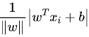
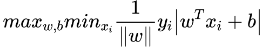
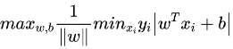
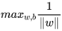
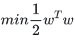
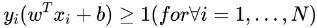
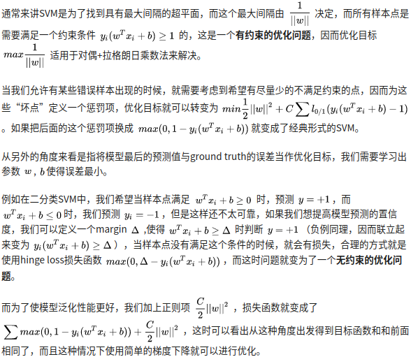

# SVM
## 原理
SVM 是一种二分类模型。它的基本模型是在特征空间中寻找间隔最大化的分离超平面的线性分类器。

- 当训练样本线性可分时，通过硬间隔最大化，学习一个线性分类器，即线性可分支持向量机；
- 当训练数据近似线性可分时，引入松弛变量，通过软间隔最大化，学习一个线性分类器，即线性支持向量机；
- 当训练数据线性不可分时，通过使用核技巧及软间隔最大化，学习非线性支持向量机。

## 硬间隔
最大化间隔 max margin(w,b) s.t. 分类正确, 即 y(w^Tx+b) > 0
点到平面距离，几何间隔

因为y属于{-1,1}, 所以可以将y引入距离公式. 优化目标为最大化点到直线最小的距离margin

上式又可以写成, 其中 $y_i (w^Tx_i + b)$ 称为函数间隔,如果大于0分类正确,否则错误.

其中min y_i(w^Tx_i+b)最小值为1，因此优化可以写成

写成min的形式，是一个二次优化问题

需要满足如下N个约束

上面的优化目标与约束可以用二次规划求解。可发现最小间距取决于分割平面两侧的支持向量，因此对异常值比较敏感，所以之后又有了松弛变量的概念。因为要求解上面的N阶约束的凸优化方程，会引入拉格朗日乘子，对偶。因为有些样本线性不可分，要引入核函数，提升到一个线性可分的高维空间，同时可以避免直接在高维空间中的复杂计算。

## 常见问题
### SVM损失函数
$$ max(0, 1 - y_i(w^T x_i + b)) + C/2||w||^2 $$
SVM 本质上是一个带N阶约束的二次规划问题, 通过hinge loss或者拉格朗日乘法转换为一个无约束的优化问题求解.
SVM两种求解方法,一种基于hinge loss梯度下降,另一种是引入拉格朗日乘子通过SMO求解.一般用第二种方法因为凸优化问题用理论求解训练速度更快,而且可以避免hinge loss 中次梯度的问题.

### SVM 为什么采用间隔最大化
当训练数据线性可分时，存在无穷个分离超平面可以将两类数据正确分开。线性可分支持向量机利用间隔最大化求得最优分离超平面，这时，解是唯一的。另一方面，此时的分隔超平面所产生的分类结果是最鲁棒的，对未知实例的泛化能力最强。

### 为什么要将求解 SVM 的原始问题转换为其对偶问题
引入对偶,方便后序SMO的求解。二是可以自然引入核函数，进而推广到非线性分类问题。

### 为什么 SVM 要引入核函数
核函数是用来计算映射到高维空间之后的内积的一种简便方法。无需求解映射函数，而只需要知道其核函数。核函数的定义：K(x,y)=<ϕ(x),ϕ(y)>，即在特征空间的内积等于它们在原始样本空间中通过核函数 K 计算的结果。一方面数据变成了高维空间中线性可分的数据，另一方面不需要求解具体的映射函数，只需要给定具体的核函数即可，这样使得求解的难度大大降低。

### 为什么SVM对缺失数据敏感
这里说的缺失数据是指缺失某些特征数据，向量数据不完整。SVM 没有处理缺失值的策略。而 SVM 希望样本在特征空间中线性可分，所以特征空间的好坏对SVM的性能很重要。缺失特征数据将影响训练结果的好坏。

### SVM 核函数之间的区别
- 线性核函数
线性核，主要用于线性可分的情况，我们可以看到特征空间到输入空间的维度是一样的，其参数少速度快，对于线性可分数据，其分类效果很理想，因此我们通常首先尝试用线性核函数来做分类，看看效果如何，如果不行再换别的
- 多项式核函数
多项式核函数可以实现将低维的输入空间映射到高维的特征空间，但是多项式核函数的参数多，当多项式的阶数比较高的时候，核矩阵的元素值将趋于无穷大或者无穷小，计算复杂度会大到无法计算。
- 高斯（RBF）核函数
高斯核函数将输入空间映射到了无穷多维空间(根据泰勒展开式)

### 拉格朗日乘法
将由n个变量和k个约束条件的最优化问题，转化成一个解有 n+k 个变量的方程组的解的问题

### KKT 条件
KKT条件可以看成是拉格朗日乘法的推广, 用于不等式约束的优化问题求取最优值
参考: https://zhuanlan.zhihu.com/p/39592364
