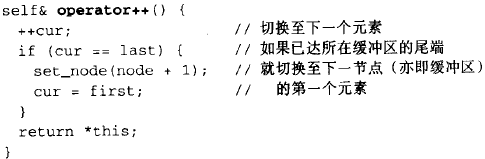
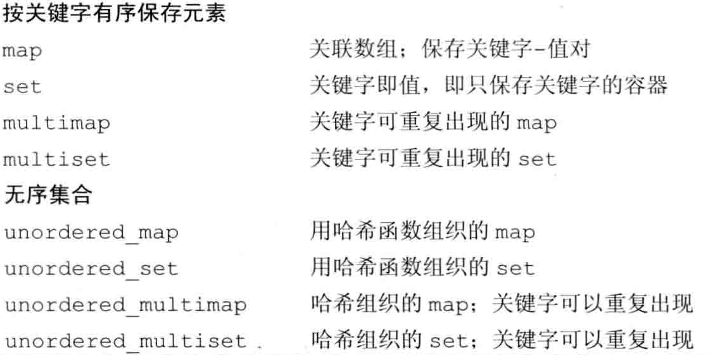

# C++ 常考面试题总结

### static 作用
- 修饰普通变量，修改变量的存储区域和生命周期，使变量存储在静态区，第一次使用前分配空间，程序结束时销毁。
- 修饰普通函数，表明函数的作用范围，仅在定义该函数的文件内才能使用。在多人开发项目时，为了防止与他人命名空间里的函数重名，可以将函数定位为 static。
- 修饰成员变量，修饰成员变量使所有的对象只保存一个该变量，而且不需要生成对象就可以访问该成员。
- 修饰成员函数，修饰成员函数使得不需要生成对象就可以访问该函数，但是在 static 函数内不能访问非静态成员。

### C++ 内存管理
在C++中，内存分成5个区，他们分别是堆、栈、全局/静态存储区和常量存储区和代码区。
- 栈，在执行函数时，函数内局部变量的存储单元都可以在栈上创建，函数执行结束时这些存储单元自动被释放。栈内存分配运算内置于处理器的指令集中，效率很高，但是分配的内存容量有限。const局部变量也在栈上。
- 堆，就是那些由new分配的内存块，他们的释放编译器不去管，由我们的应用程序去控制，一般一个new就要对应一个delete。如果程序员没有释放掉，那么在程序结束后，操作系统会自动回收。
- 全局/静态存储区，内存在程序编译的时候就已经分配好，这块内存在程序的整个运行期间都存在。它主要存放静态数据（局部static变量，全局static变量）、全局变量。
- 常量存储区，这是一块比较特殊的存储区，他们里面存放的是常量字符串，不允许修改。
- 代码区，存放程序的二进制代码


### 指针和引用的区别
- 指针是一个对象，存放的是一个变量的地址，引用是一个别名，对引用的操作就是对变量的本身进行操作。
- 引用必须初始化，不能为空，不能再次绑定。指针可以。
- 引用的本质是指针（不能再次绑定的const指针），与指针的大小应该是相同的。

### C++ 中 struct 和 class
总的来说，struct 更适合看成是一个数据结构的实现体，class 更适合看成是一个对象的实现体。区别: 默认的继承访问权限。struct 是 public 的，class 是 private 的。

### 智能指针
4种智能指针：auto_ptr、unique_ptr、share_ptr、weak_ptr
更安全且更加容易地管理动态内存。智能指针就是一个类，当超出了类的作用域时，类会自动调用析构函数来会自动释放资源，不需要手动地释放内存。

unique_ptr 相比 auto_ptr 更加安全, 因为它禁止了拷贝操作, 保证同一时间内只有一个智能指针可以指向该对象, 不会等到程序运行到访问空指针的时候才崩溃掉，而是会在编译时就不给予通过.

共享指针 share_ptr 使用引用计数的方式来管理指向对象的指针（成员函数use_count()可以获得引用计数），该对象和其相关资源会在“最后一个引用被销毁”时候释放。当两个对象分别使用一个共享指针share_ptr 指向对方时，会导致内存泄漏的问题。
解决方案:使用weak_ptr弱指针,指针指向一个对象时，并不会修改该对象上的引用计数，但可以访问该对象及获取该对象上的引用计数

weak_ptr 弱指针是一种不控制对象生命周期的智能指针，它指向一个 share_ptr 管理的对象，进行该对象的内存管理的是那个强引用的 share_ptr ，也就是说 weak_ptr 不会修改引用计数，只是提供了一种访问其管理对象的手段.weak_ptr 和 share_ptr 之间可以相互转化，share_ptr 可以直接赋值给weak_ptr ，而weak_ptr 可以通过调用 lock 成员函数来获得share_ptr。

### 重载运算符和重载函数
允许在同一作用域中的某个函数和运算符指定多个定义，分别称为函数重载和运算符重载。调用一个重载函数或重载运算符时，编译器通过把您所使用的参数类型与定义中的参数类型进行比较，决定选用最合适的定义。选择最合适的重载函数或重载运算符的过程，称为重载决策。

### new/delete与malloc/free的区别
- malloc使用时需要自己显式地计算内存大小，而new使用时由编译器自动计算.
- malloc分配成功后返回的是void*指针，需要强制类型转换成需要的类型；而new直接就返回了对应类型的指针
- malloc和free只能申请和释放内存空间，不会调用构造函数和析构函数. new和delete使用时会分别调用构造函数和析构函数.（在new一个对象的时候，首先会调用malloc为对象分配内存空间，然后调用对象的构造函数。delete会调用对象的析构函数，然后调用free回收内存。）

delete和free被调用后，内存不会立即回收，指针也不会指向空，delete或free仅仅是告诉操作系统，这一块内存被释放了，可以用作其他用途。但是由于没有重新对这块内存进行写操作，所以内存中的变量数值并没有发生变化，这时候就会出现野指针的情况。因此，释放完内存后，应该把指针指向NULL。

### delete 和 delete[] 的区别
- delete只会调用一次析构函数，而delete[]会调用每个成员的析构函数
- 用new分配的内存用delete释放，用new[]分配的内存用delete[]释放

### 构造函数,析构函数
- 析构函数在函数名前加 ~
- 析构函数名与类名相同，一个类只能有一个析构函数，不能重载
- 析构函数不能有任何参数，也没有返回值
- 若没有写析构函数，编译器会自动生成一个默认的析构函数
- 当对象的生命周期结束时，系统会自动调用析构函数

析构函数一般是虚函数
- C++默认的析构函数不是虚函数。因为虚函数需要虚函数表和虚表指针，会占用额外的内存空间。对于没有派生类的基类而言，将析构函数定义为虚函数就会浪费内存空间。
- 如果存在派生类继承了基类，而基类的析构函数不是声明为虚函数，那么在析构一个指向派生类的基类指针时，就只会调用基类的析构函数，不会调用派生类的析构函数，因此会造成内存泄漏的问题。

不需要自己显示地调用基类的析构函数，因为编译器会自动调用.
析构函数先析构派生类然后析构基类,与构造函数顺序相反。

构造函数一般不定义为虚函数
构造函数在创建对象时必须确定对象类型，虚函数是在运行时才确定对象的类型的

### define 和 const 的联系与区别
- define定义的常量没有类型，只是进行了简单的替换，可能会有多个拷贝，占用的内存空间大，const定义的常量是有类型的，存放在静态存储区，只有一个拷贝，占用的内存空间小。
- define定义的常量是在预处理阶段进行替换，而const在编译阶段确定它的值。
- define不会进行类型安全检查，而const会进行类型安全检查，安全性更高。
- const可以定义函数而define不可以。

### ｃ++虚函数
- 虚函数是指在基类内部声明的成员函数前添加关键字 virtual 指明的函数
- 虚函数存在的意义是为了实现多态
- 虚函数是动态绑定的，动态绑定在指针或引用调用虚函数时才会发生，而非虚函数的调用在编译时确定
- 虚函数必须是非静态成员函数，因为静态成员函数需要在编译时确定
- 构造函数不能是虚函数，因为虚函数是动态绑定的，而构造函数创建时需要确定对象类型
- 析构函数一般是虚函数
- 虚函数一旦声明，就一直是虚函数，派生类也无法改变这一事实,派生类重写基类的虚函数时，可以添加 virtual 关键字，但不是必须

虚函数工作机制
虚函数表 + 虚表指针
- 编译器在含有虚函数的类中创建一个虚函数表vtable，存放虚函数的地址。还隐式地设置了一个虚表指针vptr，指向虚函数表。
- 派生类在继承基类的同时，也会继承基类的虚函数表.
- 当派生类重写基类的虚函数时，会覆盖掉基类部分虚函数的地址
- 若派生类没有重写，则由基类继承而来的虚函数的地址将直接保存在派生类的虚函数表中。
- 每个类都只有一个虚函数表，该类的所有对象共享这个虚函数表，而不是每个实例化对象都分别有一个虚函数表.
- 虚函数因为用了虚函数表的机制，所以在调用的时候会增加一次内存开销。

多态的实现主要分为静态多态和动态多态:静态多态主要是重载在编译时就已经确定；动态多态是通过虚函数机制类实现，在运行时动态绑定。

多态性其实就是想让基类的指针具有多种形态，能够在尽量少写代码的情况下让基类可以实现更多的功能。比如说，派生类重写了基类的虚函数f1()之后，基类的指针就不仅可以调用自身的虚函数f1()，还可以调用其派生类的虚函数f1()

```c++
int main() {
    Base a;
	  Derived b;
    Base *p1 = &a;		//基类的指针，指向基类的对象
    Base *p2 = &b;		//基类的指针，指向派生类的对象
    //f1()是虚函数,只有运行时才知道真正调用的是基类的f1(),还是派生类的f1()
    p1->f1();	//p1指向的是基类的对象，所以此时调用的是基类的f1()
    p2->f1();	//p2指向的是派生类的对象，所以调用的是派生类重写后的f1()
	return 0;
}
```

### 纯虚函数
- 虚函数，在类成员方法的声明（不是定义）语句前加“virtual”, 如 virtual void func()
- 纯虚函数，在虚函数后加“=0”，如 virtual void func()=0
- 对于虚函数，子类可以（也可以不）重新定义基类的虚函数，该行为称之为复写Override。
- 对于纯虚函数，子类必须提供纯虚函数的个性化实现。

引入原因: 在很多情况下，基类本身生成对象是不合情理的。例如，动物作为一个基类可以派生出老虎、孔雀等子类，但动物本身生成对象明显不合常理。
声明了纯虚函数的类是一个抽象类。所以，用户不能创建类的实例，只能创建它的派生类的实例。


### sizeof 与 strlen
- strlen 是一个函数，只能以 char* (字符串)作为参数，用来计算指定字符串 str 的长度，不包括结束字符 '\0'。必须以 '\0'作为结束符才可以正确统计其字符长度，否则是个随机数。
- sizeof 是一个编译时运算符，参数可以是数组、指针、类型、对象、函数等。用于统计类型或者变量所占的内存字节数。由于在编译时计算，因此sizeof不能用来返回动态分配的内存空间的大小。
- sizeof 在统计字符串 str 的长度时，包含结束字符 '\0'

### 内存对齐
内存会对齐到类内定义的最大的那个数据类型的size上，类内所有的变量根据定义顺序占的内存都会按照那个size对齐
https://blog.nowcoder.net/n/cc17d398f41a4beb82b663ca0a72f35c

### C++源文件从文本到可执行文件经历的过程
- 预处理阶段：对源代码文件中文件包含关系（头文件）、预编译语句（宏定义）进行分析和替换，生成预编译文件。
- 编译阶段：将经过预处理后的预编译文件转换成特定汇编代码，生成汇编文件
- 汇编阶段：将编译阶段生成的汇编文件转化成机器码，生成可重定位目标文件
- 链接阶段：将多个目标文件及所需要的库，符号链接成最终的可执行目标文件

### 引用作为函数参数和返回值的好处

### 函数指针和指针函数
函数指针：本质上是一个指针，一个指向函数的指针。
指针函数：本质上是一个函数，其返回值是一个指针。
函数指针： int (*fun)(int x,int y);
指针函数： int* fun(int x,int y);
区分方法：函数名带括号的就是函数指针，不带括号的就是指针函数。

### 数组指针和指针数组
数组指针：本质是一个指针，指向了一个数组
指针数组：本质是一个数组，该数组中的每个元素都是一个指针
数组指针：int (*p)[n];
指针数组：int *p[n];
区分方法：数组名带括号的就是数组指针，不带括号的就是指针数组.*

### 内联函数
内联函数的作用是提高函数执行的效率，在程序中的每个调用点将函数体展开，而不是按照通常的函数调用机制取调用，从而减少调用函数花费的额外开销（保存恢复寄存器，拷贝实参）。内联函数有一下一些特点：
- 定义在class内的成员函数默认是inline函数（虚函数除外）
- 通常只有函数非常短小的时候（如10行代码内）才适合定义成inline函数，否则会导致程序变慢
- 头文件中不仅要包含inline函数的声明，还要包含其定义，方便编译器查找。
- （缺点）inline函数会增加执行文件的大小。

### 宏
```
#define max(a,b) (((a) > (b)) ? (a) : (b))
```

### Cpp 11新特性
- 自动类型推导auto
- nullptr：nullptr是为了解决原来C++中NULL的二义性问题而引进的一种新的类型，因为NULL实际上代表的是0，而nullptr是void*类型的
- lambda表达式：用于创建并定义匿名的函数对象，以简化编程工作。
- thread类和mutex类
- 新的智能指针 unique_ptr和shared_ptr
更多详见：https://blog.csdn.net/caogenwangbaoqiang/article/details/79438279

### 菱形继承，虚拟继承
1.什么是菱形继承？
在多继承体系中，形成了一种B继承A，C也继承A，D继承了B和C，的继承关系，这样的话D类对象中就会有两个A类对象，（分别在B对象和C对象中）。

2.菱形继承存在什么问题？
数据冗余和二义性
如上面问题一，D类对象中有两个对象A，这样就会造成数据冗余，而且当你想访问A类对象中的成员时，不知道是想访问B中A类成员还是C中的A类成员，造成二义性。

3.如何解决？
虚拟继承
让B类虚拟继承A类，C类虚拟继承A类，D类再继承B类和C类时，就会解决数据冗余和二义性。

4.虚继承是如何实现的？
当B类虚拟继承A类时，B类对象中就会有一个虚基表指针，指向一张虚基表，这张续集表中存放B中A类对象相较于该位置的偏移量，C类对象也是，这样的话，当出现菱形继承时，D中就只存一份A类对象，D类对象的B和C类对象中分别有一张虚基表指针（指向一张虚基表，存放A类对象相较于该位置的偏移量），这样就避免了数据冗余，而且只有一份A类对象，也不存在二义性了。

### 公有、私有、保护
公用（public） ：访问权限最高；除派生类外，外部函数也可以直接访问（无论是成员变量还是成员函数）。
私有（private）：访问权限最低；只能是该类内部函数互相调用，派生类、外部函数都不能访问。
保护（protect）：访问权限中间；该类内部函数、派生类都能访问，外部类、外部函数不能访问

## 面向对象
### 封装
利用抽象数据类型将数据和基于数据的操作封装在一起，使其构成一个不可分割的独立实体。数据被保护在抽象数据类型的内部，尽可能地隐藏内部的细节，只保留一些对外的接口使其与外部发生联系。用户无需关心对象内部的细节，但可以通过对象对外提供的接口来访问该对象。
- 减少耦合：可以独立地开发、测试、优化、使用、理解和修改
- 减轻维护的负担：可以更容易被理解，并且在调试的时候可以不影响其他模块
- 有效地调节性能：可以通过剖析来确定哪些模块影响了系统的性能
- 提高软件的可重用性
- 降低了构建大型系统的风险：即使整个系统不可用，但是这些独立的模块却有可能是可用的
### 继承
继承实现了 IS-A 关系，例如 Cat 和 Animal 就是一种 IS-A 关系，因此 Cat 可以继承自 Animal，从而获得 Animal 非 private 的属性和方法。
### 多态
多态,消息以多种形式显示的能力。
多态是以封装和继承为基础的。
- 编译时多态主要指方法的重载
- 运行时多态指程序中定义的对象引用所指向的具体类型在运行期间才确定

### 类的设计原则
SOLID
1. 单一责任原则: 一个类只负责一件事，当这个类需要做过多事情的时候，就需要分解这个类。
2. 开放封闭原则: 类应该对扩展开放，对修改关闭。
3. 里氏替换原则: 继承是一种 IS-A 关系，子类需要能够当成父类来使用，并且需要比父类更特殊。如果不满足这个原则，那么各个子类的行为上就会有很大差异，增加继承体系的复杂度。
4. 接口分离原则: 使用多个专门的接口比使用单一的总接口要好。
5. 依赖倒置原则: 高层模块不应该依赖于低层模块，二者都应该依赖于抽象；
抽象不应该依赖于细节，细节应该依赖于抽象。

### Volatile, mutable
访问寄存器要比访问内存要块，因此CPU会优先访问该数据在寄存器中的存储结果，但是内存中的数据可能已经发生了改变，而寄存器中还保留着原来的结果。为了避免这种情况的发生将该变量声明为volatile，告诉CPU每次都从内存去读取数据。
一个参数可以即是const又是volatile的吗？可以，一个例子是只读状态寄存器，是volatile是因为它可能被意想不到的被改变，是const告诉程序不应该试图去修改他

### 顶层 const 与底层 const
顶层 const 表示的是 指针本身是一个常量， 底层 const 表示的是 指针所指的对象是一个常量

### 顺序容器
- vector：大小可变数组
- deque：双端队列
- list: 双向链表
- forward_list: 单向链表
- array: 固定大小数组
- string: 字符串
string a;
a = "1234adf"
a[]
#### 两种include方式
#include <iostream> 搜索系统函数库
#include "max.h" 先搜索当前目录，再搜索系统函数库

#### vector 扩容
1.寻找新的比当前capacity大两倍的地址 2.将当前元素复制过去 3.释放原空间。

#### deque
遍历速度较慢，deque是分段连续空间（缓冲区），通过迭代器++维持整体连续的假象。


### 关联容器




# 设计模式
