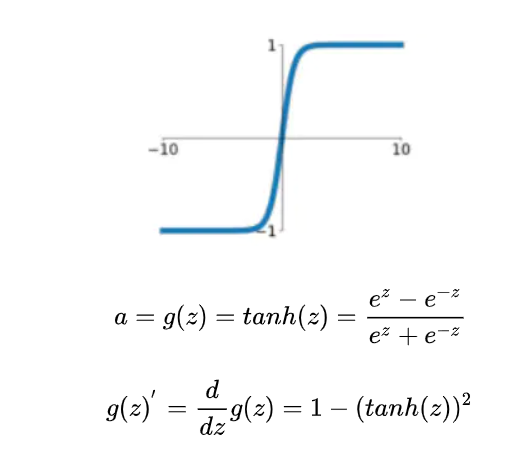

## 面试

### 自我介绍

### 简历开放性问题

- 亮点和特征
- 印象最深的项目
- 项目遇到最大的困难

### 毕设

##### 时间序列发展史，相关论文
- 如何解决多目标优化问题？（即同时优化CTR和CVR）
##### 生成模型和判别模型
生成模型和判别模型是解决分类问题的两类基本思路。
-首先，您得先了解，分类问题，就是给定一个数据x，要判断它对应的标签y（这么naive的东西都要解释下，求面试官此时内心的阴影面积，嘎嘎）。生成模型就是要学习x和y的联合概率分布P(x,y)，然后根据贝叶斯公式来求得条件概率P(y|x)，预测条件概率最大的y。贝叶斯公式这么简单的知识相信您也了解，我就不啰嗦了。判别模型就是直接学习条件概率分布P(y|x)
链接：https://blog.csdn.net/u010358304/article/details/79748153
生成模型例子：https://www.jianshu.com/p/4ef549eb0ad4

常见生成模型：
- 贝叶斯
-  hmm，
- 生成模型为什么收敛快
常见判别模型
- 线性模型，k近邻，cnn，lr，决策树，svm，boosting
- 贝叶斯公式：
- 判别模型：
- 生成模型需要的数据量比较大，能够较好地估计概率密度；而判别模型对数据样本量的要求没有那么多
- 极大似然估计：使用样本中的数据分布来拟合数据的实际分布概率，所有的采样都是独立同分布的
- 优缺点：
##### RNN/LSTM
- RNN反向传播
https://blog.csdn.net/qq_39422642/article/details/78676567
- 应用场景：自然语言处理，机器翻译，文本生成，图像描述
- 原理和缺点：
- https://www.zhihu.com/question/61265076


- rnn结构

双向rnn

- 与cnn的区别：cnn没有记忆功能
- LSTM原理公式结构：https://blog.csdn.net/Jerr__y/article/details/58598296

- 
- lsTM如何解决梯度消失问题:https://www.zhihu.com/question/34878706
  https://www.cnblogs.com/bonelee/p/10475453.html
- LSTM正向传播，反向传播推导：https://www.cnblogs.com/pinard/p/6519110.html
- LSTM激活函数有哪些：tanh，sigmoid:https://www.zhihu.com/question/61265076
- tanh公式以及导数：[https://blog.csdn.net/qq_35200479/article/details/84502844]
  
- sugnoid公式以及导数：

  

waff


- softmax公式以及导数：http://shuokay.com/2016/07/20/softmax-loss/
```python
def softmax(x):
    """Compute the softmax of vector x."""
    exps = np.exp(x)
    return exps / np.sum(exps)
```
- relu公式以及导数
  
- 激励函数为什么要是非线性函数：为了增加网络的非线性，可以逼近任何函数，没有激活函数的每层都相当于矩阵相乘。就算你叠加了若干层之后，无非还是个矩阵相乘罢了。所以你没有非线性结构的话，根本就算不上什么神经网络。
- 
- 交叉熵函数的推导(https://blog.csdn.net/C_chuxin/article/details/86174807),避免了学习速率下降

- 

- lstm的优点，记忆单元是怎么工作的，他为什么可以克服梯度消失
- 偏差，方差与残差：https://zhuanlan.zhihu.com/p/50214504
- 梯度下降：
https://blog.csdn.net/huwenxing0801/article/details/82791879

##### 机器学习步骤
1.确定是有监督还是无监督
2.分类还是回归,分类算法应用场景：
3.特征工程

##### 特征工程
- 划分训练集和测试集
- 如何判断一个特征是否重要？
- 有效的特征工程有哪些？
- 特征组合：
- 特征选择：
- 常见的降维方法？PCA和神经网络的embedding降维有啥区别？
##### 数据预处理方法
- 处理缺失值
- 数据有问题怎么处理，长尾分布数据怎么处理，
- 数据增强方法
- 处理数据不平衡问题：SMO算法
- 连续特征：
- 离散特征：
- 连续特征离散化有什么好处：
- 数据归一化方法：
- 为什么要归一化
-

##### 对时间序列的问题如何进行交叉验证

##### 如何提升网络的泛化能力

##### 激活函数
- 常见激活函数有哪些
- relu，sigmoid（公式以及导数）
https://zhuanlan.zhihu.com/p/25110450
- 激活函数的非线性
- softnax代码实现，梯度公式推导和代码实现
- https://juejin.im/post/5d46816e51882560b9544ac1

##### 评价指标
- precision
- recall
- f1-score:

- auc越大 , 说明分类器越可能把真正的正样本排在前面 , 分类性能越好
- roc:区分正负预测结果的闺值

- accuracy
- rmse:
- 均绝对百分比误差(Mean Abso lute PercentError, MAPE )
- ｒｏｃ：erfenlei
- 讲下Attention的原理
- 解释一下AUC的计算方法和它代表的意义。问了一个相关的问题，当时没有答的很好，就是一个数据如果分成两份，分别在两份数据上计算出AUC为AUC_1和AUC_2，问整体数据的AUC是多少？面试的时候一直以为这个是能算出来的，所以一直在推导公式。最后的答案其实是无法得到，因为从局部的有序无法直接退出全局的有序，这个题目其实还是考查对于AUC这个指标的理解深度。
##### 损失函数，交叉熵公式，
https://zhuanlan.zhihu.com/p/72589970
##### 优化器
- adam


### 新能源大数据
- l1，l2正则化：L1可以用来选择特征
- 数学角度解释一下L1和L2正则化项的区别？
- 如何解决样本不均衡问题？
- 常见的采样方法？
- 解决过拟合的办法，为什么：dropout
- 常用机器学习算法,传统机器学习模型,线性模型，集成模型，
- LR,SVM,XGBOOSTING,LASSO,RIDGE,GBDT，随机森林原理推导以及损失函数
- 逻辑回归怎么实现多分类
- 逻辑回归为啥用交叉熵损失函数？从概率论角度解释一下？咋不用平方误差呢？
- lR和svm的区别：上来先推了个LR，问了SVM的基本原理，两个算法各自的使用场景以及它们之间的区别。
- svm对异常点不敏感，lr敏感，支持向量的选择，硬间隔，软间隔
- svm什么时候用线性核，什么时候用高斯核，拟合无穷维度，
- 说一下SVM，损失函数，核函数（会）
- SVM用折页损失函数有啥好处？
- SVM都能用核函数，逻辑回归咋不用呢？

- xgboost的特征重要性计算，优缺点，场景，
- XGBoost为什么用树作为基学习器
- xgboost是如何实现数据并行的
- XGboost 的节点分裂时候，依靠什么？数学形式？XGboost 比GBDT好在哪？如何解决过拟合问题，尽可能全面？（几乎每次都被问到）
- rf，xgboost，gbdt，正则化惩罚，各个惩罚方法，lasso，ridge，pca，group lasso
- em算法是什么
- GBDT和随机森林的区别和联系
- GBDT的原理，xgboost与GBDT的区别
- GBDT中的“梯度提升”，怎么理解？和“梯度下降”有啥异同？
- 随机森林和xgboost原理和区别
- 决策树超参数
- 决策树怎么分裂的，信息增益，信息增益率和基尼指数公式
- 神经网络，为什么用交叉熵
- k折交叉验证：


- 朴素贝叶斯
- 模型融合：stacking，bagging，boosting
- 讲下Stacking
- Boosting和Bagging的概念和区别。
- 机器学习距离计算方法：https://blog.csdn.net/xbinworld/article/details/43612603
- 在一个集合中,如果每一对元素均可唯一确定一个实数,使得三条距离公理(正定性,对称性, 三角不等式)成立,则 i亥实数可称为这对元素之间的距离。


在机器学习领域 3 被俗称为距霄,却不满足三条距曹公理的不仅仅有余弦距离 1 还有 KL 距离( Kullback-Leibler Divergence ),也叫作相对楠, E 常用 于计算两个分布之间的差异,但不满足对称性和三角不等式 。

- 直方图算法具体怎么做
- 高维稀疏特征为啥不适合神经网络训练？


### 博世黑客马拉松
- kmeans，k的选择:对于K-means中K的选择，通常有四种方法。
    按需选择
    观察法
    手肘法
    Gap Statistics方法
- kmeans流程
- Kmeans聚类为啥能收敛？理论上解释一下？
- 遗传算法原理
- 调度算法原理
-
### 目标检测
- 数据不平衡：https://www.cnblogs.com/charlotte77/p/10455900.html
- 被打断问CNN是深度深好还是长宽大好
- CNN权重的初始化方法：
- 有两种初始化方法：
采用正态分布的随机初始化方法。
Xavier初始化方法：假设某全连接层的输入个数为a，输出个数为b，Xavier随机初始化将使该层中权重参数的每个元素都随机采样于均匀分布：
- CNN反向传播
初始化后，每层输出的方差不会受该层输入个数的影响，且每层梯度的方差也不受该层输出个数的影响。

- 数据集kitti格式：https://blog.csdn.net/Solomon1558/article/details/70173223
- 非极大值抑制:目标检测的过程中在同一目标的位置上会产生大量的候选框，这些候选框相互之间可能会有重叠，此时我们需要利用非极大值抑制找到最佳的目标边界框，消除冗余的边界框
```python
def nms(bboxes, iou_thresh):
    """
    Args:
      bboxes: after score. np.array. (N, 6) [xmin, ymin, xmax, ymax, score, class]
      iou_thresh: float
    Returns:
      bboxes_nms: np.array. (N', 6) [xmin, ymin, xmax, ymax, score, class]
    """
    classes = bboxes[:, 5] # (N,)
    unique_classes = set(classes)
    bboxes_nms = []
    for cls in unique_classes:
        mask = classes == cls # (N,)
        cls_bboxes = bboxes[mask] # (M, 6)
        # nms in each class
        x1, y1 = cls_bboxes[:, 0], cls_bboxes[:, 1] # (M,)
        x2, y2 = cls_bboxes[:, 2], cls_bboxes[:, 3]
        scores = cls_bboxes[:, 4] # (M,)
        areas = (x2 - x1) * (y2 - y1) # (M,)
        order = scores.argsort()[::-1] # (M,)
        keep = []
        while order.size > 0:
            i = order[0]
            keep.append(i)
            x1_max = np.maximum(x1[i], x1[order[1:]]) # (1,), (M-1,) -> (M-1,)
            y1_max = np.maximum(y1[i], y1[order[1:]])
            x2_min = np.minimum(x2[i], x2[order[1:]])
            y2_min = np.minimum(y2[i], y2[order[1:]])
            w = np.maximum(0, x2_min - x1_max) # (M-1,)
            h = np.maximum(0, y2_min - y1_max)
            inter_area = w * h # (M-1,)
            union_area = areas[i] + areas[order[1:]] - inter_area # (1,), (M-1,) -> (M-1,)
            iou = inter_area / union_area # (M-1,)
            keep_index = np.where(iou <= iou_thresh)[0]
            order = order[keep_index + 1]
        keep_bboxes = cls_bboxes[keep]
        bboxes_nms.append(keep_bboxes)
    bboxes_nms = np.vstack(bboxes_nms)
    return bboxes_nms
```
ｃｎｎ梯度消失：https://blog.csdn.net/qq_25737169/article/details/78847691
梯度下降函數：https://www.cnblogs.com/guoyaohua/p/8542554.html
- yolov3，损失函数，改进，网络结构
https://www.cnblogs.com/ywheunji/p/10761239.html
- yolov1:24卷积层，２全链接，输入４４８＊４４８,输出７＊７，两个候选框
- yolov2改进：https://www.cnblogs.com/ywheunji/p/10761239.html
１．ｂｎ　２．高分辨率微調模型　３．聚類獲得先驗框　４．采用先验框（Anchor Boxes）对于常用的欧式距离，大边框会产生更大的误差，但我们关心的是边框的IOU。所以，YOLO2在聚类时采用以下公式来计算两个边框之间的“距离” ５　约束预测边框的位置:


- ｙｏｌｏｖ３：利用多尺度特征进行对象检测；对象分类用Logistic取代了softmax。
darknet-53借用了resnet的思想，在网络中加入了残差模块，这样有利于解决深层次网络的梯度问题，每个残差模块由两个卷积层和一个shortcut connections,1,2,8,8,4代表有几个重复的残差模块，整个v3结构里面，没有池化层和全连接层，网络的下采样是通过设置卷积的stride为2来达到的，每当通过这个卷积层之后图像的尺寸就会减小到一半。而每个卷积层的实现又是包含     卷积+BN+Leaky relu  ,每个残差模块之后又要加上一个zero padding,具体实现可以参考下面的一张图。
darknet-53

YOLO3更进一步采用了3个不同尺度的特征图来进行对象检测。能够检测的到更加细粒度的特征。


网络的最终输出有3个尺度分别为1/32，1/16，1/8；
- 生成模型，判别模型
- auc，计算公式
- Softmax公式
- BACTH normalization 作用：激活函数对梯度也有很大的影响，大部分激活函数只在某个区域内梯度比较好。在后向传播的时候，我们需要进行链式求导，如果网络层很深，激活函数如果权重很小，会导致梯度消失；如果权重很大，又会导致梯度爆炸。那么解决梯度消失可以从这几方面入手：
1）换激活函数；2）调整激活函数的输入；3）调整网络结构。事实上，我们有一个好东西可以解决梯度问题，叫做Normalization，就是从第二方面入手同时解决梯度消失和爆炸，而且也可以加快训练速度。
- vgg，googlenext，参数量，特征计算
- 微调模型的原因
- 卷积层和池化层有什么区别
- 介绍一下cnn原理，作用，多层cnn提取全局信息，池化，怎么gpu加速，一维cnn，二维cnn，球面卷积cnn.
- 说一下Faster R-CNN，要详细画出图，说一下ROI polling与RPN（会）

### 博世黑客马拉松
k-means：聚类个数选择，原理过程，优缺点
遗传算法：
调度算法：


### python问题
锁种类有哪些，适用于什么场景。
python：python的生成器
is 和 == 的区别
Pytorch tensor cuda的作用,
python 多进程
深拷贝，浅拷贝
static关键字，const
如何判断两个list是否一样，list头上删除元素
python锁
深浅拷贝的区别，如何使用
c++指针引用
链表公共节点
列表去重
字典排序
列表的排序算法，归并排序的原理
字符串去空格
Python23的区别
Python的内存管理机制，优缺点
readline和readlines的区别
了解的正则表达式
对Linux的系统的了解，如何统计磁盘使用情况的命令
mapreduce过程的了解
先问了项目，对项目经历问的比较细。
Python的装饰器
对Hadoop的了解
ajax的理解，get和post的区别
join和split函数的区别
http状态码的意思
sql的执行顺序
垃圾回收
最后写了两道编程题，两个字符串求最长公共子序列，青蛙跳台阶问题(写了两种解法)
python闭包、反射、装饰器、GIL
3.标准float的格式
4.pytorch如何定义一个新的算子

##### 数据结构
- 最大堆最小堆的概念
- 归并排序时间复杂度
- 稳定排序和非稳定排序
- 二叉搜索树的递归定义
- 哈希表怎么实现
- 二叉树特点
- 排序算法有几种，各自的时间复杂度，归并排序空间复杂度，多线程是否使用过，各种排序算法在哪些场景使用，如归并排序，快排，冒泡排序
- 线程和进程的区别
