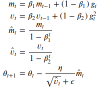
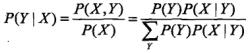
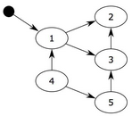
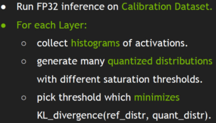

# 面试问答整理

## cv 算法
### 手写IoU
```python
import numpy as np
def iou_calculate(bbox1, bbox2):
    """
    Args:
      bbox1: (N, 4) (xmin, ymin, xmax, ymax)
      bbox2: (M, 4) np.array
    Returns:
      iou: (N,M)
    """
    area1 = (bbox1[..., 2] - bbox1[..., 0]) * (bbox1[..., 3] - bbox1[..., 1]) # (N,)
    area2 = (bbox2[..., 2] - bbox2[..., 0]) * (bbox2[..., 3] - bbox2[..., 1]) # (M,)
    lt = np.maximum(bbox1[:, None, :2], bbox2[:, :2]) # (N, M, 2)
    rb = np.minimum(bbox1[:, None, 2:], bbox2[:, 2:]) # (N, M, 2)
    inter = np.maximum(0, rb - lt) # (N, M, 2)
    inter_area = inter[..., 0] * inter[..., 1] # (N, M)
    union_area = area1[:, None] + area2 - inter_area # (N, M)
    iou = inter_area / union_area
    return iou
```

### 手写NMS
```python
def nms(bboxes, iou_thresh):
    """
    Args:
      bboxes: after score. np.array. (N, 6) [xmin, ymin, xmax, ymax, score, class]
      iou_thresh: float
    Returns:
      bboxes_nms: np.array. (N', 6) [xmin, ymin, xmax, ymax, score, class]
    """
    classes = bboxes[:, 5] # (N,)
    unique_classes = set(classes)
    bboxes_nms = []
    for cls in unique_classes:
        mask = classes == cls # (N,)
        cls_bboxes = bboxes[mask] # (M, 6)
        # nms in each class
        x1, y1 = cls_bboxes[:, 0], cls_bboxes[:, 1] # (M,)
        x2, y2 = cls_bboxes[:, 2], cls_bboxes[:, 3]
        scores = cls_bboxes[:, 4] # (M,)
        areas = (x2 - x1) * (y2 - y1) # (M,)
        order = scores.argsort()[::-1] # (M,)
        keep = []
        while order.size > 0:
            i = order[0]
            keep.append(i)
            x1_max = np.maximum(x1[i], x1[order[1:]]) # (1,), (M-1,) -> (M-1,)
            y1_max = np.maximum(y1[i], y1[order[1:]])
            x2_min = np.minimum(x2[i], x2[order[1:]])
            y2_min = np.minimum(y2[i], y2[order[1:]])
            w = np.maximum(0, x2_min - x1_max) # (M-1,)
            h = np.maximum(0, y2_min - y1_max)
            inter_area = w * h # (M-1,)
            union_area = areas[i] + areas[order[1:]] - inter_area # (1,), (M-1,) -> (M-1,)
            iou = inter_area / union_area # (M-1,)
            keep_index = np.where(iou <= iou_thresh)[0]
            order = order[keep_index + 1]
        keep_bboxes = cls_bboxes[keep]
        bboxes_nms.append(keep_bboxes)
    bboxes_nms = np.vstack(bboxes_nms)
    return bboxes_nms
```

### focal loss
```python
p = torch.sigmoid(predicts)
ce_loss = torch.nn.functional.binary_cross_entropy_with_logits(predicts, targets, reduction="none")
p_t = p * targets + (1 - p) * (1 - targets)
loss = ce_loss * ((1 - p_t) ** gamma)
if alpha >= 0:
    alpha_t = alpha * targets + (1 - alpha) * (1 - targets)
    loss = alpha_t * loss
loss = loss.sum()
loss = loss / max(1, num_matched_based_anchors)
return loss
```

### Opencv 双线性插值
参考:
https://geek-docs.com/opencv/opencv-examples/bilinear-interpolation.html
双线性插值是opencv resize 默认方法,折中来说具有较好速度与图像质量.
1. 生成全黑的放大图像的矩阵
2. 查找放大图像每个点对应的原图像坐标. 设放大后图像x', y', 横纵放大率均为a, 原图像坐标为 x'/a, y'/a
3. 寻找原图像周围4领域像素点, (x,y), (x+1,y), (x,y+1), (x+1,y+1)
4. 求4个点到x'/a, y'/a距离, dx = x'/a - x, dy = y'/a - y
5. 则放大图像像素值为
$$ I'(x',y') = (1-dx)(1-dy)I(x,y) + dx(1-dy)I(x+1,y) + (1-dx)dyI(x,y+1) + dxdyI(x+1,y+1) $$

```python
import cv2
import numpy as np

def bl_interpolate(img, ax=1., ay=1.):
    H, W, C = img.shape
    aH = int(ay * H)
    aW = int(ax * W)
    # get position of resized image
    y = np.tile(np.arange(aH), (aW, 1)).transpose()
    x = np.tile(np.arange(aW), (aH, 1))
    # get position of original position
    y = (y / ay)
    x = (x / ax)
    ix = np.floor(x).astype(np.int)
    iy = np.floor(y).astype(np.int)
    ix = np.minimum(ix, W-2)
    iy = np.minimum(iy, H-2)
    # get distance
    dx = x - ix
    dy = y - iy
    dx = np.repeat(np.expand_dims(dx, axis=-1), 3, axis=-1)
    dy = np.repeat(np.expand_dims(dy, axis=-1), 3, axis=-1)
    # interpolation
    out = (1-dx) * (1-dy) * img[iy, ix] + dx * (1 - dy) * img[iy, ix+1] + \
          (1 - dx) * dy * img[iy+1, ix] + dx * dy * img[iy+1, ix+1]
    out = np.clip(out, 0, 255)
    out = out.astype(np.uint8)

    return out

img = cv2.imread("filepath").astype(np.float)
out = bl_interpolate(img, ax=1.5, ay=1.5)
cv2.imshow("result", out)
cv2.waitKey(0)
```

### 中值滤波
```python
def medianBlur(img_3c, kernel, padding_way='ZERO'):
    # kernel size need 3, 5, 7, 9....
    paddingSize = kernel // 2
    height, width, channel = img_3c.shape

    # 假设输入,如下矩阵,5x5
    # [[2 6 3 4 7]
    #  [6 1 7 1 5]
    #  [4 6 7 3 3]
    #  [3 1 8 8 6]
    #  [2 4 8 0 7]]

    # 创建用于输出的矩阵
    matOut = np.zeros((height, width, 3), dtype=img_3c.dtype)
    for c in range(channel):
        img = img_3c[:, :, c]
        matBase = np.zeros((height + paddingSize * 2, width + paddingSize * 2), dtype=img.dtype)

        # 创建一个添加了padding的矩阵,初始值为0
        # 如果kernel的大小为3,所以从5x5变成了7x7
        # [[0 0 0 0 0 0 0]
        #  [0 0 0 0 0 0 0]
        #  [0 0 0 0 0 0 0]
        #  [0 0 0 0 0 0 0]
        #  [0 0 0 0 0 0 0]
        #  [0 0 0 0 0 0 0]
        #  [0 0 0 0 0 0 0]]

        matBase[paddingSize:-paddingSize, paddingSize:-paddingSize] = img
        # 将原值写入新创建的矩阵当中
        #[[0 0 0 0 0 0 0]
        # [0 2 6 3 4 7 0]
        # [0 6 1 7 1 5 0]
        # [0 4 6 7 3 3 0]
        # [0 3 1 8 8 6 0]
        # [0 2 4 8 0 7 0]
        # [0 0 0 0 0 0 0]]

        if padding_way is 'ZERO':
            pass
        elif padding_way is 'REPLICA':
            for i in range(paddingSize):
                matBase[i, paddingSize:-paddingSize] = img[0, :]
                matBase[-(1 + i), paddingSize:-paddingSize] = img[-1, :]
                matBase[paddingSize:-paddingSize, i] = img[:, 0]
                matBase[paddingSize:-paddingSize, -(1 + i)] = img[:, -1]
                # 通过REPLICA后的矩阵,讲四个边补齐
                #[[0 2 6 3 4 7 0]
                # [2 2 6 3 4 7 7]
                # [6 6 1 7 1 5 5]
                # [4 4 6 7 3 3 3]
                # [3 3 1 8 8 6 6]
                # [2 2 4 8 0 7 7]
                # [0 2 4 8 0 7 0]]

        # 这里是遍历矩阵的每个点
        for x in range(height):
            for y in range(width):
                # 获取kernel X kernel 的内容,并转化成队并列
                line = matBase[x:x + kernel, y:y + kernel].flatten()
                # 队列排序处理.
                line = np.sort(line)
                # 取中间值赋值
                matOut[x, y, c] = line[(kernel * kernel) // 2]
    return matOut
```

### kmeans
算法流程:
1. 随机生成k个质心
while 收敛或达到最大迭代次数:
    2. 分别计算每一个样本与k个质心的距离
    3. 每个样本归类到距离最近质心
    4. 基于归类样本更新质心坐标

缺点:
质心的初始位置和数据的分布很大程度影响了算法的精准度和收敛时间。更严重的是，在某些情况下，质心会被一小簇数据“欺骗”，从而陷入到局部最优解，无法达到全局最优。

yolov3 kmeans
```python
def kmeans(self, X, k, dist=np.median):
    """X: (n, 4) bboxes"""
    n = len(X)
    prev_cls = np.zeros((n,))
    # init k centers. replace=False no repeat element
    centers = X[np.random.choice(n, k, replace=False)] # (k, 4)
    while True:
        # distances = np.sqrt(np.sum((X[:,None,:]-centers[:,None,:])**2, axis=-1)) # (n, k)
        distances = 1 - self.iou(X, centers) # (n, k)
        curr_cls = np.argmin(distances, axis=1) # (n,)
        # centers won't change
        if (prev_cls == curr_cls).all():
            break
        # update centers coordinates
        for i in range(k):
            centers[i] = dist(X[curr_cls == i], axis=0)
        prev_cls = curr_cls

    return centers
```
#### knn python 实现
```python
def classify_two(inX, dataSet, labels, k):
    m, n = dataSet.shape   # shape（m, n）m列n个特征
    # 计算测试数据到每个点的欧式距离
    distances = []
    for i in range(m):
        dist_sum = 0
        for j in range(n):
            dist_sum += (inX[j] - dataSet[i][j]) ** 2
        distances.append(dist_sum ** 0.5)

    sortDist = sorted(distances)

    # k 个最近的值所属的类别
    classCount = {}
    for i in range(k):
        voteLabel = labels[ distances.index(sortDist[i])]
        classCount[voteLabel] = classCount.get(voteLabel, 0) + 1
    sortedClass = sorted(classCount.items(), key=lambda d:d[1], reverse=True)
    return sortedClass[0][0]
```

### mean shift 聚类流程：
mean shift就是沿着密度上升的方向寻找同属一个簇的数据点。图像分割、图像跟踪，需要加入核函数。
1. 在未被标记的数据点中随机选择一个点作为中心center；
2. 找出离center距离在bandwidth之内的所有点，记做集合M，认为这些点属于簇c。同时，把这些求内点属于这个类的概率加1，这个参数将用于最后步骤的分类
3. 以center为中心点，计算从center开始到集合M中每个元素的向量，将这些向量相加，得到向量shift。
4. center = center+shift。即center沿着shift的方向移动，移动距离是||shift||。
5. 重复步骤2、3、4，直到shift的大小很小（就是迭代到收敛），记住此时的center。注意，这个迭代过程中遇到的点都应该归类到簇c。
6. 如果收敛时当前簇c的center与其它已经存在的簇c2中心的距离小于阈值，那么把c2和c合并。否则，把c作为新的聚类，增加1类。
6. 重复1、2、3、4、5直到所有的点都被标记访问。
7. 分类：根据每个类，对每个点的访问频率，取访问频率最大的那个类，作为当前点集的所属类。
https://github.com/zziz/mean-shift

### 机器学习知识点
#### 欠拟合,过拟合
- 欠拟合: 高偏差, 低方差. 增加模型复杂度, 增加训练时长
- 过拟合: 低偏差, 高方差. 数据增强, 提前结束训练, 正则化
#### SGD, Adam 区别
SGD为随机梯度下降,每一次迭代计算数据集的mini-batch的梯度,然后对参数进行更新。
Momentum参考了动量的概念,前几次的梯度也会参与到当前的计算中,但是前几轮的梯度叠加在当前计算中会有一定的衰减。
Adagard在训练的过程中可以自动变更学习的速率,设置一个全局的学习率,而实际的学习率与以往的参数模和的开方成反比。
Adam利用梯度的一阶矩估计和二阶矩估计动态调整每个参数的学习率,使得参数更新较为平稳。

SGD: W = W - lr * grad
Adam:

前两行对梯度和梯度的平方进行滑动平均
中间两行对初期滑动平均偏差的修正，当t越来越大时，分母都趋近于 1
最后一行是参数更新公式. 每个参数的梯度都是不同的，每个参数的学习率即使在同一轮也不一样.
<!--
$$ m_t = \beta_1 m_{t-1} + (1 - \beta_1) g_t $$
$$ v_t = \beta_2 v_{t-1} + (1 - \beta_2) g_t^2 $$
$$ \hat{m_t} = \frac{m_t}{1 - \beta_1^t} $$
$$ \hat{v_t} = \frac{v_t}{1 - \beta_2^t} $$
$$ W_{t+1} = W_t - \frac{lr}{\sqrt{\hat{v_t}}+\varepsilon }\hat{m_t} $$
-->
参考: https://www.cnblogs.com/wuliytTaotao/p/11101652.html

#### 向量与矩阵的欧几里得距离计算
参考: https://blog.csdn.net/Autism_/article/details/88360483
向量与向量的欧式距离

矩阵与矩阵的欧式距离

$$ C=sum(A^2,axis=1)∗ones((1,3))+ones((2,1))∗sum(B^2,axis=1)^T − 2AB^T $$

####  矩阵正定性的判断,Hessian矩阵正定性在梯度下降中的应用
若矩阵所有特征值均不小于0,则判定为半正定。若矩阵所有特征值均大于0,则判定为正定。在判断优化算法的可行性时Hessian矩阵的正定性起到了很大的作用,若Hessian正定,则函数的二阶偏导恒大于0,函数的变化率处于递增状态,在牛顿法等梯度下降的方法中,Hessian矩阵的正定性可以很容易的判断函数是否可收敛到局部或全局最优解。

#### 不同的损失函数
https://zhuanlan.zhihu.com/p/77686118
MSE, MAE, SMOOTH L1, CE, Hinge Loss


#### 特征工程
https://www.zhihu.com/question/29316149

#### 概率 似然 区别
似然:基于特定观测值，推测模型参数是否合理。
概率:基于给定模型参数，推测结果的合理性，不涉及任何观察到的数据。
最大似然估计: 找到参数theta的一个估计值,使得当前样本出现的可能性最大。

#### 贝叶斯
对于大多数的分类算法，比如决策树,KNN,逻辑回归，支持向量机等，他们都是判别方法，也就是直接学习出特征输出Y和特征X之间的关系，要么是决策函数𝑌=f(𝑋),要么是条件概率分布𝑃(𝑌|𝑋)。
朴素贝叶斯是生成方法，找出输出Y和特征X的联合分布𝑃(𝑋,𝑌), 然后用 𝑃(𝑌|𝑋)=𝑃(𝑋,𝑌)/𝑃(𝑋) 得出条件概率分布 𝑃(𝑌|𝑋). 具体说下, 联合概率分布P(X,Y)由P(X|Y)乘P(Y)得到. 朴素:指假设各个特征间相互独立. 朴素贝叶斯可以用极大似然估计和贝叶斯估计求解, 贝叶斯估计在极大似然估计的基础上引入了先验分布(拉普拉斯平滑,在计算条件概率的时候引入lambda).


朴素贝叶斯法分类时, 对给定的输入 x. 通过学习到的模型计算后验概率分布 P(Y=c|X=x), 将后验概率最大的类作为 x 的类输出. 根据期望风险最小化准则就得到后验概率最大化准则.

生成方法的特点: 生成方法可以还原出联合概率分布 P(X,Y), 而如判别方法
则不能. 生成方法的学习收敛速度更快, 当存在隐变量时, 仍可以用生成方法学习, 此时判别方法就不能用
判别方法的特点: 判别方法直接学习的是条件概率 P(Y|X)或决策函数
f(X), 直接面对预测, 往往学习的准确率更高. 由于直接学习 P(Y|X) 或 f(X), 可以对数据进行各种程度上的抽象、定义特征并使用特征, 因此可以简化学习问题。

参考: http://www.ruanyifeng.com/blog/2013/12/naive_bayes_classifier.html
https://www.cnblogs.com/pinard/p/6069267.html

#### PCA算法
参考 https://www.cnblogs.com/pinard/p/6239403.html
PCA的优化目标，就是最大化投影方差。换种说法就是，让数据在某个超平面（主轴）上投影的方差最大。

X投影后的方差就是协方差矩阵的特征值。要找到最大的方差，相当于求协方差矩阵的最大特征值，而最佳投影方向就是最大特征值所对应的特征向量。
输入：n维样本集𝐷=(𝑥(1),𝑥(2),...,𝑥(𝑚))，要降维到的维数n'.
输出：降维后的样本集𝐷′
1. 对所有的样本进行中心化：$ x(i)=x(i)−1/m \sum_{j=1}^m x^j$
2. 计算样本的协方差矩阵$𝑋𝑋^𝑇$
3. 对矩阵$𝑋𝑋^𝑇$进行特征值分解
4. 取出最大的k个特征值对应的特征向量(𝑤1,𝑤2,...,𝑤k), 将所有的特征向量标准化后，组成特征向量矩阵W
5. 对样本集中的每一个样本𝑥(𝑖),转化为新的样本 $𝑧(𝑖)=𝑊^𝑇𝑥(𝑖)$
6. 得到输出样本集𝐷′=(𝑧(1),𝑧(2),...,𝑧(𝑚))

在上面的PCA算法中，我们假设存在一个线性的超平面，可以让我们对数据进行投影。但是有些时候，数据不是线性的，不能直接进行PCA降维。这里就需要用到和支持向量机一样的核函数的思想，先把数据集从n维映射到线性可分的高维N>n,然后再从N维降维到一个低维度n', 这里的维度之间满足$n'<n<N$。

使用了核函数的主成分分析一般称之为核主成分分析(Kernelized PCA)
通过在高维空间进行协方差矩阵的特征值分解，然后用和PCA一样的方法进行降维。一般来说，映射𝜙不用显式的计算，而是在需要计算的时候通过核函数完成。由于KPCA需要核函数的运算，因此它的计算量要比PCA大很多。

总结, PCA算法的主要优点有：
1）仅仅需要以方差衡量信息量，不受数据集以外的因素影响。　
2）各主成分之间正交，可消除原始数据成分间的相互影响的因素。
3）计算方法简单，主要运算是特征值分解，易于实现。
PCA算法的主要缺点有：
1）主成分各个特征维度的含义具有一定的模糊性，不如原始样本特征的解释性强。
2）方差小的非主成分也可能含有对样本差异的重要信息，因降维丢弃可能对后续数据处理有影响。

#### SVD
SVD也是对矩阵进行分解，但是和特征分解不同，SVD并不要求要分解的矩阵为方阵。假设我们的矩阵A是一个𝑚×𝑛的矩阵，那么我们定义矩阵A的SVD为$ 𝐴=𝑈Σ𝑉^𝑇 $
U是一个𝑚×𝑚的矩阵，Σ是一个𝑚×𝑛的矩阵，除了主对角线上的元素以外全为0，主对角线上的每个元素都称为奇异值，V是一个𝑛×𝑛的矩阵。U和V都是酉矩阵，即满足$ 𝑈^𝑇𝑈=𝐼 $,$ 𝑉^𝑇𝑉=𝐼 $

1. 计算右奇异矩阵V
将A的转置和A做矩阵乘法，会得到𝑛×𝑛的一个方阵。将$𝐴^𝑇𝐴$进行特征分解，就可以得到n个特征值和对应的n个特征向量𝑣。将$𝐴^𝑇𝐴$的所有特征向量张成一个𝑛×𝑛的矩阵V，就是SVD公式里面的V矩阵.
2. 计算左奇异矩阵U
将A和A的转置做矩阵乘法，会得到𝑚×𝑚的一个方阵$𝐴𝐴^𝑇$,将$𝐴𝐴^𝑇$的所有特征向量张成一个𝑚×𝑚的矩阵U，就是SVD公式里面的U矩阵.
3. 计算奇异值矩阵
由于Σ除了对角线上是奇异值其他位置都是0，那我们只需要求出每个奇异值𝜎就可以了.可以用特征值开根号,𝜎=𝜆_i^0.5直接求出奇异值.

前10%甚至1%的奇异值的和就占了全部的奇异值之和的99%以上的比例。也就是说，可以用最大的k个的奇异值和对应的左右奇异向量来近似描述矩阵.

在PCA降维中，右奇异矩阵可以用于列数即特征维度的压缩.PCA中需要找到样本协方差矩阵$𝑋^𝑇𝑋$的最大的d个特征向量，然后用这最大的d个特征向量张成的矩阵来做低维投影降维。多样本多特征数的时候，计算量很大。
注意这个过程其实就是SVD中求解右奇异矩阵.有一些SVD的实现算法不用求出协方差矩阵$𝑋^𝑇𝑋$，也能求出右奇异矩阵𝑉。也就是说，PCA算法可以不用做特征分解，而是做SVD来完成。这个方法在样本量很大的时候很有效。实际上，scikit-learn的PCA算法的背后真正的实现就是用的SVD，而不是我们我们认为的暴力特征分解。
另一方面，注意到PCA仅仅使用了我们SVD的右奇异矩阵V，没有使用左奇异矩阵U，那么左奇异矩阵有什么用呢？假设我们的样本是𝑚×𝑛的矩阵X，如果我们通过SVD找到了矩阵$𝑋^𝑇𝑋$最大的d个特征向量张成的𝑚×𝑑维矩阵U，则我们如果进行如下处理：
$$ 𝑋c_{𝑑×𝑛}=𝑈^𝑇_{𝑑×𝑚}𝑋_{𝑚×𝑛} $$
可以得到一个𝑑×𝑛的矩阵Xc,这个矩阵和我们原来的𝑚×𝑛维样本矩阵X相比，行数从m减到了d，可见对行数进行了压缩。也就是说，左奇异矩阵可以用于行数的压缩。相对的，右奇异矩阵可以用于列数即特征维度的压缩，也就是我们的PCA降维。　　　

#### 拟牛顿法的原理
牛顿法的收敛速度快,迭代次数少,但是Hessian矩阵很稠密时,每次迭代的计算量很大,随着数据规模增大,Hessian矩阵也会变大,需要更多的存储空间以及计算量。拟牛顿法就是在牛顿法的基础上引入了Hessian矩阵的近似矩阵,避免了每次都计算Hessian矩阵的逆,在拟牛顿法中,用Hessian矩阵的逆矩阵来代替Hessian矩阵,虽然不能像牛顿法那样保证最优化的方向,但其逆矩阵始终是正定的,因此算法始终朝优化的方向搜索。

#### 梯度下降法和牛顿法区别
梯度下降法：利用一阶导数
牛顿法：利用二阶导数，收敛速度快；但对目标函数有严格要求，必须有连续的一、二阶偏导数，计算量大

#### stack, blending 原理与区别
stacking：
假设有n个基模型，使用k-fold交叉验证。对于每个基模型取k-1份数据作为训练集，剩下的一份作为验证集，重复k次，得到k个模型与k个验证集上的输出。将验证集上的输出纵向拼接起来，作为第二层模型的训练集P。对于n个基模型，得到n维的P，作为第二层的训练集。训练时，第一层，第二层的label都是原始label。在预测阶段，特征输入k*n个模型，在维度k上取均值得到第一层基模型的预测，然后输入第二层模型，得到最终输出。
blending：
blending 每次只训练一个模型，而stacking训练模型数和交叉验证折数相关；
blending 训练时训练集和验证集是确定不变的，stacking则是通过交叉验证使得所有数据都做过验证集。

#### Adaboost
基学习器G加权误差率e, 基学习器权重系数a, 训练集每个样本的相对误差 e_i, 训练集每个样本权重w
每个样本的相对误差 e_i
$$ e_i = \frac{|y_i-G_k(x_i)|}{max(|y_i-G_k(x_i)|)} $$
基学习器G加权误差e
$$ e = \sum_{i=1}^m w_i e_i $$

$$ a = 1/2 log \frac{1-e}{e} $$

$$ w_{k+1} = \frac{w_k}{Z} e^{-a_k y G_k(x)} $$

规范化因子
$$ Z = \sum^m_{i=1} w_k e^{-a_k y G_k(x)} $$

得到k个弱分类器,最终强分类器为他们的加权和
参考 https://www.cnblogs.com/pinard/p/6133937.html

#### knn
就是在训练集中数据和标签已知的情况下，输入测试数据，将测试数据的特征与训练集中对应的特征进行相互比较，找到训练集中与之最为相似的前K个数据，则该测试数据对应的类别就是K个数据中出现次数最多的那个分类

### python 知识点
#### 深拷贝,浅拷贝
直接赋值：为对象取别名,两个对象的id相同. a=1, b=a
浅拷贝(copy)：创建一个新对象，这个对象有着原始对象属性值的一份精确拷贝。如果属性是基本类型，拷贝的就是基本类型的值，如果属性是引用类型，拷贝的就是内存地址 ，所以如果其中一个对象改变了这个地址，就会影响到另一个对象。
深拷贝(deepcopy)：拷贝父对象,并递归的拷贝原对象所包含的子对象.深拷贝出来的对象与原对象没有任何关联. 2维数组

```python
def deepcopy(entry):
  if isinstance(entry, dict):
    return {k: deepcopy(v) for k, v in entry.items()}
  elif isinstance(entry, list):
    return [deepcopy(item) for item in entry]
  elif isinstance(entry, tuple):
    return (deepcopy(item) for item in entry)
  else:
    return entry
```

#### GIL
GIL 是python的全局解释器锁，同一进程中假如有多个线程运行，一个线程在运行python程序的时候会霸占python解释器（加了一把锁即GIL），使该进程内的其他线程无法运行，等该线程运行完后其他线程才能运行。如果线程运行过程中遇到耗时操作，则解释器锁解开，使其他线程运行。所以在多线程中，线程的运行仍是有先后顺序的，并不是同时进行。

多进程中因为每个进程都能被系统分配资源，相当于每个进程有了一个python解释器，所以多进程可以实现多个进程的同时运行，缺点是进程系统资源开销大。


#### *args, **kwargs
当我们不知道向函数传递多少参数时，比如我们向传递一个列表或元组，我们就使用*args。

```python
def func(*args):
    for i in args:
        print(i)
func(3,2,1,4,7)
```

在我们不知道该传递多少关键字参数时，使用**kwargs来收集关键字参数。
```python
def func(**kwargs):
    for i in kwargs:
        print(i,kwargs[i])
func(a=1,b=2,c=7)
```

#### 装饰器
装饰器本质上是一个Python函数，它可以让其它函数在不作任何变动的情况下增加额外功能，装饰器的返回值也是一个函数对象. 比如：插入日志、性能测试、事务处理、缓存、权限校验等。有了装饰器我们就可以抽离出大量的与函数功能无关的雷同代码进行重用。装饰器其实就是一个闭包.
```python
def log(text):
    def decorator(func):
        def wrapper(*args, **kw):
            print("{} {}():" % (text, func.__name__))
            return func(*args, **kw)
        return wrapper
    return decorator

@log('execute')
def now():
    print('2015-3-25')
>>> now()
>>> execute now():
>>> 2015-3-25

import time
def time_decorator(func):
    def wrapper(*args, **kw):
        start = time.time()
        result = func(*args, **kw)
        print(time.time() - start)
        return result
    return wrapper
```
面向切面编程. 切面:切入到 指定类or指定方法 的代码片段. 切入点:切入到 哪些类or方法

#### 生成器
生成器是一个返回迭代器的函数，不需要像迭代器的类一样写__iter__()和__next__()方法，只需要一个yiled关键字，每次遇到yield时函数会暂停并保存当前所有的运行信息，返回yield的值,并在下一次执行next()方法时从当前位置继续运行.

#### 迭代器
迭代器是一个可以记住遍历的位置的对象。迭代器对象从集合的第一个元素开始访问，直到所有的元素被访问完结束。迭代器只能往前不会后退。迭代器有两个基本的方法：iter() 和 next()。

#### python 内存管理
参考: https://juejin.im/post/5ca2471df265da307b2d45a3

##### 内存池机制
**内存池机制**，用于对内存的申请和释放管理。内存池的概念就是预先在内存中申请一定数量的，大小相等的内存块留作备用，当有新的内存需求时，就先从内存池中分配内存给这个需求，不够了之后再申请新的内存. 这样做最显著的优势就是能够减少内存碎片，提升效率。
##### 垃圾回收机制
**垃圾回收机制**，一是找到内存中无用的垃圾对象资源，二是清除找到的这些垃圾对象，释放内存给其他对象使用。Python 采用了`引用计数`为主,`标记清除`和`分代回收`为辅助策略。
###### 1 引用计数
`引用计数`: 每一个对象,都会有一个计数字段.当一个对象有新的引用时，它的ob_refcnt就会增加，当引用它的对象被删除，它的ob_refcnt就会减少. 一旦对象的引用计数为0，该对象立即被回收，对象占用的内存空间将被释放.
```sh
优点:
1. 简单
2. 实时性：一旦没有引用，内存就直接释放了。不用像其他机制等到特定时机。

缺点:
1. 需要额外的空间维护引用计数。
2. 不能解决对象的循环引用。(主要缺点)
```
```
>>>a = { } #对象A的引用计数为 1
>>>b = { } #对象B的引用计数为 1
>>>a['b'] = b  #B的引用计数增1
>>>b['a'] = a  #A的引用计数增1
>>>del a #A的引用减 1，最后A对象的引用为 1
>>>del b #B的引用减 1, 最后B对象的引用为 1
```

###### 2 标记清除
标记清除主要是解决循环引用问题。
标记清除算法是一种基于追踪回收（tracing GC）技术实现的垃圾回收算法。分为两个阶段：第一阶段是标记阶段，GC会把所有的活动对象打上标记，第二阶段是把那些没有标记的对象非活动对象进行回收。
那么GC又是如何判断哪些是活动对象哪些是非活动对象的呢？对象之间通过引用（指针）连在一起，构成一个有向图，对象构成这个有向图的节点，而引用关系构成这个有向图的边。从根对象（root object）出发，沿着有向边遍历对象，可达的（reachable）对象标记为活动对象，不可达的对象就是要被清除的非活动对象。根对象就是全局变量、调用栈、寄存器。

在上图中，我们把小黑圈视为全局变量，也就是把它作为root object，从小黑圈出发，对象1可直达，那么它将被标记，对象2、3可间接到达也会被标记，而4和5不可达，那么1、2、3就是活动对象，4和5是非活动对象会被GC回收。
标记清除算法作为 Python 的辅助垃圾收集技术主要处理的是容器对象(container)，比如list、dict、tuple等，因为对于字符串、数值对象是不可能造成循环引用问题。Python使用一个双向链表将这些容器对象组织起来。
Python 这种简单粗暴的标记清除算法也有明显的缺点：清除非活动的对象前它必须顺序扫描整个堆内存，哪怕只剩下小部分活动对象也要扫描所有对象。

###### 3 分代回收
分代回收是一种以空间换时间的操作方式。
Python将内存根据对象的存活时间划分为不同的集合，每个集合称为一个代，Python将内存分为了3“代”，分别为年轻代（第0代）、中年代（第1代）、老年代（第2代），他们对应的是3个链表，它们的垃圾收集频率与对象的存活时间的增大而减小。新创建的对象都会分配在年轻代，年轻代链表的总数达到上限时，Python垃圾收集机制就会被触发，把那些可以被回收的对象回收掉，而那些不会回收的对象就会被移到中年代去，依此类推，老年代中的对象是存活时间最久的对象，甚至是存活于整个系统的生命周期内。同时，分代回收是建立在标记清除技术基础之上。分代回收同样作为Python的辅助垃圾收集技术处理容器对象。

#### list 底层
Python中的list是一个动态数组，它储存在一个连续的内存块中，随机存取的时间复杂度是O(1)，但插入和删除时会造成内存块的移动，时间复杂度是O(n)。同时，当数组中内存不够时，会重新申请一块内存空间并进行内存拷贝。
PyListObject五个属性: ob_refcnt, *obtype, ob_size, **ob_item, allocated.*
python的列表总是会被频繁的添加或者删除元素，因此频繁的申请释放内存显然是不明智的,所以python的列表在创建时总是会申请一大块内存，申请的内存大小就记录在 allocated 上, 已经使用的就记录在 ob_size.
当通过 PyObject_GC_New 创建列表之后，其实里面的元素都是null.
list 赋值 步骤
1 参数类型检查
2 索引 有效性检查 不可超出索引
3 设置元素
list insert 步骤
1 参数检查
2 从新调整列表容量 通过 list_resize 方法确定 是否需要申请内存
3 确定插入点
4 插入元素 (列表插入时 都会将后面的位置的元素重新移动)
list append 步骤
1 参数检查
2 容量检查
3 调用 list_resize 方法检查是否需要申请内存
4 添加元素

参考:https://blog.csdn.net/lucky404/article/details/79596319
https://juejin.im/post/595f0de75188250d781cfd12
http://wklken.me/posts/2014/08/10/python-source-list.html

#### dict 底层实现
哈希表，根据键Key, 直接对储存位置进行访问的数据结构。存储位置可直接通过哈希函数计算。
常用的哈希函数:
1. 直接定置法. 取关键字的某个线性函数值为散列地址. hash(k)=ak+b，a,b为常数.
2. 除留余数法. 取关键字除p的余数为哈希地址. hash(k) = k mod p, p<=m. m 为哈希表长度.
3. 数字分析法. 取关键字的若干数位组成哈希地址.

随着数据的增加,当通过哈希函数计算的存储地址已经有值了,会发生哈希冲突. python 通过开放定址法解决哈希冲突, JAVA hashMap通过拉链法, 此外还有再构建哈希函数等方法.
- 开放定址法: 产生哈希冲突时, python 通过一个二次探测函数(增量序列:线性,平方,伪随机), 计算下一个候选位置, 当下一个位置可用, 将数据插入该位置, 如果不可用则再次调用探测函数, 获得下一个候选位置.
开放定址法存在的问题: 通过多次使用二次探测函数f(增量序列)，每一个位置对上一个位置都有依赖, 这形成了一个 ‘冲突探测链’, 当需要删除探测链上中间的某个数据时, 会导致探测链断裂, 无法访问到后序位置. 所以采用开放定地法，删除链路上的某个元素时，不能真正的删除元素，只能‘伪删除’.
python字典的三种状态 Unused, Active, Dummy. 当字典中的 key 和 value 被删除后字典不能从Active 直接进入 Unused 状态 否则会出现冲突链路中断,实际上python进行删除字典元素时，会将key的状态改为Dummy ,这就是 python的 ‘伪删除’.
- 拉链法: 将通过哈希函数映射到同一个存储位置的所有元素保存在一个链表中. JAVA 1.8之后, 当链表长度超过阈值时, 将链表转为红黑树.

载荷因子 = 填入表中的元素个数 / 散列表的长度
对于开放定址法，载荷因子很重要，应严格限制在0.7-0.8以下。超过0.8，查表时的缓存不命中（cache missing）按照指数曲线上升。超过载荷因子阈值, 需要resize扩容哈希表。(扩容后hashcode需要重新计算)

python字典源码(https://github.com/python/cpython/blob/master/Objects/dictobject.c, https://github.com/python/cpython/blob/master/Include/dictobject.h)
参考: https://blog.csdn.net/lucky404/article/details/79606089
https://zh.wikipedia.org/wiki/%E5%93%88%E5%B8%8C%E8%A1%A8
https://coolcao.com/2019/07/17/hashmap/

#### + 与 join 的区别
字符串是不可变对象，当用操作符+连接字符串的时候，每执行一次+都会申请一块新的内存，然后复制上一个+操作的结果和本次操作的右操作符到这块内存空间，因此用+连接字符串的时候会涉及好几次内存申请和复制。而join在连接字符串的时候，会先计算需要多大的内存存放结果，然后一次性申请所需内存并将字符串复制过去，这是为什么join的性能优于+的原因。所以在连接字符串数组的时候，我们应考虑优先使用join。
#### is 与 == 区别
- is 判断id是否相等
- == 判断值是否相等
> 1 is 1.0　False
> 1 == 1.0　True

#### type, isinstance 区别
isinstance才能用于含继承关系的判断
```
class A:
    pass
class B(A):
    pass
isinstance(A(), A)    # returns True
type(A()) == A        # returns True
isinstance(B(), A)    # returns True
type(B()) == A        # returns False
```

TODO: python 知识点 http://vissssa.gitee.io/blog/posts/e11f968c/
#### 单例模式
好处: 对于频繁使用的对象，可以省略创建对象所花费的时间，这对于那些重量级对象而言，是非常可观的一笔系统开销；由于 new 操作的次数减少，因而对系统内存的使用频率也会降低，这将减轻 GC 压力，缩短 GC 停顿时间。

单例模式保证了在程序运行中该类只实例化一次，并且提供了一个全局访问点。
`__new__()`是一个静态方法,会返回一个创建的实例,在`__init__()`之前被调用，用于生成实例对象。利用这个方法和类的属性的特点可以实现设计模式的单例模式。
线程安全的单例模式.
多线程环境下，由于单例模式总是会去判断 实例是否被创建，但是多个线程有可能会拿到相同的结果，这样就无法实现单例模式了，因此遇到多线程的环境时，需要加锁。加了锁之后，每个线程判断 if cls.instance is None 这里就变成了线程安全。因此可以实现多线程环境下，始终只有一个实例.
```python
import threading
def synchronized(func):
    func.__lock__ = threading.Lock()
    def lock_func(*args, **kwargs):
        with func.__lock__:
            return func(*args, **kwargs)
    return lock_func

class Singleton(object):
    instance = None
    @synchronized
    def __new__(cls, *args, **kwargs):
        if cls.instance is None:
            cls.instance = super().__new__(cls)
        return cls.instance

if __name__ == "__main__":
    a = Singleton(3)
    print("a单例! id为 %s" % id(a))
    b = Singleton(4)
    print("b单例! id为 %s" % id(b))
```

1 使用`__new__`方法
```python
class Singleton(object):
    def __new__(cls, *args, **kw):
        if not hasattr(cls, '_instance'):
            orig = super(Singleton, cls)
            cls._instance = orig.__new__(cls, *args, **kw)
        return cls._instance

class MyClass(Singleton):
    a = 1
```
2 装饰器版本
```python
def singleton(cls):
    instances = {}
    def getinstance(*args, **kw):
        if cls not in instances:
            instances[cls] = cls(*args, **kw)
        return instances[cls]
    return getinstance

@singleton
class MyClass:
  ...
```
3 import方法
```python
# mysingleton.py
class My_Singleton(object):
    def foo(self):
        pass
my_singleton = My_Singleton()

# to use
from mysingleton import my_singleton
my_singleton.foo()
```

#### 静态方法(staticmethod),类方法(classmethod),实例方法,普通方法
```python
def foo(x):
    print "executing foo(%s)"%(x)

class A(object):
    def foo(self,x):
        print "executing foo(%s,%s)"%(self,x)

    @classmethod
    def class_foo(cls,x):
        print "executing class_foo(%s,%s)"%(cls,x)

    @staticmethod
    def static_foo(x):
        print "executing static_foo(%s)"%x
```
self和cls是对类或者实例的绑定,对于一般的函数来说我们可以这么调用foo(x),这个函数就是最常用的,它的工作跟任何东西(类,实例)无关.对于实例方法,我们知道在类里每次定义方法的时候都需要绑定这个实例,就是foo(self, x),为什么要这么做呢?因为实例方法的调用离不开实例,我们需要把实例自己传给函数,调用的时候是这样的a.foo(x)(其实是foo(a, x)).类方法一样,只不过它传递的是类而不是实例,A.class_foo(x)

#### 类变量,实例变量
类变量：是可在类的所有实例之间共享的值（也就是说，它们不是单独分配给每个实例的）
实例变量：实例化之后，每个实例单独拥有的变量。
```python
class Test(object):
    num_of_instance = 0
    def __init__(self, name):
        self.name = name
        Test.num_of_instance += 1

if __name__ == '__main__':
    print Test.num_of_instance   # 0
    t1 = Test('jack')
    print Test.num_of_instance   # 1
```

#### Python中单下划线和双下划线
```python
>>> class MyClass():
...     def __init__(self):
...         self.__superprivate = "Hello"
...         self._semiprivate = ", world!"
...
>>> mc = MyClass()
>>> print mc.__superprivate
Traceback (most recent call last):
  File "<stdin>", line 1, in <module>
AttributeError: myClass instance has no attribute '__superprivate'
>>> print mc._semiprivate
, world!
>>> print mc.__dict__
{'_MyClass__superprivate': 'Hello', '_semiprivate': ', world!'}
```

#### Python中的作用域
本地作用域（Local）→当前作用域被嵌入的本地作用域（Enclosing locals）→全局/模块作用域（Global）→内置作用域（Built-in）


#### 面向对象
继承可以把父类的所有功能都直接拿过来，这样就不必重零做起，子类只需要新增自己特有的方法，也可以把父类不适合的方法覆盖重写。
对于静态语言（例如Java）来说，如果需要传入Animal类型，则传入的对象必须是Animal类型或者它的子类，否则，将无法调用run()方法。
对于Python这样的动态语言来说，则不一定需要传入Animal类型。我们只需要保证传入的对象有一个run()方法就可以了：

#### python 解释器原理
Python是一种解释型语言，它的源代码不需要编译，可以直接从源代码运行程序。Python解释器将源代码转换为字节码，然后把编译好的字节码转发到Python虚拟机（Python Virtual Machine，PVM）中执行。
当我们执行Python代码的时候，在Python解释器用四个过程“拆解”我们的代码：
1. 词法分析，如果你键入关键字或者当输入关键字有误时，都会被词法分析所触发，不正确的代码将不会被执行。
2. 语法分析，例如当"for i in test:"中，test后面的冒号如果被写为其他符号，代码依旧不会被执行。
3. 生成.pyc字节码文件。
4. 将编译好的字节码转发Python虚拟机中进行执行：由PVM来执行这些编译好的字节码。

字节码bytecode的好处就是加载快，而且可以跨平台，同样一份bytecode，只要有操作系统平台上有相应的Python解释器，就可以执行，而不需要源代码。不同版本的Python编译的字节码是不兼容的.一般来说一个Python语句会对应若干字节码指令，Python的字节码是一种类似汇编指令的中间语言，但是一个字节码指令并不是对应一个机器指令（二进制指令），而是对应一段C代码. 一个Python的程序会有若干代码块组成，例如一个Python文件会是一个代码块，一个类，一个函数都是一个代码块，一个代码块会对应一个运行的上下文环境以及一系列的字节码指令。

参考 https://www.ituring.com.cn/article/507878

#### MVC

- 模型（Model） - 程序员编写程序应有的功能（实现算法等等）、数据库专家进行数据管理和数据库设计(可以实现具体的功能)。
- 视图（View） - 界面设计人员进行图形界面设计。
- 控制器（Controller）- 负责转发请求，对请求进行处理。


## 深度学习

待整理:
https://www.nowcoder.com/discuss/128148?type=post&order=jing&pos=&page=3&channel=1004&source_id=search_post
https://blog.csdn.net/liuxiao214/article/details/83043170

### dirtnet
#### gmm, 显著性检测
### TODO: 待整理
http://www.fenghz.xyz/telephone-meeting/

## 深度学习
#### CNN分类网络演变脉络
##### LeNet-5
LeNet 被视为CNN的开山之作，1998，定义了基本组件：卷积、池化、全连接。用于手写数字识别10分类问题，主要有5层，包括：两层 5x5 卷积层和三层全连接层。
##### alexnet
2012年

- AlexNet一共包含8层，前5层由卷积层组成，而剩下的3层为全连接层。
- 网络结构分为同样的上下两层，分别对应两个GPU的操作过程.
卷积核大小 11x11 -> 5x5 -> 3x3,　后接全连接层

##### vgg16
2014年

- 整个网络都使用了同样大小的卷积核尺寸3x3
- 使用3x3的卷积组合代替大尺寸的卷积（2个3x3卷积即可与5x5卷积拥有相同的感受视野, 3个3x3的卷积层串联的效果则相当于1个7x7的卷积层。这样的连接方式使得1.网络参数量更小，2.多层激活函数令网络对特征的学习能力更强。
- VGG 中还没有BN

理论感受野计算:
```python
RF = 1
for layer in （top layer To down layer）: 　　　　
    RF = ((RF - 1)* stride) + k
```

##### resnet
参考: https://zhuanlan.zhihu.com/p/42833949
https://www.zhihu.com/question/64494691/answer/786270699
网络结构:
一次层是 7x7 步长 2 的 卷积下采样, 3*3 MaxPool 步长为2
1. building block: 跳跃连接
2. Bottleneck: 先压缩再膨胀

解决的问题
1. 梯度消失
反向传播过程,一旦其中某一个导数很小，多次连乘后梯度可能越来越小，对于深层网络，传到浅层几乎就没了。但是如果使用了残差，每一个导数就加上了一个恒等项1，dh/dx=d(f+x)/dx=1+df/dx。此时就算原来的导数df/dx很小，这时候误差仍然能够有效的反向传播。
2. 网络退化
网络退化: 虽然是一个高维的矩阵，但是大部分维度却没有信息，表达能力没有看起来那么强大。
让模型的内部结构至少有恒等映射的能力。以保证在堆叠网络的过程中，网络至少不会因为继续堆叠而产生退化. 假设权重矩阵完全退化为0，则输出已经失去鉴别能力，此时加上残差连接，网络又恢复了表达能力。

##### SENet
引入了attention机制,对每个channel训练得到一个权重系数

##### darknet53
网络结构:

##### dla32
网络结构:

##### mobilenetv2
网络结构:
一次层是 3x3 步长 2 的 卷积下采样
InvertedResidual: 先将通道膨胀6倍,再压缩


解决的问题:
和 MobileNetV1 的区别:


##### inception系列
inception v1, 汇合1x1,3x3,5x5,maxpool,汇合前1x1减少通道数

inception系列贡献:
1. 提出了Global Average Pooling
2. 1x1 卷积, 深度可分离卷积
3. label smoothing


#### 目标检测网络与异同点

#### 什么是梯度爆炸，什么是梯度消失，神经网络是怎么解决梯度爆炸问题的，ResNet为什么能够解决梯度消失问题？

#### 过拟合如何缓解？

#### NVIDIA INT8量化流程



#### 全连接层作用
1. 将学到的“特征表示”映射到样本标记空间
2. FC可在模型表示能力迁移过程中充当“防火墙”

#### Pooling层的作用以及如何进行反向传播
pooling层作用
1、增加非线性,也起到注意力机制的作用
2、保留主要的特征同时减少计算量(pooling层无参数)，防止过拟合，提高模型泛化能力
3、invariance(不变性)，这种不变性包括translation(平移)，rotation(旋转)，scale(尺度)

1. average pooling 把当前梯度平均分成 n 份分配给上一层
2. max pooling 将当前梯度直接传递给前一层的某个像素, 所以，max pooling和average pooling不同的是，max pooling在前向传播的时候要记录池化操作时哪个像素的值是最大的，即max_id，在反向传播中才能将其对应起来。

Spatial Pyramid Pooling（空间金字塔池化）
用大小不同的池化窗口来作用于feature map，得到1×1、2×2和4×4的池化结果

#### 神经网络反向求导不可导情况处理
1. 激活函数不可导
以relu函数为例，当x>0时，导数为1，当x<0时导数为0,当x=0的次梯度c∈[0,1]，c可以取[0,1]之间的任意值,一般直接取0。
2. 平均池化
反向传播的过程也就是把某个元素的梯度等分为n份分配给前一层，保证池化前后的梯度之和保持不变
3. max池化
反向传播也就是把梯度直接传给前一层某一个像素，而其他像素不接受梯度

#### ROI Pooling
输入为region proposals 和 特征提取的 feature map。将region proposal 映射到feature map上，然后对每个region proposal分成7 * 7的方格，做max pooling，从而输出为大小相等的7*7的proposal feature maps。roi pooling的作用是不固定输入的尺寸，输出相同尺寸，从而能够进入全连接层。
#### ROI Align
解决ROI Pooling中的两次量化，第一次是将原图的候选框映射到特征图上时，会除以32，得到一个浮点数，此时会进行取整操作。第二次是在pooling时，将特征图映射为7*7的大小，此时也是除不尽的，要进行取整操作。就会对边框位置产生影响。
ROI Align通过对浮点数的位置进行双线性插值，得到这个点的值。对于pooling中的每个格子，取固定的4个点进行双线性插值，然后取maxpooling，作为这个格子的输出。

#### rpn的loss
分类的loss为交叉熵cross_entroy,回归的loss为smooth L1 loss.
Smooth L1完美地避开了 L1 和 L2 损失的缺陷，在 损失 较小时，对 其梯度也会变小，使得能够更好的进行收敛; 而在损失很大时，对 x 的梯度的绝对值达到上限1，不会因预测值的梯度十分大导致训练不稳定。L2对离群点，异常值更敏感，容易发生梯度爆炸。

#### FasterRCNN 训练4步骤
1. load pre-trained base network, train RPN top
2. load new pre-trained base network, train classifier top
3. fix the new pre-trained base network from (2), fine tune the RNP top
4. fix the new pre-trained base network from (2), fine tune the classifier top

#### CNN结构特点
局部连接，权值共享，池化操作，多层次结构。
局部连接使网络可以提取数据的局部特征
权值共享大大降低了网络的训练难度，一个Filter只提取一个特征，在整个图片（或者语音／文本） 中进行卷积
池化操作与多层次结构一起，实现了数据的降维，将低层次的局部特征组合成为较高层次的特征，从而对整个图片进行表示。

#### 解决梯度消失和梯度爆炸问题，常用的有以下几个方案：
预训练模型 + 微调
梯度剪切 + 正则化
relu、leakrelu、relu等激活函数
BN批归一化
CNN中的残差结构

#### 1x1卷积作用
1. 改变通道数
2. 融合通道间特征,任意输入形状
3. 加入非线性。卷积层之后经过激励层，1*1的卷积在前一层的学习表示上添加了非线性激励（ non-linear activation ），提升网络的表达能力；

#### 混淆矩阵：
True Positive(真正例, TP)：将正类预测为正类数.
True Negative(真负例, TN)：将负类预测为负类数.
False Positive(假正例, FP)：将负类预测为正类数 → 误报 (Type I error).
False Negative(假负例子, FN)：将正类预测为负类数 → 漏报 (Type II error).

#### mAP指标解释
precision = TP / (TP+FP)
recall = TP / (TP+FN) = TP / (n_GT)
precision_curve = accumulate TP / (accumulate(TP+FP))
recall_curve = accumulate TP / n_GT
AP计算: 置信度从大到小排序, 插值precision_curve, recall_curve 计算


#### 常用数据增强方法
仿射变化: 旋转,缩放,平移
剪裁,翻转
添加噪声,滤波(中值,均值,高斯)
亮度,对比度增强,锐化
添加光斑,颜色扰动
GAN
mixup, cutout

#### 什么是凸优化
最小二乘, 线性规划 均属于凸优化问题

#### 灰度直方图与均匀化
https://zhuanlan.zhihu.com/p/32857009
https://zhuanlan.zhihu.com/p/54771264

#### 图像算法加速方法
1. 知识蒸馏
2. 基于指令集的优化
3. 精简网络结构(SSH, sconv)
4. 剪枝,通道剪裁
5. 量化

#### BFLOAT16
用于量化，同时可在训练与预测过程中使用。BF16的指数位比FP16多，跟FP32一样，不过小数位比较少。希望在16bits的空间中，通过降低精度（比FP16的精度还低）的方式，来获得更大的数值空间（Dynamic Range）。

| Format | Bits | Exponent | Fraction |
| ------ | ---- | -------- | -------- |
| FP32   | 32   | 8        | 23       |
| FP16   | 16   | 5        | 10       |
| BF16   | 16   | 8        | 7        |

#### 色彩空间
HSV(色相, 饱和度, 明度), HSL(色相, 饱和度, 亮度), LAB(亮度, 绿到红, 蓝到黄)

#### 霍夫变换
霍夫变换(Hough Transform)可以理解为图像处理中的一种特征提取技术，通过投票算法检测具有特定形状的物体。霍夫变换运用两个坐标空间之间的变换将在一个空间中具有相同形状的曲线或直线映射到另一个坐标空间中的一个点形成峰值，从而把检测任意形状的问题转化为统计峰值问题。
参考: https://github.com/GYee/CV_interviews_Q-A/blob/master/%E5%9B%BE%E5%83%8F%E5%A4%84%E7%90%86/15_Hough%E5%8F%98%E6%8D%A2%E6%A3%80%E6%B5%8B%E7%9B%B4%E7%BA%BF%E4%B8%8E%E5%9C%86%E7%9A%84%E5%8E%9F%E7%90%86.md

#### HOG
待整理
https://github.com/GYee/CV_interviews_Q-A/blob/master/%E5%9B%BE%E5%83%8F%E5%A4%84%E7%90%86/02_HOG%E7%AE%97%E6%B3%95%E5%8E%9F%E7%90%86.md

#### LBP
待整理
https://github.com/GYee/CV_interviews_Q-A/blob/master/%E5%9B%BE%E5%83%8F%E5%A4%84%E7%90%86/01_LBP%E7%AE%97%E6%B3%95%E5%8E%9F%E7%90%86.md
