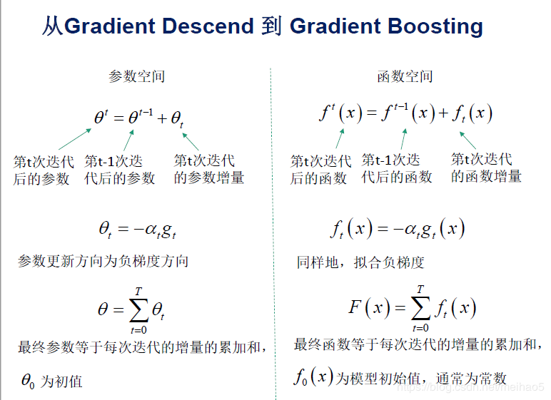
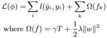
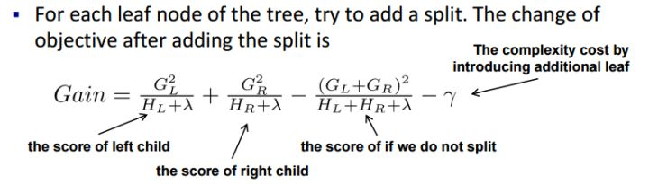
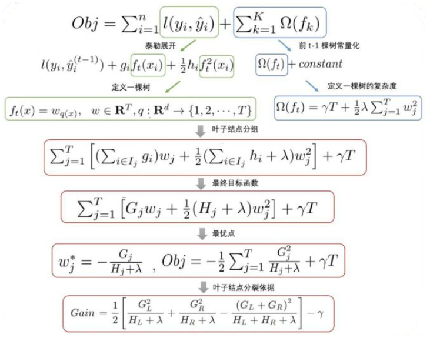

## 决策树 ID3 C4.5 CART
参考 https://www.cnblogs.com/pinard/p/6050306.html
https://www.cnblogs.com/pinard/p/6053344.html

信息熵, 代表的不确定性
$c_i$ 代表其中一个类别
$$ H(c) = -\sum_{i=1}^n p(c_i) log(p(c_i)) $$

条件熵,
当特征X的整体分布被固定时，条件熵为: H(c|X)
$$ H(c|X) = -\sum_{i=1}^n p(x_i)H(c|x=x_i) $$

$$ = -\sum_{i=1}^n  p(x_i)p(c|x=x_i) log(p(c|x=x_i)) $$

$$ = -\sum_{i=1}^n p(c,x_i) log(p(c|x=x_i)) $$

ID3 特征X的信息增益, 特征X分布被固定时,系统不确定度的减小.
信息增益的大小是相对于训练数据集而言的,没有绝对意义,在数据集信息熵大的时候,信息熵也偏大.
$$ IG(c,X) = H(c) - H(c|X) $$

$$ = - \sum_{i=1}^n p(c_i) log(p(c_i)) + \sum_{i=1}^n p(c,x_i) log(p(c|x=x_i)) $$

C4.5 特征X的信息增益比
对数运算耗时
$$ g = \frac{IG(c,X)}{H(X)} = \frac{H(c) - H(c|X)}{H(X)} $$

CART 基尼系数
可以做为熵模型的一个近似替代
$$ Gini(p) = \sum_{i=1}^n p_i(1 - p_i)$$

互信息 两个随机变量之间的相关程度

KL散度 衡量两个分布的相似度

### CART

CART分类树算法使用基尼系数来代替信息增益比，基尼系数代表了模型的不纯度，基尼系数越小，则不纯度越低，特征越好。这和信息增益是相反的。
$$ Gini(p) = \sum_{k=1}^K p_k(1 - p_k)$$
#### CART分类树对连续特征的处理
比如m个样本的连续特征A有m个，从小到大排列为𝑎1,𝑎2,...,𝑎𝑚,则CART算法取相邻两样本值的平均数，一共取得m-1个划分点。对于这m-1个点，分别计算以该点作为二元分类点时的基尼系数。选择基尼系数最小的点作为该连续特征的二元离散分类点。
#### 建立CART分类树
算法输入是训练集D，基尼系数的阈值，样本个数阈值。输出是决策树T。
我们的算法从根节点开始，用训练集递归的建立CART分类树。
1) 对于当前节点的数据集为D，如果样本个数小于阈值，return。
2) 计算样本集D的基尼系数，如果基尼系数小于阈值，return。
3) 计算当前节点的各个特征对数据集D的基尼系数.
4) 在各特征对数据集D的基尼系数中，选择基尼系数最小的特征A作为最优特征，把数据集划分成两部分D1和D2至左右节点。
5) 对左右的子节点递归的调用1-4步，生成决策树。

对于生成的决策树做预测的时候，假如测试集里的样本A落到了某个叶子节点，而节点里有多个训练样本。则对于A的类别预测采用的是这个叶子节点里概率最大的类别。

#### 建立CART回归树
CART回归树和CART分类树的建立和预测的区别主要有下面两点：
1) 连续值的处理方法不同
CART分类度量目标是树采用基尼系数最小,CART回归树的度量目标是均方差之和最小。
2) 决策树建立后做预测的方式不同。
CART分类树采用叶子节点里概率最大的类别作为当前节点的预测类别。而回归树输出不是类别，它采用的是用最终叶子的均值或者中位数来预测输出结果。

### CART树建树时间复杂度
O(NMD), N是sample的大小，M是feature的数量，D是树的深度。cart生长时，把所有feature内的值都作为分裂候选，并为其计算一个评价指标（信息增益、增益比率、gini系数等），所以每层是O(NM)，D层的树就是O(NMD)

#### 剪枝
决策树很容易出现的一种情况是过拟合(overfitting)，所以需要进行剪枝。而基本的策略包括两种：预剪枝(Pre-Pruning)与后剪枝(Post-Pruning)。

预剪枝：其中的核心思想就是，在每一次实际对结点进行进一步划分之前，先采用验证集的数据来验证如果划分是否能提高划分的准确性。如果不能，就把结点标记为叶结点并退出进一步划分；如果可以就继续递归生成节点。
后剪枝：后剪枝则是先从训练集生成一颗完整的决策树，然后自底向上地对非叶结点进行考察，若将该结点对应的子树替换为叶结点能带来泛化性能提升，则将该子树替换为叶结点。
参考 https://blog.csdn.net/bitcarmanlee/java/article/details/106824993

### GBDT
使用的是CART回归树, 用负梯度拟合. 损失函数除了loss还有正则项，正则中有参数和变量，很多情况下只拟合残差loss变小但是正则变大，代价函数不一定就小，这时候就要用梯度. 用残差去拟合，只是目标函数是MSE均方误差的一种特殊情况. 分类拟合的是概率的负梯度.
梯度提升树在函数空间做优化

梯度下降: 每次迭代基于负梯度方向更新权重参数
梯度提升: 每次迭代基于负梯度方向更新拟合函数(添加一个新函数)
对于新添加的函数取泰勒1阶/2阶近似,通过产生的一阶二阶梯度去拟合这个近似的函数.
最终权重参数/函数等于每次迭代增量的累加和.

### GBDT, XGBoost区别
对比原算法GBDT，XGBoost主要从下面三个方面做了优化：
1. 算法本身的优化：在算法的弱学习器模型选择上，GBDT只支持CART回归数，XGBoost还支持很多其他的弱学习器。在算法的优化方式上，GBDT的损失函数只对误差部分做负梯度（一阶泰勒）展开，而XGBoost损失函数对误差部分还做二阶泰勒展开，更加准确。
2. 是算法运行效率的优化：XGBoost决策树子树分裂特征选择的过程可并行。在并行选择之前，先对所有的特征值进行排序分组，对分组的特征，选择合适的分组大小，使用CPU缓存进行读取加速。将各个分组保存到多个硬盘以提高IO速度。
3. 算法健壮性的优化：算法本身加入了L1和L2正则化项，列抽样,子采样,泛化能力更强。对于缺失值的特征，通过枚举所有缺失值在当前节点是进入左子树还是右子树来决定缺失值的处理方式。

### XGBoost
https://arxiv.org/pdf/1603.02754.pdf
这个文章xgboost总结的很好:
https://snaildove.github.io/2018/10/02/get-started-XGBoost/
### 损失函数

l 为损失函数, Omiga为树的复杂度, T 为叶子结点个数，w 为叶子权重。

节点分裂公式

损失函数本身满足样本之间的累加特性(最大似然取log的好处)，所以，可以通过将分裂前的叶结点上样本的损失函数和与分裂之后的两个新叶结点上的样本的损失函数之和进行对比结合复杂度的控制,计算增益gain，寻找最优特征与最优分割点。

### XGBoost 并行
1. XGBoost在处理特征时可以做到并行处理，XGBoost并行原理体现在最优切分点的选择，假设样本数据共M个特征,分别对M个特征分别先预排序,然后以compressed column的形式存储在M个block中(减小内存占用), Block预先放入内存.在寻找每个特征的最优划分点的时候,可以利用多线程对每个block并行计算.
2. 缓存感知:
CSC 存储格式会使得数据不在连续的内存里，用普通的访问方式会使得划分查找算法效率降低，并可能导致 cache miss。
对于精确贪婪算法，使用缓存感知cache-aware解决问题。首先为每个线程分配一个内部buffer，读取梯度信息并存入buufer中(实现非连续到连续的转化), 然后再在buffer中统计梯度信息。
对于近似算法，选取正确的 block 大小就可以解决问题。
3. 核外块的计算
为了解决硬盘读取数据耗时长,吞吐量不足.
多线程对数据分块压缩(block compression)存储在硬盘上,再将数据传输到内存,最后再用独立的线程解压缩. (用解压缩时间换取IO时间)

参考:https://blog.rocuku.cc/xgboost-summary/
https://snaildove.github.io/2018/10/02/get-started-XGBoost/

### XGBoost防止过拟合的方法
- 目标函数添加正则项：叶子节点个数+叶子节点权重的L1,L2正则化
- 列抽样：训练的时候只用一部分特征（不考虑剩余的block块即可）
- 子采样：每轮计算可以不使用全部样本，使算法更加保守
- ealry stop
- 剪枝

这个文章讲的比较好: https://www.xuyindavid.top/2019/11/23/%E6%9C%BA%E5%99%A8%E5%AD%A6%E4%B9%A0%E7%AE%97%E6%B3%95%E4%B8%93%E9%A2%98/xgboost/%E7%99%BE%E9%97%AExgboost/

### xgboost 特征重要性
xgboost实现中Booster类get_score方法输出特征重要性，其中importance_type参数支持三种特征重要性的计算方法：
1. importance_type=weight（默认值），特征重要性使用特征在所有树中作为划分属性的次数。
2. importance_type=gain，特征重要性使用特征在作为划分属性时loss平均的降低量。
3. importance_type=cover，特征重要性使用特征在作为划分属性时对样本的覆盖度。

### 不需要归一化原因
增益gain的计算与特征值范围无关,是采用生成树的结构与权重计算的,所以不需要对特征进行归一化处理.

### XGBoost如何处理缺失值
XGBoost模型的一个优点就是允许特征存在缺失值。对缺失值的处理方式如下：
- 在特征k非缺失的样本上上寻找最佳切分点。
- 将该特征值缺失的样本分别分配到左叶子结点和右叶子结点，两种情形都计算一遍后，选择分裂后增益最大的那个分支，作为预测时特征值缺失样本的默认分支方向。
- 如果在训练中没有缺失值而在预测中出现缺失，那么会自动将缺失值的划分方向放到右子结点。

### XGBoost中的一棵树的停止生长条件
- 当新引入的一次分裂所带来的增益Gain<0时，放弃当前的分裂。这是训练损失和模型结构复杂度的博弈过程。
- 当树达到最大深度时，停止建树，因为树的深度太深容易出现过拟合，这里需要设置一个超参数max_depth。
- 如果一个叶子节点包含的样本数量太少也会放弃分裂，防止树分的太细。

### 最优切分点划分算法
- 对每个叶节点枚举所有的可用特征
- 针对每个特征，把属于该节点的训练样本根据该特征值进行升序排列，从左到右线性扫描决定该特征的最佳分裂点，并记录该特征的分裂增益(左孩子损失+右孩子损失-分裂前损失+复杂度)
- 选择增益最大的特征作为分裂特征，用该特征的最佳分裂点作为分裂位置，在该节点上分裂出左右两个新的叶节点，并为每个新节点关联对应的样本集
每次排序的时间复杂度 O(m nlogn), m为特征类别数, n为样本数. 可以通过预排序节省.

近似算法: 上述算法可以得到最优解，但计算量大. 对于每个特征，只考察分位点可以减少计算复杂度.
根据分位数采样得到分割点的候选集合S, 将特征k的值根据集合Sk划分到桶(bucket)中，接着对每个桶内样本的增益(梯度G,H)进行累加统计，最后在这些累计的统计量上寻找最佳分裂点。
除此之外还有带权重(基于梯度)的分位方案.

参考: https://zhuanlan.zhihu.com/p/105612830
https://yxzf.github.io/2017/04/xgboost-v2/

### XGBoost 公式推导

### 随机森林
bagging每次对数据集随机采样,使用一部分数据训练不同的基学习器,最后再集成起来.
随机森林使用CART作为基学习器,不同的是,RF随机选择节点上的一部分特征𝑛𝑠𝑢𝑏，然后在这些随机选择的𝑛𝑠𝑢𝑏个样本特征中，选择一个最优的特征来做决策树的左右子树划分。(nsub越小,模型方差越小,偏差越大.一般通过交叉验证调参获取合适的𝑛𝑠𝑢𝑏)
如果是分类算法预测，则T个弱学习器投出最多票数的类别或者类别之一为最终类别。如果是回归算法，T个弱学习器得到的回归结果进行算术平均得到的值为最终的模型输出。
优点:
1. 训练可以高度并行化
2. 采用随机采样，随机选取节点特征,训练出的模型的方差小，泛化能力强。

### RF和GBDT的区别
相同点：
- 都是由多棵树组成，最终的结果都是由多棵树一起决定。

不同点：
- 集成学习：RF属于bagging思想，而GBDT是boosting思想
- 偏差-方差权衡：RF不断的降低模型的方差，而GBDT不断的降低模型的偏差
- 训练样本：RF每次迭代的样本是从全部训练集中有放回抽样形成的，而GBDT每次使用全部样本
- 并行性：RF的树可以并行生成，而GBDT只能顺序生成(需要等上一棵树完全生成)
- 最终结果：RF最终是多棵树进行多数表决（回归问题是取平均），而GBDT是加权融合
- 数据敏感性：RF对异常值不敏感，而GBDT对异常值比较敏感
- 泛化能力：RF不易过拟合，而GBDT容易过拟合

### LightGBM和XGBoost的区别？
https://my.oschina.net/u/4314328/blog/3338894

### LR和GBDT比较， 什么情景下GBDT不如LR

LR是线性模型，可解释性强，很容易并行化，但学习能力有限，需要大量的人工特征工程
GBDT是非线性模型，具有天然的特征组合优势，特征表达能力强，但是树与树之间无法并行训练，很容易过拟合；

当在高维稀疏特征的场景下，LR的效果一般会比GBDT好。原因如下：

先看一个例子：

假设一个二分类问题，label为0和1，特征有100维，如果有1w个样本，但其中只要10个正样本1，而这些样本的特征 f1的值为全为1，而其余9990条样本的f1特征都为0(在高维稀疏的情况下这种情况很常见)。

我们都知道在这种情况下，树模型很容易优化出一个使用f1特征作为重要分裂节点的树，因为这个结点直接能够将训练数据划分的很好，但是当测试的时候，却会发现效果很差，因为这个特征f1只是刚好偶然间跟y拟合到了这个规律，这也是我们常说的过拟合。

那么这种情况下，如果采用LR的话，应该也会出现类似过拟合的情况呀：y = W1f1 + Wifi+….，其中 W1特别大以拟合这10个样本。为什么此时树模型就过拟合的更严重呢？

仔细想想发现，因为现在的模型普遍都会带着正则项，而 LR 等线性模型的正则项是对权重的惩罚，也就是 W1一旦过大，惩罚就会很大，进一步压缩 W1的值，使他不至于过大。但是，树模型则不一样，树模型的惩罚项通常为叶子节点数和深度等，而我们都知道，对于上面这种 case，树只需要一个节点就可以完美分割9990和10个样本，一个结点，最终产生的惩罚项极其之小。

这也就是为什么在高维稀疏特征的时候，线性模型会比非线性模型好的原因了：带正则化的线性模型比较不容易对稀疏特征过拟合。
