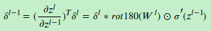

# 手撕推导
## 反向传播
### 基础知识
- 向量范数
2范数: 向量元素绝对值的平方和再开方，表示x到零点的欧式距离
)

- 矩阵求导
yx拉伸(先纵向拉伸y,再横向拉伸x)

### DNN 反向传播
参考:https://www.jianshu.com/p/d52626b39382
https://www.cnblogs.com/pinard/p/6422831.html
https://zhuanlan.zhihu.com/p/25794795

### CNN 前向传播
输入：1个图片样本，CNN模型的层数L和所有隐藏层的类型，对于卷积层，要定义卷积核的大小K，卷积核子矩阵的维度F，填充大小P，步幅S。对于池化层，要定义池化区域大小k和池化标准（MAX或Average），对于全连接层，要定义全连接层的激活函数（输出层除外）和各层的神经元个数。

输出：CNN模型的输出$a^L$

1) 根据输入层的填充大小P，填充原始图片的边缘，得到输入张量$a^1$。
2）初始化所有隐藏层的参数$W,b$　　
3）for $l$=2 to $L-1$:
a) 如果第$l$层是卷积层,则输出为$$ a^l= ReLU(z^l) = ReLU(a^{l-1}W^l +b^l)$$　　
b) 如果第$l$层是池化层,则输出为$ a^l= pool(a^{l-1})$, 这里的pool指按照池化区域大小k和池化标准将输入张量缩小的过程。
c) 如果第$l$层是全连接层,则输出为$$ a^l= \sigma(z^l) = \sigma(W^la^{l-1} +b^l)$$
4)对于输出层第L层: $$ a^L= softmax(z^L) = softmax(W^La^{L-1} +b^L)$$

### CNN 反向传播
https://www.cnblogs.com/pinard/p/6494810.html
将卷积核翻转后和反向传播的梯度误差进行卷积，就得到了前一次的梯度误差

此时卷积核并没有反转，主要是此时是层内的求导，而不是反向传播到上一层的求导

𝛿^𝑙 是高维张量，而𝑏只是一个向量，将 𝛿^𝑙 的各个子矩阵的项分别求和，得到一个误差向量，即为𝑏的梯度

池化层反向传播的时候,上采样,对于maxpool,梯度只反传给上一层max对应的cell,对于avgpool,梯度取mean反传给上一层每一个cell

(下面第一个式子$a^{l-1}$不应该T转置)

## softmax 损失函数
softmax, sigmoid, MSE 代数求导 看这个就够了
待总结: http://vonng.com/blog/nn-basic/

 

## 逻辑回归(sigmoid)损失函数

