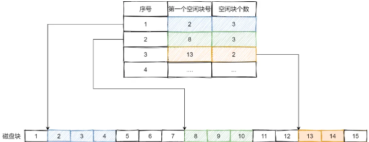

# 操作系统
待整理: https://www.cnblogs.com/javaguide/p/operating-system.html
## 概述
进程,内存管理,文件系统,锁,进程间通信.linux知识. c++ STL容器种类.
### 操作系统基本特征
1. 并发
并发是指宏观上在一段时间内能同时运行多个程序，而并行则指同一时刻能运行多个指令。
并行需要硬件支持，如多流水线、多核处理器或者分布式计算系统。
操作系统通过引入进程和线程，使得程序能够并发运行。
2. 共享
共享是指系统中的资源可以被多个并发进程共同使用。
有两种共享方式：互斥共享和同时共享。
互斥共享的资源称为临界资源，例如打印机等，在同一时刻只允许一个进程访问，需要用同步机制来实现互斥访问。
3. 虚拟
虚拟技术把一个物理实体转换为多个逻辑实体。
主要有两种虚拟技术：时（时间）分复用技术和空（空间）分复用技术。
多个进程能在同一个处理器上并发执行使用了时分复用技术，让每个进程轮流占用处理器，每次只执行一小个时间片并快速切换。
虚拟内存使用了空分复用技术，它将物理内存抽象为地址空间，每个进程都有各自的地址空间。地址空间的页被映射到物理内存，地址空间的页并不需要全部在物理内存中，当使用到一个没有在物理内存的页时，执行页面置换算法，将该页置换到内存中。
4. 异步
异步指进程不是一次性执行完毕，而是走走停停，以不可知的速度向前推进。

### 操作系统基本功能
1. 进程管理: 进程控制、进程同步、进程通信、死锁处理、处理机调度等。
2. 内存管理: 内存分配、地址映射、内存保护与共享、虚拟内存等。
3. 文件管理: 文件存储空间的管理、目录管理、文件读写管理和保护等。
4. 设备管理: 完成用户的 I/O 请求，方便用户使用各种设备，并提高设备的利用率。主要包括缓冲管理、设备分配、设备处理、虛拟设备等。

### 大内核和微内核
1. 大内核
大内核是将操作系统功能作为一个紧密结合的整体放到内核。各模块共享信息，因此有很高的性能。但是内核中的错误会拖累系统。

2. 微内核
由于操作系统不断复杂，因此将一部分操作系统功能移出内核，从而降低内核的复杂性。移出的部分根据分层的原则划分成若干服务，相互独立。在微内核结构下，操作系统被划分成小的、定义良好的模块，只有微内核这一个模块运行在内核态，其余模块运行在用户态。需要频繁地在用户态和核心态之间进行切换，会有一定的性能损失。

### 用户态和内核态的区别
内核态: 可以访问内存所有数据, 外围设备.在特权级最高的（0级）内核代码中执行。操作系统运行在内核态。
用户态: 只能受限的访问内存, 不能访问外围设备. 占用CPU的能力被剥夺, CPU资源可以被其他程序获取,在特权级最低的（3级）用户代码中运行。用户程序运行在用户态。

当一个任务（进程）执行 系统调用 而陷入内核代码中执行时，我们就称进程处于内核运行态（或简称为内核态）。此时处理器处于特权级最高的（0级）内核代码中执行。当进程处于内核态时，执行的内核代码会使用当前进程的内核栈。每个进程都有自己的内核栈。
当进程在执行用户自己的代码时，则称其处于用户运行态（用户态）。即此时处理器在特权级最低的（3级）用户代码中运行。

CPU状态之间的转换
用户态-->内核态：唯一途径是通过中断、异常、系统调用
内核态-->用户态：设置程序状态字PSW

内核线程比用户线程速度慢。

## 进程管理

### 进程 线程区别
`一个任务就是一个进程（Process）`,每个进程都拥有自己的地址空间、内存、数据栈及其它资源.多个进程可以在不同的 CPU 上运行，互不干扰同一个CPU上，可以运行多个进程，由操作系统来自动分配时间片由于进程间资源不能共享，需要进程间通信，来发送数据，接受消息等多进程，也称为“并行”。
`进程内的“子任务”称为线程（Thread）`.一个进程下可以运行多个线程，这些线程之间共享主进程内申请的操作系统资源.在一个进程中启动多个线程的时候，每个线程按照顺序执行.

计算密集型任务使用多进程,IO密集型任务使用多线程.

Ⅰ 拥有资源
进程是资源分配的基本单位，有独立的地址空间，线程可以访问隶属进程的资源。
Ⅱ 调度
线程是独立调度的基本单位，在同一进程中，线程的切换不会引起进程切换，从一个进程中的线程切换到另一个进程中的线程时，会引起进程切换。
Ⅲ 系统开销
由于创建或撤销进程时，系统都要为之分配或回收资源，如内存空间、I/O 设备等，所付出的开销远大于创建或撤销线程时的开销。类似地，在进行进程切换时，涉及当前执行进程 CPU 环境的保存及新调度进程 CPU 环境的设置，而线程切换时只需保存和设置少量寄存器内容，开销很小。
Ⅳ 通信方面
线程间可以通过直接读写同一进程中的数据进行通信，但是进程通信需要借助 IPC。


### 协程
`协程`的作用，是在执行函数A时，可以随时中断，去执行函数B，然后中断继续执行函数A（可以自由切换）。但这一过程并不是函数调用（没有调用语句），这一整个过程看似像多线程，然而协程只有一个线程执行.
协程有何优势？
- 最大的优势就是协程极高的执行效率。因为子程序切换不是线程切换，而是由程序自身控制，因此，没有线程切换的开销，和多线程比，线程数量越多，协程的性能优势就越明显。
- 第二大优势就是不需要多线程的锁机制，因为只有一个线程，也不存在同时写变量冲突，在协程中控制共享资源不加锁，只需要判断状态就好了，所以执行效率比多线程高很多。
- 因为协程是一个线程执行，那怎么利用多核CPU呢？最简单的方法是多进程+协程，既充分利用多核，又充分发挥协程的高效率，可获得极高的性能。

### 进程状态

就绪,运行,阻塞,创建,终止
- 只有就绪态和运行态可以相互转换，其它的都是单向转换。就绪状态的进程通过调度算法从而获得 CPU 时间，转为运行状态；而运行状态的进程，在分配给它的 CPU 时间片用完之后就会转为就绪状态，等待下一次调度。
- 阻塞状态是缺少需要的资源从而由运行状态转换而来，但是该资源不包括 CPU 时间，缺少 CPU 时间会从运行态转换为就绪态。

如果有大量处于阻塞状态的进程，进程可能会占用着物理内存空间，显然不是我们所希望的，毕竟物理内存空间是有限的，被阻塞状态的进程占用着物理内存就一种浪费物理内存的行为。所以，在虚拟内存管理的操作系统中，通常会把阻塞状态的进程的物理内存空间换出到硬盘，等需要再次运行的时候，再从硬盘换入到物理内存。那么，就需要一个新的状态，来描述进程没有占用实际的物理内存空间的情况，这个状态就是挂起状态。这跟阻塞状态是不一样，阻塞状态是等待某个事件的返回。

### 进程层次结构
进程（UNIX中）以层次结构进行组织，所有进程属于以init位根的树。windows进程地位相同，创建进程时，父进程得到句柄，用于控制子进程。

### PCB 进程控制块 (process control block)
PCB（也叫进程表） 是进程存在的唯一标识
包含如下信息:程序计数器，栈指针，内存分配状况，所打开文件的状态，账号和调度信息，以及进程切换时所必须保存的信息。


PCB通过链表的方式进行组织，把具有相同状态的进程链在一起，组成各种队列

进程的上下文切换不仅包含了虚拟内存、栈、全局变量等用户空间的资源，还包括了内核栈、寄存器等内核空间的资源,页表。通常，会把交换的信息保存在进程的 PCB，当要运行另外一个进程的时候，我们需要从这个进程的 PCB 取出上下文，然后恢复到 CPU 中，这使得这个进程可以继续执行.

线程切换不需要陷入内核，上下文切换，刷新内存与高速缓存，只需要切换线程的栈与寄存器。

### CPU利用率
CPU利用率 = 1 - p^n
下图x轴单位时进程数n


### epoll
### 进程特征
动态性, 并发性, 独立性, 异步性, 结构性

### 进程调度算法
1.批处理系统
批处理系统没有太多的用户操作，在该系统中，调度算法目标是保证吞吐量和周转时间（从提交到终止的时间）。
1.1 先来先服务 first-come first-serverd（FCFS）
非抢占式的调度算法，按照请求的顺序进行调度。不利于短作业，不利于IO繁忙型作业
1.2 短作业优先 shortest job first（SJF）
非抢占式的调度算法，按估计运行时间最短的顺序进行调度。
长作业有可能会饿死.

2.交互式系统
交互式系统有大量的用户交互操作，在该系统中调度算法的目标是快速地进行响应。
2.1 时间片轮转
将所有就绪进程按 FCFS 的原则排成一个队列，每次调度时，把 CPU 时间分配给队首进程，该进程可以执行一个时间片。当时间片用完时，由计时器发出时钟中断，调度程序便停止该进程的执行，并将它送往就绪队列的末尾，同时继续把 CPU 时间分配给队首的进程。时间片轮转算法的效率和时间片的大小有很大关系：因为进程切换都要保存进程的信息并且载入新进程的信息，如果时间片太小，会导致进程切换得太频繁。如果时间片过长，那么实时性就不能得到保证。
2.2 优先级调度
为每个进程分配一个优先级，按优先级进行调度。为了防止低优先级的进程永远等不到调度，可以随着时间的推移增加等待进程的优先级。
2.3 多级反馈队列
一个进程需要执行 100 个时间片，如果采用时间片轮转调度算法，那么需要交换 100 次。
多级队列是为这种需要连续执行多个时间片的进程考虑，它设置了多个队列，每个队列时间片大小都不同，例如 1,2,4,8,..。进程在第一个队列没执行完，就会被移到下一个队列。这种方式下，之前的进程只需要交换 7 次。每个队列优先权也不同，最上面的优先权最高。因此只有上一个队列没有进程在排队，才能调度当前队列上的进程。可以将这种调度算法看成是时间片轮转调度算法和优先级调度算法的结合。

3.实时系统
实时系统要求一个请求在一个确定时间内得到响应。
分为硬实时和软实时，前者必须满足绝对的截止时间，后者可以容忍一定的超时。

### 进程切换和线程切换的区别
进程切换涉及虚拟地址空间的切换而线程不会。因为每个进程都有自己的虚拟地址空间，而线程是共享所在进程的虚拟地址空间的，因此同一个进程中的线程进行线程切换时不涉及虚拟地址空间的转换。

每个进程都有自己的虚拟地址空间，那么显然每个进程都有自己的页表，那么当进程切换后页表也要进行切换，页表切换后缓存TLB就失效了，cache失效导致命中率降低，那么虚拟地址转换为物理地址就会变慢，表现出来的就是程序运行会变慢，而线程切换则不会导致TLB失效，因为线程线程无需切换地址空间，因此我们通常说线程切换要比较进程切换块.

### 调度评价指标
CPU 利用率, 系统吞吐量, 周转时间, 响应时间

### 进程同步 ??
- 临界资源: 多个进程可以共享系统中的各种资源，但其中许多资源一次只能为一个进程所使用，我们把一次只允许一个进程使用的资源成为临界资源。对临界资源的访问，必须互斥的进行。每个进程中，访问临界资源的那段代码成为临界区。
- 同步: 同步已成为直接制约关系，它是为完成某种任务而建立的两个或多个进程。这些进程因为需要在某些位置上协调他们的工作次序而等待、传递信息所产生的制约关系。进程间的直接制约关系就是它们之间的相互合作。
- 互斥: 互斥亦称间接制约关系。当一个进程进入临界区使用临界资源时，另一个进程必须等待，当占用临界资源的进程退出临界区后，另一个进程才允许去访问此临界资源。

### 进程间通信 IPC
进程间通信:每个进程各自有不同的用户地址空间，任何一个进程的全局变量在另一个进程中都看不到，所以进程之间要交换数据必须通过内核，在内核中开辟一块缓冲区，进程1把数据从用户空间拷到临界区，进程2再从临界区把数据读走，内核提供的这种机制称为进程间通信（IPC，InterProcess Communication）
进程间通信的7种方式:
- 管道(pipe): 数据只能向一个方向流动；需要双方通信时，需要建立起两个管道.只能用于父子进程或者兄弟进程之间.
- 有名管道(FIFO): 通过有名管道不相关的进程也能交换数据. 因为命令管道，提前创建了一个类型为管道的设备文件，在进程里只要使用这个设备文件，就可以相互通信. FIFO严格遵循先进先出.
- 消息队列(Message): 存放在内核中的消息链表.
- 信号(Signal): 信号可以在任何时候发给某一进程，而无需知道该进程的状态
- 信号量(semaphore): 调协进程对共享资源的访问, 让一个临界区同一时间只有一个线程在访问它
- 共享内存(share memory): 使得多个进程可以可以直接读写同一块内存空间，是最快的可用IPC形式.
- 套接字(socket): 是一种通信机制，凭借这种机制，客户/服务器（即要进行通信的进程）系统的开发工作既可以在本地单机上进行，也可以跨网络进行.

参考: https://www.nowcoder.com/discuss/462678?source_id=profile_create&channel=666

不管是匿名管道还是命名管道，进程写入的数据都是缓存在内核中，另一个进程读取数据时候自然也是从内核中获取，同时通信数据都遵循先进先出原则. 所谓的管道，就是内核里面的一串缓存. 数据是无格式的流且大小受限. 生命周期随进程的创建而建立，随进程的结束而销毁。

管道的通信方式是效率低的，不适合进程间频繁地交换数据。对于这个问题，消息队列的通信模式就可以解决. 比如，A 进程要给 B 进程发送消息，A 进程把数据放在对应的消息队列后就可以正常返回了，B 进程需要的时候再去读取数据就可以了。同理，B 进程要给 A 进程发送消息也是如此。两个进程之间的通信就像平时发邮件一样，你来一封，我回一封，可以频繁沟通。不足的地方有两点，一是通信不及时，二是附件也有大小限制. 消息队列不适合比较大数据的传输，因为在内核中每个消息体都有一个最大长度的限制，同时所有队列所包含的全部消息体的总长度也是有上限。在 Linux 内核中，会有两个宏定义 MSGMAX 和 MSGMNB，它们以字节为单位，分别定义了一条消息的最大长度和一个队列的最大长度。消息队列通信过程中，存在用户态与内核态之间的数据拷贝开销，因为进程写入数据到内核中的消息队列时，会发生从用户态拷贝数据到内核态的过程，同理另一进程读取内核中的消息数据时，会发生从内核态拷贝数据到用户态的过程。消息队列生命周期随内核，如果没有释放消息队列或者没有关闭操作系统，消息队列会一直存在.

消息队列的读取和写入的过程，都会有发生用户态与内核态之间的消息拷贝过程。那共享内存的方式，就很好的解决了这一问题。现代操作系统，对于内存管理，采用的是虚拟内存技术，也就是每个进程都有自己独立的虚拟内存空间，不同进程的虚拟内存映射到不同的物理内存中。所以，即使进程 A 和 进程 B 的虚拟地址是一样的，其实访问的是不同的物理内存地址，对于数据的增删查改互不影响。共享内存的机制，就是在进程A,B中各将一部分虚拟地址空间，映射到相同的物理内存中。这样这个进程写入的东西，另外一个进程马上就能看到了，都不需要拷贝来拷贝去，传来传去，大大提高了进程间通信的速度。

用了共享内存通信方式，带来新的问题，那就是如果多个进程同时修改同一个共享内存，很有可能就冲突了。例如两个进程都同时写一个地址，那先写的那个进程会发现内容被别人覆盖了。为了防止多进程竞争共享资源，而造成的数据错乱，所以需要保护机制，使得共享的资源，在任意时刻只能被一个进程访问。正好，信号量就实现了这一保护机制。信号量其实是一个整型的计数器，主要用于实现进程间的互斥与同步，使得不同进程互斥访问共享内存, 而不是用于缓存进程间通信的数据。
信号量表示资源的数量，控制信号量的方式有两种原子操作：
一个是 P 操作，这个操作会把信号量减去 -1，相减后如果信号量 < 0，则表明资源已被占用，进程需阻塞等待；相减后如果信号量 >= 0，则表明还有资源可使用，进程可正常继续执行。
另一个是 V 操作，这个操作会把信号量加上 1，相加后如果信号量 <= 0，则表明当前有阻塞中的进程，于是会将该进程唤醒运行；相加后如果信号量 > 0，则表明当前没有阻塞中的进程；
P 操作是用在进入共享资源之前，V 操作是用在离开共享资源之后，这两个操作是必须成对出现的。列子如下
- 进程 A 在访问共享内存前，先执行了 P 操作，由于信号量的初始值为 1，故在进程 A 执行 P 操作后信号量变为 0，表示共享资源可用，于是进程 A 就可以访问共享内存。
- 若此时，进程 B 也想访问共享内存，执行了 P 操作，结果信号量变为了 -1，这就意味着临界资源已被占用，因此进程 B 被阻塞。
- 直到进程 A 访问完共享内存，才会执行 V 操作，使得信号量恢复为 0，接着就会唤醒阻塞中的线程 B，使得进程 B 可以访问共享内存，最后完成共享内存的访问后，执行 V 操作，使信号量恢复到初始值 1。

上面说的进程间通信，都是常规状态下的工作模式。对于异常情况下的工作模式，就需要用「信号」的方式来通知进程。信号是进程间通信机制中唯一的异步通信机制，可以在任何时候发送信号给某一进程.

前面提到的管道、消息队列、共享内存、信号量和信号都是在同一台主机上进行进程间通信，那要想跨网络与不同主机上的进程之间通信，就需要 Socket 通信了. (Socket也可以在同主机上进程间通信)

#### 生产者-消费者
生产者-消费者问题描述：
- 生产者在生成数据后，放在一个缓冲区中；
- 消费者从缓冲区取出数据处理；
- 任何时刻，只能有一个生产者或消费者可以访问缓冲区；

- 互斥信号量 mutex：用于互斥访问缓冲区，初始化值为 1；
- 资源信号量 fullBuffers：用于消费者询问缓冲区是否有数据，有数据则读取数据，初始化值为 0（表明缓冲区一开始为空）；
- 资源信号量 emptyBuffers：用于生产者询问缓冲区是否有空位，有空位则生成数据，初始化值为 n （缓冲区大小）；


如果消费者线程一开始执行 P(fullBuffers)，由于信号量 fullBuffers 初始值为 0，则此时 fullBuffers 的值从 0 变为 -1，说明缓冲区里没有数据，消费者只能等待。
接着，轮到生产者执行 P(emptyBuffers)，表示减少 1 个空槽，如果当前没有其他生产者线程在临界区执行代码，那么该生产者线程就可以把数据放到缓冲区，放完后，执行 V(fullBuffers) ，信号量 fullBuffers 从 -1 变成 0，表明有「消费者」线程正在阻塞等待数据，于是阻塞等待的消费者线程会被唤醒。
消费者线程被唤醒后，如果此时没有其他消费者线程在读数据，那么就可以直接进入临界区，从缓冲区读取数据。最后，离开临界区后，把空槽的个数 + 1。

参考：https://www.nowcoder.com/discuss/457659?source_id=profile_create&channel=1013

#### 哲学家就餐

假设五位哲学家同时拿起左边的叉子，死锁

方案1：在拿叉子前，加个互斥信号量。只要有一个哲学家进入了「临界区」，其他哲学家都不能动，只有这位哲学家用完叉子了，才能轮到下一个哲学家进餐。


方案2：即让偶数编号的哲学家「先拿左边的叉子后拿右边的叉子」，奇数编号的哲学家「先拿右边的叉子后拿左边的叉子」。


方案3：用一个数组 state 来记录每一位哲学家在进程、思考还是饥饿状态（正在试图拿叉子）。一个哲学家只有在两个邻居都没有进餐时，才可以进入进餐状态。


#### 读者-写者
- 「读-读」允许：同一时刻，允许多个读者同时读
- 「读-写」互斥：没有写者时读者才能读，没有读者时写者才能写
- 「写-写」互斥：没有其他写者时，写者才能写

方案1：读者优先，只要有读者正在读的状态，后来的读者都可以直接进入，如果读者持续不断进入，写者会处于饥饿状态。


方案2：写者优先，如果有写者持续不断写入，则读者就处于饥饿。


方案3：通过flag阻止读者的特殊权限（特殊权限是指只要读者到达，就可以进入读者队列）

#### 管程
使用信号量时要非常小心，小错误可能导致死锁等麻烦。管程是一种高级同步原语，为了更易于编写正确的程序。任意时刻管程中只能有一个活跃进程，使得管程能有效互斥。管程引入条件变量，wait，signal。

### 死锁
死锁是指多个进程因竞争资源而造成的一种僵局，若无外力作用，这些进程都将无法向前推进。

#### 死锁产生的必要条件
产生死锁必须同时满足以下四个条件，只要其中任一个条件不成立，死锁就不会发生。
- 互斥：一个资源一次只能被一个进程使用；
- 占有并等待：一个进程至少占有一个资源，并在等待另一个被其它进程占用的资源；
- 非抢占：已经分配给一个进程的资源不能被强制性抢占，只能由进程完成任务之后自愿释放；
- 循环等待：若干进程之间形成一种头尾相接的环形等待资源关系，该环路中的每个进程都在等待下一个进程所占有的资源。

### 线程间同步/通信
- 互斥量(Mutex)：采用互斥对象机制，只有拥有互斥对象的线程才有访问公共资源的权限。因为互斥对象只有一个，所以可以保证公共资源不会被多个线程同时访问。比如 Java 中的 synchronized 关键词和各种 Lock 都是这种机制。
- 信号量(Semphares) ：它允许同一时刻多个线程访问同一资源，但是需要控制同一时刻访问此资源的最大线程数量
- 事件(Event) :Wait/Notify：通过通知操作的方式来保持多线程同步，还可以方便的实现多线程优先级的比较操

1、锁机制
互斥锁：提供了以排它方式阻止数据结构被并发修改的方法。
读写锁：允许多个线程同时读共享数据，而对写操作互斥。
条件变量：可以以原子的方式阻塞进程，直到某个特定条件为真为止。对条件测试是在互斥锁的保护下进行的。条件变量始终与互斥锁一起使用。
2、信号量机制：包括无名线程信号量与有名线程信号量
3、信号机制：类似于进程间的信号处理。
线程间通信的主要目的是用于线程同步，所以线程没有象进程通信中用于数据交换的通信机制。

### 进程运行步骤
编译, 链接, 装入


### 什么叫僵尸进程？怎么处理僵尸进程？
僵尸进程: 完成了生命周期但却依然留在进程表中的进程
若父进程未能读取到子进程的 Exit 信号，则这个子进程虽然完成执行处于死亡的状态，但也不会从进程表中删掉。
确保删除子僵尸的唯一方法就是杀掉它们的父进程。
ps -aux 显示所有的进程

### 什么是缓冲区溢出？有什么危害？其原因是什么？
缓冲区溢出是指当计算机向缓冲区填充数据时超出了缓冲区本身的容量，溢出的数据覆盖在合法数据上。
危害有以下两点：
1. 程序崩溃，导致拒绝服务
2. 跳转并且执行一段恶意代码
造成缓冲区溢出的主要原因是程序中没有仔细检查用户输入。

###　内存抖动
指内存频繁地分配和回收，而频繁的gc会导致卡顿，严重时和内存泄漏一样会导致OOM。

###　内存溢出　out of memory
是指程序在申请内存时，没有足够的内存空间供其使用，出现out of memory；比如申请了一个integer,但给它存了long才能存下的数，那就是内存溢出。

###　内存泄露 memory leak：
是指程序在申请内存后，无法释放已申请的内存空间，一次内存泄露危害可以忽略，但内存泄露堆积后果很严重，无论多少内存,迟早会被占光。memory leak会最终会导致out of memory

### 页面置换算法/缓存替换策略 —> FIFO，LRU，LFU
- LRU(Least Recently Used) 最近最少使用算法，它是根据时间维度来选择将要淘汰的元素，即删除掉最长时间没被访问的元素。
- LFU(Least Frequently Used) 最近最不常用算法，它是根据频率维度来选择将要淘汰的元素，即删除访问频率最低的元素。如果两个元素的访问频率相同，则淘汰最久没被访问的元素。

### 大端模式 小端模式
1) 小端模式：就是低位字节排放在内存的低地址端，高位字节排放在内存的高地址端。
2) 大端模式：就是高位字节排放在内存的低地址端，低位字节排放在内存的高地址端。

### 线程池
线程池的基本思想是一种对象池，在程序启动时就开辟一块内存空间，里面存放了众多(未死亡)的线程，池中线程执行调度由池管理器来处理。当有线程任务时，从池中取一个，执行完成后线程对象归池，这样可以避免反复创建线程对象所带来的性能开销，节省了系统的资源。

### 线程安全性的三个体现
线程安全指某个函数、函数库在多线程环境中被调用时，能够正确地处理多个线程之间的共享变量，使程序功能正确完成.
- 原子性：一个操作要么全部执行（生效），要么全部都不执行（都不生效）
线程是调度的基本单位。CPU有时间片的概念，会根据不同的调度算法进行线程调度。当一个线程获得时间片之后开始执行，在时间片耗尽之后，就会失去CPU使用权。所以在多线程场景下，由于时间片在线程间轮换，就会发生原子性问题。
- 可见性：当多个线程并发访问共享变量时，一个线程对共享变量的修改，其它线程能够立即看到。
- 有序性：程序执行的顺序按照代码的先后顺序执行。

如何保证原子性?
加锁 lock, 同步 synchronized: 使用锁，可以保证同一时间只有一个线程能拿到锁，也就保证了同一时间只有一个线程能执行申请锁和释放锁之间的代码。 比如线程1CPU时间片用完，线程1放弃了CPU，但是，他并没有进行解锁。而由于synchronized的锁是可重入的，下一个时间片还是只能被他自己获取到，还是会继续执行代码。直到所有代码执行完。这就保证了原子性。
无论使用锁还是synchronized，本质都是一样，通过锁来实现资源的排它性，从而实际目标代码段同一时间只会被一个线程执行，进而保证了目标代码段的原子性。这是一种以牺牲性能为代价的方法。

如何保证可见性?
当使用volatile修饰某个变量时，它会保证对该变量的修改会立即被更新到内存中，并且将其它缓存中对该变量的缓存设置成无效，因此其它线程需要读取该值时必须从主内存中读取，从而得到最新的值。

如何保证顺序性?
volatile在一定程序上保证顺序性，另外还可以通过synchronized和锁来保证顺序性。
synchronized和锁保证顺序性的原理和保证原子性一样，都是通过保证同一时间只会有一个线程执行目标代码段来实现的。


## 内存管理

操作系统为每个进程分配独立的「虚拟地址」，互不干涉

- 程序使用的内存地址叫做虚拟内存地址（Virtual Memory Address）
- 实际存在硬件里面的空间地址叫物理内存地址（Physical Memory Address）。
- 操作系统会提供一种机制，将不同进程的虚拟地址和不同内存的物理地址映射起来。

操作系统引入了虚拟内存，进程持有的虚拟地址会通过 CPU 芯片中的 内存管理单元（MMU）的映射关系，来转换变成物理地址，然后再通过物理地址访问内存.
虚拟内存: 操作系统为每个进程提供的一种抽象，每个进程都有私有的、地址连续的虚拟内存, 编写的程序操作的都是虚拟内存地址. 最终进程的数据及代码必然要放到物理内存上，那么必须有某种机制能记住虚拟地址空间中的某个数据被放到了哪个物理内存地址上，这就是所谓的地址空间映射，那么操作系统是如何记住这种映射关系的呢，答案就是页表。

### 操作系统如何管理虚拟地址与物理地址之间的关系？
主要是内存分段和内存分页
#### 内存分段
参考： https://www.nowcoder.com/discuss/445401
分段机制下的虚拟地址由两部分组成，段选择因子和段内偏移量。
- 段选择子就保存在段寄存器里面。段选择子里面最重要的是段号，用作段表的索引。段表里面保存的是这个段的基地址、段的界限和特权等级等。
- 虚拟地址中的段内偏移量应该位于 0 和段界限之间，如果段内偏移量是合法的，就将段基地址加上段内偏移量得到物理内存地址。


缺点
- 第一个就是内存碎片的问题。
- 第二个就是内存交换的效率低的问题。

解决外部内存碎片的问题就是内存交换，Linux 系统里，就是Swap空间，这块空间是从硬盘划分出来的，用于内存与硬盘的空间交换。

对于多进程的系统来说，用分段的方式，内存碎片是很容易产生的，产生了内存碎片，那不得不重新 Swap 内存区域，这个过程会产生性能瓶颈。因为硬盘的访问速度要比内存慢太多了，每一次内存交换，我们都需要把一大段连续的内存数据写到硬盘上。所以，如果内存交换的时候，交换的是一个占内存空间很大的程序，这样整个机器都会显得卡顿。

#### 内存分页
为了解决内存分段的内存碎片和内存交换效率低的问题，就出现了内存分页。
分页是把整个虚拟和物理内存空间切成一段段固定尺寸的大小。物理内存对应的单元成为页框。在 Linux 下，每一页的大小为 4KB。
虚拟地址与物理地址之间通过页表来映射，页表实际上存储在 CPU 的内存管理单元 （MMU），于是 CPU 就可以直接通过 MMU，找出要实际要访问的物理内存地址。
因为虚拟内存地址空间可能比物理内存空间大，因此会出现部分映射与物理内存换出的问题，从而导致缺页错误。
如果虚拟地址空间中的内存页在物理内存中没有对应的页框，那么 CPU 就无法获取数据, 会报告一个缺页错误。 若此时物理内存里，已经有一个页框正是此时 CPU 请求的内存页，那么这是一个软缺页错误；于是，Page Fault Hander 会指示 MMU 建立相应的页帧到页的映射关系。若此时物理内存中，没有相应的页框，那么这就是一个硬缺页错误；于是 Page Fault Hander 会指示 CPU，从已经打开的磁盘文件中读取相应的内容到物理内存，而后交由 MMU 建立这份页帧到页的映射关系。
缺页参考: https://liam.page/2017/09/01/page-fault/

##### 分页是怎么解决分段的内存碎片、内存交换效率低的问题？
- 由于内存空间都是预先划分好的，也就不会像分段会产生间隙非常小的内存，这正是分段会产生内存碎片的原因。而采用了分页，那么释放的内存都是以页为单位释放的，也就不会产生无法给进程使用的小内存。
- 如果内存空间不够，操作系统会把其他正在运行的进程中的「最近没被使用」的内存页面(物理地址)给释放掉，换出（Swap Out）暂时写在硬盘上。一旦需要的时候，再加载进来，称为换入（Swap In）。所以，一次性写入磁盘的也只有少数的一个页或者几个页，不会花太多时间，内存交换的效率就相对比较高。
更进一步地，分页的方式使得加载程序的时候，不再需要一次性都把程序加载到物理内存中。我们完全可以在进行虚拟内存和物理内存的页之间的映射之后，并不真的把页加载到物理内存里，而是只有在程序运行中，需要用到对应虚拟内存页里面的指令和数据时，再加载到物理内存里面去。

##### 分页机制下，虚拟地址和物理地址是如何映射的？
在分页机制下，虚拟地址分为两部分，页号和页内偏移。页号作为页表的索引，页表包含物理页每页所在物理内存的基地址，这个基地址与页内偏移的组合就形成了物理内存地址。
##### 多级页表
简单的分页缺陷: 空间占用大，4GB空间的映射就需要有4MB的内存来存储页表，100 个进程的话，就需要 400MB 的内存来存储页表（64位下更大）
多级页表
如果使用了二级分页，一级页表就可以覆盖整个 4GB 虚拟地址空间，但如果某个一级页表的页表项没有被用到，也就不需要创建这个页表项对应的二级页表了，即可以在需要时才创建二级页表

引入多级页表避免把全部页表一直保存在内存中，对于空闲区不分配页表。
##### TLB（Translation Lookaside Buffer）
多级页表虽然解决了空间上的问题，但是虚拟地址到物理地址的转换就多了几道转换的工序，显然降低了地址转换的速度，带来了时间上的开销。
程序是有局部性的，即在一段时间内，整个程序的执行仅限于程序中的某一部分。相应地，执行所访问的存储空间也局限于某个内存区域。把最常访问的几个页表项存储到访问速度更快的硬件，于是在 CPU 芯片中，加入了一个专门存放程序最常访问的页表项的 Cache，这个 Cache 就是 TLB（Translation Lookaside Buffer）页表缓存.
有了 TLB 后，那么 CPU 在寻址时，会先查 TLB，如果没找到，才会继续查常规的页表。TLB 的命中率其实是很高的，因为程序最常访问的页就那么几个。

#### 段页式内存管理
段页式内存管理实现的方式：
- 先将程序划分为多个有逻辑意义的段；
- 接着再把每个段划分为多个页，也就是对分段划分出来的连续空间，再划分固定大小的页；
地址就由段号、段内页号和页内位移三部分组成。

#### fork()
fork系统调用用于创建一个新进程.
为什么fork会返回两次？
由于在复制时复制了父进程的堆栈段，fork函数会返回两次，一次是在父进程中返回，另一次是在子进程中返回
- 在父进程中，fork返回新创建子进程的进程ID；
- 在子进程中，fork返回0(因为子进程没有子进程)；
- 如果出现错误，fork返回一个负值。

#### Linux 启动过程
1.加载内核 2.启动初始化进程 3.确定运行级别 4.加载开机启动程序 5.用户登录 6.进入 login shell (打开 non-login shell)

#### 存储器
寄存器 - 高速缓存 - 主存 - 磁盘
内存又称主存，是CPU能直接寻址的存储空间，它的特点是存取速率快，包括随机存储器（RAM）、只读存储器（ROM）和高级缓存（Cache）

### 文件系统
「一切皆文件」，不仅普通的文件和目录，就连块设备、管道、socket 等，也都是统一交给文件系统管理的。

Linux 文件系统会为每个文件分配两个数据结构：索引节点（index node）和目录项（directory entry），它们主要用来记录文件的元信息和目录层次结构。
- 索引节点，用来记录文件的元信息，比如 inode 编号、文件大小、访问权限、创建时间、修改时间、数据在磁盘的位置等等。索引节点是文件的唯一标识，它们之间一一对应，也同样都会被存储在硬盘中，所以索引节点同样占用磁盘空间。
- 目录项，用来记录文件的名字、索引节点指针以及与其他目录项的层级关联关系。多个目录项关联起来，就会形成目录结构，但它与索引节点不同的是，目录项是由内核维护的一个数据结构，不存放于磁盘，而是缓存在内存。
由于索引节点唯一标识一个文件，而目录项记录着文件的名，所以目录项和索引节点的关系是多对一。

#### `目录项和目录`
目录是个文件，持久化存储在磁盘，而目录项是内核一个数据结构，缓存在内存。如果查询目录频繁从磁盘读，效率会很低，所以内核会把已经读过的目录用目录项这个数据结构缓存在内存，下次再次读到相同的目录时，只需从内存读就可以，大大提高了文件系统的效率。注意，目录项这个数据结构不只是表示目录，也是可以表示文件的。

#### `文件数据是如何存储在磁盘`
磁盘读写的最小单位是扇区，扇区的大小只有 512B 大小，很明显，如果每次读写都以这么小为单位，那这读写的效率会非常低。所以，文件系统把多个扇区组成了一个逻辑块，每次读写的最小单位就是逻辑块（数据块），Linux 中的逻辑块大小为 4KB，也就是一次性读写 8 个扇区，这将大大提高了磁盘的读写的效率。

#### `索引节点、目录项以及文件数据的关系`


索引节点是存储在硬盘上的数据，为了加速文件的访问，通常会把索引节点加载到内存中。

#### `虚拟文件系统`
文件系统的种类众多，而操作系统希望对用户提供一个统一的接口，于是在用户层与文件系统层引入了中间层，称为虚拟文件系统（Virtual File System，VFS）。

在 Linux 文件系统中，用户空间、系统调用、虚拟机文件系统、缓存、文件系统以及存储之间的关系如下图：


文件系统首先要先挂载到某个目录才可以正常使用，比如 Linux 系统在启动时，会把文件系统挂载到根目录。

#### `文件系统的基本操作单位是数据块`
- 当用户进程从文件读取 1 个字节大小的数据时，文件系统则需要获取字节所在的数据块，再返回数据块对应的用户进程所需的数据部分。
- 当用户进程把 1 个字节大小的数据写进文件时，文件系统则找到需要写入数据的数据块的位置，然后修改数据块中对应的部分，最后再把数据块写回磁盘。

#### `文件的存储`
- 连续空间存放方式
- 非连续空间存放方式
非连续空间存放方式又可以分为「链表方式」和「索引方式」。

`连续空间存放方式`
文件存放在磁盘「连续的」物理空间中。这种模式下，文件的数据都是紧密相连，读写效率很高，因为一次磁盘寻道就可以读出整个文件。
使用连续存放的方式有一个前提，必须先知道一个文件的大小，这样文件系统才会根据文件的大小在磁盘上找到一块连续的空间分配给文件。所以，文件头（索引节点）里需要指定「起始块的位置」和「长度」。

连续空间存放的方式虽然读写效率高，但是有「磁盘空间碎片」和「文件长度不易扩展」的缺陷。


`非连续空间存放方式`
- 链表方式：链表的方式存放是离散的，不用连续的，可以消除磁盘碎片，提高磁盘空间的利用率，同时文件的长度可以动态扩展。根据实现的方式的不同，链表可分为「隐式链表」和「显式链接」。
  - 隐式链表：文件头要包含「第一块」和「最后一块」的位置，并且每个数据块里面留出一个指针空间，用来存放下一个数据块的位置，这样一个数据块连着一个数据块，从链头开是就可以顺着指针找到所有的数据块，所以存放的方式可以是不连续的。 缺点：无法直接访问数据块，只能通过指针顺序访问文件，数据块指针消耗了一定的存储空间。隐式链接分配的稳定性较差，系统在运行过程中由于软件或者硬件错误导致链表中的指针丢失或损坏，会导致文件数据的丢失。
  - 显式链接：把用于链接文件各数据块的指针，显式地存放在内存的文件分配表（File Allocation Table，FAT）中，该表在整个磁盘仅设置一张，每个表项中存放链接指针，指向下一个数据块号。由于查找记录的过程是在内存中进行的，因而不仅显著地提高了检索速度，而且大大减少了访问磁盘的次数。但也正是整个表都存放在内存中的关系，它的主要的缺点是不适用于大磁盘。
- 索引方式：为每个文件创建一个「索引数据块」，里面存放的是指向文件数据块的指针列表，文件头需要包含指向「索引数据块」的指针，这样就可以通过文件头知道索引数据块的位置，再通过索引数据块里的索引信息找到对应的数据块。索引的方式优点在于：文件的创建、增大、缩小很方便；不会有碎片的问题；支持顺序读写和随机读写；缺陷是存储索引带来的开销。如果文件很大，大到一个索引数据块放不下索引信息，可以通过组合的方式，来处理大文件的存储。
  - 「链式索引块」：链表+索引的组合。在索引数据块留出一个存放下一个索引数据块的指针，于是当一个索引数据块的索引信息用完了，就可以通过指针的方式，找到下一个索引数据块的信息。这种方式也会出现链表方式的问题，万一某个指针损坏了，后面的数据也就会无法读取了。


上面提到的文件存放方式总结


#### `磁盘空闲空间管理`
`空闲表法`
第一个块号和该空闲区的块个数，这个方式是连续分配的。


当请求分配磁盘空间时，系统依次扫描空闲表里的内容，直到找到一个合适的空闲区域为止。当用户撤销一个文件时，系统回收文件空间。这时，也需顺序扫描空闲表，寻找一个空闲表条目并将释放空间的第一个物理块号及它占用的块数填到这个条目中。

这种方法仅当有少量的空闲区时才有较好的效果。因为，如果存储空间中有着大量的小的空闲区，则空闲表变得很大，这样查询效率会很低。另外，这种分配技术适用于建立连续文件。


`空闲链表法`
也可以使用「链表」的方式来管理空闲空间，每一个空闲块里有一个指针指向下一个空闲块。


当创建文件需要一块或几块时，就从链头上依次取下一块或几块。反之，当回收空间时，把这些空闲块依次接到链头上。

这种技术只要在主存中保存一个指针，令它指向第一个空闲块。其特点是简单，但不能随机访问，工作效率低，因为每当在链上增加或移动空闲块时需要做很多 I/O 操作，同时数据块的指针消耗了一定的存储空间。

空闲表法和空闲链表法都不适合用于大型文件系统，因为这会使空闲表或空闲链表太大。

`位图法`
位图是利用二进制的一位来表示磁盘中一个盘块的使用情况，磁盘上所有的盘块都有一个二进制位与之对应。
当值为 0 时，表示对应的盘块空闲，值为 1 时，表示对应的盘块已分配。它形式如下：
```
1111110011111110001110110111111100111 ...
```
在 Linux 文件系统就采用了位图的方式来管理空闲空间 与 索引节点 inode 空闲块的管理，因为 inode 也是存储在磁盘的。
位图法也有缺陷，能够表达的空间范围太小。

#### 软链接和硬链接
- 硬链接是多个目录项中的「索引节点」指向一个文件，也就是指向同一个 inode，但是 inode 是不可能跨越文件系统的，每个文件系统都有各自的 inode 数据结构和列表，所以硬链接是不可用于跨文件系统的。由于多个目录项都是指向一个 inode，那么只有删除文件的所有硬链接以及源文件时，系统才会彻底删除该文件。硬链接并不占用磁盘空间。
- 软链接相当于重新创建一个文件，这个文件有独立的 inode，但是这个文件的内容是另外一个文件的路径，所以访问软链接的时候，实际上相当于访问到了另外一个文件，所以软链接是可以跨文件系统的，甚至目标文件被删除了，链接文件还是在的，只不过指向的文件找不到了而已。
参考： https://www.nowcoder.com/discuss/476462?source_id=profile_create&channel=1011

### 文件 I/O
- 缓冲与非缓冲 I/O
- 直接与非直接 I/O
- 阻塞与非阻塞 I/O v.s. 同步与异步 I/O

`缓冲与非缓冲 I/O`
文件操作的标准库是可以实现数据的缓存，根据「是否利用标准库缓冲」，可以把文件 I/O 分为缓冲 I/O 和非缓冲 I/O
- 缓冲 I/O，利用的是标准库的缓存实现文件的加速访问，而标准库再通过系统调用访问文件。
- 非缓冲 I/O，直接通过系统调用访问文件，不经过标准库缓存。

`直接与非直接 I/O`
根据「是否利用操作系统的缓存」，可以把文件 I/O 分为直接 I/O 与非直接 I/O：
- 直接 I/O，不会发生内核缓存和用户程序之间数据复制，而是直接经过文件系统访问磁盘。
- 非直接 I/O，读操作时，数据从内核缓存中拷贝给用户程序，写操作时，数据从用户程序拷贝给内核缓存，再由内核决定什么时候写入数据到磁盘。

以下几种场景会触发内核缓存的数据写入磁盘：
- 在调用 write 的最后，当发现内核缓存的数据太多的时候，内核会把数据写到磁盘上；
- 用户主动调用 sync，内核缓存会刷到磁盘上；
- 当内存十分紧张，无法再分配页面时，也会把内核缓存的数据刷到磁盘上；
- 内核缓存的数据的缓存时间超过某个时间时，也会把数据刷到磁盘上；

`阻塞与非阻塞 I/O v.s. 同步与异步 I/O`
阻塞 I/O，当用户程序执行 read ，线程会被阻塞，一直等到内核数据准备好，并把数据从内核缓冲区拷贝到应用程序的缓冲区中，当拷贝过程完成，read 才会返回。阻塞等待的是「内核数据准备好」和「数据从内核态拷贝到用户态」这两个过程。

非阻塞 I/O，非阻塞的 read 请求在数据未准备好的情况下立即返回，可以继续往下执行，同时应用程序会不断轮询内核，直到数据准备好，内核将数据拷贝到应用程序缓冲区，read 调用才可以获取到结果。注意，这里最后一次 read 调用，获取数据的过程，是一个同步的过程，是需要等待的过程。

为了解决这种傻乎乎轮询方式，于是 I/O 多路复用技术就出来了，如 select、poll、epoll，它是通过 I/O 事件分发，当内核数据准备好时，再以事件通知应用程序进行操作。

实际上，无论是阻塞 I/O、非阻塞 I/O，还是基于I/O的多路复用都是同步调用。因为它们在 read 调用时，内核将数据从内核空间拷贝到应用程序空间，过程都是需要等待的，也就是说这个过程是同步的，如果内核实现的拷贝效率不高，read 调用就会在这个同步过程中等待比较长的时间。

真正的异步 I/O 是「内核数据准备好」和「数据从内核态拷贝到用户态」这两个过程都不用等待.
发起 aio_read 之后，就立即返回，用户进程可以去做别的事。内核自动将数据从内核空间拷贝到应用程序空间，这个拷贝过程同样是异步的，内核自动完成的，应用程序不需要主动发起拷贝动作，然后从内核向进程发送通知。

#### IO多路复用
同步非阻塞方式需要不断主动轮询，消耗大量CPU时间，因此提出了IO多路复用，用单个进程同时处理多个IO。在单独的进程中轮询所负责的所有IO文件描述符，当某个IO可用了，就通知用户进程，发起拷贝动作。

在I/O编程过程中，当需要同时处理多个客户端接入请求时，可以利用多线程或者I/O多路复用技术进行处理。I/O多路复用技术通过把多个I/O的阻塞复用到同一个select的阻塞上，从而使得系统在单线程的情况下可以同时处理多个客户端请求。与传统的多线程/多进程模型比，I/O多路复用的最大优势是系统开销小，系统不需要创建新的额外进程或者线程，也不需要维护这些进程和线程的运行，降底了系统的维护工作量，节省了系统资源。从整个IO过程来看，他们都是顺序执行的，因此可以归为同步模型(synchronous)。都是进程主动等待且向内核检查状态。多路复用既然可以处理多个IO，但多个IO之间的顺序变得不确定。


##### select
select把所有监听的文件描述符拷贝到内核中，挂起进程，当某个文件描述符可读或可写时，执行中断唤起该进程，将监听的文件描述符拷贝到用户空间，然后遍历这些文件描述符找到可用的文件。下次监控的时候需要再次拷贝这些文件描述符到内核空间。select支持监听的描述符最大数量是1024。


##### poll
poll使用链表保存文件描述符，其他的跟select没有什么不同。

##### epoll
epoll将文件描述符拷贝到内核空间后用红黑树进行维护，同时向内核注册每个文件描述符的回调函数，当某个文件描述符可读可写的时候，将这个文件描述符加入到就绪链表里，并唤起进程，返回就绪链表到用户空间。


`Epoll的ET模式和LT模式（ET的非阻塞）`
- ET是边缘触发模式，在这种模式下，只有当描述符从未就绪变成就绪时，内核才会通过epoll进行通知。然后直到下一次变成就绪之前，不会再次重复通知。也就是说，如果一次就绪通知之后不对这个描述符进行IO操作导致它变成未就绪，内核也不会再次发送就绪通知。优点就是只通知一次，减少内核资源浪费，效率高。缺点就是不能保证数据的完整，有些数据来不及读可能就会无法取出。
- LT是水平触发模式，在这个模式下，如果文件描述符IO就绪，内核就会进行通知，如果不对它进行IO操作，只要还有未操作的数据，内核都会一直进行通知。优点就是可以确保数据可以完整输出。缺点就是由于内核会一直通知，会不停从内核空间切换到用户空间，资源浪费严重。

参考：https://www.nowcoder.com/discuss/489210

### 调度算法
参考：[小林调度算法](https://mp.weixin.qq.com/s?__biz=MzUxODAzNDg4NQ==&mid=2247485564&idx=1&sn=b1673a5da4fab943a8a0d27ca1f1fb5c&chksm=f98e4cd6cef9c5c0429a9a3dec153121726f41f6cff36395594fabaad5e5a98ec7b59f29b2c1&scene=126&sessionid=1600524740&key=4b85b8cb0be448878796a2087943ef090daedfe1b57523fa42600397acefc9760f6d724cb969bf13028571373fb91c40f4ca96ef8bce8b8e121a6b7fde1af5dcaf24b33cfcbb2694ed575620ab3bc680e153e6d85bcf66ebd1024aea170cac43f8a46eebad4420ee03340a84effeebfcb56ebf381c90e5d097789a9edf808fe8&ascene=1&uin=Njk1MDM4NjA3&devicetype=Windows+10+x64&version=6209007b&lang=zh_CN&exportkey=AVL3folsNPNVrxrBGd%2BhiTk%3D&pass_ticket=wakTZVvCci%2F4t%2BetDM8iJ%2BCyE9hGS76TvEUOIbabsFN%2BZof247yW2NOHBV1TlqfW&wx_header=0)
