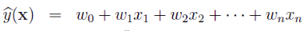
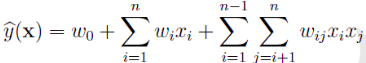
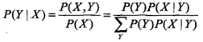
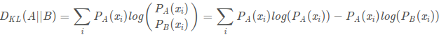
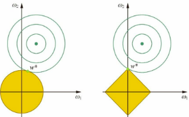
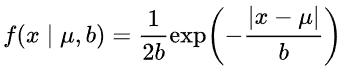
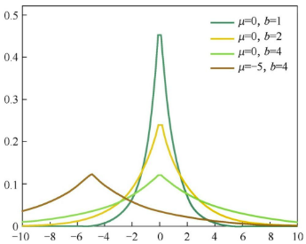
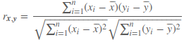
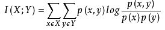

# 机器学习

### 线性回归模型
回归模型是表示从输入变量到输出变量之间映射的函数. 回归学习最常用的损失函数是平方损失函数,在此情况下,回归问题可以由最小二乘法求解.


### FM, FFM, deepFFM
线性回归模型

可见上式中各个特征分量之间是独立的,如果进一步考虑特征之间二阶组合的交互关系,可将线性回归写成

上述公式的问题是, 对于观察样本中未出现过的交互的特征分类, 很难正确估计w矩阵中的相应参数. 因此FM提出用(n,k)维的v, $V V^T$ 对w矩阵分解替代. 可以看到长度为k的v相当于对原始长度为n的特征做了embbeding.
时间复杂度O(kn).
参考: https://www.cnblogs.com/pinard/p/6370127.html
1. 可以在非常稀疏的数据中进行合理的参数估计
2. FM模型的时间复杂度是线性的
FFM: 通过引入field的概念，FFM把相同性质的特征归于同一个field。简单来说，同一个categorical特征经过One-Hot编码生成的数值特征都可以放到同一个field。在FFM中，每一维特征 xi，针对其它特征的每一种field fj，都会学习一个隐向量 v. 假设样本的 n 个特征属于 f 个field，那么FFM每一维特征有f个隐向量。而在FM模型中，每一维特征的隐向量只有一个。FM可以看作FFM的特例. FFM的二次参数有 nfk 个，远多于FM模型的 nk 个. 时间复杂度O(kn^2).
https://tech.meituan.com/2016/03/03/deep-understanding-of-ffm-principles-and-practices.html

### GDBT+LR
例如，gbdt里有3棵树T1,T2,T3，每棵树的叶节点个数为4，第i个树的第j个叶节点是Li,j。
当gdbt训练完成之后，样本X1在第一棵树中被分到了第3个叶节点上，也就是L1,3，那么这个样本在T1上的向量表达为(0,0,1,0)。
样本X1在T2被分到了L2,1，那么X1在T2上的向量表达为(1,0,0,0)
样本X1在T3被分到了L3,4，那么X1在T3上的向量表达为(0,0,0,1)
那么X1在整个gbdt上的向量表达为 (0,0,1,0,1,0,0,0,0,0,0,1)
所以每个样本都会被表示为一个长度为12的0-1向量，其中有3个数值是1。这样每棵树输出的就相当于是一个 one-hot 编码的特征.
然后这类向量就是LR模型的输入数据。

通过gbdt引入交叉特征与非线性, GBDT 担任了特征工程的工作, 特征的组合和选择, 再用带惩罚项的逻辑回归学习高维稀疏的特征.

### ROC 曲线 AUC 含义
ROC曲线: X轴-FPR(false positive rate)，Y轴-TPR(true positive rate)
TPR：在所有实际为阳性的样本中，被正确地判断为阳性之比率。
TPR = TP / (TP + FN)
FPR：在所有实际为阴性的样本中，被错误地判断为阳性之比率。
FPR = FP / (FP + TN)

设置阈值来得到混淆矩阵，不同的阈值会影响得到的TPRate，FPRate，如果阈值取0.5，小于0.5的为0，否则为1。依次使用所有预测值作为阈值，得到一系列TPRate，FPRate，描点，求面积，即可得到AUC。

AUC: 若随机抽取一个阳性样本和一个阴性样本，分类器正样本的预测概率大于负样本的预测概率之几率.
AUC的计算方法同时考虑了分类器对于正例和负例的分类能力，在样本不平衡的情况下，依然能够对分类器作出合理的评价。
mAP受正负样本分布影响明显, AUC几乎不变.
但是在某些场景下，我们会更关注正样本，这时候就要用到 PR 曲线了。例如, 提高二分类的 threshold 就能提高 precision，降低 threshold 就能提高 recall，这时便可观察 PR 曲线，得到最优的 threshold。
```python
def AUC(label, pre):
    # label = [1,0,0,0,1,0,1,0]
    # pre = [0.9, 0.8, 0.3, 0.1, 0.4, 0.9, 0.66, 0.7]
    pos = [i for i in range(len(label)) if label[i] == 1]
    neg = [i for i in range(len(label)) if label[i] == 0]
    auc = 0
    # AUC的含义就是所有穷举所有的正负样本对，
    # 如果正样本的预测概率大于负样本的预测概率，+１
    # 如果正样本的预测概率等于负样本的预测概率，+0.5
    # 如果正样本的预测概率小于负样本的预测概率，+0
    for i in pos:
        for j in neg:
            if pre[i] > pre[j]:
                auc += 1
            elif pre[i] == pre[j]:
                auc += 0.5

    return auc / (len(pos)*len(neg))
```
例如在反欺诈场景，设欺诈类样本为正例，正例占比很少（假设0.1%），如果使用准确率评估，把所有的样本预测为负例，便可以获得99.9%的准确率。但是如果使用AUC，把所有样本预测为负例，TPRate和FPRate同时为0（没有Positive），与(0,0) (1,1)连接，得出AUC仅为0.5，成功规避了样本不均匀带来的问题。

### 生成模型与判别模型有什么区别
对于大多数的分类算法，比如决策树,KNN,逻辑回归，支持向量机等，他们都是判别方法，也就是直接学习出特征输出Y和特征X之间的关系，要么是决策函数𝑌=f(𝑋),要么是条件概率分布𝑃(𝑌|𝑋)。
朴素贝叶斯是生成方法，找出输出Y和特征X的联合分布𝑃(𝑋,𝑌), 然后用 𝑃(𝑌|𝑋)=𝑃(𝑋,𝑌)/𝑃(𝑋) 得出条件概率分布 𝑃(𝑌|𝑋). 具体说下, 联合概率分布P(X,Y)由P(X|Y)乘P(Y)得到. 朴素:指假设各个特征间相互独立. 朴素贝叶斯可以用极大似然估计和贝叶斯估计求解, 贝叶斯估计在极大似然估计的基础上引入了先验分布(拉普拉斯平滑,在计算条件概率的时候引入lambda).


朴素贝叶斯法分类时, 对给定的输入 x. 通过学习到的模型计算后验概率分布 P(Y=c|X=x), 将后验概率最大的类作为 x 的类输出. 根据期望风险最小化准则就得到后验概率最大化准则.

生成方法的特点: 生成方法可以还原出联合概率分布 P(X,Y), 而判别方法则不能. 生成方法的学习收敛速度更快, 当存在隐变量时, 仍可以用生成方法学习, 此时判别方法就不能用.
判别方法的特点: 判别方法直接学习的是条件概率 P(Y|X)或决策函数f(X), 直接面对预测, 往往学习的准确率更高. 由于直接学习 P(Y|X) 或 f(X), 可以对数据进行各种程度上的抽象、定义特征并使用特征, 因此可以简化学习问题。

### 逻辑回归的损失函数为什么不用MSE

1. KL散度. 用于衡量两个事件分布的相似度. 可发现KL散度的后半部分就是交叉熵. 整体与交叉熵同增同减, 而sigmoid+交叉熵的梯度计算很方便, 因此从优化的角度, 要优化两个事件分布的相似度, 优化KL散度, 优化交叉熵.
2. 根据对数最大似然估计得到的模型的损失函数就是logloss.
3. 梯度. 对sigmoid+交叉熵求梯度正好是预测的f(x)与真值y的delta, 是线性的梯度. 对sigmoid+MSE求梯度, 在f(x)-y的基础上要乘上sigmoid的导数, 也就是sigmoid(z)乘(1-sigmoid(z)). 也就是说当z落在sigmoid的饱和区, 其导数几乎为0, 此时即使f(x)与y的delta比较大, 梯度也会因为sigmoid缩放的很小, 不利于梯度下降, 参数更新.

### 逻辑回归为什么用sigmoid
最大熵原理认为，学习概率模型时，在所有可能的概率模型中，熵最大的模型是最好的模型。根据Sigmoid函数，最后推导下来逻辑回归其实就是最大熵模型，根据对数最大似然估计得到的模型的损失函数就是logloss。这让整个逻辑回归都有理可据。

### L1, L2 正则化
L1正则化:将权重的绝对值之和加入到损失函数
L2正则化:将权重的平方值之和加入到损失函数,减小模型复杂度

L1正则化有特征选择的效果,得到稀疏化的权重
L2正则化同样有减小权重的效果,最终得到平滑的权重

其实L1,L2正则化可以看作是为原始损失函数添加了约束,使得权重|w| < C, ||w||^2 < C. (以L1为例)通过拉格朗日方程,可以把损失函数与约束整理为 $L_0 + \lambda(|w|-C)$,因为是优化问题可以忽略掉常数项C, 得到最终损失函数的形式$min (L_0 + \lambda |w|)$. 因为是不等式约束, 根据KKT条件, 如果原始损失函数L0的等高线在约束域外, 最优解就是等高线与约束域的切点.(如果在约束域内,不用理会约束域).其实拉格朗日方程能融合约束与损失函数是基于梯度方向一致性的假设(要想让目标函数f(x,y)的等高线和约束相切，则他们切点的梯度一定在一条直线上(f和g的斜率平行)).

L1 更容易产生稀疏解的三种解释.
1. 解空间形状

图中以二个权重为例,L2正则化定义了圆形(w^2),L1定义了菱形(|w|).蓝色的等高线是原始损失函数的. 等高线圆心在约束域外,根据KKT条件,等高线与约束域的切点为极值点.对于L2约束域,只有一个梯度方向会导致极值点落在权重为零的位置.对于L1约束域,许多梯度方向都会导致极值点落在权重为零的位置.因此L1更容易产生稀疏解.

2. 损失函数
参数更新公式 $ w = w - lr \frac{\partial{L}}{\partial{w}}$
$ L_0 + \sum \lambda |w| $ --L1损失函数求导得-- $ \frac{\partial{L_0}}{\partial{w}} + sign(\lambda)$
$ L_0 + \sum \lambda w^2 $ --L2损失函数求导得-- $ \frac{\partial{L_0}}{\partial{w}} + 2\lambda w$
    - 当$\frac{\partial{L_0}}{\partial{w}}$梯度较小时,L1的梯度为$sign(\lambda)$ 主导梯度更新的方向,若w>0,向负方向更新$lr \lambda$(假设L0梯度很小可忽略);若w<0,向正方向更新$lr \lambda$. 因此w总是向0点方向更新,趋向于取得零值.
    - 当$\frac{\partial{L_0}}{\partial{w}}$梯度较小时,L2的梯度为$2\lambda w$,梯度值也较小,L2的梯度也同L1一样,想让w的更新方向向零点靠近,但是由于此时w变小,相对于L0的偏导,无法主导梯度更新的方向.因此L2趋向与取得较小而分散的权重

3. 拉普拉斯先验 与 高斯先验 分布
$$ p(\theta|x) = \frac{p(x|\theta)p(\theta)}{p(x)}$$
其中$p(\theta|x)$是贝叶斯概率, $p(x|\theta)$是似然函数, $p(\theta)$是先验概率分布. $p(x)$是固定的只与样本有关, 因此重点看分子.
其中$p(\theta)$是先验分布,如果是拉普拉斯分布,取log后正好是L1 |w| 的形式,相当于在原来似然函数上加上了L1正则化. 拉普拉斯分布见下图,0附近概率密度最大,而且有平顶,容易停留,因此容易产生稀疏解. 高斯分布会产生L2 $w^2$的形式.

拉普拉斯分布函数



贝叶斯概率与最大后验概率的区别,贝叶斯认为先验是一个分布,最大后验概率认为先验是一个常量.



注意最大似然估计假设样本之间是独立的,因此最大化总体的似然估计可以转化成最大化每个个体似然估计的连乘,取log变成累加,就可以推导出交叉熵公式.

MSE假设分布符合高斯分布,因此个体连乘,取log后就是平方项的累加形式.

### 距离公式
欧式距离, 闵可夫斯基距离(p次方求和开p根号,是欧式距离的一般形式), 曼哈顿距离, 汉明距离, 余弦距离(1-cos)两向量夹角余弦值
除了余弦距离外,以上都属于严格的距离公式,即满足1.正定性 2.对称性 3.三角距离公式

### KNN
要找到k个最近的邻居来做预测，那么我们只需要计算预测样本和所有训练集中的样本的距离，然后计算出最小的k个距离即可，接着多数表决，很容易做出预测。这个方法的确简单直接，但计算量大。

#### KD树
- KD树建树采用的是从m个样本的n维特征中，分别计算n个特征的取值的方差，用方差最大的第k维特征𝑛𝑘来作为根节点。对于这个特征，我们选择特征𝑛𝑘的取值的中位数𝑛𝑘𝑣对应的样本作为划分点，对于所有第k维特征的取值小于𝑛𝑘𝑣的样本，我们划入左子树，对于第k维特征的取值大于等于𝑛𝑘𝑣的样本，我们划入右子树，对于左子树和右子树，我们采用和刚才同样的办法来找方差最大的特征来做更节点，递归的生成KD树。
- 生成KD树以后，就可以去预测测试集里面的样本目标点了。对于一个目标点，我们首先在KD树里面找到包含目标点的叶子节点。以目标点为圆心，以目标点到叶子节点样本实例的距离为半径，得到一个超球体，最近邻的点一定在这个超球体内部。然后返回叶子节点的父节点，检查另一个子节点包含的超矩形体是否和超球体相交，如果相交就到这个子节点寻找是否有更加近的近邻,有的话就更新最近邻。如果不相交那就简单了，我们直接返回父节点的父节点，在另一个子树继续搜索最近邻。当回溯到根节点时，算法结束，此时保存的最近邻节点就是最终的最近邻。
参考: https://www.cnblogs.com/pinard/p/6061661.html

### 特征工程
1. 过滤法
1.1 方差选择法: 如果一个特征不发散，例如方差接近于0，也就是说样本在这个特征上基本上没有差异，这个特征对于样本的区分并没有什么用. 计算各个特征的方差，然后根据阈值，选择方差大于阈值的特征。
1.2 相关系数法: Pearson 相关系数定义为两个变量之间的协方差和标准差的商, 可以理解为无量纲化后的协方差, 计算公式如下

1.3 卡方检验: 检验某个特征分布和输出值分布之间的无关性(1-无关性就是相关性). 1.首先基于真实分布,我们可以得到两个变量的统计表格. 2.因为无法排除两个遍历分布的差异是否由抽样差异决定的,所以我们先做无关性假设,计算出理论值的分布表格.卡方(x^2)的计算$\sum \frac{(A-T)^2}{T}$ 其中T为理论值, A为真实值. 3.根据自由度查询卡方分布的临界值表(自由度V=(行数-1)(列数-1)), 可得到两变量无关的概率.
1.4 互信息，即从信息熵的角度分析各个特征和输出值之间的关系, 互信息值越大，说明该特征和输出值之间的相关性越大，越需要保留.


2. 包装法
递归消除特征法: 递归消除特征法使用一个机器学习模型来进行多轮训练，每轮训练后，消除若干权值系数的对应的特征，再基于新的特征集进行下一轮训练。

3. 嵌入法
机器学习的方法来选择特征，但是它和RFE的区别是它不是通过不停的筛掉特征来进行训练，而是使用的都是特征全集。最常用的是使用L1正则化和L2正则化来选择特征, 或者决策树的特征重要程度.

寻找高级特征常用方法：
- 特征加和, 特征之差, 特征乘积, 特征除商
- 基于业务挖掘高级特征, 更有表现力的特征, 挖掘模式, 行为习惯等.

参考: https://segmentfault.com/a/1190000003719712
https://www.zhihu.com/question/28641663
https://www.cnblogs.com/pinard/p/9032759.html

### 假设检验
#### Z检验 T检验
Z检验是用于大样本(>30),总体方差已知的均值差异检验.
比较总体的均值$\bar X$与某个常数$\mu_0$是否有显著性的差异,公式如下. $\bar{X}$是样本均值,$\mu$是总体均值,$\sigma$是总体标准差,n是样本容量.
- 单个样本的Z检验
$$ Z = \frac{\bar{X}-\mu_0}{\sqrt\frac{\sigma^2}{{n}}} $$
如果是检验两组样本间平均值的差异, 公式如下 (检验时假设两个总体的均值相等u1-u2=0)
- 两个样本的均值的Z检验
$$ Z = \frac{\bar{X}_1-\bar{X}_2}{\sqrt{\frac{\sigma_1^2}{n_1}+\frac{\sigma_2^2}{n_2}}} $$

T检验是用于小样本,总体方差未知的均值差异检验.
- 单个样本的T检验
$\bar X$ 为样本均值, $\mu_0$为总体均值,$\sigma$为样本标准差,n为样本数.
$$ T = \frac{\bar{X}-\mu_0}{\sqrt\frac{\sigma^2}{{n}}} $$

- 两个配对样本t检验($\bar d$为配对样本差值的均值)


- 两个独立样本均值的T检验
异方差独立样本T检验
$$ T = \frac{\bar{X}_1-\bar{X}_2}{\sqrt{\frac{\sigma_1^2}{n_1}+\frac{\sigma_2^2}{n_2}}} $$
等方差独立样本T检验


- 卡方检验: 检验两个变量之间有没有关系
- F检验: 检验两个正态随机变量的总体方差是否相等

单边检测,双边检测看假设有没有方向性,有就单边,没有就双边.
p值（P value）就是当原假设为真时, 样本观察结果出现的概率。 如果P值很小，说明原假设情况的发生的概率很小，而如果出现了，根据小概率原理，我们就有理由拒绝原假设，P值越小，我们拒绝原假设的理由越充分. 显著性水平（0.05或0.01）.

### A/B test
一部分用户使用原方案A（对照组），同时另一部分用户使用新方案B（试验组），对比不同方案下转化率、点击量、留存率等指标，以判断不同方案的优劣并进行决策。
A/B测试中是用对照组和试验组这两个样本的数据来对两个总体是否存在差异进行检验，所以其本质是使用假设检验中的独立样本t检验 。

1. 测试时长如何设定？
测试的时长不宜过短。用户进入到新方案中，很可能因为好奇而表现得更加活跃，但随着时间的推移，逐渐趋于冷静，数据表现回到本该有的水平，如果实验观察期设置的过早，则容易得出错误的结论。适应期的长短通常以足量用户参与试验后的2到3天为宜。适应期过后的试验时间长短除了需要考察样本量外，还需要参考用户的行为周期，譬如说电商用户的购买行为有较强的周期规律，周末的购买量与工作日会有显著差异，这时测试的周期需要能够覆盖一个完整的周期，也就是应该大于1周。
但是测试时间也不宜太长，因为A/B测试是对线上多个版本的测试，这也就意味着线上系统需要同时维护多个可用的版本，长时间的A/B测试无疑加大了系统的复杂性。

2. 确定实验所需样本数量
H0 = A、B没有差异
H1 = A、B存在差异
统计功效power是说拒绝H0后接受H1假设概率。直观上说，AB即使有差异，也不一定能被你观测出来，必须保证一定的条件（比如样本要充足）才能使你能观测出统计量之间的差异；

3. 如何用户 实验组/对照组 分组
1.样本互相独立 2.分组的用户群在各维度的特征都应相似

4. A/B测试只能同时测试2个方案吗？
A/B测试不是只能测试A方案和B方案，实际上一个测试可以包含A/B/C/D/E/……多个版本，但是要保证是单变量的测试，比如按钮的颜色---赤/橙/黄/绿/青/蓝/紫，那么这七个方案可以同时做A/B测试，但如果某方案在旁边新增了另一个按钮，即便实验结果产生了显著差异，我们也无法判断这种差异的成因究竟是什么。

5. 什么是A/A测试？
A/A测试将分给原始版本的流量再次划分，分出的两组流量分别给两个相同的原始版本进行测试。A/A测试用来评估两个实验组是否是处于相同的水平，是为了测试埋点、分流、实验统计的正确性，增加A/B测试的结论可信度。如果AA实验的结果不存在显著差异，那么可以认为实验结果是有效的，进而可以对新老版本的实验结果进行进一步的判断。

参考: https://www.cnblogs.com/HuZihu/p/11178068.html
https://zhuanlan.zhihu.com/p/38471891

### 均匀分布生成标准正太分布
中心极限定理：设从均值为μ、方差为σ^2 的任意一个总体中抽取样本量为n的样本，当n充分大时，样本均值的抽样分布近似服从均值为μ、方差为（σ^2）/n 的正态分布。
正态分布概率密度函数:
正态转标准正态分布N(0,1): $ \frac{X - \mu}{\sigma} $
均匀分布 [a,b), 均值为(a+b)/2, 方差为(b-a)^2/12. 方差是由该公式计算出来的, $D(X) = E(X^2) - (E(X))^2$. 求E(X^2)的时候用概率密度函数在[a,b)积分.
因此假设给出[0,1)上的均匀分布样本集X.

```python
def getNormal(SampleSize,n):
    distribution = []
    for i in range(SampleSize):
        # 利用中心极限定理，[0,1)均匀分布期望为0.5，方差为1/12
        sample = (np.mean(np.random.uniform(0,1,n)) - 0.5) / (np.sqrt(1/12/n))
        distribution.append(sample)
    return distribution
```

反变换法: 假设F(x)是一个概率分布函数(CDF)，$F^{-1}$是它的反函数，若U是一个服从(0,1)均匀分布的随机变量，则$F^{−1}(U)$服从函数F给出的分布

例如要生成一个服从指数分布的随机变量，我们知道指数分布的概率分布函数(CDF)为 $F(x)=1−e^{−λx}$，其反函数为 $F^{−1}(x)=−\frac{ln(1−x)}{λ}$
```python
def getExponential(SampleSize,p_lambda):
    result = -np.log(1-np.random.uniform(0,1,SampleSize))/p_lambda
    return result
# 生成10000个数，观察它们的分布情况
SampleSize = 10000
es = getExponential(SampleSize, 1)
plt.hist(es,np.linspace(0,5,50),facecolor="green")
```

参考: https://bindog.github.io/blog/2015/05/20/different-method-to-generate-normal-distribution/#%E6%A6%82%E7%8E%87%E5%88%86%E5%B8%83%E5%87%BD%E6%95%B0%E5%92%8C%E6%A6%82%E7%8E%87%E5%AF%86%E5%BA%A6%E5%87%BD%E6%95%B0


### 大数定律
指当样本的数量越来越多时，样本的算术平均值越来越逼近系统概率分布的期望值，也就是说只要样本数量足够多的，几乎肯定能够反映出系统的真实分布

### EM 算法

### 朴素贝叶斯

### SVM 逻辑回归 区别
1. 损失函数不同. 逻辑回归方法基于最大熵模型，然后通过极大似然估计的方法估计出参数的值. SVM​基于几何间隔最大化原理，认为存在最大几何间隔的分类面为最优分类面.
2. 支持向量机只考虑局部的边界线附近的点，而逻辑回归考虑全局.（远离的点对边界线的确定也起作用）
3. 在解决非线性问题时，支持向量机采用核函数的机制，而LR通常不采用核函数的方法. 在计算决策面时，SVM算法里只有少数几个代表支持向量的样本参与了计算，也就是只有少数几个样本需要参与核计算。然而，LR算法里，每个样本点都必须参与决策面的计算过程，也就是说，假设我们在LR里也运用核函数的原理，那么每个样本点都必须参与核计算，这带来的计算复杂度是相当高的。所以，在具体应用时，LR很少运用核函数机制。​
4. SVM的损失函数就自带正则（损失函数中的1/2||w||^2项）, 而LR必须另外在损失函数上添加正则项.

### 梯度检查
用泰勒展开一阶近似拟合未知函数的梯度
```python
class Layer(object):
   def forward(self, input) -> output:
         ...

   def backward(self, output_grad, input, output) -> input_grad:
         ...

def gradient_check(layer, eps=1e-5) -> bool:
    """
    f(x+x0) = f(x) + f(x)'(x0)
    f(x)' = (f(x+x0) - f(x)) / x0
    """
    esp = 1e-7
    delta = 1e-2
    for i in range(100):
        grad = (layer.forward(i+delta) - layer.forward(i)) / delta
        if abs(grad - layer.backward()) > esp:
            print("wrong gradient")
```
