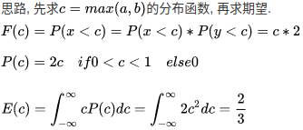
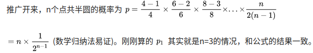
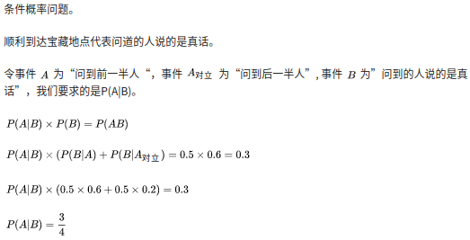
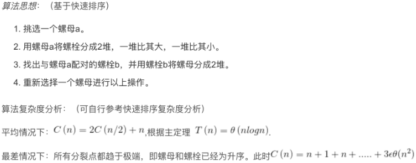

# 概率智力题

1. 从一副52张扑克牌中随机抽两张，颜色相等的概率
C(4,1)C(13,2) / C(52,2)
2. 一副扑克牌54张，现分成3等份每份18张，问大小王出现在同一份中的概率是多少？
总的分法 M=(C54，18)(C36，18)(C18，18)
大小王在同一份 N=(C3，1)(C52，16)(C36，18)(C18，18)
N/M=17/53
3. 去掉大小王的52张扑克牌，随机分成两堆26张。求其中一堆集齐4张A的概率
固定梅花A的位置，方片A有51个位置可以选择，其中有25个与梅花A在一堆。在梅花A和方片A在一堆的条件下，红桃A有50个位置可以选择，其中有24个与梅花A和方片A在一堆。在梅花A和方片A和红桃A在一堆的条件下，黑桃A有49个位置可以选择，其中有23个与梅花A和方片A和红桃A在一堆。
25/51 * 24/50 * 23/49
4. 已知N枚真硬币，M枚假硬币（两面都是国徽），R次重复采样都是国徽，问真硬币的概率？

5. 一对夫妻有2个孩子，求一个孩子是女孩的情况下，另一个孩子也是女孩的概率?
1/3
6. 某城市发生了一起汽车撞人逃跑事件，该城市只有两种颜色的车，蓝20%绿80%，事发时现场有一个目击者，他指证是蓝车，但是根据专家在现场分析，当时那种条件能看正确的可能性是80%，那么，肇事的车是蓝车的概率是多少？
条件概率,全概率. 0.2x0.8 / (0.2x0.8+0.8x0.2) = 0.5
7. 有种癌症，早期的治愈率为0.8，中期的治愈率为0.5，晚期的治愈率为0.2.若早期没治好就会转为中期，中期没治好就会变成晚期。现在有一个人被诊断为癌症早期，然后被治愈了，问他被误诊为癌症的概率是多少？
p(cur|早) = 0.8
p(cur|中) = 0.2 x 0.5 = 0.1
p(cur|晚) = 0.2 x 0.5 x 0.2 = 0.02
8. 100人坐飞机，第一个乘客在座位中随便选一个坐下，第100人正确坐到自己坐位的概率是？
等价于这个描述：2-99号乘客登机后如果发现1号坐在本属于自己的位子上，就会请1号离开，然后1号再随机找个空座. 这样到100号登机时，2-99号都在自己座位上，1号在自己座位上和100号乘客座位上概率相同，所以是1/2
9. 一个国家重男轻女，只要生了女孩就继续生，直到生出男孩为止，问这个国家的男女比例？
1/2
10. 有50个红球，50个蓝球，如何放入两个盒子中使得拿到红球的概率最大?
两个箱子概率是1/2，选中某个箱子后又有选择的是不是红球的概率，所以最大概率就是一个红球放在一个箱子里，其余的99个球全放到另一个箱子。这样概率=0.5+0.5*（49/99）约等于0.75，这样为最大概率。
11. 某个函数返回0/1，0的概率为p,1概率1-p,写一函数返回两数概率相等?
randp()以概率p产生0，概率（1-p）产生1；
 a=0,b=1的概率为p(1-p),将其视为0
a=1,b=0的概率也为p（1-p）,将其视为1
则产生0和1的概率相等
int randequal()  { int a=randp(); int b=randp();
if(a == 0;b == 1) return 0;
if(a == 1;b == 0) return 1;
return randequal();}
12. 给你一个硬币，你如何获得2/3的概率?
正正,正反,反正,反反.如果出现第4种情况则相当于采样失败，继续实验，如果在1-3种情况中出现1-2的情况则是一个2/3的概率
13. 扔硬币期望掷出‘正反正反……’的序列出来，倘若抛掷硬币没有任何技巧，每次是正是反的概率相同，那么无限地抛掷下去，第一次出错更有可能出在什么地方？
14. 怎么计算圆周率π的值(蒙特卡洛采样)?
在一个边长为a的正方形内一均匀概率随机投点，该点落在此正方形的外接圆中的概率即为外接圆与正方形的面积比值，即：Pi(a/2)^2 / a^2 = Pi/4
15. 一根棍子折三段能组成三角形的概率?
设长L的棍子任意折成3段的长度分别是x,y和z=L-(x+y)
三段能构成三角形,则
x+y＞z, 即 x +y>(L-x-y), x +y>L/2
y+z＞x, 即 y +(L-x-y)>x, x＜L/2
z+x＞y, 即 (L-x-y)+x>y, y＜L/2
所求概率等于x+y=L/2、x=L/2、y=L/2三条直线所包围图形的面积除以直线(x+y)=L与x轴、y轴所包围图形的面积
故长L的棍子任意折成3段，此3段能构成一个三角形的概率是（L/2 L/2 1/2）÷（L L 1/2） = 1/4
16. 圆内接三角形是锐角,钝角,直角三角形概率是多少?
1/4, 3/4, 0
圆内接三角形的最大角至少要大于等于60度，该最大角的范围可从60到180度变化，60到90间为锐角，所以占1/4. 90到180间为锐角，所以占3/4.
17. X，Y独立均服从（0,1）上的均匀分布，P{X^2 + Y^2 ≤ 1}等于?
pi/4 (做图, 1/4圆与1/4矩形重叠部分)
18. 一个袋子里有100个黑球和100个白球，每次随机拿出两个球丢掉，如果丢掉的是不同颜色的球，则从其他地方补充一个黑球到袋子里，如果颜色相同，则补充一个白球到袋子里。问：最后一个球是黑球和白球的概率分别为多大？
1、如果每次从桶里面拿出两个白球，则应放入一个黑球：(0, -2) + (1, 0) = (1, -2)；
2、如果每次从桶里面拿出两个黑球，则应放入一个黑球：(-2, 0) + (1, 0) = (-1, 0)；
3、如果每次从桶里面拿出一个白球和一个黑球，则应放入一个白球：(-1, -1) + (0, 1) = (-1, 0)；
从以上各种情况可以看出以下规律：
1）每次都会减少一个球，那么最后的结果肯定是桶内只剩一个球，要么是白球，要么是黑球；
2）每次拿球后，白球的数目要么不变，要么两个两个地减少；
所以从上面的分析可以得知，最后不可能只剩下一个白球，那么必然就只能是黑球了。
19. 扔骰子，最多扔两次，第一次扔完可以自行决定要不要扔第二次，取最后一次扔色子的结果为准，求：尽可能得到最大点数的数学期望?
对一扔一次骰子，期望是3.5,那么此时的扔骰子的策略为，当我扔到1-3时，继续抛，当我扔到4-6时，停止。在选择继续抛的时候，之前的结果作废，此时相当于抛一次骰子。他的期望为3.5。当只投一次的时候，只会在[4, 5, 6]之间，他的期望是5，所以最终的期望是，（5+3.5）/2 = 4.25
20. 两人轮流扔硬币，扔出正面获胜，求：先扔者A,后扔者B,获胜的概率?
设甲先抛。设甲胜率为x。则第一次甲抛了反面后，乙胜率为x，从而甲胜率+乙胜率=x+0.5x=1，从而x=2/3。后扔者B获胜的概率1/3
21. a b c 分别循环投掷硬币，直到正面出现胜利，求a b c获胜的概率?
P(B) = 1/2 x P(A); P(C) = 1/4 x P(A); P(A)+P(B)+P(C) = 1;
得P(A) = 4/7, P(B) = 2/7, P(C) = 1/7
22. 平均要抛多少次硬币，才能出现连续两次正面向上?
扔到的是反面，那么就要重新仍，所以是0.5(E+1)
扔到的是正面，再扔一次又反面了，则是0.25(E+2)
扔到两次，都是正面，结束，则是0.5 0.5 2
E = 0.5x0.5x2 + 0.5x(E+1) + 0.5x0.5x(E+2) = 6
23. 抛硬币，正反概率都是0.5，如果是正面则继续抛，求抛硬币次数的期望?
级数求和 1×1/2 + 2×1/4 + 3×1/8 + 4×1/16…
等差*等比数列求和, 用乘以等比做差.
解得S=2
24. 假设A和 B 服从(0,1)的均匀分布，并且A和B相互独立，求max(A, B)的数学期望?
积分算就行, 答案：2/3
25. 有36匹马，6个跑道，无计时器，最少多少次能够选出最快的三匹马？
36匹马分6个组,分别为A、B、C、D、E、F组.
1.每个组各跑一次,取每组前三名,用a1，a2，a3，b1，b2，b3，c1，c2，c3以此类推表示
2.每个组的第一名（a1到f1）拉出来跑一次（确定前三名）
后三名及其所在组的其余组员均被淘汰（第一都被淘汰了后边的也肯定被淘汰），两战都是第一的已经提前夺冠.
3.剩余两个名额和在已经夺冠的小组的第二第三和第二名小组的第一第二和第三名小组的第一里得出。
总次数=6+1+1=8
26. 一个聚会上，每两个人只握一次手，一共握了45次，问一共几个人?
C(10,2) = 45, 一共10个人
28. 有两只坏了的手表，A表每天慢一分钟，B表干脆不动，在一年之中，哪只表准确的次数多？
B表，B表一天一定会准时一次
A表 60x24=1440天后第一次准时
29. 一个岔路口分别通向诚实国和说谎国。来了两个人，已知一个是诚实国的，另一个是说谎国的。诚实国永远说实话，说谎过永远说谎话。现在你要去说谎国，但不知道应该走那条路，需要问这两个人。请问应该怎么问？
请问前面有几个国家，诚实国肯定会说两个，那么就确定了哪个是诚实的人，
下面就可以直接问诚实国的人怎么去说谎国了
30. 爸爸、妈妈、妹妹、小明至少两人同一生肖的概率是多少？
用1减去没有任何两个人同一生日的概率
1 - (12 * 11 * 10 * 9) / (12 * 12 * 12 * 12) = 41 / 96
31. 假设有一个池塘，里面有无穷多的水。现有 2 个空水壶，容积分别为5升和 6 升。问题是如何只用这2个水壶从池塘里取得 3 升的水。
V1表示水壶1内的水
V2表示水壶2内的水
V1:0 V2:0
V1装满 V1:5 V2:0
V1的五升倒入V2
V1:0 V2:5
V1装满 V1:5 V2:5
V1倒入V2，直到V2满
V1：4升 V2:6升
V2 6升全部倒掉
V1 4升倒入V2
V1:0 V2:4
V1装满 V1:5 V2:4
V1倒入V2直到V2装满
V1:3 V2:6
V1得到了3升
32. 烧一根不均匀的绳要用一个小时，如何用它来判断一个小时十五分钟呢？
需要三根绳子。假设分别为 1 号、2 号和 3 号绳子，每个绳子都有 A、B 端。
首先点燃 1 号绳子的两端，同时点燃 2 号绳子的 A 端，1 号绳子燃尽 (30min) 的同时点燃 2 号绳的 B 端，2 号绳子燃尽 (15min) 的同时点燃 3 号绳子的两端，当 3 号绳子燃尽 (30min) 的时刻就是一个小时十五分钟。
33. 四个人 ABCD 过桥，一次最多能过两个人，只有一个手电，每个人所需的时间分别为 1、2、5、10；求最快可以多长时间全部过桥？
A B过，2
A回 1
C D过 10
B 回 2
A B过2
答案：2+1+10+2+2=17分钟
34. 桌子上有 3 只朝上的茶杯，每次翻转 2 只，能否经过若干次翻转使得 3 只被子的杯口全部朝下呢？
不能
111 -> 001 -> 100 -> 010-> …死循环 永远达不到000
会一直在集合[001 010 100]中跳转，出不去
35. 有 1000 瓶酒，其中只有一瓶有毒。现在用小白鼠进行实验，小白鼠只要服用任意有毒的酒就会在 24 小时内死亡。问最少需要多少只小白鼠进行实验，才能在 24 小时内检测出哪瓶药水有毒？
1000瓶可以改成513~1023, 答案：10只 (2^9 < 1000 < 2^10 -> 10)
10只小白鼠编号，第k瓶酒转化成二进制num，num第i位上为1的，就为给第i号小白鼠，一次性喝完
24h后，死的小白鼠的编号就构成了毒酒的二进制编码，可以得到哪一瓶是毒酒
【变形】考考你真的学会了么？
改成10瓶酒，需要的最少小老鼠？
答案：4只
36. 排队，小明站在从前往后数的第 x 个，从后往前数的第 y 个，则小明所在的列共有多少人?
x+y-1
37. 有一个没有刻度的长方形的塑料盒子，没有盖子，它的容积是1升。请问如果只能使用这个盒子称量1次，能够准确地量出多少升的水？
1/2升（斜切一分为二）和 1/6升（组成三棱锥）
38. 已知有个 rand7() 的函数，返回 1 到 7 随机自然数，怎样利用这个 rand7() 构造 rand10()，随机 1 ~ 10
构造映射 f，输入n，输出m，m要大于n。n是输入集合的大小，m是输出集合的大小
x = (Rand7()-1) x 7 + ran7()
if x <= 40: return x%10+1
返回1-49，丢弃41到49的数字，1~40分成四组，
39. 一个三角形， 三个端点上有三只蚂蚁，蚂蚁可以绕任意边走，问蚂蚁不相撞的概率是多少？
2 / 2^3 = 1/4 (要么全部顺时针 要么全部逆时针)
40. 假设A和 B 服从(0,1)的均匀分布，并且A和B相互独立，求max(A, B)的数学期望

41. 某开发团队有6位开发同学,需参加5个项目， 每个项目都有人做 ,每位同学需要恰好参加1个项目,那么总共有多少种不同的分配方案？
先选出四个人C64=C62=15做四个项目A44=24，剩下的两个人C51=5
15x24x5=1800，答案是1800种。
42. 在一个圆内任取四个点，则这四个点出现在同一个半圆的概率是多少？ 1/2
参考: https://zhuanlan.zhihu.com/p/81368406

43. 部落里有一半人有60%可能说真话，另一半人有80%可能说假话，随机找一个人问寻宝路线，然后按这个人的建议走，最终顺利到达宝藏地点，那么所问的这个人属于前一半人的可能性为多少？

44. 给你两个一模一样的玻璃球。这两个球如果从一定高度掉到地上就会摔碎，当然，如果在这个高度以下往下扔，怎么都不会碎，超过这个高度肯定就一次摔碎了。现在已知这个恰巧摔碎的高度范围在1层楼到100层楼之间。如何用最少的试验次数，用这两个玻璃球测试出玻璃球恰好摔碎的楼高?
x + (x-1) + (x-2) + ... + 1 = 100, 解得 x = 14
45. 只要有一个员工过生日，当天所有员工全部放假一天。但在其余时候，所有员工都没有假期，必须正常上班。这个公司需要雇用多少员工，才能让公司一年内所有员工的总工作时间期望值最大？
E = n*(1-1/365)^n，求导，得n=365
46. 某段公路上1小时有车通过的概率是0.96，半小时有车通过的概率是多少?
1个小时内有车通过的概率是0.96，那么个一个小时内没有车通过的概率是0.04。
就相当于在连续的两个30分钟里面都没有出现任何车辆,即x2 ＝ 0.04 解得 x＝0.2
那么半小时内出现车辆的概率就是0.8.
47. 一个公交站在1分钟内有车经过概率是p，问3分钟内有车经过概率?
1-(1-p)^3
48. 三个范围在0-1的数，和也在0-1的概率?
设所取的三个数分别为 x、y、z, 则 0<x<1,0<y<1,0<z<1 ,
满足上述条件的点 P（x,y,z）构成一个边长为 1 的正方体,体积为 V=111=1 ,
满足 x+y+z=1 的点是分别过（1,0,0）、（0,1,0）、（0,0,1）的平面,
而满足 x+y+z<1 的点位于正方体内、平面的下方,体积为 V1=1/6
49. 一个盒子装有6只乒乓球，其中4只是新球（即：未使用过的球）。第一次比赛时随机从盒子中取出2只乒乓球，使用后放回盒子。第二次比赛时又随机地从盒子中取出2只乒乓球。求：第二次取出的球全是新球的概率?
第一次取球有三种结果：
1、2个旧的，其概率 P1 = (2*1)/(6*5) = 1/15;    
2、2个新的，其概率 P2 = (4*3)/(6*5) = 2/5;
3、一旧一新,其概率 P3 = (4*2+2*4)/(6*5) = 8/15;(第一次取旧第二次取新+第一次取新第二次取旧)
第二次取球与第一次取球结果有关
1、若第一次为2个旧的， 此时新球仍为4个， 则P11 =  (4*3)/( 6*5) = 2/5;
2、若第一次为 2个新的，此时新球变为2个，P21 =  (2*1)/(6*5) = 1/15;    
3、若第一次一旧一新，此时新球变为3个，P31 = (3*2)/(6*5) = 1/5;
所以，P = P1*P11+P2*P21+P3*P31 = 4/25 =0.16
50. 12球称重
https://juejin.im/post/5b372a15518825749c1c348c
51. 5个海盗抢到了100颗宝石，每一颗都一样的大小和价值连城。他们决定：抽签决定自己的号码（1，2，3，4，5）。首先，由1号提出分配方案（你抽到1号），然后大家5人进行表决，当且仅当超过半数的人同意时，按照他的提案进行分配，否则将被扔入大海喂鲨鱼。 如果1号死后，再由2号提出分配方案，依此类推。条件：每颗宝石都是一样的价值。海盗都想保命，尽量多得宝石，尽量多杀人。问题：你会提出怎样的分配方案才能够使自己的收益最大化？
思路： 逆向假设
1/ 前面四个都死了 ： 5  get 100
2/ 前面三个都死了 ： 4 肯定会死 ， 因为5会 投反对票。  所以 4 肯定不希望前面三个都死
3/ 前面二个死了   ： 4 会投赞成票  所以3分发：  100  0  0 分别给  3，4，5  
(3，4，5 这3个人，3知道4为了保命肯定会投赞成票，不用管5 ，自己肯定通过）
4/ 前面1 死了    ： 3希望2死，因为2死后这样就能得到100   3投反对
                ： 4，5 如果每人得到  1个金币，肯定会赞成
                ： 2的分法是 ：  98   0  1  1      （2，3，4，5）
5/ 现在 1 都知道了以上的思路：他必须争取到两票来让自己通过
97 0 1 2 0      ： 3  和 4 都会投赞成票,或者   
97 0 1 0 2      ： 3 和 5 都会投赞成票     
52. 一个人要过一座 80 米的桥，每走一米需要吃一颗豆子，他最多可以装 60 颗豆子，问最少需要吃多少颗豆子才能走完桥？
参考: https://blog.csdn.net/flyfish1986/article/details/49156071
R为往返次数, L桥长, C最多装多少豆子
f(L,C) = f(L-1,C) + 2R + 1
R = (f(L-1,C) - (C-1)) / (C-2)
53. 给你一堆螺母和螺栓，每个螺母都有一个相对应的螺栓，但是他们之间的对应关系已经打乱。你可以比较螺母和螺栓的大小关系，但是你无法比较螺母和螺母的大小关系，你也无法比较螺栓和螺栓的大小关系。设计一个算法，找出螺母和螺栓的对应关系。

54. 1到999,999中共有几个整数不包含3、5、7
0-9----中共计 7个
10-19----7
20-29----7
30-39----0
...
90-99----7
0-99中共计 7*7=49
同理
0-999共计 7*7*7个
