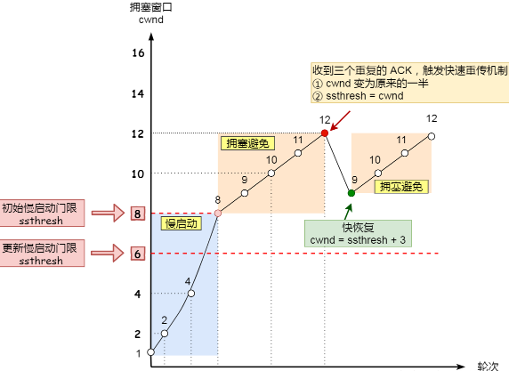

# 计算机网络
待整理: https://github.com/Snailclimb/JavaGuide/blob/master/docs/network/%E8%AE%A1%E7%AE%97%E6%9C%BA%E7%BD%91%E7%BB%9C.md
## 计算机网络体系结构
参考 https://github.com/CyC2018/CS-Notes/blob/master/notes/%E8%AE%A1%E7%AE%97%E6%9C%BA%E7%BD%91%E7%BB%9C%20-%20%E7%9B%AE%E5%BD%95.md

1. 五层协议
- 应用层：为特定应用程序提供数据传输服务，例如 HTTP、DNS 等协议。数据单位为报文。
- 传输层：为进程提供通用数据传输服务。由于应用层协议很多，定义通用的传输层协议就可以支持不断增多的应用层协议。包括两种协议：传输控制协议 TCP，提供面向连接、可靠的数据传输服务，数据单位为报文段；用户数据报协议 UDP，提供无连接、尽最大努力的数据传输服务，数据单位为用户数据报。TCP 主要提供完整性服务，UDP 主要提供及时性服务。
- 网络层：为主机提供数据传输服务。而传输层协议是为主机中的进程提供数据传输服务。网络层把传输层传递下来的报文段或者用户数据报封装成分组。
- 数据链路层 ：网络层针对的还是主机之间的数据传输服务，而主机之间可以有很多链路，链路层协议就是为同一链路的主机提供数据传输服务。数据链路层把网络层传下来的分组封装成帧。
- 物理层：考虑的是怎样在传输媒体上传输数据比特流，而不是指具体的传输媒体。物理层的作用是尽可能屏蔽传输媒体和通信手段的差异，使数据链路层感觉不到这些差异。

2. OSI
其中表示层和会话层用途如下：
- 表示层：数据压缩、加密以及数据描述，这使得应用程序不必关心在各台主机中数据内部格式不同的问题。
- 会话层：建立及管理会话。
五层协议没有表示层和会话层，而是将这些功能留给应用程序开发者处理。

3. TCP/IP
它只有四层，相当于五层协议中数据链路层和物理层合并为网络接口层。
TCP/IP 体系结构不严格遵循 OSI 分层概念，应用层可能会直接使用 IP 层或者网络接口层。

4. 数据在各层之间的传递过程
在向下的过程中，需要添加下层协议所需要的首部或者尾部，而在向上的过程中不断拆开首部和尾部。
路由器只有下面三层协议，因为路由器位于网络核心中，不需要为进程或者应用程序提供服务，因此也就不需要传输层和应用层。

### 三次握手
第一次握手：客户端发送网络包，服务端收到了。这样服务端就能得出结论：客户端的发送能力、服务端的接收能力是正常的。

第二次握手：服务端发包，客户端收到了。这样客户端就能得出结论：服务端的接收、发送能力，客户端的接收、发送能力是正常的。

第三次握手：客户端发包，服务端收到了。这样服务端就能得出结论：客户端的接收、发送能力，服务端的发送、接收能力是正常的。 第一、二次握手后，服务端并不知道客户端的接收能力以及自己的发送能力是否正常。

经历了上面的三次握手过程，客户端和服务端都确认了自己的接收、发送能力是正常的, 之后就可以正常通信了。
- 防止历史连接的建立
- 确保双方的初始序列号能被可靠的同步
只有同步了序列号才有可靠传输，TCP 许多特性都依赖于序列号实现，比如流量控制、丢包重传等，这也是三次握手中的报文称为 SYN 的原因，SYN 的全称就叫 Synchronize Sequence Numbers（同步序列号）

第三次握手是可以携带数据的，前两次握手是不可以携带数据的
TCP 的连接状态查看，在 Linux 可以通过 netstat -napt

### 四次挥手
TCP连接是双向传输的对等的模式，就是说双方都可以同时向对方发送或接收数据。当有一方要关闭连接时，会发送指令告知对方，我要关闭连接了。这时对方会回一个ACK，此时一个方向的连接关闭。但是另一个方向仍然可以继续传输数据，等到发送完了所有的数据后，会发送一个FIN段来关闭此方向上的连接。接收方发送ACK确认关闭连接。
参考: https://zhuanlan.zhihu.com/p/53374516

关闭连接时，客户端向服务端发送 FIN 时，仅仅表示客户端不再发送数据了但是还能接收数据。等服务端不再发送数据时，才发送 FIN 报文给客户端来表示同意现在关闭连接。

为什么 TIME_WAIT 等待的时间是 2MSL？
- 防止收到历史数据，从而导致数据错乱的问题. 经过 2MSL 这个时间，足以让两个方向上的数据包都被丢弃，使得原来连接的数据包在网络中都自然消失，再出现的数据包一定都是新建立连接所产生的。
- 保证连接正确关闭. 等待足够的时间以确保最后的 ACK 能让被动关闭方接收，从而帮助其正常关闭。为什么是2 MSL呢？若 ACK 在一个 MSL 内丢失，这样被动方重发的 FIN 会在第 2 个 MSL 内到达，TIME_WAIT 状态的连接可以应对。

### TCP重传机制
TCP 针对数据包丢失的情况，会用重传机制解决。
超时重传, 快速重传, SACK, D-SACK

- 超时重传: 在发送数据时，设定一个定时器，当超过指定的时间后，没有收到对方的 ACK 确认应答报文，就会重发该数据. 数据包丢失，确认应答丢失会触发超时重传。
RTO（超时重传时间) 的值应该略大于RTT（包的往返时间）的值。
RTT估计：需要 TCP 通过采样 RTT 的时间，然后进行加权平均，算出一个平滑 RTT 的值，而且这个值还是要不断变化的，因为网络状况不断地变化。
- 快速重传：当收到三个相同的 ACK 报文时，会重传丢失的报文段。以数据为驱动，避免了超时时间的估计问题，但是重传的时候，无法确认是重传之前的一个，还是重传之前所有。
- SACK（ Selective Acknowledgment 选择性确认）：在 TCP 头部「选项」字段里加一个 SACK 的东西，它可以将缓存的地图发送给发送方，这样发送方就可以知道哪些数据收到了，哪些数据没收到，知道了这些信息，就可以只重传丢失的数据。发送方收到了三次同样的 ACK 确认报文，于是就会触发快速重发机制，通过 SACK 信息发现只有 200~299 这段数据丢失，则重发时，就只选择了这个 TCP 段进行重复。
- Duplicate SACK，其主要使用了 SACK 来告诉「发送方」有哪些数据被重复接收了。

### 滑动窗口
TCP 每发送一个数据，都要进行一次确认应答。当上一个数据包收到了应答了， 再发送下一个。为解决这个问题，TCP 引入了窗口这个概念。窗口大小就是指无需等待确认应答，而可以继续发送数据的最大值。窗口的实现实际上是操作系统开辟的一个缓存空间，发送方主机在等到确认应答返回之前，必须在缓冲区中保留已发送的数据。如果按期收到确认应答，此时数据就可以从缓存区清除。
通常窗口的大小是由接收方的决定的：window这个字段是接收端告诉发送端自己还有多少缓冲区可以接收数据。于是发送端就可以根据这个接收端的处理能力来发送数据，而不会导致接收端处理不过来。

### 流量控制

发送方不能无脑的发数据给接收方，接收方处理不过来，就会导致触发重发机制，从而导致网络流量的无端浪费。
为了解决这种现象发生，TCP 提供一种机制可以让`发送方 根据 接收方 的实际接收能力控制发送的数据量`，这就是所谓的流量控制。
假设发送窗口为 200。 假设发送方发送了120字节的数据，发送窗口-120，接受方收到后回复ack，同时序列号+120，意味着接收方期望的下一个报文的序列号。当接受方收到ack后，发送窗口+120。当发送窗口为0时，无法继续发送数据。
如果数据大小超过了接收窗口的大小，会发生丢包。为了防止这种情况发生，TCP 规定是不允许同时减少缓存又收缩窗口的，而是采用先收缩窗口，过段时间再减少缓存，避免丢包。
TCP 通过`让接收方指明希望从发送方接收的数据大小（窗口大小）`来进行流量控制。

当发生窗口关闭时，接收方处理完数据后，会向发送方通告一个窗口非 0 的 ACK 报文，如果这个通告窗口的 ACK 报文在网络中丢失了，会导致发送方一直等待接收方的非 0 窗口通知，接收方也一直等待发送方的数据，如不采取措施，这种相互等待的过程，会造成了死锁的现象。

发送窗口大小是基于接收方回传的接受窗口大小动态调整的么？
为了解决这个问题，TCP 为每个连接设有一个持续定时器，只要 TCP 连接一方收到对方的零窗口通知，就启动持续计时器。如果持续计时器超时，就会发送窗口探测 ( Window probe ) 报文，而对方在确认这个探测报文时，给出自己现在的接收窗口大小。

### 拥塞控制
流量控制是避免「发送方」的数据填满「接收方」的缓存，但是并不知道网络的中发生了什么。计算机网络都处在一个共享的环境。因此也有可能会因为其他主机之间的通信使得网络拥堵。在网络出现拥堵时，如果继续发送大量数据包，可能会导致数据包时延、丢失等，这时 TCP 就会重传数据，但是一重传就会导致网络的负担更重，于是会导致更大的延迟以及更多的丢包。
拥塞控制，目的是避免 发送方 的数据填满整个网络。
拥塞窗口 cwnd 是发送方维护的一个的状态变量，它会根据网络的拥塞程度动态变化。在流量控制中发送窗口 swnd 和接收窗口 rwnd 是约等于的关系，引入拥塞窗口 cwnd 后，发送窗口 swnd = min(cwnd, rwnd)。只要网络中没有出现拥塞，cwnd 就会增大；网络中出现了拥塞，cwnd 就减少；只要 发送方 没有在规定时间内接收到 ACK 应答报文，也就是发生了超时重传，就会认为网络出现了拥塞。

拥塞控制主要是四个算法：`慢启动，拥塞避免，拥塞发生，快速恢复`

- 慢启动：当发送方每收到一个 ACK，拥塞窗口 cwnd 的大小就加 1。（一开始初始化 cwnd = 1）
有一个叫慢启动门限 ssthresh （slow start threshold）状态变量。
当 cwnd < ssthresh 时，使用慢启动算法。
当 cwnd >= ssthresh 时，就会使用「拥塞避免算法」。

- 拥塞避免算法：每当收到一个 ACK 时，cwnd 增加 1/cwnd。拥塞避免算法就是将原本慢启动算法的指数增长变成了线性增长，还是增长阶段，但是增长速度缓慢了一些。

- 拥塞发生
当丢包现象出现，网络会进入拥塞的状况，这时需要重传丢失的数据包。当触发了重传机制，也就进入了 拥塞发生。
  - 对于超时重传
  1. ssthresh 设为 cwnd/2，
  2. cwnd 重置为 1
  - 对于快速重传
  1. ssthresh = cwnd
  2. cwnd 重置为 cwnd/2
  3. 进入快速恢复算法
  

- 快速恢复
没有像 超时重传 一夜回到解放前，而是还在比较高的值，后续呈线性增长。
  - 拥塞窗口 cwnd = ssthresh + 3 （ 3 的意思是确认有 3 个数据包被收到了）
  - 重传丢失的数据包
  - 如果再收到重复的 ACK，那么 cwnd 增加 1
  - 如果收到新数据的 ACK 后，设置 cwnd 为 ssthresh，接着就进入了拥塞避免算法
  

### 什么是面向有连接型和面向无连接型？
面向有连接型传输: 包括会话建立、传输数据和会话断开，此外还包括保证传输可靠性的各种措施，比如超时重传、流量控制等，常见的面向有连接传输有TCP；
面向无连接型传输: 仅提供基本的传输数据的功能，即使接收端不存在，发送端也能发送数据包，常见的面向无连接传输有UDP、IP。

### TCP UDP 区别
- TCP是面向连接的协议，提供的是可靠传输，在收发数据前需要通过三次握手建立连接，使用ACK对收发的数据进行正确性检验。而UDP是无连接的协议，不管对方有没有收到或者收到的数据是否正确。
- TCP提供流量控制和拥塞控制，而UDP没有。
- TCP对系统资源的要求高于UDP，所以速度也比UDP慢。
- TCP数据包是没有边界的，会出现粘包的问题，UDP包是独立的，不会出现粘包问题。
- 在应用方面，如果强调数据的完整性和正确性用TCP，当要求性能和速度的时候，使用UDP更加合适。

### TCP对应的应用层协议有哪些？UDP对应的应用层协议有哪些？
TCP对应的典型的应用层协议：
- FTP：文件传输协议；
- SSH：远程登录协议；
- HTTP：web服务器传输超文本到本地浏览器的超文本传输协议。

UDP对应的典型的应用层协议：
- DNS：域名解析协议；
- TFTP：简单文件传输协议；
- SNMP：简单网络管理协议。 

### 什么是TCP 粘包、拆包？
1. 接收端正常收到两个数据包，即没有发生拆包和粘包的现象。
2. 接收端只收到一个数据包，但是这一个数据包中包含了发送端发送的两个数据包的信息，这种现象即为粘包。
3. 接收端收到了两个数据包，但是这两个数据包要么是不完整的，要么就是多出来一块，这种情况即发生了拆包和粘包。

### 为什么会发生 TCP 粘包、拆包？
- 要发送的数据大于 TCP 发送缓冲区剩余空间大小，将会发生拆包。
- 待发送数据大于 MSS（最大报文长度），TCP 在传输前将进行拆包。
- 要发送的数据小于 TCP 发送缓冲区的大小，TCP 将多次写入缓冲区的数据一次发送出去，将会发生粘包。
- 接收数据端的应用层没有及时读取接收缓冲区中的数据，将发生粘包。

### 粘包、拆包解决办法
由于 TCP 本身是面向字节流的，无法理解上层的业务数据，所以在底层是无法保证数据包不被拆分和重组的，这个问题只能通过上层的应用协议栈设计来解决，解决方案归纳如下：
- 消息定长：发送端将每个数据包封装为固定长度（不够的可以通过补 0 填充），这样接收端每次接收缓冲区中读取固定长度的数据就自然而然的把每个数据包拆分开来。
- 设置消息边界：服务端从网络流中按消息边界分离出消息内容。在包尾增加回车换行符进行分割，例如 FTP 协议。
- 将消息分为消息头和消息体：消息头中包含表示消息总长度（或者消息体长度）的字段。

### http和https
http (HyperText Transfer Protocol) 协议是应用层的协议，超文本传输协议，是客户端和服务端相互通信时将信息以http报文的形式传输。
HTTP 是一个在计算机世界里专门在「两点」之间「传输」文字、图片、音频、视频等「超文本」数据的「约定和规范」。

早期 HTTP/1.0 性能上的一个很大的问题，那就是每发起一个请求，都要新建一次 TCP 连接（三次握手）. 为了解决上述 TCP 连接问题，HTTP/1.1 提出了长连接的通信方式，也叫持久连接。这种方式的好处在于减少了 TCP 连接的重复建立和断开所造成的额外开销，减轻了服务器端的负载。
HTTP/1.1 采用了长连接的方式，这使得管道（pipeline）网络传输成为了可能。即可在同一个 TCP 连接里面，客户端可以发起多个请求，只要第一个请求发出去了，不必等其回来，就可以发第二个请求出去，可以减少整体的响应时间。
但是服务器还是按照顺序，先回应 A 请求，完成后再回应 B 请求。要是 前面的回应特别慢，后面就会有许多请求排队等着。这称为「队头堵塞」。

HTTP/2 协议是基于 HTTPS 的. HTTP/2 相比 HTTP/1.1 性能上的改进:
- HTTP/2 会压缩头（Header）如果你同时发出多个请求，他们的头是一样的或是相似的，那么，协议会帮你消除重复的分。这就是所谓的 HPACK 算法：在客户端和服务器同时维护一张头信息表，所有字段都会存入这个表，生成一个索引号，以后就不发送同样字段了，只发送索引号，这样就提高速度了。
- HTTP/2 不再像 HTTP/1.1 里的纯文本形式的报文，而是全面采用了二进制格式，头信息和数据体都是二进制，并且统称为帧（frame）：头信息帧和数据帧。
- HTTP/2 的数据包不是按顺序发送的，因此，必须要对数据包做标记，指出它属于哪个回应。每个请求或回应的所有数据包，称为一个数据流（Stream）。每个数据流都标记着一个独一无二的编号，其中规定客户端发出的数据流编号为奇数， 服务器发出的数据流编号为偶数. 客户端还可以指定数据流的优先级。服务器优先响应优先级高的请求。
- HTTP/2 是可以在一个连接中并发多个请求或回应，而不用按照顺序一一对应。移除了 HTTP/1.1 中的串行请求，不需要排队等待，也就不会再出现「队头阻塞」问题，降低了延迟，大幅度提高了连接的利用率。

- HTTP/1.1 中的管道（ pipeline）传输中如果有一个请求阻塞了，那么队列后请求也统统被阻塞住了
- HTTP/2 多请求复用一个TCP连接，一旦发生丢包，就会阻塞住所有的 HTTP 请求。
这都是基于 TCP 传输层的问题，所以 HTTP/3 把 HTTP 下层的 TCP 协议改成了 UDP.

UDP 是不可靠传输的，但基于 UDP 的 QUIC 协议 可以实现类似 TCP 的可靠性传输。

摘要算法用来实现完整性，能够为数据生成独一无二的「指纹」，用于校验数据的完整性，解决了篡改的风险。客户端在发送明文之前会通过摘要算法算出明文的「指纹」，发送的时候把「指纹 + 明文」一同加密成密文后，发送给服务器，服务器解密后，用相同的摘要算法算出发送过来的明文，通过比较客户端携带的「指纹」和当前算出的「指纹」做比较，若「指纹」相同，说明数据是完整的。

HTTPS 采用的是对称加密和非对称加密结合的「混合加密」方式：
- 在通信建立前采用非对称加密的方式交换「会话秘钥」，后续就不再使用非对称加密。
- 在通信过程中全部使用对称加密的「会话秘钥」的方式加密明文数据。
采用「混合加密」的方式的原因：
- 对称加密只使用一个密钥，运算速度快，密钥必须保密，无法做到安全的密钥交换。
- 非对称加密使用两个密钥：公钥和私钥，公钥可以任意分发而私钥保密，解决了密钥交换问题但速度慢

http协议的缺点:
- 通信使用明文（不加密），内容可能会被窃听。比如，账号信息容易泄漏。
- 不验证通信方的身份，因此有可能遭遇伪装。比如，访问假的淘宝、拼多多。
- 无法证明报文的完整性，所以有可能已遭篡改。比如，网页上植入垃圾广告。

https可以简单的理解为：https = http + 加密 + 认证 + 完整性保护。

https协议改进
- 加密。https协议通过SSL或者TLS协议将报文内容进行加密，client端进行加密，server端进行解密。
- 认证。通过值得信赖的第三方机构颁布证书，即可确认通信双方的身份。客户端持有证书即可完成客户端身份的确认，客户端通信前会查看服务端的证书。
- 完整性保护。可以通过MD5等散列码进行通信内容的校验。

参考: https://www.nowcoder.com/discuss/379081?source_id=profile_create&channel=666

todo: HTTPS密钥交换过程

CA信任链
通过数字证书的方式保证服务器公钥的身份，解决冒充的风险。

### 常见的http动词
- GET: 从服务器获取资源
- POST: 在服务器新建资源
- PUT: 在服务器更新资源
- DELETE: 在服务器删除资源
- HEAD: 获取资源的元数据
- OPTIONAL: 查询对指定的资源支持的方法

### 从URL输入到页面展现发生什么
1. 根据域名到DNS中找到IP
2. 根据IP建立TCP连接(三次握手)
3. 发起http请求
4. 服务器响应http请求
5. 浏览器解析HTML代码并请求html中的静态资源（js,css）
6. 关闭TCP连接（四次挥手）
7. 浏览器渲染页面
